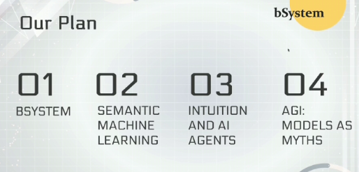
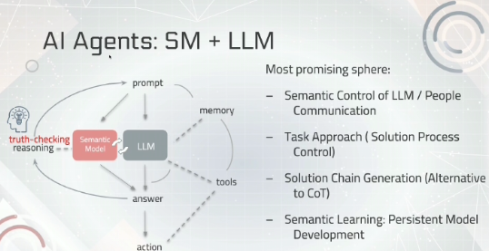

### AIRI Seminars | Должен ли AGI «думать» как мы? Принцип свободной энергии, модель мира и LLM (26.03.25)
Докладчиком выступит Пётр Анохин, кандидат биологических наук, ведущий научный сотрудник группы «Обучаемый интеллект» AIRI. Оппонент — Антон Колонин, кандидат технических наук, ведущий научный сотрудник ЦИИ НГУ, эксперт РСМД, основатель AGIRussia и Aigents, архитектор по ИИ и блокчейну SingularityNET.  
На семинаре обсудят, как интеллектуальные биологические системы используют модели мира для принятия решений, основываясь на принципе свободной энергии. Будет рассмотрен вопрос о том, обладают ли LLM подобными моделями, необходимы ли они для достижения AGI, и какие мнения по этому поводу высказывают ведущие эксперты в сфере ИИ.  
https://youtube.com/live/qHjNWwI2lzs?feature=share  
https://vkvideo.ru/video-210514085_456239213  
LLM vs (General) World Model  
Ветров: LLM можно представить теоремой Байеса  

### Выступления профессора Манциводы и профессора Витяева
https://t.me/XAITALKS/1983   
  
Geoffrey Hilton: ИИ - моделирование суждений, LLM - моделирование человеческой интуиции.  
Кроме Интуиции (LMM), добавляем Рассуждения (Reasoning) и Воображение (Imagination), см. 46;00  
Слайд 55;00:  

### Также
- [/LD/cognition](https://github.com/bpmbpm/doc/tree/main/LD/cognition)
- [Семантический веб и AutoML: великие обещания и горькая реальность](https://habr.com/ru/companies/selectel/articles/912738/)
