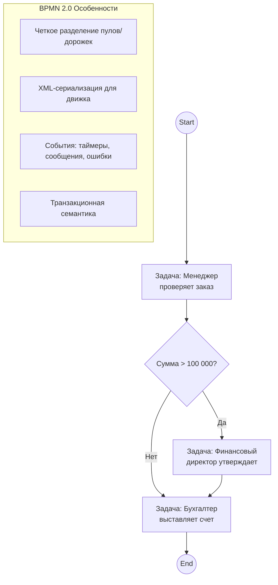
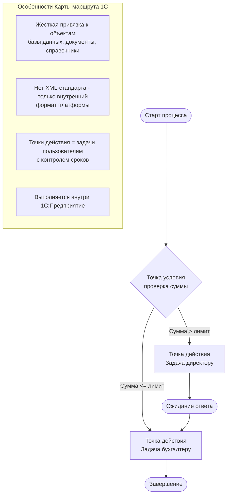

## 1c
### 1
SAP Signavio представляет собой не просто инструмент для классического моделирования, а мощную платформу управления бизнес-процессами (BPMS), которая сочетает в себе возможности как описания, так и автоматизации процессов. Давайте детально разберем оба направления и посмотрим, как обстоят дела с моделированием в экосистеме 1С.

---

### 1. SAP Signavio: От моделирования к исполнению

SAP Signavio — это комплексное решение, которое охватывает полный цикл управления процессами (BPM). Оно объединяет в себе возможности, характерные как для классических систем моделирования (как ARIS), так и для современных платформ автоматизации.

#### А. Классическое моделирование (Неисполняемый BPMN)

В этом амплуа Signavio выступает как корпоративный инструмент для документирования и анализа. Как и ARIS, он позволяет создавать подробные карты процессов, но делает это более интуитивно и современно .

*   **Визуализация и коллаборация**: Это пространство для совместной работы бизнес-пользователей и ИТ-специалистов. Signavio предлагает удобный веб-интерфейс для создания диаграмм в нотации BPMN 2.0, а также других нотациях .
*   **Централизованное хранилище (Collaboration Hub)**: Позволяет публиковать утвержденные процессы в иерархическом виде, обеспечивая прозрачность для всей организации. Это ключевое отличие от простых "рисовалок" — здесь процессы становятся корпоративным знанием, доступным для всех сотрудников .
*   **Стратегический анализ**: Инструменты моделирования позволяют проводить симуляции (оценка стоимости, времени, ресурсов) еще до внедрения, а также анализировать внутренний контроль (Governance) .

**Сравнение с ARIS:** ARIS традиционно воспринимается как более сложный и "тяжелый" инструмент, требующий серьезного обучения и дисциплины. Он силен в управлении сложными архитектурами предприятий . Signavio же позиционируется как более интуитивный, современный и тесно интегрированный с продуктами SAP, что делает его предпочтительным выбором для клиентов SAP, стремящихся к цифровой трансформации .

#### Б. Исполняемый BPMN (Автоматизация)

Здесь Signavio предлагает два пути, что и делает его "исполняемым" в широком смысле слова:

1.  **Встроенная автоматизация (Process Governance)**:
    Signavio включает в себя модуль **Process Governance** — решение с низким кодом (no-code/low-code), которое позволяет запускать спроектированные процессы прямо в той же среде. Модель BPMN не просто хранится как картинка, а служит основой для работающего workflow. Это идеальный вариант для автоматизации задач согласования, заявок, документооборота и рутинных операций без привлечения программистов .

2.  **Экспорт в движки выполнения (Round-trip Engineering)**:
    Для сложной автоматизации, требующей глубокой интеграции с ERP-системами (SAP S/4HANA) или кастомной разработки, Signavio интегрируется со сторонними движками, такими как **jBPM** или **Activiti/Camunda**.
    *   **Принцип**: Бизнес-аналитики моделируют процесс в Signavio, а затем разработчики экспортируют BPMN 2.0 XML в движок выполнения. Любые изменения в модели могут быть синхронизированы с исполняемым кодом и обратно .
    *   **Zero-Coding vs Less-Code**: В документации Signavio подчеркивается, что полная автоматизация (Zero-Coding) возможна только для простых процессов. Для сложных сценариев используется подход "Less-Code", когда движок (например, Camunda) встраивается в Java-приложение, а Signavio остается надстройкой для моделирования и мониторинга .

---

### 2. Варианты моделирования для ERP 1С

В мире 1С подход к моделированию бизнес-процессов имеет свою специфику, отличающуюся от классического BPMN 2.0. Здесь существуют как встроенные проприетарные инструменты, так и возможность использования открытых стандартов.

#### А. Неисполняемое моделирование

Этот этап критически важен на стадии внедрения и обследования предприятия. Основные цели: сбор требований, документирование "как есть" (As-Is) и проектирование "как будет" (To-Be). Для этого в проектах 1С используются стандартные нотации моделирования, так как они понятны бизнес-пользователям .

| **Нотация** | **Назначение** | **Пример использования в проекте 1С** |
| :--- | :--- | :--- |
| **Блок-схемы (Flowcharts)** | Простейшая визуализация последовательности действий. | Используется на начальных этапах для быстрого согласования логики с заказчиком, например, схема "Оформление заказа -> Оплата -> Отгрузка" . |
| **BPMN 2.0** | Стандарт де-факто для описания процессов с детализацией событий, шлюзов и потоков данных. | Применяется для сложной логики, где есть параллельные ветви, несколько участников (пулы/дорожки) и сложные правила. Аналитик отрисовывает BPMN-схему, которую затем передает разработчикам для реализации . |
| **EPC (Event-driven Process Chain)** | Нотация ARIS, популярная в Германии и на крупных промышленных предприятиях. | Используется, если заказчик придерживается методологии ARIS или на проекте требуется строгое документирование регламентов . |
| **IDEF0** | Функциональное моделирование (функции, входы, выходы, механизмы). | Применяется для верхнеуровневого описания деятельности компании (архитектура предприятия), чтобы определить границы автоматизации и зоны ответственности подразделений . |

#### Б. Исполняемый BPMN и нотации в 1С

Здесь кроется главное различие между западными BPMS (Signavio, Camunda) и экосистемой 1С.

1.  **Родной язык 1С: Карта маршрута (Route Map)**
    Платформа "1С:Предприятие" имеет собственный встроенный язык описания бизнес-процессов. Он представлен объектами **"Бизнес-процесс"** и **"Задача"**. Визуально логика описывается с помощью **"Карты маршрута"**.
    *   **Особенности**: Карта маршрута визуально напоминает блок-схему, но имеет строгую привязку к объектам базы данных. Она не является чистым BPMN 2.0 и содержит специфические для 1С элементы: "Точка действия" (связана с пользователем), "Точка условия", "Точка обработки" (выполнение кода системой), "Точка разделения/слияния" .
    *   **Исполнение**: Карта маршрута не требует экспорта во внешний движок. Это нативный механизм платформы. Процесс запускается, создает задачи пользователям и управляет транзакциями внутри 1С.

2.  **Исполнение BPMN 2.0 в 1С**
    Поскольку нативный формат 1С — это не BPMN, для исполнения BPMN-схем внутри 1С используются сторонние разработки или специализированные инструменты:
    *   **Конструктор бизнес-процессов (1BPM и аналоги)**: Существуют коммерческие подсистемы для 1С (например, "1BPM" или "Конструктор бизнес-процессов" от некоторых франчайзи), которые позволяют загружать схему в нотации BPMN 2.0 и превращать ее в работающий процесс внутри 1С. В таких подсистемах разработчик визуально расставляет элементы (события, шлюзы, действия), и на backend'е генерируется код 1С или запускается исполняющий механизм, интерпретирующий XML схемы .

---

### 3. Примеры

#### Пример 1: Исполняемый процесс в SAP Signavio
**Сценарий:** Согласование командировки.
1.  **Моделирование**: Бизнес-аналитик рисует процесс в **SAP Signavio Process Manager**: стартовое событие "Заявка на командировку" -> задача "Руководитель отдела" (шлюз +/->) -> задача "Финансовый директор" (если сумма > лимита) -> конечное событие.
2.  **Автоматизация**:
    *   **Путь А**: Модуль **Process Governance** автоматически создает задачи в интерфейсе Signavio. Сотрудник нажимает "Согласовать", процесс движется дальше без программирования .
    *   **Путь Б**: Экспорт BPMN XML в **Camunda**. Разработчик дописывает Java-код для проверки лимитов в SAP S/4HANA. Signavio используется как витрина для мониторинга (где сейчас находится заявка) .

#### Пример 2: Моделирование и исполнение в 1С
**Сценарий:** Процесс отгрузки товара со склада.
1.  **Моделирование (Неисполняемый BPMN)**: Аналитик рисует BPMN 2.0 схему, где указаны пулы: "Менеджер", "Кладовщик", "Бухгалтерия". На схеме видны шлюзы: если товар есть на складе -> "Отгрузка", иначе -> "Заказ поставщику" .
2.  **Реализация (Исполняемый)**: Разработчик открывает конфигурацию 1С. Вместо ручного написания кода переходов он использует **"Карту маршрута"** (визуальный редактор 1С). Он создает точки действия для Менеджера и Кладовщика. Если используется подсистема типа **"Конструктор Бизнес-Процессов"**, разработчик может загрузить ту самую BPMN-схему и настроить сопоставление полей (маппинг) с документами 1С ("Заказ покупателя", "Реализация товаров"). В результате на форме документа "Заказ покупателя" появляется кнопка "Процесс", и система начинает выдавать задачи "Отгрузить" именно тому кладовщику, который указан в заказе .

### Итоговое резюме

*   **SAP Signavio** — это не просто "еще один ARIS". Это гибридная платформа: она закрывает потребность в классическом документировании (как ARIS), но при этом предоставляет встроенные инструменты для исполнения (Process Governance) и гибкую интеграцию с промышленными движками выполнения BPMN (Camunda, jBPM) для сложных сценариев автоматизации .
*   **Для 1С** моделирование делится на:
    1.  **Внешнее (неисполняемое)**: Использование классических нотаций (BPMN, EPC, IDEF0) для общения с заказчиком и проектирования архитектуры .
    2.  **Внутреннее (исполняемое)**: Использование нативного формата **"Карта маршрута"** (проприетарный язык 1С) либо установка специализированных подсистем (1BPM и др.), позволяющих выполнять процессы, смоделированные в **BPMN 2.0**, непосредственно в среде "1С:Предприятие" .
 
    3.  ### 2
    4.  ## 1. SAP Signavio: BPMN-engine и архитектура исполнения

### 1.1 Есть ли у Signavio собственный BPMN-engine?

**Краткий ответ:** У SAP Signavio **нет отдельного полноценного BPMN-движка** в классическом понимании (как Camunda или jBPM). Вместо этого платформа использует гибридную архитектуру:

1. **Process Governance** — встроенный low-code движок для простых workflow (согласования, заявки, задачи)
2. **Интеграция с внешними движками** (Camunda, jBPM, Activiti) для сложной автоматизации

Официальная документация SAP прямо указывает: *"Signavio — это не инструмент для Zero-Coding автоматизации сложных процессов. Для core-процессов требуется подход Less-Code с использованием embeddable движков"* .

### 1.2 Архитектура исполнения BPMN в SAP Signavio

```
┌─────────────────────────────────────────────────────────────────┐
│                   SAP Signavio Suite                           │
├─────────────────────────────────────────────────────────────────┤
│  ┌─────────────────────┐      ┌─────────────────────────────┐  │
│  │  Process Manager    │      │  Process Governance        │  │
│  │  (Моделирование     │─────▶│  (Встроенный low-code      │  │
│  │   BPMN 2.0)         │      │   движок для простых       │  │
│  └─────────────────────┘      │   workflow)                │  │
│                               └─────────────────────────────┘  │
│           │                                                   │
│           │ Экспорт BPMN XML                                   │
│           ▼                                                   │
│  ┌─────────────────────────────────────────────────────────┐  │
│  │           Внешние BPMN-движки (Less-Code)               │  │
│  ├─────────────────────────────────────────────────────────┤  │
│  │  • Camunda Platform (рекомендуемый SAP партнер)        │  │
│  │  • jBPM (Red Hat)                                       │  │
│  │  • Activiti                                             │  │
│  └─────────────────────────────────────────────────────────┘  │
│                              │                                │
│                              ▼                                │
│  ┌─────────────────────────────────────────────────────────┐  │
│  │           SAP S/4HANA / ERP системы                    │  │
│  └─────────────────────────────────────────────────────────┘  │
└─────────────────────────────────────────────────────────────────┘
```

**Ключевые принципы** :

| Подход | Описание | Когда использовать |
|--------|----------|-------------------|
| **Zero-Coding** | Модель BPMN становится исполняемой через конфигурацию без кода | Простые процессы: согласование отпусков, заявки на командировку |
| **Less-Code** | BPMN-движок внедряется в Java-приложение, разработка компонентов ведется в IDE (Eclipse, IntelliJ) | Сложные core-процессы с интеграцией, нестандартной логикой |

### 1.3 Модули SAP Signavio: детальная структура

На основе официальной документации SAP Learning  и аналитических материалов :

| Модуль | Функциональность | Тип |
|--------|-----------------|-----|
| **SAP Signavio Process Manager** | Облачная платформа для моделирования BPMN 2.0, симуляции процессов, анализа. Поддерживает автоматическую генерацию диаграмм из таблиц и импорт из SAP Best Practices  | Моделирование |
| **SAP Signavio Process Governance** | Low-code движок для автоматизации workflow. Позволяет бизнес-пользователям создавать исполняемые процессы согласования, контроля рисков и compliance без программирования  | Исполнение (простое) |
| **SAP Signavio Process Intelligence** | Process mining на основе системных логов. Анализ bottlenecks, вариативности процессов, root-cause analysis  | Аналитика |
| **SAP Signavio Process Insights** | Предварительно настроенные KPI и бенчмарки для SAP S/4HANA и ECC. Автоматические рекомендации по оптимизации  | Аналитика |
| **SAP Signavio Process Collaboration Hub** | Единый портал для публикации процессов. "Single source of truth" для всей организации  | Коллаборация |
| **SAP Signavio Journey Modeler** | Связывание customer journey с бизнес-процессами  | Моделирование |
| **SAP Signavio Process Transformation Manager** | Управление инициативами по изменениям, отслеживание реализации улучшений  | Управление изменениями |

**Process Manager** — это **не BPMN-движок**, а инструмент моделирования. Исполнение достигается либо через Process Governance (простые кейсы), либо через экспорт в Camunda/jBPM (сложные кейсы) .

---

## 2. 1С: BPMN 2.0 vs нативный язык "Карта маршрута"

### 2.1 Сравнительная схема в Mermaid

Ниже приведены диаграммы, показывающие один и тот же процесс согласования заказа в двух нотациях:

#### BPMN 2.0 (исполняемая модель для Camunda/jBPM)



#### "Карта маршрута" 1С (нативный язык платформы)



### 2.2 Ключевые отличия

| Характеристика | BPMN 2.0 | Карта маршрута 1С |
|----------------|----------|-------------------|
| **Стандарт** | Международный стандарт OMG | Проприетарный формат 1С |
| **Сериализация** | XML (BPMN 2.0 XSD) | Внутренний формат платформы |
| **Исполнение** | Внешними движками (Camunda, jBPM) | Встроенным механизмом 1С |
| **Интеграция** | Через REST/SOAP, Java-код | Напрямую с объектами 1С |
| **События** | Таймеры, сообщения, ошибки, сигналы, эскалации | Только ожидание ответа пользователя |
| **Данные** | Data objects, переменные, маппинг | Реквизиты документов и справочников |
| **Транзакции** | Поддержка distributed transactions | В рамках одной базы 1С |
| **Мониторинг** | Через админ-консоли движков | Журнал регистрации 1С |

---

## 3. Конструкторы бизнес-процессов для 1С

### 3.1 "Конструктор процессов" от компании "Аналитика. Проекты и решения"

**Официальный сертифицированный продукт** с подтверждением "Совместимо! Система программ 1С:Предприятие" .

| Характеристика | Описание |
|----------------|----------|
| **Разработчик** | ООО "Аналитика. Проекты и решения" (Аналитика СНГ) |
| **Сайт продукта** | https://get-process.ru |
| **Контакты** | 1c@get-process.ru, 8 800 201-33-18 |
| **Совместимость** | "1С:Управление нашей фирмой" (УНФ), ред. 3.0  |
| **Тип** | Расширение конфигурации (не требует модификации типовой) |
| **Код** | Полностью открыт  |

**Функциональность** :
- Визуальный редактор бизнес-процессов в пользовательском режиме (без программирования)
- Автоматический запуск по событиям программы (создание счета, контрагента)
- Использование любых справочников и документов 1С в задачах
- Иерархические процессы с вызовом подпроцессов и передачей данных
- Библиотека шаблонов процессов (экспорт/импорт)

### 3.2 Другие решения на рынке

| Решение | Разработчик | Специализация |
|---------|-------------|---------------|
| **1BPM** | "1С-Битрикс" (партнеры) | Интеграция 1С с Битрикс24, BPMN-движок |
| **Бизнес-процессы 1С** | Встроенный функционал | Базовая "Карта маршрута" без визуального редактора |
| **Конструктор бизнес-процессов УНФ** | "Аналитика. Проекты и решения" | УНФ, расширение (ранее версия 1.6)  |

### 3.3 Архитектура работы "Конструктора процессов"

```
┌─────────────────────────────────────────────────────────────────┐
│              1С:Предприятие 8.3 (платформа)                    │
├─────────────────────────────────────────────────────────────────┤
│  ┌─────────────────────────────────────────────────────────┐   │
│  │  Типовая конфигурация "Управление нашей фирмой"        │   │
│  │  (УНФ)                                                  │   │
│  └─────────────────────────────────────────────────────────┘   │
│                              +                                  │
│  ┌─────────────────────────────────────────────────────────┐   │
│  │  Расширение "Конструктор процессов"                     │   │
│  │  (не требует изменения типовой конфигурации)           │   │
│  ├─────────────────────────────────────────────────────────┤   │
│  │  • Визуальный редактор BPMN-подобных диаграмм          │   │
│  │  • Движок выполнения (интерпретатор)                   │   │
│  │  • Интеграция с документами и справочниками УНФ        │   │
│  └─────────────────────────────────────────────────────────┘   │
└─────────────────────────────────────────────────────────────────┘
```

---

## 4. Сравнительный вывод: SAP Signavio vs 1С в контексте BPMN

| Критерий | SAP Signavio | 1С с конструктором процессов |
|----------|--------------|------------------------------|
| **BPMN 2.0 поддержка** | Полная (моделирование + экспорт) | Частичная (визуально похож, но внутренний формат) |
| **Исполнение BPMN** | Process Governance + Camunda/jBPM | Только через проприетарный движок 1С |
| **ERP интеграция** | Нативная с SAP S/4HANA, ECC | Нативная с 1С:УНФ, Бухгалтерия, ERP |
| **Process Mining** | Process Intelligence (встроенный) | Отсутствует (требует отдельных решений) |
| **Целевая аудитория** | Крупные предприятия на SAP | Малый и средний бизнес на 1С |
| **Архитектура** | Cloud + SAP BTP | On-premise / cloud (1С Fresh) |

**Ключевой вывод:** SAP Signavio не имеет собственного классического BPMN-движка, но предоставляет гибридную модель: Process Governance для простых workflow и интеграцию с Camunda/jBPM для сложных процессов. В экосистеме 1С BPMN-подобное моделирование реализовано через расширения типа "Конструктор процессов", которые преобразуют визуальные схемы во внутренний язык платформы "Карта маршрута".
