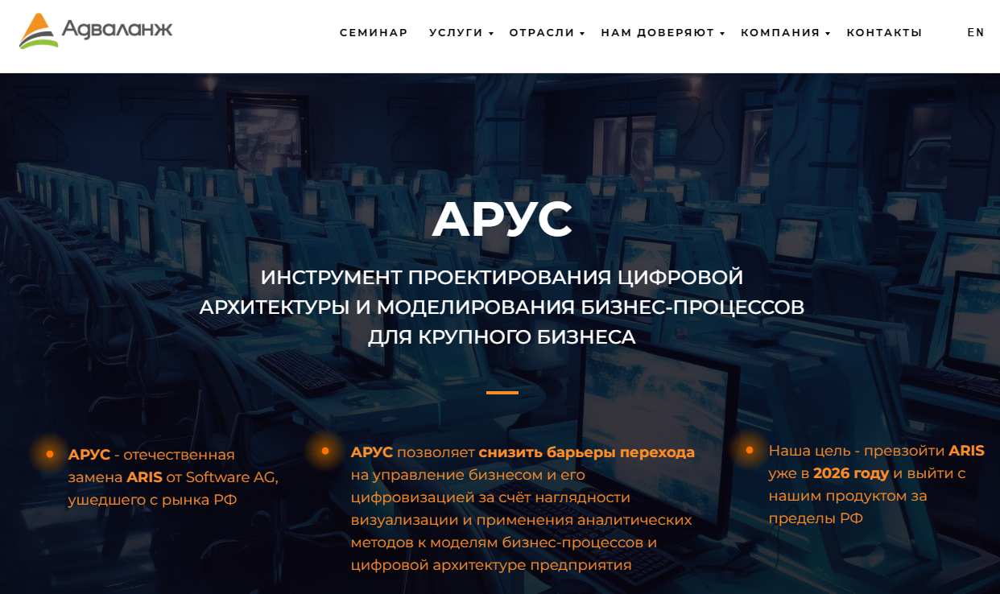

## СПЖЦ
07623615.00435 «Система моделирования процессов жизненного цикла изделий», ФГУП "РФЯЦ-ВНИИЭФ"
- СПЖЦ.ТР = "Технологическая платформа" комплекса программ в защищенном исполнении "Система моделирования процессов жизненного цикла изделий" "Цифровое предприятие"
- СПЖЦ.PDM = "Система управления данными об изделии" комплекса программ в защищенном исполнении "Система моделирования процессов жизненного цикла изделий" "Цифровое предприятие", PDM - система Сарус

[Буклет СПЖЦ ИЦТ](https://xn--b1aecabnea2cbmcffd7av8a5o.xn--p1ai/files/ict-booklet.pdf): Система полного жизненного цикла 
### Тендер на СПЖЦ 
См. папку тендер:
- Лицензия СПЖЦ.ТР серверная РФЯЦ-ВНИИЭФ / 30.11.2024
- Лицензия СПЖЦ.PDM клиентская РФЯЦ-ВНИИЭФ / 30.11.2024

[Стартовая страничка](https://xn--b1aecabnea2cbmcffd7av8a5o.xn--p1ai/), состав СПЖЦ "Цифровое предприятие", СЦЖЦ.ЦП:
- PLM
- Общесистемные программные комплексы
- Технологическая и вычислительная платформы
- MES
- ERP
- HRM

## ARUS 
АРУС - упрощенная версия СПЖЦ, предлагаемая компанией ООО "Лабс" / Advalange.  
[reestr](https://reestr.digital.gov.ru/reestr/2993098/?sphrase_id=5710114), ООО "ЛАБОРАТОРИЯ БЕЗОПАСНЫХ СИСТЕМ", ООО "Лабс"  
[advalange.ru/arus](https://advalange.ru/arus):  
  
