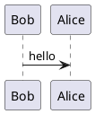

### PlantUML

рендеринг *.iuml файлов
- https://github.com/marketplace/actions/plantuml-for-markdown
- https://github.com/jonashackt/plantuml-markdown

в md-файле нет поддержки:

### Поддержка
- [У GitLab есть интеграция с PlantUML , а вот GitHub никогда не поддерживал.](https://www.reddit.com/r/github/comments/188k7hs/did_github_just_remove_its_markdown_plantuml/?tl=ru)
- [Ранее в этом году (февраль 2022 г.) GitHub добавил поддержку математических выражений в стиле LaTeX и диаграмм Mermaid в Markdown.](https://stackoverflow.com/questions/32203610/how-to-integrate-uml-diagrams-into-gitlab-or-github)

https://github.com/jonashackt/plantuml-markdown  
https://github.com/plantuml/plantuml  

### example 
https://github.com/okunev-e/plantuml_examples
