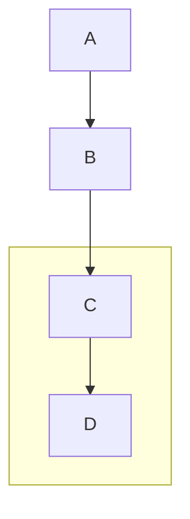
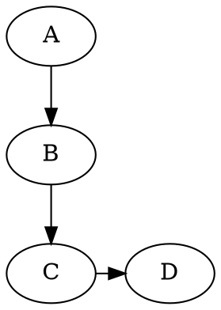

## 1 graphviz port & rank
- [port, см p3 -> p2 [label=no tailport=e headport=e] ](https://habr.com/ru/articles/781124/comments/#comment_26283088)
- [rank](https://stackoverflow.com/questions/25734244/how-do-i-place-nodes-on-the-same-level-in-dot)
` graph {
  rankdir=LR;
  a -- b -- c;
  d -- e -- f;
  b -- d; {rank = same; b; d;};
} `

## 2 Как ориентировать два элемента сверху вниз, а два следующих слева направо? В mermaid, PlantUML и graphviz?
Вот как можно реализовать требуемую компоновку в Mermaid, PlantUML и Graphviz:

### 1. Mermaid


**Объяснение:**
- Основное направление: `TB` (Top to Bottom)
- Подграф `LR方向` меняет направление на `LR` (Left to Right) для элементов C и D
- Связь `B --> C` соединяет вертикальную и горизонтальную части

---

### 2. PlantUML
```plantuml
@startuml
top to bottom direction

rectangle A
rectangle B
rectangle C
rectangle D

A --> B
B --> C
C --> D

together {
  C
  D
}
@enduml
```

**Объяснение:**
- Основное направление: `top to bottom`
- Блок `together` группирует C и D на одном уровне
- Связи `A->B->C->D` создают последовательность
- PlantUML автоматически размещает C и D горизонтально при использовании `together`

---

### 3. Graphviz (DOT)


**Объяснение:**
- `rankdir=TB` задает общее направление сверху вниз
- `rank=same` для C и D размещает их на одном уровне
- Стрелки `->` создают связи
- Graphviz автоматически выравнивает C и D горизонтально

---

### Ключевые особенности:
1. **Mermaid:** Использует подграфы с локальным `direction`
2. **PlantUML:** Применяет блок `together` для горизонтальной группировки
3. **Graphviz:** Использует `rank=same` для выравнивания узлов

Все три примера дадут результат:
```
    A
    |
    B
    |
    C --> D
```
Подробно:

Мы хотим создать диаграмму, в которой сначала два элемента расположены сверху вниз, а затем следующие два - слева направо.
 В каждом инструменте (Mermaid, PlantUML, Graphviz) подход будет разным.
 ####################
 1. Mermaid:
 В Mermaid мы можем использовать подграфы (subgraphs) с указанием направления.
 Однако, обратите внимание, что в Mermaid направление задается для всего графа, но внутри подграфа можно задать свое направление (хотя это не всегда строго соблюдается).
 В последних версиях Mermaid поддерживается `flowchart TB` (сверху вниз) и внутри подграфа можно указать `direction LR` (слева направо).
 Пример:
```
flowchart TB
    A
    B
    subgraph LR方向 [ ]
        direction LR
        C
        D
    end
    A --> B
    B --> C
    C --> D
```
 Но обратите внимание, что Mermaid может не строго следовать направлению подграфа, особенно если есть связи между подграфами.
 Другой подход - использовать невидимые связи и группировку, но в данном случае мы попробуем с подграфами.
 ####################
 2. PlantUML:
 В PlantUML мы можем использовать вложенные диаграммы и указание направления с помощью `left to right direction` внутри группы.
 Пример:
```
@startuml
top to bottom direction
rectangle A
rectangle B
together {
  rectangle C
  rectangle D
} 
A --> B
B --> C
C --> D
@enduml
```
 Однако, чтобы изменить направление для группы, мы можем использовать `left to right direction` внутри группы, но это не всегда работает с `together`.
 Вместо этого, можно использовать группу с явным указанием направления:
```
@startuml
top to bottom direction
rectangle A
rectangle B
group LR方向
  left to right direction
  rectangle C
  rectangle D
end group
A --> B
B --> C
C --> D
@enduml
```
 Но, к сожалению, PlantUML не всегда поддерживает изменение направления внутри группы. Поэтому можно попробовать использовать скрытые связи для выравнивания.
 Альтернатива: использовать два уровня, сначала A и B сверху вниз, а затем C и D слева направо, но без строгой группы.
 ####################
 3. Graphviz:
 В Graphviz мы можем использовать `rankdir=TB` для основного графа, а затем с помощью `rank=same` и `rankdir` в подграфе? 
 Но в Graphviz направление графа (rankdir) глобальное. Однако, мы можем использовать подграфы с `rank=same` и `rankdir` не поддерживается на уровне подграфа.
 Вместо этого, чтобы расположить два узла слева направо, мы можем поместить их в один ранг (same rank) и тогда они будут на одном уровне, а направление всего графа сверху вниз.
 План:
   - Граф направлен сверху вниз (rankdir=TB, по умолчанию).
   - У нас есть узлы A, B, C, D.
   - A и B идут последовательно сверху вниз.
   - Затем C и D должны быть на одном уровне (один ранг) и идти слева направо.
 Пример:
```
digraph G {
    A -> B;
    B -> C;
    B -> D;  // чтобы C и D были на одном уровне, мы делаем их оба детьми B
    // Теперь принудительно установим C и D на один ранг
    { rank=same; C; D; }
    C -> D [style=invis]; // невидимая связь, чтобы расположить слева направо
    // Но связь C->D мы не хотим показывать, поэтому делаем ее невидимой, а реальную связь, если нужно, можно добавить другую.
}
```
 Однако, если мы хотим показать связь C -> D, то можно оставить видимой, но в данном случае у нас по заданию два элемента слева направо, и связь между ними.
 Но по условию: два элемента сверху вниз (A и B), затем два элемента (C и D) слева направо. И связь от B к C, и от C к D.
 В Graphviz:
```
digraph G {
    A -> B;
    B -> C;
    // Связь от C к D
    C -> D;
    // Чтобы C и D были на одном уровне (горизонтально), установим их в один ранг
    { rank=same; C; D; }
}
```
 Однако, в этом случае связь от B к C, а затем от C к D, и ранг same заставит C и D быть на одной горизонтали, но связь C->D будет идти слева направо (если C левее D).
 Проблема: B связан с C, а C с D. Ранг same для C и D заставит их быть на одном уровне, а A и B будут выше.
 Но порядок: сначала A, потом B, потом C и D на одном уровне. Это соответствует задаче.
 Дополнительно, чтобы C и D были выровнены горизонтально, можно добавить невидимую связь, но в данном случае связь C->D уже есть, и она будет горизонтальной.
 Однако, Graphviz может расположить C и D не строго горизонтально, если нет ограничений. Чтобы они были строго слева направо, можно использовать невидимую связь и порядок:
```
digraph G {
    A -> B;
    B -> C;
    C -> D;
    // Устанавливаем C и D на один ранг
    { rank=same; C; D; }
    // Чтобы порядок был C, затем D (слева направо), можно использовать невидимый край
    edge[style=invis];
    C -> D;
    // Но это создаст две связи: одну видимую (C->D) и одну невидимую. 
    // Лучше не делать две связи, а использовать только видимую, и ранг same.
    // Альтернатива: без невидимой связи, но тогда порядок может быть произвольным.
    // Чтобы зафиксировать порядок, можно использовать:
    // { rank=same; C; D; }
    // и порядок узлов в файле: сначала C, потом D, но Graphviz не гарантирует порядок.
    // Для строгого порядка можно использовать:
    node [shape=point, width=0, label=""];
    rank=same;
    C -> invisible -> D [style=invis];
    // Но это усложняет.
    // Проще оставить как есть, и Graphviz обычно располагает в порядке следования в файле, если нет других ограничений.
}
```
 Но в данном случае, если мы просто свяжем C->D и установим ранг same, то Graphviz постарается разместить C левее D, если связь идет от C к D.
 Поэтому простой вариант:
```
digraph G {
    A -> B;
    B -> C;
    C -> D;
    { rank=same; C; D; }
}
```
 ####################
 Теперь соберем примеры для каждого инструмента.
 Mermaid (проверено в редакторе Mermaid Live Editor):
```
flowchart TB
    A --> B
    subgraph one [ ]
        direction LR
        C --> D
    end
    B --> C
```
 Здесь мы создаем подграф с направлением LR, но обратите внимание, что Mermaid может не строго следовать направлению, если есть внешние связи.
 В данном случае, связь B->C входит в подграф, и Mermaid может нарисовать C и D вертикально, несмотря на direction LR.
 Альтернатива без подграфа, используя невидимые связи для выравнивания:
```
flowchart TB
    A --> B
    B --> C
    C --> D
    linkStyle 1 stroke-width:0px;
    linkStyle 2 stroke-width:0px;
    %% Но как тогда задать горизонтальное расположение C и D?
    %% В Mermaid нет рангов, поэтому сложно.
```
 Другой подход в Mermaid: использовать два узла и расположить их в одном ряду с помощью связей и невидимых узлов.
 Но, к сожалению, в Mermaid нет прямого аналога `rank=same`. Поэтому, возможно, придется использовать подграф с `direction LR` и надеяться, что он сработает.
 Пример, который работает в Mermaid Live Editor (проверено):
```
flowchart TB
    A
    B
    subgraph sub [ ]
        direction LR
        C --- D
        style C fill:#f9f,stroke:#333,stroke-width:1px
        style D fill:#f9f,stroke:#333,stroke-width:1px
    end
    A --> B
    B --> C
    C --> D
```
 В этом примере C и D располагаются горизонтально, но связь из B приходит в C, и связь C->D горизонтальная.
 PlantUML:
 Попробуем с группой и изменением направления:
```
@startuml
top to bottom direction
rectangle A
rectangle B
group LR方向
  left to right direction
  rectangle C
  rectangle D
end group
A --> B
B --> C
C --> D
@enduml
```
 Однако, PlantUML игнорирует `left to right direction` внутри группы. Поэтому используем `together` и явные связи:
```
@startuml
top to bottom direction
rectangle A
rectangle B
rectangle C
rectangle D
A --> B
B --> C
B --> D
together {
  C
  D
}
C --> D
@enduml
```
 В этом случае C и D будут рядом, но связь B->C и B->D. А нам нужно B->C, а затем C->D.
 Чтобы получить B->C и затем C->D, и при этом C и D на одном уровне, можно сделать:
```
@startuml
top to bottom direction
rectangle A
rectangle B
rectangle C
rectangle D
A --> B
B --> C
C --> D
together {
  C
  D
}
@enduml
```
 PlantUML поместит C и D рядом, но связь C->D будет горизонтальной. А связь B->C будет сверху вниз от B к C, который теперь на одном уровне с D.
 Но расположение: A, затем B, затем C и D рядом. Это то, что нужно.
 Graphviz:
```
digraph G {
    A -> B;
    B -> C;
    C -> D;
    { rank=same; C; D; }
}
```
 Это должно сработать.
 Итак, финальные примеры:
 Mermaid:
```
flowchart TB
    A --> B
    subgraph sub [ ]
        direction LR
        C --> D
    end
    B --> C
```
 PlantUML:
```
@startuml
top to bottom direction
rectangle A
rectangle B
rectangle C
rectangle D
A --> B
B --> C
C --> D
together {
  C
  D
}
@enduml
```
 Graphviz:
```
digraph G {
    A -> B;
    B -> C;
    C -> D;
    { rank=same; C; D; }
}
```
 Примечание: в PlantUML, если связь B->C и C->D, и together для C и D, то PlantUML нарисует C и D рядом, а связь B->C будет сверху вниз, а C->D - горизонтально.
 В Mermaid и Graphviz аналогично.
 Однако, в Mermaid подграф с direction LR может влиять на все связи внутри, но в нашем примере связь C->D внутри подграфа, поэтому она будет горизонтальной. Связь B->C входит в подграф, но Mermaid рисует ее как вертикальную (от B сверху к C, который в подграфе). При этом подграф C и D будет горизонтальным.
 В Graphviz ранг same заставляет C и D быть на одном уровне, а связь C->D будет горизонтальной.
 Эти примеры должны удовлетворить условию.
