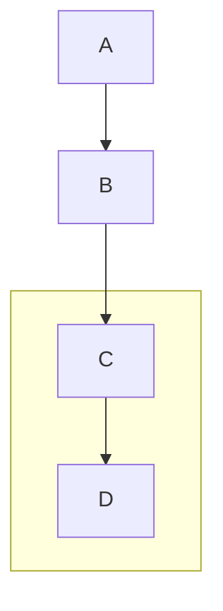
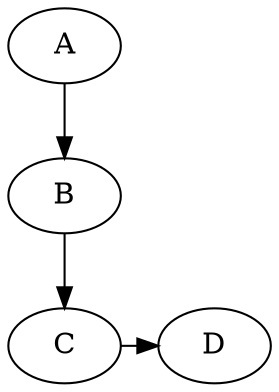

### Как ориентировать два элемента сверху вниз, а два следующих слева направо? В mermaid, PlantUML и graphviz?
Вот как можно реализовать требуемую компоновку в Mermaid, PlantUML и Graphviz:

### 1. Mermaid


**Объяснение:**
- Основное направление: `TB` (Top to Bottom)
- Подграф `LR方向` меняет направление на `LR` (Left to Right) для элементов C и D
- Связь `B --> C` соединяет вертикальную и горизонтальную части

---

### 2. PlantUML
```plantuml
@startuml
top to bottom direction

rectangle A
rectangle B
rectangle C
rectangle D

A --> B
B --> C
C --> D

together {
  C
  D
}
@enduml
```

**Объяснение:**
- Основное направление: `top to bottom`
- Блок `together` группирует C и D на одном уровне
- Связи `A->B->C->D` создают последовательность
- PlantUML автоматически размещает C и D горизонтально при использовании `together`

---

### 3. Graphviz (DOT)


**Объяснение:**
- `rankdir=TB` задает общее направление сверху вниз
- `rank=same` для C и D размещает их на одном уровне
- Стрелки `->` создают связи
- Graphviz автоматически выравнивает C и D горизонтально

---

### Ключевые особенности:
1. **Mermaid:** Использует подграфы с локальным `direction`
2. **PlantUML:** Применяет блок `together` для горизонтальной группировки
3. **Graphviz:** Использует `rank=same` для выравнивания узлов

Все три примера дадут результат:
```
    A
    |
    B
    |
    C --> D
```
