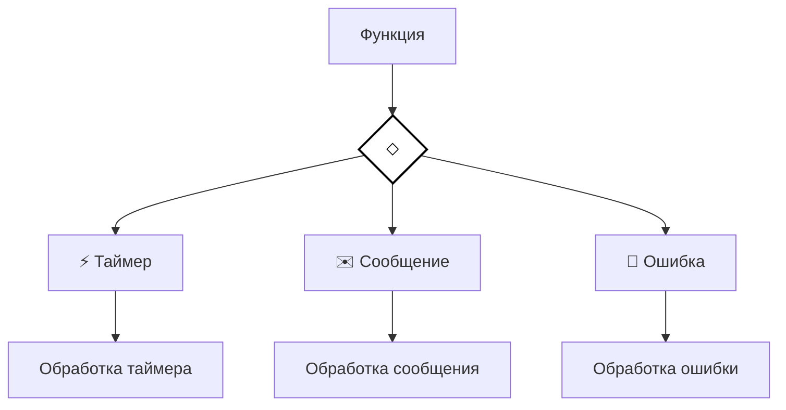

### Mapping BPMN to EPC
#### info
- https://www.businessstudio.ru/help/docs/current/doku.php/ru/csdesign/bpmodeling/bpmn_notation
- https://www.businessstudio.ru/help/docs/current/doku.php/ru/csdesign/bpmodeling/epc_notation

### Ответ 1
# Маппинг шлюзов BPMN в нотацию EPC

## 1. Exclusive Gateway (XOR) → Оператор XOR в EPC

### Разделяющий XOR (Exclusive Decision)
**BPMN**: 
```
[ ]→〈X〉→{A}
      →{B}
```

**EPC**:
```
(Event1)→[Function]→(Event2)─XOR─→[Function A]→...
                          └─→[Function B]→...
```

**Комментарий**: В EPC оператор XOR после события указывает на исключающее ИЛИ - будет выполнена только одна из последующих функций. Условия выбора пути указываются в виде событий или текстовых аннотаций.

### Сходящийся XOR (Exclusive Merge)
**BPMN**:
```
{A}→〈X〉→[ ]
{B}→   ↗
```

**EPC**:
```
...→[Function A]→(Event1)─XOR─→[Next Function]→...
...→[Function B]→(Event2)─┘
```

**Комментарий**: Сходящийся XOR объединяет альтернативные пути. В EPC это реализуется через оператор XOR, который ожидает одно из возможных предыдущих событий.

## 2. Parallel Gateway (AND) → Оператор AND в EPC

### Разделяющий AND (Parallel Fork)
**BPMN**:
```
[ ]→〈+〉→{A}
      →{B}
```

**EPC**:
```
(Event)→[Function]→(Event2)─AND─→[Function A]→...
                         └─→[Function B]→...
```

**Комментарий**: Оператор AND в EPC активирует все исходящие пути одновременно, что соответствует параллельному выполнению в BPMN.

### Сходящийся AND (Parallel Join)
**BPMN**:
```
{A}→〈+〉→[ ]
{B}→   ↗
```

**EPC**:
```
...→[Function A]→(Event1)─AND─→[Next Function]→...
...→[Function B]→(Event2)─┘
```

**Комментарий**: Сходящийся AND требует завершения всех входящих потоков перед продолжением процесса.

## 3. Inclusive Gateway (OR) → Комбинация операторов в EPC

### Разделяющий OR (Inclusive Decision)
**BPMN**:
```
[ ]→〈O〉→{A}
      →{B}
      →{C}
```

**EPC**:
```
(Event)→[Function]→(Gateway Event)─OR─→[Function A]→...
                                ├─→[Function B]→...
                                └─→[Function C]→...
```

**Комментарий**: В EPC нет нативного оператора OR, поэтому используются комбинации XOR и AND, либо расширенные нотации с явным указанием условий.

### Сходящийся OR (Inclusive Merge)
**BPMN**:
```
{A}→〈O〉→[ ]
{B}→   ↗
{C}→   ↗
```

**EPC**:
```
...→[Function A]→(Event1)─\
...→[Function B]→(Event2)─OR─→[Next Function]→...
...→[Function C]→(Event3)─/
```

**Комментарий**: Сложность маппинга заключается в том, что EPC не имеет прямого аналога сходящегося OR. Часто используется комбинация событий и условий.

## 4. Event-Based Gateway → Комбинация событий в EPC

**BPMN**:
```
[ ]→〈◇〉→⚡Timer→{A}
        →✉Message→{B}
```

**EPC**:
```
(Start Event)→(Wait State)─XOR─→(Timer Event)→[Function A]→...
                         └─→(Message Event)→[Function B]→...
```

**Комментарий**: Event-Based Gateway отображается через ожидающее событие с последующим оператором XOR, где каждое исходящее событие представляет триггер.

## 5. Complex Gateway → Пользовательские правила в EPC

**BPMN**:
```
{A}→〈*〉→[ ]
{B}→   ↗
{C}→   ↗
```

**EPC**:
```
...→[Function A]→(Event1)─\
...→[Function B]→(Event2)─[Complex Rule Function]→[Next Function]→...
...→[Function C]→(Event3)─/
```

**Комментарий**: Для Complex Gateway в EPC создается специальная функция, которая инкапсулирует сложную логику объединения потоков.

## Ключевые ограничения маппинга:

1. **Семантические различия**: EPC ориентирована на события, а BPMN - на потоки управления
2. **Отсутствие прямых аналогов**: Не все шлюзы BPMN имеют точные соответствия в EPC
3. **Визуальное представление**: EPC использует операторы как отдельные элементы, а не узлы соединения
4. **Условные переходы**: В EPC условия часто привязаны к событиям, а не к операторам

Маппинг требует адаптации модели с учетом бизнес-логики и конкретных требований процесса.

### Mermaid

# Маппинг шлюзов BPMN в EPC (Mermaid.js)

## 1. Exclusive Gateway (XOR)

### Разделяющий XOR


**Комментарий**: В EPC черный крест (XOR) указывает на исключающий выбор - выполняется только одна ветвь.

### Сходящийся XOR


## 2. Parallel Gateway (AND)

### Разделяющий AND

```mermaid
flowchart TD
    A[Функция] --> B{ }
    B --> C[Функция A]
    B --> D[Функция B]
    
    style B fill:#000000
    style B color:#ffffff
```


**Комментарий**: В EPC для AND используется тот же символ, но логика определяется контекстом - все пути выполняются параллельно.

### Сходящийся AND

```mermaid
flowchart TD
    A[Функция A] --> C{ }
    B[Функция B] --> C
    C --> D[Следующая функция]
    
    style C fill:#000000
    style C color:#ffffff
```


## 3. Inclusive Gateway (OR)

### Разделяющий OR

```mermaid
flowchart TD
    A[Функция] --> B(( ))
    B --> C[Функция A]
    B --> D[Функция B]
    B --> E[Функция C]
    
    style B fill:#000000
    style B color:#ffffff
    style B stroke:#000000
    style B stroke-width:2px
```


**Комментарий**: В EPC OR часто представляется как пустой круг или комбинация операторов, активирующая одну или несколько ветвей.

## 4. Event-Based Gateway



**Комментарий**: Event-Based Gateway отображается через ожидание различных событий-триггеров.

## 5. Комбинированные операторы EPC

### Комплексная логика

```mermaid
flowchart TD
    A[Начальная функция] --> B{XOR}
    B --> C[Функция A]
    B --> D[Функция B]
    
    C --> E{AND}
    D --> E
    
    E --> F[Функция C]
    E --> G[Функция D]
    
    F --> H((Конечное событие))
    G --> H
    
    style B fill:#000000
    style E fill:#000000
    style B color:#ffffff
    style E color:#ffffff
```


## 6. Полный пример процесса

```mermaid
flowchart TD
    Start((Старт)) --> A[Проверить заявку]
    A --> B{XOR}
    
    B --> C[Одобрить заявку]
    B --> D[Отклонить заявку]
    
    C --> E{AND}
    E --> F[Уведомить клиента]
    E --> G[Обновить БД]
    
    F --> H((Заявка одобрена))
    G --> H
    
    D --> I((Заявка отклонена))
    
    style B fill:#000000
    style E fill:#000000
    style B color:#ffffff
    style E color:#ffffff
```



## Особенности маппинга в Mermaid:

1. **XOR оператор** - черный ромб/прямоугольник
2. **AND оператор** - черный ромб (контекст определяет логику)
3. **События** - круги
4. **Функции** - прямоугольники
5. **Поток управления** - стрелки

Mermaid не имеет нативной поддержки EPC, но может эмулировать основные конструкции через стандартные элементы flowcharts.
