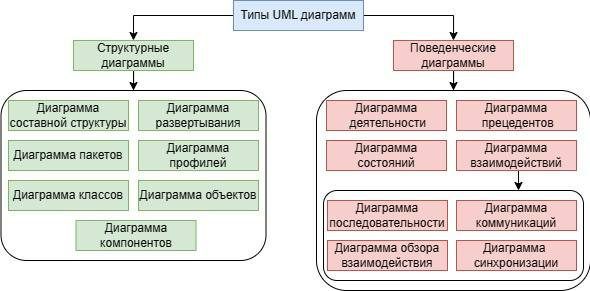

### Dia Type
#### 1
https://t.me/ba_and_sa/2515  
Продолжим тему UML-моделирования, (https://t.me/ba_and_sa/2509) и рассмотрим 12 диаграмм UML, которые делятся на два основных типа: структурные и поведенческие. 

Структурные диаграммы описывают структуру системы (например, диаграмма классов, компонентов, развертывания), а поведенческие — её поведение и взаимодействия (например, диаграмма деятельности, последовательности, состояний). 

1️⃣ Структурные диаграммы: 

- Диаграмма классов: (https://prog-cpp.ru/uml-classes/) Отображает классы, их атрибуты, методы и связи между ними. 

- [Диаграмма компонентов:](https://imlearning.ru/netcat_files/file/FSIS/%D0%A4%D0%A1%D0%98%D0%A1_%D1%81%D0%B5%D0%BC%D0%B8%D0%BD%D0%B0%D1%80-9_%D0%94%D0%B8%D0%B0%D0%B3%D1%80%D0%B0%D0%BC%D0%BC%D0%B0-%D0%BA%D0%BE%D0%BC%D0%BF%D0%BE%D0%BD%D0%B5%D0%BD%D1%82%D0%BE%D0%B2.pdf) Показывает, как компоненты системы (например, сервисы, приложения) организованы и зависят друг от друга. 

- [Диаграмма развертывания:](https://imlearning.ru/netcat_files/file/FSIS/%D0%A4%D0%A1%D0%98%D0%A1_%D1%81%D0%B5%D0%BC%D0%B8%D0%BD%D0%B0%D1%80-10_%D0%94%D0%B8%D0%B0%D0%B3%D1%80%D0%B0%D0%BC%D0%BC%D0%B0-%D1%80%D0%B0%D0%B7%D0%B2%D0%B5%D1%80%D1%82%D1%8B%D0%B2%D0%B0%D0%BD%D0%B8%D1%8F.pdf) Описывает физическое развертывание системы на аппаратных узлах. 

- [Диаграмма объектов:](https://ru.wikipedia.org/wiki/%D0%94%D0%B8%D0%B0%D0%B3%D1%80%D0%B0%D0%BC%D0%BC%D0%B0_%D0%BE%D0%B1%D1%8A%D0%B5%D0%BA%D1%82%D0%BE%D0%B2) Представляет собой моментальный снимок системы с конкретными объектами и связями между ними. 

- Диаграмма пакетов: (https://blog.visual-paradigm.com/ru/what-is-a-package-what-is-a-package-diagram-in-uml/) Группирует элементы модели в пакеты и показывает зависимости между этими пакетами. 

- [Диаграмма композитной структуры:](https://iu5.bmstu.ru/pluginfile.php?file=%252F7991%252Fmod_folder%252Fcontent%252F0%252F%D0%9F%D1%80%D0%B5%D0%B7%D0%B5%D0%BD%D1%82%D0%B0%D1%86%D0%B8%D0%B8%2520UML2%252F11%2520%D0%94%D0%B8%D0%B0%D0%B3%D1%80%D0%B0%D0%BC%D0%BC%D0%B0%D0%9A%D0%BE%D0%BC%D0%BF%D0%BE%D0%B7%D0%B8%D1%82%D0%BD%D0%BE%D0%B9%D0%A1%D1%82%D1%80%D1%83%D0%BA%D1%82%D1%83%D1%80%D1%8B.pptx&forcedownload=1) Показывает внутреннюю структуру класса и взаимодействие его элементов. 

- Диаграмма профилей: (https://dzen.ru/video/watch/62faaab21f76d45bc6e434d3) Позволяет определять пользовательские стереотипы, теги и ограничения для моделирования. 

2️⃣ Поведенческие диаграммы: 

- Диаграмма вариантов использования (https://habr.com/ru/amp/publications/566218/) (прецедентов): Описывает, как пользователи взаимодействуют с системой для достижения определенных целей. 

- Диаграмма деятельности: (https://nationalteam.worldskills.ru/skills/proektirovanie-diagrammy-deyatelnosti-uml-activity-diagram/) Показывает поток управления, аналогичный блок-схеме процесса или потоку работ. 

- Диаграмма состояний: (https://nationalteam.worldskills.ru/skills/proektirovanie-diagrammy-sostoyaniy-uml-statechart-diagram/) Описывает жизненный цикл объекта, показывая, как он переходит из одного состояния в другое в ответ на события. 

- Диаграммы взаимодействия:

   - Диаграмма последовательности: (https://habr.com/ru/amp/publications/814769/) Иллюстрирует, как объекты взаимодействуют друг с другом во времени, показывая последовательность вызовов. 

    - Диаграмма коммуникации: (https://www.youtube.com/watch?v=KVLJj9xOq0E) Похожа на диаграмму последовательности, но фокусируется на сообщениях, которыми обмениваются объекты, отображая их на общей линии, а не в отдельной временной шкале. 

    - Диаграмма обзора взаимодействия: (https://itonboard.ru/analysis/921-obzornaia_diagramma_vzaimodeistviia_uml/) Позволяет представить взаимодействие нескольких диаграмм последовательности или коммуникации в виде единой диаграммы. 

    - Временная диаграмма: (https://dzen.ru/video/watch/62c93f5e0f324673224c550a) Показывает, как состояние объекта изменяется с течением времени, накладывая временные ограничения

### 2
Часть 2: «Что такое UML? Это не язык, это - алфавит» 

❓Используют ли UML для моделирования бизнес-процессов?

Краткий ответ: можно, но BPMN почти всегда лучше.

UML для этого предлагает две основные диаграммы:

- UML Activity Diagram: Хорошо подходит для описания потока работ (workflow) внутри системы или алгоритма. Она отлично показывает параллельные процессы, ветвления, слияния.

- UML Use Case Diagram: Показывает, что делает система с точки зрения пользователя, но не как и в какой последовательности.

Почему же BPMN чаще предпочтительнее для бизнес-процессов?

- Более богатый семантический набор: BPMN имеет специальные элементы для всего, что важно в бизнес-процессе: пулы и дорожки (роли), события-сообщения (письма, сигналы), артефакты (документы), транзакции.

- Понятность для бизнес-пользователей: BPMN изначально создавался для того, чтобы и бизнес-аналитики, и менеджеры говорили на одном языке. UML же все-таки более «технический».

- Ясное разделение ответственности: Дорожки в BPMN наглядно показывают, кто за что отвечает — человек, отдел или система.

‼️Вывод: Используйте UML Activity Diagram, если вы описываете чисто системную логику или алгоритм. 

Используйте BPMN, если вы описываете бизнес-процесс с участием людей, отделов и внешних систем.  
Выберите инструмент под задачу: Sequence — для взаимодействия, State Machine — для жизненного цикла, Component — для архитектуры.
