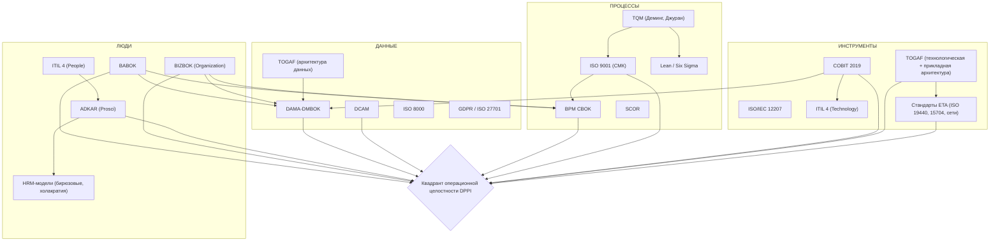

## 1

Ниже представлена развёрнутая концепция, объединяющая четыре элемента управления предприятием: **Данные, Процессы, Исполнитель и Инструменты**. Материал структурирован по вашему запросу и содержит сравнительные таблицы, анализ методологий и прототип интеграционной модели.

---

### 1. Четыре квадрата: границы и определяющие источники

Каждый элемент рассматривается как самостоятельный домен с чёткими границами, однако все они находятся в непрерывном взаимодействии.

#### Квадрат 1. Данные
- **Границы:** модели данных (концептуальные, логические, физические), Master Data, транзакционные данные, метаданные, качество данных, жизненный цикл, хранение, архитектура данных, безопасность и конфиденциальность.
- **Определяющие источники:**
  - **DAMA-DMBOK** (Data Management Body of Knowledge) — фундаментальный свод знаний по управлению данными, выделяющий 11 функциональных областей (колесо DAMA).
  - **DCAM** (Data Management Capability Assessment Model) от EDM Council — модель зрелости для финансовой отрасли, охватывающая архитектуру данных, качество, управление.
  - **TOGAF** — раздел архитектуры данных (фаза C в ADM) определяет структуру корпоративных данных, их миграцию и управление.
  - **ISO 8000** — стандарт качества данных.
  - **GDPR / ISO 27701** — нормативные рамки приватности и защиты персональных данных, влияющие на управление данными.

#### Квадрат 2. Процессы (бизнес-процессы)
- **Границы:** сквозные цепочки создания ценности, подпроцессы, операции, события, правила, KPI, входы/выходы, ответственные, нотация моделирования (BPMN).
- **Определяющие источники:**
  - **BPM CBOK** (Business Process Management Common Body of Knowledge) — главный ориентир, описывающий цикл BPM (PDCA), управление процессами, трансформацию, измерение.
  - **APQC PCF** (Process Classification Framework) — эталонная таксономия процессов.
  - **ISO 9001:2015** — процессный подход, риск-ориентированное мышление, цикл PDCA.
  - **SCOR** (Supply Chain Operations Reference) — для цепей поставок.
  - **Lean / Six Sigma** — операционное совершенствование процессов на основе статистики и устранения потерь.

#### Квадрат 3. Исполнитель процесса
- **Границы:** организационные роли, штатная структура, компетенции, мотивация, распределение ответственности (RACI), культура непрерывного улучшения, вовлечённость.
- **Определяющие источники:**
  - **BABOK** (Business Analysis Body of Knowledge) — определяет заинтересованных сторон, их роли, потребности и коллаборацию в процессе изменений.
  - **ITIL 4** — понятие «Practice» немыслимо без ролей и компетенций; выделяет роли владельца процесса, менеджера, исполнителя.
  - **ISO 10018** — руководство по вовлечению людей в систему менеджмента качества (компетентность, осведомлённость).
  - **SHRM BoCK** (Society for Human Resource Management) — управление талантами, развитие персонала.
  - **RACI / RASCI-матрица** — практический инструмент закрепления исполнителя за действиями процесса.

#### Квадрат 4. Инструменты (ИТ-системы)
- **Границы:** корпоративные приложения (ERP, CRM, BPM-движки), интеграционные шины, базы данных, low-code платформы, облачные сервисы, средства автоматизации, юзабилити интерфейсов.
- **Определяющие источники:**
  - **COBIT 2019** — управление корпоративным ИТ, оценка enablers (приложения, инфраструктура) для достижения бизнес-целей.
  - **ITIL 4** — «Service Management» требует инструментов для регистрации инцидентов, CMDB, каталога услуг, автоматизации.
  - **TOGAF** — архитектура приложений и технологическая архитектура (каталоги приложений, интерфейсов, технологических компонентов).
  - **ISO 12207 / IEEE 12207** — жизненный цикл программного обеспечения, определяет процессы создания и поддержки ИТ-инструментов.
  - **Market guides** (Gartner Magic Quadrant, Forrester) — эталонные классы систем (iBPMS, ERP, CRM).

#### Сравнительная таблица источников по блокам

| Блок | Ключевые источники | Что именно определяется |
|------|-------------------|--------------------------|
| **Данные** | DAMA-DMBOK, DCAM, TOGAF, ISO 8000, GDPR | Структура, качество, жизненный цикл, безопасность, master-data. |
| **Процессы** | BPM CBOK, APQC PCF, ISO 9001, SCOR, Lean | Цепочка ценности, метрики, нотация, управление изменениями. |
| **Исполнитель** | BABOK, ITIL 4, ISO 10018, SHRM, RACI | Роли, компетенции, вовлечённость, матрица ответственности. |
| **Инструменты** | COBIT, ITIL 4, TOGAF (App/Tech), ISO 12207 | Каталог приложений, автоматизация, технологический стек, интерфейсы. |

---

### 2. Концепции интеграции четырёх компонентов и их сравнительный анализ

**ARIS House** (архитектура интегрированных информационных систем) — одна из первых моделей, объединяющая представления: «Организация», «Функции», «Данные», «Продукты/Услуги» и центральное «Управление процессами». Близка к нашим четырём квадратам, но акцентирует «Продукты» как отдельный элемент.

**Другие интеграционные концепции:**

- **Zachman Framework** — матрица 6×6, выделяющая *Что (данные), Как (функции/процессы), Где (сеть), Кто (люди), Когда (время), Почему (мотивация)*. Люди выделены, процессы и данные также. Инструменты неявно присутствуют в представлениях систем и технологий.
- **TOGAF Architecture Domains** — Бизнес-архитектура (процессы, люди), Архитектура данных, Архитектура приложений (инструменты), Технологическая архитектура (инфраструктура). Чётко разделяет приложения и людей в разных ячейках.
- **Модель «People – Process – Technology» (PPT)** — классический треугольник. Часто дополняется элементом «Data», образуя квадрант DPPT. Наиболее прямое соответствие.
- **Модель Левitt’а (Leavitt’s Diamond)** — четыре взаимозависимые переменные: *Задачи (аналог процессов), Люди, Технологии, Организационная структура*. Не хватает отдельного блока «Данные».
- **McKinsey 7S** — *Стратегия, Структура, Системы, Стиль, Персонал, Навыки, Общие ценности*. Данные и процессы растворены в «Системах», люди — в «Персонале» и «Навыках».
- **Сбалансированная система показателей (BSC)** — *Финансы, Клиенты, Внутренние процессы, Обучение и развитие*. Процессы и люди (через обучение) есть; данные и инструменты неявно встроены.

**Сравнительная таблица концепций интеграции**

| Концепция | Покрытие «Данные» | Покрытие «Процессы» | Покрытие «Исполнитель» | Покрытие «Инструменты» | Особенность |
|-----------|-------------------|----------------------|------------------------|------------------------|-------------|
| **ARIS House** | Явный блок «Данные» | Центральный «Процесс» | Блок «Организация» | Блок «Функции/Приложения» | Добавлен блок «Продукты/Услуги» |
| **Zachman** | Столбец «Что» | Столбец «Как» | Столбец «Кто» | Ячейки «Системы» и «Технологии» | 6 перспектив, сложная матрица |
| **TOGAF ADM** | Архитектура данных | Бизнес-архитектура | В рамках бизнес-архитектуры (акторы) | Архитектура приложений + технологий | Наиболее полный корпоративный стандарт |
| **PPT + Data** | Отдельный «Data» | «Process» | «People» | «Technology» | Простота, часто используется в цифровой трансформации |
| **Leavitt’s Diamond** | Не выделен | «Task» | «People» | «Technology» | Акцент на взаимозависимости, «Структура» вместо данных |
| **BSC** | Не выделен | «Внутренние процессы» | «Обучение и развитие» | Не выделен | Стратегический, а не архитектурный фокус |

---

### 3. Прототип общей модели «Квадрант операционной целостности DPPI» (Data-Process-People-IT)

Создадим прототип, который наиболее полно раскрывает взаимосвязь: **Модель DPPI** (четыре квадрата, равнозначные и взаимозависимые, связанные потоками ценности). Название: **«Квадрант операционной целостности DPPI»**.

#### Визуальное представление (описание прототипа)

Четыре квадрата расположены в виде 2x2 матрицы:
- **Слева сверху:** **ДАННЫЕ** (Что обрабатывается)
- **Справа сверху:** **ПРОЦЕССЫ** (Как создаётся ценность)
- **Слева снизу:** **ИСПОЛНИТЕЛЬ** (Кто выполняет и управляет)
- **Справа снизу:** **ИНСТРУМЕНТЫ** (Чем автоматизировано)

В центре пересечения всех квадратов — **Создаваемая ценность / Бизнес-результат**.

**Связи-потоки между квадратами:**
1. **Данные → Процессы:** События и информационные объекты инициируют и наполняют шаги процесса (например, заказ клиента запускает процесс «Обработка заявки»).
2. **Процессы → Инструменты:** Процесс требует функциональности, которая реализуется в ИТ-системах (экранные формы, уведомления, правила валидации).
3. **Инструменты → Исполнитель:** Интерфейс приложения предоставляет рабочую среду (списки задач, информационные панели) для исполнителя, поддерживая его эффективность.
4. **Исполнитель → Процессы:** Люди принимают решения, вводят данные, управляют исключениями — без них процесс неживой (человеко-центричные шаги).
5. **Исполнитель → Данные:** Экспертный ввод, интерпретация и контроль качества данных — обязательное звено. Исполнитель порождает новые данные, поддерживает master-data.
6. **Данные → Инструменты:** Модели данных, справочники и правила хранятся в системах, обеспечивая их корректную работу.

**Границы внутри квадратов:**
- В квадрате **Данные** обязательны слои: Метаданные, Master Data, Качество данных, Аналитика.
- В квадрате **Процессы**: сквозные цепочки, метрики выполнения, бизнес-правила.
- В квадрате **Исполнитель**: должностные роли, компетенции, мотивация, матрица RACI, культура.
- В квадрате **Инструменты**: прикладной ландшафт (ERP, CRM, BPM-движки, BI), интеграционная шина, интерфейсы.

Эта модель гарантирует, что при проектировании изменений ни один из элементов не выпадает: цифровая трансформация требует одновременного управления данными, перепроектирования процессов, обучения людей и внедрения инструментов. Она же служит каркасом для зрелостной оценки организации.

---

### 4. Сравнительный анализ DAMA-DMBOK, BPM CBOK и аналогичных сводов знаний

Эти книги (BoK) задают «тела знаний» для профессиональных сообществ. Они различны по ядру, но пересекаются в элементах управления.

| BoK / Стандарт | Центральный фреймворк / Элементы | Опора на какие циклы/методы | Применимость к нашим квадратам |
|----------------|-----------------------------------|-----------------------------|----------------------------------|
| **DAMA-DMBOK** | Колесо DAMA из 11 областей (Data Governance в центре, вокруг – Архитектура, Качество, Безопасность, MDM и др.) | Plan-Do-Check-Act для качества данных | Доминирует в квадрате **Данные**, влияет на Инструменты |
| **BPM CBOK** | Цикл BPM (Design, Modeling, Execution, Monitoring, Optimization), основанный на PDCA. Процессные фреймворки, нотации, KPI. | PDCA, Lean, Six Sigma | Доминирует в квадрате **Процессы**, тесно связан с Исполнителем |
| **BABOK (IIBA)** | Шесть областей знаний: Планирование анализа, Выявление требований, Управление жизненным циклом, Стратегический анализ, Анализ требований и дизайн, Оценка решения | Заинтересованные стороны, итеративный подход | Основной для **Исполнителя** (стейкхолдеры), мост между бизнесом и Инструментами |
| **ITIL 4** | Система создания ценности услуг (SVS), Цепочка ценности, Практики (34), Постоянное улучшение | PDCA (через модель улучшения), Lean, Agile | Охватывает **Процессы** (практики), **Инструменты** (технологии), **Исполнителей** (роли, компетенции) |
| **TOGAF** | ADM-цикл (8 фаз), Континуум предприятия, 4 архитектурных домена | Итеративная разработка архитектуры | Покрывает все 4 квадрата как архитектурные блоки |
| **COBIT 2019** | Принципы системы управления, enablers (процессы, информация, люди, приложения и др.), цели каскадирования | PDCA, зрелость CMMI | Балансирует **Процессы** управления ИТ, **Данные** как актив, **Исполнителей** и **Инструменты** |

**Основные элементы, на которые опираются эти книги:**
- *BPM CBOK*: PDCA, цикл BPM, метрики зрелости, нотация BPMN, Lean-устранение потерь.
- *DAMA-DMBOK*: управление жизненным циклом данных, управление качеством (PDCA), Data Governance (совет по данным, распорядители).
- *ITIL 4*: цепочка создания ценности (Plan → Engage → Design & Transition → Obtain/Build → Deliver & Support → Improve), SVS, guiding principles.
- *BABOK*: цикл бизнес-анализа, стейкхолдеры, требования как актив.
- *TOGAF*: ADM (видение → бизнес → ИС → технология → возможности → планирование миграции → управление реализацией → управление изменениями).
- *COBIT*: принципы COSO, enablers, балансовая карта ИТ-целей.

---

### 5. Методологии со схожими блоками и сравнение с моделью DPPI

Многие стратегические и операционные модели неосознанно или явно выделяют блоки, близкие к нашим четырём. Проведём прямое сравнение.

**Методологии-аналоги:**

| Методология / Модель | Основные блоки | Соответствие элементам DPPI | Комментарий |
|----------------------|----------------|-------------------------------|-------------|
| **BSC (Каплан, Нортон)** | Финансы, Клиенты, Внутренние процессы, Обучение и развитие | Обучение ~ **Исполнитель**, Процессы ~ **Процессы**. Данные и Инструменты отсутствуют в явном виде, они — обеспечивающие факторы. | Стратегическая карта. Полезна для выравнивания целей. |
| **Leavitt’s Diamond** | Задачи, Люди, Технологии, Структура | Люди = **Исполнитель**, Технологии = **Инструменты**, Задачи = **Процессы**. Вместо Данных — Структура (организационная). | Классика управления изменениями. |
| **PPT + Data (DPPT)** | Данные, Процессы, Люди, Технологии | Почти прямое совпадение. Люди = Исполнитель. | Наиболее близкий аналог, часто используется в цифровой трансформации. |
| **McKinsey 7S** | Стратегия, Структура, Системы, Стиль, Персонал, Навыки, Общие ценности | Персонал+Навыки ≈ **Исполнитель**, Системы ≈ **Инструменты** и часть Данных. Процессы рассеяны. | Жёсткие и мягкие элементы, сильный культурный аспект. |
| **ARIS House** | Организация, Данные, Процессы, Функции/Приложения, Продукты | Данные = **Данные**, Процессы = **Процессы**, Организация = **Исполнитель**, Функции/Приложения = **Инструменты**. Есть лишний блок «Продукты». | Идеально сопоставим, модель-прототип для нашего квадранта. |
| **Бережливое производство (Lean) 4M** | Man (Человек), Machine (Оборудование/ИТ), Material, Method (Процесс) | Человек = Исполнитель, Method = Процессы, Machine = Инструменты, Material можно трактовать как поток данных/сырья. | Ориентировано на производственную ячейку. |
| **IT4IT (The Open Group)** | Четыре потока создания ценности: Strategy to Portfolio, Requirement to Deploy, Request to Fulfill, Detect to Correct. Оперирует объектами данных, действиями людей и системами. | Имеет сквозные объекты «Data Object», «System», «Person». | Эталонная архитектура для управления ИТ, близкая к нашему делению. |

**Сравнительный анализ с нашей моделью DPPI:**
Большинство методологий не выделяют **Данные** как равноправный квадрат, а растворяют их в «Технологиях» или «Системах». Наш подход делает на этом акцент, поскольку в цифровой экономике данные становятся самостоятельным продуктом и активом, требующим отдельной дисциплины управления. Модели BSC и 7S ориентированы на стратегию и культуру, а не на операционную конструкцию, поэтому данные и инструменты в них являются вторичными. Прямые аналоги (DPPT, ARIS House) подтверждают, что концепция из четырёх равных квадратов уже зрела в практике, но редко формализовывалась как единая модель для операционного аудита и трансформации.

**Вывод:** Предложенная модель **«Квадрант операционной целостности DPPI»** систематизирует междисциплинарный подход, опираясь на признанные BoK: DAMA для данных, BPM CBOK для процессов, BABOK/ITIL для людей и COBIT/TOGAF для инструментов. Она даёт сбалансированный каркас для диагностики предприятия, где ни один из четырёх столпов не может игнорироваться без риска разбалансировки инициатив.

## 1.1 reasoning

Мы должны ответить на комплексный запрос пользователя, который просит:

Составить концепцию, включающую четыре взаимосвязанных элемента: Данные, Процессы (бизнес-процессы), Исполнитель процесса, Инструменты (ИТ-системы). Представить как четыре квадрата с четкими границами. Для каждого блока указать определяющие источники: для Данных - DAMA-DMBOK и другие источники, для Процессов - BPM CBOK и другие, для Исполнителя и Инструментов - указать, какие источники их определяют. Сделать сравнительную таблицу источников.

Привести общие концепции интеграции указанных четырех компонентов. Одна из концепций ARIS House. Привести другие и сделать их сравнительный анализ.

Создать прототип общей модели (дать ей название), которая наиболее полно показывает взаимосвязь Данные, Процессы, Исполнитель, Инструменты.

Сделать сравнительный анализ DAMA-DMBOK, BPM CBOK и подобных (например, BABOK, ITIL, TOGAF и т.д.). Указать основные элементы, на которые опираются эти "книги" (своды знаний), например, в BPM CBOK это PDCA.

Показать методологии, где есть схожие блоки (например, ССП - финансы, клиенты, процессы, обучение и развитие, где обучение и развитие похоже на Исполнителя). Сравнить их с нашей концепцией.

Нужно дать развернутый, структурированный ответ, с таблицами, сравнительным анализом, прототипом модели. Весь ответ на русском языке.

План ответа:

Введение: концепция четырех квадратов.

Блок 1: Данные. Источники: DAMA-DMBOK, DCAM, TOGAF (управление данными), ISO 8000 и др. Определение границ: данные как актив, модели данных, качество данных, master data и т.д.

Блок 2: Процессы. Источники: BPM CBOK, ISO 9001, APQC PCF, Six Sigma, Lean, SCOR. BPM CBOK - PDCA, процессный подход. Границы: сквозные процессы, нотация BPMN, KPI процессов.

Блок 3: Исполнитель процесса. Источники: BABOK (заинтересованные стороны, роли), ITIL (роли, ответственности), теория управления человеческими ресурсами, ISO 10018 (вовлечение людей), SHRM, модели компетенций, RACI. Границы: роли, организационная структура, компетенции, мотивация.

Блок 4: Инструменты (ИТ-системы). Источники: ITIL (управление ИТ-услугами, CMDB), TOGAF (архитектура приложений и технологий), COBIT (управление ИТ), ISO 12207 (процессы жизненного цикла ПО), стандарты Enterprise Architecture. Границы: ERP, BPM-системы, CRM, базы данных, интерфейсы, автоматизация.

Сравнительная таблица источников для четырех блоков: столбцы - Блок, Основные определяющие источники, Краткая характеристика того, как источник определяет блок.

Интеграционные концепции: ARIS House (данные, функции, организация, продукты/услуги, процессы - но не совсем квадраты), модель Захмана (данные, функции, сеть, люди, время, мотивация), TOGAF ADM (бизнес-архитектура, архитектура данных, архитектура приложений, технологическая архитектура), модель "Люди-Процессы-Технологии" (PPT framework), Сбалансированная система показателей (BSC) с четырех перспектив, модель "Leavitt's Diamond" (задачи, люди, структура, технология). Сравнительный анализ их покрытия четырех элементов.

Прототип общей модели: назвать, например, "Модель D-PIT (Data-Process-People-IT)" или "Квадрант операционной эффективности". Показать взаимосвязь: Данные питают Процессы и инструменты, Процессы выполняются Исполнителем с помощью Инструментов, которые обрабатывают Данные; Исполнитель владеет данными и процессами. Представить в виде квадратов со стрелками. Модель с циклическим взаимодействием. Подробно описать.

Сравнительный анализ DAMA-DMBOK, BPM CBOK, BABOK, ITIL, TOGAF, COBIT. Таблица: Свод знаний, Основные элементы/фреймворки (например, DAMA: колесо DAMA, управление данными; BPM CBOK: PDCA, цикл BPM; BABOK: BABOK Guide v3 - бизнес-анализ; ITIL 4: сервисная ценность, SVS; TOGAF: ADM; COBIT 2019: принципы управления ИТ). Сравнение охвата четырех блоков.

Методологии со схожими блоками: сравнение ССП (финансы, клиенты, процессы, обучение и развитие) с нашей моделью (Данные, Процессы, Исполнитель, Инструменты). Обучение и развитие ~ Исполнитель, процессы ~ процессы, финансы/клиенты могут быть аспектами данных и результатов процессов, но не прямо. Модель "Leavitt's Diamond": структура, задачи, люди, технологии - у нас Данные вместо структуры? Модель Гейта (People, Process, Technology) + Data. Модель McKinsey 7S: стратегия, структура, системы, стиль, персонал, навыки, общие ценности. Сравним, насколько наши 4 элемента уникальны и как они отражаются. Таблица: Методология, Блоки, Соответствие четырем элементам (Д, П, И, И), Комментарий.

Затем создать итоговую концепцию и прототип. Название модели: "Интегрированная модель операционного управления DPPI" (Data, Process, People, IT). Или "Квадрант D3PI". Учитывая запрос "наиболее полно показывает взаимосвязь", нарисовать (описать) квадраты, расположенные в виде ромба или сетки 2x2: сверху Данные (Что?) и Процессы (Как?), снизу Исполнитель (Кто?) и Инструменты (Чем?). Стрелки: Данные -> Процессы (информационные потоки), Процессы -> Инструменты (автоматизация), Инструменты -> Исполнитель (интерфейс), Исполнитель -> Процессы (выполнение), Исполнитель -> Данные (ввод/интерпретация). В центре - цель бизнеса. Описать, что такое границы: Данные - структурированные/неструктурированные, метаданные, качество; Процессы - цепочка создания ценности, события, задачи, правила; Исполнитель - люди, роли, компетенции, ответственность (RACI); Инструменты - приложения, платформы, интеграции. Эта модель может быть положена в основу архитектурного подхода.

### 1.2 link DPPT
- https://frederickvanbrabant.com/blog/2025-05-16-people-processes-technology-and-information/

## 2
## Дополнение: углублённый разбор по блокам и сквозным темам

### 1. Стандарты технической (технологической) архитектуры предприятия

Ниже собраны основные международные, национальные и отраслевые стандарты, формирующие дисциплину ETA, включая аспекты моделирования предприятия и сетевой инфраструктуры.

| Стандарт | Название / Суть | Фокус в ETA | Примечание |
|----------|------------------|-------------|------------|
| **ISO 19440:2020** | Моделирование предприятия и архитектура – Конструкции для моделирования предприятия | Базовые конструкты (сущности, события, процессы, ресурсы) для описания операционной и технологической архитектуры | Заменил ISO 19440:2007; обеспечивает семантическую основу |
| **ISO 15704:2019** | Требования к стандартным архитектурам и методологиям предприятия (GERA, GERM) | Определяет, какой должна быть архитектурная методология; охватывает жизненный цикл, модели, роли | ГОСТ Р ИСО 15704-2008 – перевод первой редакции 2000 г. |
| **ISO/IEC 12207:2017** | Процессы жизненного цикла программных средств | Инструментальная часть: проектирование, разработка, сопровождение ИТ-систем | Связана с архитектурой приложений |
| **TOGAF (The Open Group)** | Методология архитектуры предприятия (ADM, континуум, техническая эталонная модель TRM) | Де-факто стандарт для технической архитектуры; каталоги приложений, инфраструктуры, интерфейсов | Сертифицируемый фреймворк, не ISO, но широко признан |
| **ArchiMate (The Open Group)** | Язык моделирования архитектуры, интегрированный с TOGAF | Описание ИТ-инфраструктуры, сетей, устройств, узлов | Стандартизован в IEC 62018 |
| **DoDAF / MODAF / NAF** | Военные/правительственные архитектурные фреймворки | Детальные представления системной и технической архитектуры (SV, TV) | Применяются в госсекторе |
| **ANSI/ISA-95** | Интеграция систем управления предприятием и производственных систем | Архитектура интерфейсов между ERP и АСУТП, иерархия оборудования | Важен для промышленного IoT |
| **ISO/IEC 11801 (серия)** | Информационные технологии – Структурированные кабельные системы для помещений заказчиков | Физическая сетевая инфраструктура | Основа проектирования ЛВС |
| **ISO/IEC 24764** | Кабельные системы центров обработки данных | Сетевая архитектура ЦОД | Дополняет 11801 |
| **ISO/IEC 27033 (серия)** | Сетевая безопасность | Архитектура защищённых сетей | Часть семейства 27000 |
| **IEEE 802.1 / 802.3** | Архитектура и протоколы локальных/городских сетей, Ethernet | Технический фундамент коммутации, VLAN, маршрутизации | Стандарты IEEE |
| **ITU-T Y.2000-серия** | Сети последующих поколений (NGN) | Архитектура мультисервисных сетей операторов связи | Рекомендации для провайдеров |
| **ITU-T G.8010/Y.1306** | Архитектура транспортных Ethernet-сетей | Техническая архитектура несущих сетей | |

Эти стандарты в совокупности покрывают слои технической архитектуры от бизнес-требований до физического уровня сети, задавая нормативную базу для квадрата «Инструменты» и частично «Данные».

---

### 2. Процессы: от контроля качества до СМК и BPM

В эволюции блока «Процессы» фундаментом выступает дисциплина качества, из которой выросли современные процессные подходы.

**Цепочка развития:**
1. **Инспекция (контроль готовой продукции, конец XIX – начало XX в.)** – обнаружение брака после производства.
2. **Статистический контроль процессов (SPC, У. Шухарт, 1920‑е)** – контроль стабильности процесса с помощью контрольных карт, внедрение понятий вариабельности.
3. **Обеспечение качества (QA, 1950‑е)** – системное предупреждение дефектов через документированные процедуры, аудит, стандарты (MIL‑Q‑9858).
4. **Всеобщее управление качеством (TQM, Э. Деминг, Дж. Джуран, 1980‑е)** – философия непрерывного улучшения, вовлечения всех сотрудников, ориентации на потребителя. Ключевые элементы:
   - цикл PDCA (Plan-Do-Check-Act) Деминга;
   - «14 принципов Деминга»;
   - инструменты: диаграмма Исикавы, гистограммы, расслоение, контрольные карты;
   - концепция «Кайдзен», кружки качества.
5. **Система менеджмента качества (СМК) по ISO 9001 (1987 → 2015)** – стандартизированный процессный подход с риск-ориентированным мышлением, опирающийся на PDCA. СМК требует документирования процессов, управления ресурсами (включая людей и инфраструктуру), анализа данных и постоянного улучшения.
6. **Интегрированные системы менеджмента (ISO 9001 + ISO 14001 + ISO 45001 и др.)** – расширение процессного управления на экологию, охрану труда.

**Влияние на BPM CBOK:** Цикл BPM (дизайн → моделирование → исполнение → мониторинг → оптимизация) прямо наследует PDCA. Процессные метрики и контрольные карты также перешли из TQM. Таким образом, блок «Процессы» в модели DPPI неразрывно связан с культурой качества.

---

### 3. Люди (Исполнитель): HR‑практики, мотивация и самоорганизация

Квадрат «Исполнитель» глубже раскрывается через современные теории управления персоналом.

**Классические теории мотивации:**
- Пирамида потребностей А. Маслоу – учёт базовых и высших потребностей при построении системы стимулирования.
- Двухфакторная модель Ф. Герцберга – гигиенические факторы (зарплата, условия) предотвращают неудовлетворённость, мотиваторы (признание, развитие, ответственность) повышают вовлечённость.
- Теория самодетерминации (Deci & Ryan) – автономия, компетентность и связанность как универсальные психологические потребности.

**Современные организационные модели:**
- **Бирюзовые организации (Ф. Лалу)** – самоуправление, эволюционная цель, целостность личности. Процессы и ответственность распределены, роль «исполнителя» расширяется до полноценного владельца части процесса.
- **Холакратия (Б. Робертсон)** – иерархия ролей, а не должностей; чёткие процессы принятия решений через тактические и управленческие встречи.
- **Agile-команды (Scrum, LeSS)** – самоорганизующиеся кросс-функциональные исполнители, наделённые правом выбора инструментов и методов работы.
- **Социократия 3.0** – согласованное принятие решений, распределённый авторитет.

**Применение в модели DPPI:** Блок «Исполнитель» означает не просто ресурс, а активного участника, компетенции и мотивация которого определяют зрелость процессов, качество ввода данных и эффективность использования инструментов. HR-стратегия должна синхронизироваться с процессными и цифровыми инициативами.

---

### 4. Встраивание BABOK и BIZBOK в концепт четырёх элементов

**BABOK (Business Analysis Body of Knowledge)**  
Фокусируется на бизнес-анализе, который связывает людей, процессы, данные и инструменты. Бизнес-аналитик:
- взаимодействует со стейкхолдерами (люди);
- выявляет, анализирует и формализует требования к процессам, данным и ИТ‑решениям;
- управляет требованиями как активом.

*В какой квадрат входит:* BABOK не принадлежит одному квадрату – он является «клеем», обеспечивающим трансляцию потребностей между всеми четырьмя. Он особенно силён на стыке «Люди → Процессы → Инструменты», но **не даёт целостного взгляда на данные как самостоятельный домен**. Данные в BABOK рассматриваются как часть информационных требований, без глубины DAMA.

**BIZBOK (Business Architecture Body of Knowledge)**  
Описывает архитектуру бизнеса через четыре ключевых домена:
- **Capabilities (Возможности)** – что бизнес делает;
- **Value Streams (Потоки создания ценности)** – как создаётся ценность для клиента (процессный разрез);
- **Organization (Организация)** – кто участвует (исполнители, роли, структуры);
- **Information (Информация)** – какие данные необходимы.

*Соответствие модели DPPI:*
- Процессы → Value Streams
- Люди → Organization
- Данные → Information
- Инструменты → отсутствует как домен; они рассматриваются косвенно как автоматизирующие возможности.

**Проблема:** ни BABOK, ни BIZBOK не покрывают одновременно все четыре элемента с равной глубиной. BABOK упускает Data Governance, BIZBOK – инструменты и технологии. Это создаёт разрыв, который приходится закрывать комбинацией нескольких BoK (например, TOGAF + DAMA + BPM CBOK), что и предлагает наша модель DPPI.

---

### 5. Критический анализ концепций интеграции (с указанием недостатков)

| Концепция | Основные недостатки и критика |
|-----------|-------------------------------|
| **ARIS House** | Чрезмерная сложность и избыточность представлений. Привязка к проприетарному инструменту ARIS. Слабая поддержка стратегического слоя. Критика: «модели ради моделей», трудоёмкость поддержания в актуальном состоянии. |
| **Zachman Framework** | Схематично-таксономический подход без чёткой методологии создания артефактов. 36 ячеек часто остаются пустыми. Не определяет последовательность действий. Сложен для восприятия бизнес-пользователями. |
| **TOGAF ADM** | Громоздкость, требует масштабной адаптации. Часто превращается в «бумажную» архитектуру, не доходящую до реализации. Недостаточный фокус на данных как на самостоятельном активе (архитектура данных есть, но управление данными отдельно). |
| **PPT + Data (DPPT)** | Слишком высокоуровневая, не показывает причинно-следственные связи между элементами. Отсутствует временной аспект (как изменения в одном влияют на другие). Не задаёт стандартов управления. |
| **Leavitt’s Diamond** | Создана в 1960‑х, не учитывает цифровую реальность. Блок «Данные» заменён «Структурой». Ориентирована на организационные изменения, а не на операционное управление. |
| **BSC (Сбалансированная система показателей)** | Критикуется за жёсткую причинно-следственную линейность. Финансовый перекос при неправильном внедрении. Не включает ни ИТ, ни данные как стратегический актив. Обучение и развитие – всего лишь один из четырёх блоков, слабо связан с остальными. |
| **McKinsey 7S** | Данные и процессы явно не выделены, растворены в «Системах». Отсутствие динамической петли обратной связи. Фреймворк для диагностики, а не для проектирования целевого состояния. |

**Вывод:** каждая концепция имеет слепые зоны, что обосновывает необходимость построения синтезированной модели (такой как DPPI), уравновешивающей все четыре домена и связывающей их потоками создания ценности.

---

### 6. Проблема термина «управление» в русскоязычной практике

В русском языке одно слово «управление» покрывает три разных западных концепта, что ведёт к путанице.

| Английский термин | Суть | Примеры в методологиях | Рекомендуемый русский эквивалент |
|-------------------|------|--------------------------|-----------------------------------|
| **Governance** | Задание правил, политик, распределение прав принятия решений, надзор | Data Governance (DAMA), IT Governance (COBIT), Process Governance | **Руководство**, **правление**, **стратегическое управление** (с уточнением «Governance») |
| **Management** | Оперативное координирование, выполнение, обеспечение достижения целей | Data Management (DAMA), Business Process Management (CBOK), Service Management (ITIL) | **Менеджмент** или **оперативное управление** |
| **Control** | Проверка соответствия установленным критериям, мониторинг и корректировка | Quality Control, Internal Control (COSO), Process Control | **Контроль** (в значении проверки, мониторинга) |

**Примеры разночтения:**
- «Управление данными» может означать и Data Governance (установление политик), и Data Management (интеграция, хранение). DAMA чётко разделяет: Data Governance – функция руководства, Data Management – функция исполнения.
- «Управление процессами» в BPM CBOK – это менеджмент, включающий мониторинг и оптимизацию (control), а также выработку стратегии (governance). Но в ISO 9001 говорят о «процессном подходе» и «менеджменте качества», подразумевая management.

**Рекомендация точных действий вместо абстрактного «управления»:**
- Для данных: *инвентаризация данных, каталогизация, назначение владельцев, профилирование качества, построение модели данных, дата-гурманс, дата-менеджмент.*
- Для процессов: *формализация (документирование) процессов, регламентация, моделирование (BPMN), анализ узких мест, автоматизация выполнения, мониторинг показателей, непрерывное улучшение.*
- Для людей: *закрепление ролей (RACI), развитие компетенций, настройка системы мотивации, внедрение самоорганизации.*
- Для инструментов: *рационализация ИТ-ландшафта, каталогизация приложений, стандартизация интерфейсов, автоматизация ручных шагов.*

Такая детализация устраняет неоднозначность и делает задачи измеримыми.

---

### 7. Родственные фреймворки DPPT (People-Process-Technology + Data/Information)

Фреймворк, основанный на четырёх столпах, существует в нескольких вариантах.

**Классическая триада PPT** (People, Process, Technology) используется в ITSM, управлении проектами, цифровой трансформации. Она подчёркивает, что любое изменение должно затрагивать все три компонента. Позже многие добавили четвёртый компонент **Data/Information**.

**Варианты:**
- **PPT + Data** → DPPT (Data, Process, People, Technology) – прямое соответствие модели DPPI.
- **Иногда Data заменяют на Information**, особенно там, где важна смысловая нагрузка: модель «Information, Process, People, Technology» (IPPT). Например, в ITIL 4 измерения: Organizations and people, Information and technology, Partners and suppliers, Value streams and processes – здесь информация явно отделена от технологии.
- **DIKW-пирамида** уточняет, что данные – сырой материал, информация – обработанные данные в контексте. В нашем квадрате «Данные» мы охватываем все уровни, но DAMA делает акцент на данных как активе.

**Связь с DPPI:** наша модель придерживается DPPT, так как это наиболее сбалансированный вариант, где Данные признаются равноправным стратегическим ресурсом.

---

### 8. ADKAR, Prosci и другие модели изменений в привязке к четырём блокам

**ADKAR (Awareness, Desire, Knowledge, Ability, Reinforcement)** – модель индивидуальных изменений, разработанная Prosci. Она описывает путь одного сотрудника к принятию нового способа работы.

**Соответствие компонентам DPPI:**
- ADKAR прямо нацелена на **Исполнителя**: нельзя успешно внедрить новые процессы, данные или инструменты, если люди не осознают необходимость (Awareness), не хотят меняться (Desire), не знают как (Knowledge), не могут (Ability) и не получают подкрепления (Reinforcement).
- Она *не описывает*, как проектировать данные или настраивать BPM-движок, но задаёт обязательные условия успеха технологических и процессных инициатив.

**Другие модели управления изменениями:**
- **Kotter 8 steps** (создание срочности, коалиция, видение, коммуникация, устранение барьеров, быстрые победы, закрепление) – также работают в слое «Люди» и частично «Процессы» (устранение барьеров, закрепление изменений в процессах).
- **Модель К. Левина (Unfreeze – Change – Refreeze)** – стабилизация новых процессов и поведения, касается Исполнителя и регламентов.
- **Модель Бриджеса (переход через нейтральную зону)** – психологический фокус на людях.

**Вывод:** все модели изменений обслуживают прежде всего квадрат «Исполнитель», но без них внедрение инструментов и реинжиниринг процессов проваливаются. Поэтому в модели DPPI необходимо предусмотреть поток «Готовность персонала» как один из центральных.

---

### 9. Граф взаимосвязей рассмотренных методологий (Mermaid)

*Пояснение к графу:*  
Центральная идея DPPI связывает все домены. Стрелки показывают как эталонные BoK (BABOK, BIZBOK) играют роль мостов между блоками, так и историческую преемственность (TQM → ISO 9001 → BPM). ADKAR и HR-модели подключаются к людям, стандарты ETA и TOGAF Tech – к инструментам, а DAMA и DCAM – к данным.

---

Такой углублённый разбор подчёркивает, что целостная архитектура предприятия требует одновременной зрелости всех четырёх компонентов и точного профессионального языка, исключающего ложные синонимы.

### 2.1 
### Дополнение: ГОСТ Р 57100-2025 и нотации для каждого элемента модели DPPI

#### 1. Пропущенный стандарт: ГОСТ Р 57100-2025 (ISO/IEC/IEEE 42010:2011)

**ГОСТ Р 57100-2025** (идентичен ISO/IEC/IEEE 42010:2011 «Системная и программная инженерия – Описание архитектуры») – основополагающий стандарт, определяющий требования к тому, как создаются, документируются и поддерживаются описания архитектур систем и предприятий. Он не задаёт конкретные нотации или методологии, а формулирует метатребования:

- любое описание архитектуры должно идентифицировать заинтересованные стороны и их опасения;
- каждое представление архитектуры должно адресовать определённые опасения;
- должна быть явно описана связь между представлениями и моделями;
- архитектурные решения должны обосновываться и прослеживаться до требований.

**В модели DPPI** этот стандарт выступает «мета-рамкой», гарантирующей, что архитектурные описания данных, процессов, исполнителей и инструментов будут согласованы, явно привязаны к интересам стейкхолдеров и не потеряют целостность. ГОСТ Р 57100-2025 равно применим к технической архитектуре (ETA) и к другим доменам, поэтому его уместно добавить в перечень стандартов технологической архитектуры как сквозной обеспечивающий стандарт.

---

#### 2. Таблица нотаций для элементов DPPI

Нотации – язык описания каждого домена. Ниже приведены наиболее распространённые нотации, сгруппированные по квадратам, с указанием разработчиков.

| Элемент DPPI | Нотация | Основное назначение | Разработчик / Консорциум |
|--------------|---------|----------------------|---------------------------|
| **Данные** | ERD (Entity-Relationship Diagram) | Концептуальное и логическое моделирование данных, сущности и связи | П. Чен (1976), развита многими |
| | IDEF1X | Моделирование данных для реляционных баз | ВВС США, позднее IEEE |
| | UML Class Diagram | Структура данных в объектно-ориентированном контексте | OMG (Object Management Group) |
| | ArchiMate Data Entity, Data Object | Представление данных в архитектуре предприятия | The Open Group |
| | DFD (Data Flow Diagram) | Потоки данных между процессами, хранилищами и внешними сущностями | Э. Йордан, Т. де Марко, К. Гейн, Д. Сарсон |
| | DMN (Decision Model and Notation) | Моделирование бизнес-правил и решений, структура данных для входов/выходов решений | OMG |
| | OWL / RDF (онтологии) | Семантическое описание данных и знаний | W3C |
| **Процессы** | BPMN (Business Process Model and Notation) | Сквозное и детальное моделирование бизнес-процессов, включая потоки сообщений и данных | OMG |
| | EPC (Event-driven Process Chain) | Процессные цепочки, управляемые событиями, основа ARIS | А.-В. Шеер (IDS Scheer) |
| | UML Activity Diagram | Моделирование потоков управления и данных, удобно для документирования Use Cases | OMG |
| | IDEF3 (Process Flow Description) | Описание последовательности выполнения процессов | ВВС США |
| | DFD (в аспекте процессов) | Декомпозиция процессов с потоками данных | Йордан, де Марко |
| | ArchiMate Business Process / Business Function | Архитектурное представление процессов на уровне предприятия | The Open Group |
| | APQC PCF (Process Classification Framework) | Таксономическая структура, а не графическая нотация, но важный эталон | APQC |
| **Исполнитель** | Org Chart (Organizational Chart) | Иерархическая структура подразделений и должностей | Универсальная, не привязана к консорциуму |
| | ArchiMate Business Actor, Business Role, Business Collaboration | Роли и взаимодействия в архитектуре предприятия | The Open Group |
| | RACI Matrix (Responsibility Assignment Matrix) | Закрепление ответственности, согласования, консультаций, информирования | Универсальная методика |
| | BPMN Lane / Pool (ролевые дорожки) | Привязка действий в процессе к конкретному исполнителю/роли | OMG (в составе BPMN) |
| | Stakeholder Matrix (BABOK) | Картирование заинтересованных лиц, их влияния и интересов | IIBA (описано в BABOK) |
| | UML Use Case Diagram (акторы) | Отражение исполнителей (акторов) и их взаимодействия с системой | OMG |
| **Инструменты (ИТ)** | UML Deployment Diagram | Размещение программных компонентов на узлах (серверах, устройствах) | OMG |
| | ArchiMate Technology Layer (Node, Device, System Software, Path) | Полноценная модель технологической инфраструктуры | The Open Group |
| | BPMN (автоматизированные сервис-задачи) | Обозначение шагов процесса, выполняемых автоматически ИТ-системой | OMG |
| | IDEF0 (Integration Definition for Function Modeling) | Функциональное моделирование систем (входы, выходы, механизмы, управление) | ВВС США |
| | SysML (Systems Modeling Language) | Моделирование сложных систем, включая оборудование и ПО | OMG |
| | CMDB-схемы (ITIL) | Визуализация взаимосвязей конфигурационных единиц ИТ-инфраструктуры | Сервис-менеджмент, ITIL |
| | Схемы сетей (Cisco, Microsoft Visio Network Diagram) | Физическая и логическая топология сетей | Cisco, Microsoft, стандарты IEEE/ITU |

**Уточнение по ГОСТ Р 57100-2025:** Стандарт требует документировать архитектурные решения, используя подходящие нотации (например, перечисленные в таблице) в рамках явно определённых архитектурных представлений. Он не предписывает конкретную графическую нотацию, но задаёт правила того, как архитектурные описания должны быть организованы, чтобы отвечать на вопросы заинтересованных сторон. Таким образом, при построении модели DPPI с использованием ArchiMate, BPMN, UML и т.п., соответствие ГОСТ Р 57100-2025 гарантирует прослеживаемость и целостность всей архитектурной документации.
