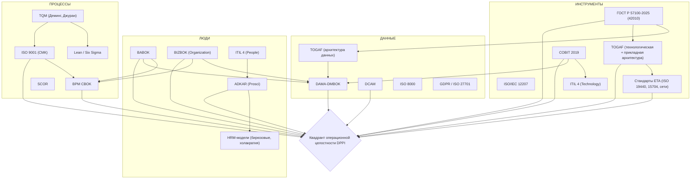

## 1 dppt1a.md
Ниже представлен единый, расширенный материал, объединяющий первоначальную концепцию и все запрошенные дополнения: стандарты технологической архитектуры, углублённые обзоры процессов и людей, разбор BABOK/BIZBOK, критику интеграционных фреймворков, проблему терминологии «управление», фреймворки DPPT, модели изменений, граф взаимосвязей и таблицу нотаций.

---

### 1. Четыре квадрата: границы и определяющие источники

Каждый элемент рассмотрен как самостоятельный домен с чёткими границами, однако все они находятся в непрерывном взаимодействии.

#### Квадрат 1. Данные
- **Границы:** модели данных (концептуальные, логические, физические), Master Data, транзакционные данные, метаданные, качество данных, жизненный цикл, хранение, архитектура данных, безопасность и конфиденциальность.
- **Определяющие источники:**
  - **DAMA-DMBOK** – 11 функциональных областей, колесо DAMA.
  - **DCAM** (EDM Council) – модель зрелости управления данными.
  - **TOGAF** – раздел архитектуры данных (фаза C).
  - **ISO 8000** – стандарт качества данных.
  - **GDPR / ISO 27701** – нормативные рамки приватности.

#### Квадрат 2. Процессы (бизнес-процессы)
- **Границы:** сквозные цепочки ценности, подпроцессы, операции, события, правила, KPI, входы/выходы, ответственные, нотация BPMN.
- **Определяющие источники:**
  - **BPM CBOK** – цикл BPM, управление процессами, измерение.
  - **APQC PCF** – таксономия процессов.
  - **ISO 9001:2015** – процессный подход, риск-ориентированное мышление.
  - **SCOR** – для цепей поставок.
  - **Lean / Six Sigma** – операционное совершенствование.

#### Квадрат 3. Исполнитель процесса
- **Границы:** организационные роли, штатная структура, компетенции, мотивация, распределение ответственности (RACI), культура непрерывного улучшения, вовлечённость.
- **Определяющие источники:**
  - **BABOK** – заинтересованные стороны, их роли и потребности.
  - **ITIL 4** – роли владельца, менеджера, исполнителя.
  - **ISO 10018** – вовлечение людей в менеджмент качества.
  - **SHRM BoCK** – управление талантами, развитие персонала.
  - **RACI / RASCI-матрица** – закрепление ответственности.

#### Квадрат 4. Инструменты (ИТ-системы)
- **Границы:** корпоративные приложения (ERP, CRM, BPM-движки), интеграционные шины, базы данных, low-code платформы, облачные сервисы, средства автоматизации.
- **Определяющие источники:**
  - **COBIT 2019** – управление ИТ, enablers (приложения, инфраструктура).
  - **ITIL 4** – технологические практики, управление услугами.
  - **TOGAF** – архитектура приложений и технологическая архитектура.
  - **ISO/IEC 12207** – жизненный цикл ПО.
  - **Market guides** (Gartner, Forrester) – эталонные классы систем.

#### Сравнительная таблица источников по блокам

| Блок | Ключевые источники | Что именно определяется |
|------|-------------------|--------------------------|
| **Данные** | DAMA-DMBOK, DCAM, TOGAF, ISO 8000, GDPR | Структура, качество, жизненный цикл, безопасность, master-data. |
| **Процессы** | BPM CBOK, APQC PCF, ISO 9001, SCOR, Lean | Цепочка ценности, метрики, нотация, управление изменениями. |
| **Исполнитель** | BABOK, ITIL 4, ISO 10018, SHRM, RACI | Роли, компетенции, вовлечённость, матрица ответственности. |
| **Инструменты** | COBIT, ITIL 4, TOGAF (App/Tech), ISO 12207 | Каталог приложений, автоматизация, технологический стек, интерфейсы. |

---

### 2. Стандарты технической (технологической) архитектуры предприятия (ETA)

Собраны основные международные, национальные и отраслевые стандарты, формирующие дисциплину ETA, включая аспекты моделирования предприятия и сетевой инфраструктуры.

| Стандарт | Название / Суть | Фокус в ETA | Примечание |
|----------|------------------|-------------|------------|
| **ГОСТ Р 57100-2025** | Идентичен ISO/IEC/IEEE 42010:2011. Описание архитектуры – требования к описаниям архитектур систем и предприятий | Мета-рамка для всех архитектурных описаний; идентификация стейкхолдеров, представлений, обоснование решений | Сквозной обеспечивающий стандарт, важен для согласованности доменов |
| **ISO 19440:2020** | Моделирование предприятия и архитектура – Конструкты для моделирования предприятия | Базовые конструкты (сущности, события, процессы, ресурсы) для операционной и технологической архитектуры | Заменил ISO 19440:2007 |
| **ISO 15704:2019** | Требования к стандартным архитектурам и методологиям предприятия (GERA, GERM) | Определяет, какой должна быть архитектурная методология; жизненный цикл, модели, роли | ГОСТ Р ИСО 15704-2008 – ранняя версия |
| **ISO/IEC 12207:2017** | Процессы жизненного цикла программных средств | Инструментальная часть: проектирование, разработка, сопровождение ИТ-систем | |
| **TOGAF** | Методология архитектуры предприятия (ADM, TRM) | Де-факто стандарт для технической архитектуры | Сертифицируемый фреймворк |
| **ArchiMate** | Язык моделирования архитектуры, интегрированный с TOGAF | Описание ИТ-инфраструктуры, сетей, устройств | IEC 62018 |
| **DoDAF / MODAF / NAF** | Военные/правительственные архитектурные фреймворки | Детальные представления системной и технической архитектуры | |
| **ANSI/ISA-95** | Интеграция систем управления предприятием и производственных систем | Архитектура интерфейсов ERP и АСУТП | |
| **ISO/IEC 11801 (серия)** | Структурированные кабельные системы | Физическая сетевая инфраструктура | |
| **ISO/IEC 24764** | Кабельные системы ЦОД | Сетевая архитектура центров обработки данных | |
| **ISO/IEC 27033 (серия)** | Сетевая безопасность | Архитектура защищённых сетей | |
| **IEEE 802.1 / 802.3** | Архитектура и протоколы локальных сетей, Ethernet | Технический фундамент коммутации, VLAN | |
| **ITU-T Y.2000-серия** | Сети последующих поколений (NGN) | Архитектура мультисервисных сетей операторов связи | |
| **ITU-T G.8010/Y.1306** | Архитектура транспортных Ethernet-сетей | Техническая архитектура несущих сетей | |

ГОСТ Р 57100-2025 (42010) особенно важен тем, что не задавая конкретную нотацию, он требует прослеживаемой и обоснованной архитектурной документации, что напрямую поддерживает модель DPPI как согласованный набор архитектурных описаний.

---

### 3. Концепции интеграции четырёх компонентов и их критический анализ

Ниже представлены основные интеграционные модели с указанием их слабых сторон, что обосновывает необходимость более сбалансированного подхода (DPPI).

| Концепция | Покрытие «Данные» | Покрытие «Процессы» | Покрытие «Исполнитель» | Покрытие «Инструменты» | Критика и недостатки |
|-----------|-------------------|----------------------|------------------------|------------------------|----------------------|
| **ARIS House** | Явный блок «Данные» | Центральный «Процесс» | Блок «Организация» | Блок «Функции/Приложения» | Избыточность представлений, привязка к проприетарному инструменту, «модели ради моделей» |
| **Zachman Framework** | Столбец «Что» | Столбец «Как» | Столбец «Кто» | Ячейки «Системы» и «Технологии» | Таксономия без методологии, 36 ячеек часто пусты, сложен для бизнес-пользователей |
| **TOGAF ADM** | Архитектура данных | Бизнес-архитектура | В рамках бизнес-архитектуры (акторы) | Архитектура приложений + технологий | Громоздкость, риск «бумажной» архитектуры, недостаточный фокус на управление данными |
| **PPT + Data (DPPT)** | Отдельный «Data» | «Process» | «People» | «Technology» | Слишком высокоуровневая, не показывает динамику взаимовлияний, нет стандартов управления |
| **Leavitt’s Diamond** | Не выделен | «Task» | «People» | «Technology» | Устарела, вместо Данных – «Структура», не охватывает цифровую специфику |
| **BSC** | Не выделен | «Внутренние процессы» | «Обучение и развитие» | Не выделен | Линейная причинность, финансовая предвзятость, слабая связь ИТ и данных со стратегией |
| **McKinsey 7S** | Растворены в «Системах» | Растворены в «Системах» | «Персонал» и «Навыки» | «Системы» | Диагностический, не проектный; нет цикла обратной связи, данные обезличены |

---

### 4. Прототип общей модели «Квадрант операционной целостности DPPI»

Предлагается модель из четырёх равноправных квадратов, связанных потоками ценности. В центре пересечения – создаваемая бизнес-ценность.

**Визуальное представление (описание):**
- **Верхний левый:** **ДАННЫЕ** (Что обрабатывается)
- **Верхний правый:** **ПРОЦЕССЫ** (Как создаётся ценность)
- **Нижний левый:** **ИСПОЛНИТЕЛЬ** (Кто выполняет и управляет)
- **Нижний правый:** **ИНСТРУМЕНТЫ** (Чем автоматизировано)

**Потоки связи:**
1. Данные → Процессы (события и информация запускают шаги)
2. Процессы → Инструменты (требования к функциональности)
3. Инструменты → Исполнитель (рабочая среда и интерфейсы)
4. Исполнитель → Процессы (решения, обработка исключений)
5. Исполнитель → Данные (экспертный ввод, контроль качества)
6. Данные → Инструменты (модели данных, справочники)

**Внутренние слои квадратов:**
- **Данные:** метаданные, Master Data, качество, аналитика.
- **Процессы:** сквозные цепочки, метрики, бизнес-правила.
- **Исполнитель:** должностные роли, компетенции, мотивация, RACI, культура.
- **Инструменты:** прикладной ландшафт, интеграционная шина, интерфейсы.

Модель DPPI даёт каркас для диагностики и трансформации, где ни один из четырёх столпов не может игнорироваться.

---

### 5. Сравнительный анализ DAMA-DMBOK, BPM CBOK и аналогичных сводов знаний

| BoK / Стандарт | Центральный фреймворк / Элементы | Опора на какие циклы/методы | Применимость к квадратам DPPI |
|----------------|-----------------------------------|-----------------------------|----------------------------------|
| **DAMA-DMBOK** | Колесо DAMA (11 областей, Data Governance в центре) | PDCA для качества данных | Доминирует в Данных, влияет на Инструменты |
| **BPM CBOK** | Цикл BPM (Design, Modeling, Execution, Monitoring, Optimization) | PDCA, Lean, Six Sigma | Доминирует в Процессах, тесно связан с Исполнителем |
| **BABOK (IIBA)** | 6 областей знаний бизнес-анализа | Заинтересованные стороны, итеративный подход | Связующее звено Исполнитель – Инструменты, слабо по данным |
| **ITIL 4** | Система создания ценности услуг (SVS), 34 практики | PDCA, Lean, Agile | Процессы, Инструменты, Люди (роли) |
| **TOGAF** | ADM (8 фаз), 4 архитектурных домена | Итеративная разработка архитектуры | Покрывает все 4 квадрата как архитектурные блоки |
| **COBIT 2019** | Принципы управления, enablers, цели каскадирования | PDCA, зрелость CMMI | Балансирует Процессы управления, Данные, Исполнителей и Инструменты |
| **BIZBOK** | Business Capabilities, Value Streams, Organization, Information | Архитектура бизнеса | Покрывает Процессы, Людей, Данные; Инструменты отсутствуют |

Все указанные BoK в той или иной мере опираются на цикл PDCA, а также на зрелостные модели и принцип непрерывного улучшения.

---

### 6. Методологии со схожими блоками и сравнение с DPPI

| Методология / Модель | Основные блоки | Соответствие элементам DPPI | Комментарий |
|----------------------|----------------|-------------------------------|-------------|
| **BSC** | Финансы, Клиенты, Внутренние процессы, Обучение и развитие | Обучение ≈ Исполнитель, Процессы ≈ Процессы. Данные и Инструменты неявны. | Стратегическая карта, слабая операционная связность |
| **Leavitt’s Diamond** | Задачи, Люди, Технологии, Структура | Люди = Исполнитель, Технологии = Инструменты, Задачи = Процессы. Данных нет. | Управление изменениями, устарела для цифровой эпохи |
| **DPPT (PPT + Data)** | Данные, Процессы, Люди, Технологии | Почти прямое совпадение. | Наиболее близкий аналог, но не хватает архитектурных стандартов |
| **McKinsey 7S** | Стратегия, Структура, Системы, Стиль, Персонал, Навыки, Общие ценности | Персонал+Навыки ≈ Исполнитель, Системы ≈ Инструменты + Данные. Процессы рассеяны. | Сильный культурный акцент, слабая детализация ИТ и данных |
| **ARIS House** | Организация, Данные, Процессы, Функции/Приложения, Продукты | Прямое попадание в 4 блока, плюс Продукты. | Избыточен для многих организаций, проприетарный инструментарий |
| **Lean 4M** | Man, Machine, Material, Method | Человек = Исполнитель, Method = Процессы, Machine = Инструменты, Material ≈ данные. | Операционный уровень, подходит для производственных ячеек |

DPPI обобщает лучшее из этих моделей, явно выделяя Данные и обеспечивая равновесие между доменами.

---

### 7. Эволюция блока «Процессы»: от TQM до СМК

Дисциплина процессов уходит корнями в управление качеством. Ключевые этапы:

1. **Инспекция** (контроль готовой продукции, начало XX в.) – исправление брака постфактум.
2. **Статистический контроль процессов (SPC, У. Шухарт, 1920‑е)** – контрольные карты, вариабельность, предупреждение дефектов.
3. **Обеспечение качества (QA, 1950‑е)** – системные процедуры, аудит, стандарты MIL‑Q‑9858.
4. **Всеобщее управление качеством (TQM, Э. Деминг, Дж. Джуран, 1980‑е)** – философия непрерывного улучшения, вовлечения всех сотрудников, ориентация на потребителя. Принципы Деминга, цикл PDCA (Plan-Do-Check-Act), кайдзен, кружки качества.
5. **Система менеджмента качества (СМК) по ISO 9001 (1987 → 2015)** – стандартизированный процессный подход с риск-ориентированным мышлением. Требования к документированию процессов, управлению ресурсами, анализу данных, постоянному улучшению.
6. **Интегрированные системы менеджмента** (ISO 9001 + ISO 14001 + ISO 45001 и др.) – расширение процессного управления на экологию, охрану труда.

В BPM CBOK и современных процессных фреймворках цикл PDCA перешёл в цикл BPM (дизайн–моделирование–исполнение–мониторинг–оптимизация), а статистические методы и инструменты TQM (диаграмма Исикавы, контрольные карты) остаются актуальными для анализа процессов.

---

### 8. Блок «Исполнитель»: HR-практики, мотивация, бирюзовые организации

Развитие темы людей выходит далеко за рамки штатного расписания и охватывает глубинные механизмы мотивации и организационные модели.

**Классические теории мотивации:**
- **Пирамида Маслоу** – иерархия потребностей как основа стимулирования.
- **Двухфакторная модель Герцберга** – гигиенические факторы (зарплата, условия) и мотиваторы (признание, развитие, ответственность).
- **Теория самодетерминации (Deci & Ryan)** – потребность в автономии, компетентности и связанности.

**Современные организационные модели:**
- **Бирюзовые организации (Ф. Лалу)** – самоуправление, эволюционная цель, целостность. Исполнитель становится владельцем процесса, а не просто ресурсом.
- **Холакратия (Б. Робертсон)** – иерархия ролей вместо должностей, чёткие процессы принятия решений.
- **Agile-команды (Scrum, LeSS)** – самоорганизация, кросс-функциональность, эмпиризм.
- **Социократия 3.0** – согласованное принятие решений, распределённый авторитет.

**Влияние на DPPI:** зрелость квадрата «Исполнитель» напрямую определяет успех процессных и цифровых инициатив. Без вовлечённых, компетентных и мотивированных людей любые инструменты и регламенты остаются формальными.

---

### 9. Встраивание BABOK и BIZBOK в концепт четырёх элементов

**BABOK** фокусируется на бизнес-анализе как связующей дисциплине. Бизнес-аналитик работает со стейкхолдерами (Люди), выявляет требования к Процессам, Данным и ИТ-решениям. BABOK не принадлежит одному квадрату, а служит «клеем» между ними. Однако он не предоставляет целостного управления данными (Data Governance) и не охватывает архитектуру инструментов.

**BIZBOK** описывает архитектуру бизнеса через домены:
- Capabilities (возможности)
- Value Streams (потоки ценности – Процессы)
- Organization (Организация – Люди)
- Information (Информация – Данные)

Инструменты в BIZBOK явно не выделены, они рассматриваются как автоматизирующие возможности.

**Проблема:** ни один из этих сводов знаний по отдельности не покрывает все четыре элемента с равной глубиной. Для полноты картины требуется комбинация фреймворков, что и предлагает модель DPPI, интегрирующая DAMA, BPM CBOK, BABOK/BIZBOK, TOGAF и COBIT.

---

### 10. Проблема термина «управление» в русскоязычной практике

Слово «управление» маскирует три разных концепции, что создаёт путаницу в проектах.

| Английский термин | Суть | Примеры в методологиях | Рекомендуемый точный русский эквивалент |
|-------------------|------|--------------------------|------------------------------------------|
| **Governance** | Задание правил, политик, распределение прав принятия решений, надзор | Data Governance (DAMA), IT Governance (COBIT) | **Руководство**, стратегическое управление, «Governance» |
| **Management** | Оперативное координирование, выполнение, обеспечение достижения целей | Data Management, Business Process Management, Service Management | **Менеджмент** или оперативное управление |
| **Control** | Проверка соответствия критериям, мониторинг и корректировка | Quality Control, Internal Control (COSO), Process Control | **Контроль** (в значении проверки, мониторинга) |

**Рекомендация:** вместо абстрактного «управление» использовать конкретные действия:
- Для данных: *инвентаризация, каталогизация, назначение владельцев, профилирование качества, моделирование, дата-менеджмент.*
- Для процессов: *формализация, моделирование (BPMN), анализ узких мест, автоматизация выполнения, мониторинг показателей, непрерывное улучшение.*
- Для людей: *закрепление ролей (RACI), развитие компетенций, настройка системы мотивации, внедрение самоорганизации.*
- Для инструментов: *рационализация ИТ-ландшафта, каталогизация приложений, стандартизация интерфейсов, автоматизация ручных шагов.*

Это устраняет неоднозначность и повышает измеримость задач.

---

### 11. Родственные фреймворки DPPT (Data, Process, People, Technology)

Классическая триада **PPT (People, Process, Technology)** – фундамент многих методологий цифровой трансформации и ITSM. Добавление четвёртого компонента «Data» (или «Information») стало закономерным с ростом значимости данных.

- **DPPT (Data, Process, People, Technology)** – прямое соответствие модели DPPI.
- **IPPT (Information, Process, People, Technology)** – информация вместо данных, подчёркивает смысловую ценность. Например, в ITIL 4 измерения «Organizations and people», «Information and technology», «Value streams and processes», где информация явно отделена от технологии.
- Пирамида **DIKW** (Data→Information→Knowledge→Wisdom) уточняет, что данные – сырой материал, информация – обработанные данные в контексте. Модель DPPI охватывает все уровни, но DAMA делает акцент именно на данные как управляемый актив.

Наш выбор – DPPT – обусловлен тем, что данные сегодня признаются самостоятельным стратегическим ресурсом, требующим специальных дисциплин управления, нерастворимых в технологии.

---

### 12. ADKAR, Prosci и другие модели изменений в привязке к DPPI

**ADKAR (Awareness, Desire, Knowledge, Ability, Reinforcement)** – модель индивидуальных изменений Prosci. Она целиком нацелена на квадрат **Исполнитель**: нельзя успешно внедрить процессы, данные или инструменты, если люди не прошли пять этапов: осознание, желание, знание, способность, подкрепление. ADKAR не проектирует архитектуру, но является обязательным условием успеха.

**Другие модели:**
- **Kotter 8 steps** (срочность, коалиция, видение, коммуникация, устранение барьеров, быстрые победы, закрепление) – также работают в слое «Люди» и частично «Процессы».
- **Модель К. Левина (Unfreeze – Change – Refreeze)** – разморозка, изменение, заморозка новых процессов и поведения.
- **Модель Бриджеса** (переход через нейтральную зону) – психологический акцент на людях.

**Вывод для DPPI:** любое изменение в квадратах Процессы, Данные, Инструменты требует параллельного применения модели изменений к квадрату Исполнитель. Зрелость этого блока определяет скорость и устойчивость трансформации.

---

### 13. Граф взаимосвязей рассмотренных методологий (Mermaid)



ГОСТ Р 57100-2025 добавлен как обеспечивающий мета-стандарт, связывающий все архитектурные представления.

---

### 14. Таблица нотаций для каждого элемента DPPI

| Элемент DPPI | Нотация | Основное назначение | Разработчик / Консорциум |
|--------------|---------|----------------------|---------------------------|
| **Данные** | ERD (Entity-Relationship Diagram) | Концептуальное и логическое моделирование данных | П. Чен (1976) |
| | IDEF1X | Моделирование данных для реляционных баз | ВВС США, IEEE |
| | UML Class Diagram | Структура данных в объектно-ориентированном контексте | OMG |
| | ArchiMate Data Entity, Data Object | Представление данных в архитектуре предприятия | The Open Group |
| | DFD (Data Flow Diagram) | Потоки данных между процессами и хранилищами | Э. Йордан, Т. де Марко, К. Гейн, Д. Сарсон |
| | DMN (Decision Model and Notation) | Моделирование бизнес-правил и структуры данных решений | OMG |
| | OWL / RDF (онтологии) | Семантическое описание данных и знаний | W3C |
| **Процессы** | BPMN (Business Process Model and Notation) | Детальное моделирование бизнес-процессов | OMG |
| | EPC (Event-driven Process Chain) | Процессные цепочки, управляемые событиями | А.-В. Шеер (IDS Scheer) |
| | UML Activity Diagram | Моделирование потоков управления и данных | OMG |
| | IDEF3 (Process Flow Description) | Описание последовательности выполнения процессов | ВВС США |
| | DFD (в аспекте процессов) | Декомпозиция процессов с потоками данных | Йордан, де Марко |
| | ArchiMate Business Process / Function | Архитектурное представление процессов предприятия | The Open Group |
| | APQC PCF | Таксономическая структура (не графическая) | APQC |
| **Исполнитель** | Org Chart | Иерархия подразделений и должностей | Универсальная |
| | ArchiMate Business Actor, Role, Collaboration | Роли и взаимодействия в архитектуре | The Open Group |
| | RACI Matrix | Матрица ответственности, согласования, консультаций, информирования | Универсальная методика |
| | BPMN Lane / Pool (ролевые дорожки) | Привязка действий процесса к исполнителю | OMG |
| | Stakeholder Matrix (BABOK) | Картирование заинтересованных лиц, влияния и интересов | IIBA (BABOK) |
| | UML Use Case Diagram (акторы) | Акторы и их взаимодействие с системой | OMG |
| **Инструменты** | UML Deployment Diagram | Размещение программных компонентов на узлах | OMG |
| | ArchiMate Technology Layer (Node, Device, System Software, Path) | Модель технологической инфраструктуры | The Open Group |
| | BPMN (автоматизированные сервис-задачи) | Шаги процесса, выполняемые ИТ-системой | OMG |
| | IDEF0 | Функциональное моделирование систем (входы, выходы, механизмы, управление) | ВВС США |
| | SysML (Systems Modeling Language) | Моделирование сложных систем, включая оборудование и ПО | OMG |
| | CMDB-схемы (ITIL) | Взаимосвязи конфигурационных единиц ИТ | Сервис-менеджмент, ITIL |
| | Схемы сетей (Network Diagram) | Физическая и логическая топология сетей | Cisco, Microsoft, стандарты IEEE/ITU |

Таким образом, каждый квадрат DPPI обеспечен зрелыми, стандартизированными языками описания, а ГОСТ Р 57100-2025 задаёт мета-требования к целостности архитектурных представлений, связывая все выбранные нотации в единую, согласованную документацию.

## 2
Нужно более компактно сформулировать DPPI и показать, что все остальные методологии "вертятся" вокруг нее. При этом показать насколько каждая четкая \ размытая и зрелая.  
Отдельным блоком покажи вариант математической формализации DPPI и отдельным - онтологию в Linked Data.

Ниже представлено компактное продолжение, которое резюмирует модель DPPI как центральную, оценивает окружающие методологии и добавляет математическую формализацию и Linked Data онтологию.

---

### DPPI как центральная модель операционной целостности (компактная формулировка)

**DPPI (Data – Process – People – IT)** — это равновесная модель четырёх взаимозависимых доменов предприятия, объединённых потоком создания ценности:

- **Data** – все информационные активы, их структура, качество, жизненный цикл и управление.
- **Process** – сквозные и вспомогательные бизнес-процессы, их метрики, правила и постоянное улучшение.
- **People** – исполнители, их роли, компетенции, мотивация и культура.
- **IT** – прикладные системы, технологическая инфраструктура и автоматизация.

**Центральная идея:** Ни одно значимое изменение не может быть успешным без синхронного учёта всех четырёх измерений. DPPI задаёт общий язык и каркас для диагностики зрелости, архитектурного описания и управления трансформацией.

---

### Вращение методологий вокруг DPPI: чёткость, размытость и зрелость

Большинство популярных фреймворков покрывают лишь часть доменов DPPI, либо делают это с разной степенью глубины и формализации.

| Методология / Стандарт | Чёткость границ доменов* | Размытость (недостатки) | Зрелость** | Положение относительно DPPI |
|------------------------|---------------------------|--------------------------|------------|-------------------------------|
| **DPPI (предлагаемая)** | Высокая (явно выделены все 4) | Требует дальнейшей детализации метрик связей | Концептуальная (развивается) | Центральная модель |
| **ARIS House** | Средняя (5 блоков, данные+процессы+орг+функции+продукты) | Избыточность, привязка к инструменту | Высокая (разработана, внедрена) | Близка, но с лишним блоком |
| **TOGAF** | Высокая (4 домена: бизнес, данные, приложения, технология) | Люди явно не выделены (акторы только в бизнес-архитектуре) | Очень высокая (стандарт де-факто) | Хорошее покрытие, люди размыты |
| **BSC** | Низкая (финансы, клиенты, процессы, обучение) | Нет данных и ИТ как самостоятельных блоков | Высокая (стратегический инструмент) | Пересекается только по процессам и людям |
| **DPPT (PPT+Data)** | Средняя (4 компонента, но слабо формализованы) | Отсутствуют стандарты управления, динамика связей | Низкая (концептуальная) | Почти идентична идее, без глубины |
| **BABOK** | Не применимо (связующая роль) | Нет собственной модели доменов, всё через анализ | Высокая (свод знаний) | Обслуживает связи между квадратами |
| **BIZBOK** | Средняя (Capabilities, Value Streams, Org, Information) | Нет блока ИТ | Средняя (развивается) | Покрывает 3 домена, без ИТ |
| **COBIT 2019** | Средняя (Enablers: процессы, информация, люди, приложения и др.) | Смешаны данные и ИТ в «информация и технология» | Высокая (аудит, управление ИТ) | Хорошо вокруг управления, но без чёткой границы данных |
| **ITIL 4** | Средняя (4 измерения: люди, информация и технологии, партнёры, ценностные потоки) | Данные не отделены от технологий | Высокая (операционный ITSM) | Технологии и данные слиты |
| **Zachman** | Высокая (6×6, что/как/где/кто/когда/почему) | Громоздкость, отсутствие методологии заполнения | Средняя (используется частично) | Пересекается в нескольких ячейках |
| **Leavitt’s Diamond** | Низкая (люди, задачи, технологии, структура) | Данные отсутствуют, структура вместо процессов | Низкая (устаревшая концепция) | Только частичное соответствие |
| **ISO 9001 (СМК)** | Низкая (процессный подход, ресурсы, лидерство, улучшение) | Нет отдельного домена данных и ИТ, всё в «ресурсах» | Очень высокая (международный стандарт) | Процессы в центре, остальное размыто |
| **Lean / Six Sigma** | Низкая (процесс, статистика, люди как участники) | ИТ не рассматривается системно, данные только как измерения | Высокая (операционное совершенство) | Процессы и немного данных |

\* *Чёткость границ* – насколько явно методология выделяет домен как отдельную сущность с собственными атрибутами и методами управления.  
\** *Зрелость* – степень проработанности, наличие стандартов, сертификаций, практик внедрения.

**Вывод:** DPPI заимствует сильные стороны зрелых методологий, заполняя их пробелы явным разделением данных и инструментов, и предлагает равноправие всех четырёх доменов, в то время как другие фреймворки либо размывают границы (ITIL, COBIT), либо игнорируют один из квадратов (BSC, Leavitt).

---

### Математическая формализация DPPI (вариант)

Модель можно описать как четвёрку связанных пространств состояния и потоков преобразований.

Пусть:
- \( D \) – множество всех данных (сущности, атрибуты, значения, метаданные),
- \( P \) – множество всех процессов (активности, события, логические операторы),
- \( H \) – множество людей (роли, компетенции, мотивационные состояния),
- \( T \) – множество инструментов (приложения, серверы, интерфейсы).

Состояние предприятия в момент \( t \):
\[
S(t) = (D_t, P_t, H_t, T_t)
\]

Переходы определяются функциями потоков (как в системной динамике):

1. **Данные → Процесс** (информационный запуск):
   \[
   f_{D \to P}: D_t \times E_t \to P_{t+1}
   \]
   (события и данные порождают экземпляры процессов)

2. **Процесс → Инструменты** (функциональные требования):
   \[
   f_{P \to T}: P_t \to \Delta T
   \]
   (процесс диктует необходимые сервисы и экранные формы)

3. **Инструменты → Исполнитель** (интерфейсное воздействие):
   \[
   f_{T \to H}: T_t \times U_t \to H_{t+1}
   \]
   (UI/UX меняет поведение и загрузку человека)

4. **Исполнитель → Процесс** (человеческие решения):
   \[
   f_{H \to P}: H_t \times C_t \to P_{t+1}
   \]
   (компетенции и мотивация определяют качество выполнения)

5. **Исполнитель → Данные** (ввод и контроль):
   \[
   f_{H \to D}: H_t \to D_{t+1}
   \]
   (ручной ввод, верификация, обогащение)

6. **Данные → Инструменты** (конфигурация моделей):
   \[
   f_{D \to T}: D_t \to T_{t+1}
   \]
   (MDM-модели, справочники, правила валидации)

Цель управления – максимизация ценности \( V(S(t)) \) при ограничениях ресурсов и рисков, где \( V \) – интегральный показатель эффективности, объединяющий финансовые, клиентские и операционные метрики.

Такое представление позволяет строить имитационные модели и проводить анализ узких мест («бутылочных горлышек») в любом из квадратов.

---

### Онтология DPPI в Linked Data (RDF/OWL)

Ниже представлен компактный вариант онтологии на Turtle, выражающий основные классы и свойства модели DPPI.

```turtle
@prefix dppi: <http://ontology.example.org/dppi#> .
@prefix rdfs: <http://www.w3.org/2000/01/rdf-schema#> .
@prefix owl: <http://www.w3.org/2002/07/owl#> .
@prefix xsd: <http://www.w3.org/2001/XMLSchema#> .

# Классы
dppi:Data a owl:Class ;
    rdfs:label "Данные"@ru , "Data"@en .
dppi:Process a owl:Class ;
    rdfs:label "Процесс"@ru , "Process"@en .
dppi:Person a owl:Class ;
    rdfs:label "Исполнитель"@ru , "Person"@en .
dppi:IT_System a owl:Class ;
    rdfs:label "ИТ-система"@ru , "IT System"@en .

# Свойства объектов (Object Properties)
dppi:triggers a owl:ObjectProperty ;
    rdfs:domain dppi:Data ;
    rdfs:range dppi:Process ;
    rdfs:label "запускает"@ru , "triggers"@en .

dppi:requires a owl:ObjectProperty ;
    rdfs:domain dppi:Process ;
    rdfs:range dppi:IT_System ;
    rdfs:label "требует систему"@ru , "requires system"@en .

dppi:interacts_with a owl:ObjectProperty ;
    rdfs:domain dppi:IT_System ;
    rdfs:range dppi:Person ;
    rdfs:label "предоставляет интерфейс для"@ru , "interacts with"@en .

dppi:performs a owl:ObjectProperty ;
    rdfs:domain dppi:Person ;
    rdfs:range dppi:Process ;
    rdfs:label "выполняет"@ru , "performs"@en .

dppi:inputs_data a owl:ObjectProperty ;
    rdfs:domain dppi:Person ;
    rdfs:range dppi:Data ;
    rdfs:label "вводит данные"@ru , "inputs data"@en .

dppi:configured_by a owl:ObjectProperty ;
    rdfs:domain dppi:IT_System ;
    rdfs:range dppi:Data ;
    rdfs:label "конфигурируется данными"@ru , "configured by data"@en .

# Свойства данных (Data Properties) для атрибутов
dppi:qualityScore a owl:DatatypeProperty ;
    rdfs:domain dppi:Data ;
    rdfs:range xsd:decimal ;
    rdfs:label "показатель качества"@ru .

dppi:cycleTime a owl:DatatypeProperty ;
    rdfs:domain dppi:Process ;
    rdfs:range xsd:duration ;
    rdfs:label "длительность цикла"@ru .

dppi:competencyLevel a owl:DatatypeProperty ;
    rdfs:domain dppi:Person ;
    rdfs:range xsd:string ;
    rdfs:label "уровень компетенции"@ru .

dppi:availability a owl:DatatypeProperty ;
    rdfs:domain dppi:IT_System ;
    rdfs:range xsd:decimal ;
    rdfs:label "доступность"@ru .
```

Эта онтология позволяет публиковать машинно-читаемые графы знаний о корпоративной архитектуре, связывая экземпляры конкретных данных, процессов, людей и систем. Она совместима с принципами Linked Data и может расширяться путём привязки к другим онтологиям (BPMN Ontology, ArchiMate RDF, FOAF для людей и т.п.).

---

Таким образом, DPPI выступает одновременно как прагматичный каркас для менеджмента и как формализуемая модель для архитектурного анализа, объединяя сильные стороны зрелых фреймворков и устраняя их ключевые разрывы.
