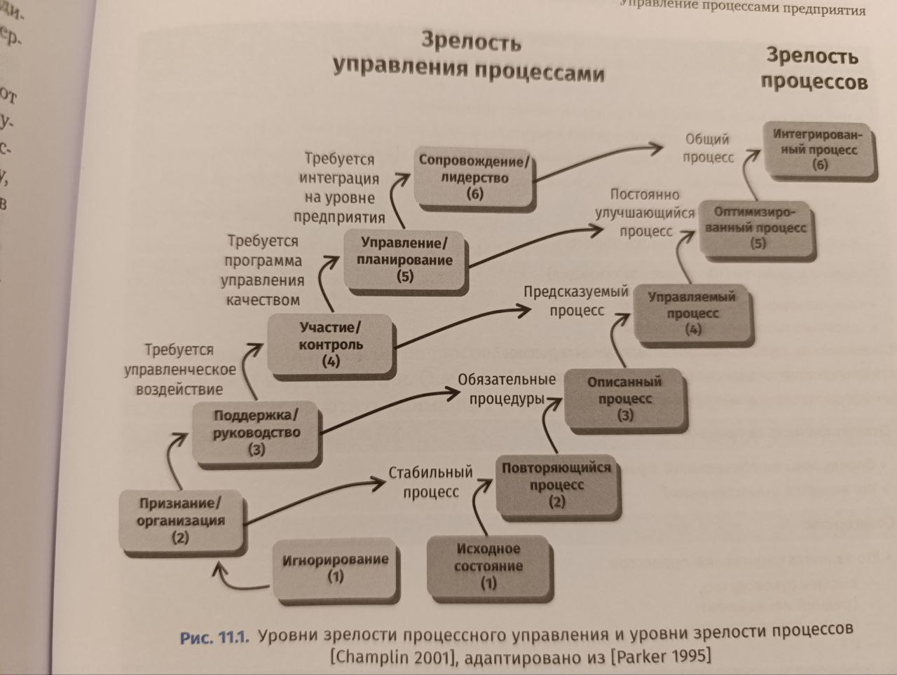
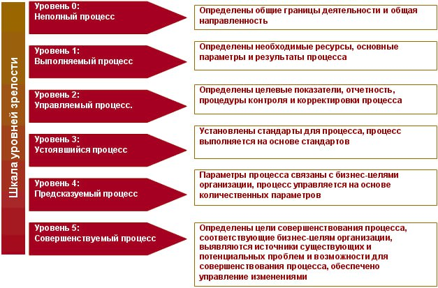
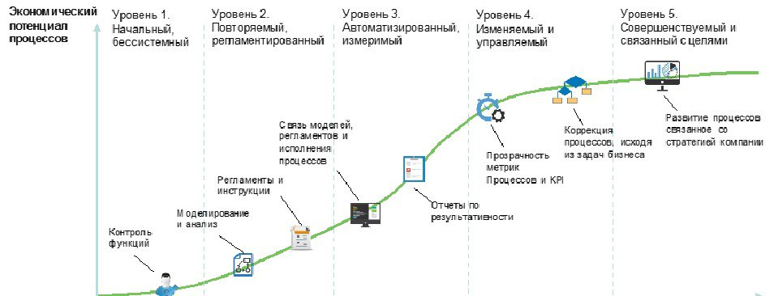

## Maturity Model
### 1 Сравни методики Оценки зрелости системы управления бизнес-процессами компании
Существует несколько методик оценки зрелости системы управления бизнес-процессами компании, каждая из которых имеет свои особенности и области применения. Основные модели включают CMMI, BPMM, OMM, PEMM, а также другие подходы, такие как Forrester Research и методика экспресс-оценки.

### CMMI (Capability Maturity Model Integration)
**Область применения**: разработка ПО, инженерные процессы.  
**Особенности**: детальная методология с двумя подходами — непрерывным и ступенчатым. Позволяет оценивать и улучшать процессы, фокусируясь на конкретных областях (например, управление требованиями или рисками). [```1```](https://sky.pro/wiki/analytics/model-zrelosti-protsessov-etapy-razvitiya-i-kriterii-otsenki/)[```8```](https://tr-page.yandex.ru/translate?lang=en-ru&url=https%3A%2F%2Fwww.smartsheet.com%2Fcontent%2Fprocess-maturity)  
**Уровни зрелости**: 5 уровней, от начального до оптимизирующего.  
**Преимущества**: универсальность, возможность систематического улучшения процессов.  
**Недостатки**: сложность внедрения, требует значительных ресурсов.

### BPMM (Business Process Maturity Model)
**Область применения**: общее бизнес-управление.  
**Особенности**: фокус на горизонтальной интеграции процессов. Помогает оценить готовность компании к внедрению новых технологий. [```1```](https://sky.pro/wiki/analytics/model-zrelosti-protsessov-etapy-razvitiya-i-kriterii-otsenki/)[```8```](https://tr-page.yandex.ru/translate?lang=en-ru&url=https%3A%2F%2Fwww.smartsheet.com%2Fcontent%2Fprocess-maturity)  
**Уровни зрелости**: 4 типа оценок (начальная, базовая, управляемая, оптимизирующая).  
**Преимущества**: подходит для оценки готовности к масштабным изменениям.  
**Недостатки**: может быть недостаточно детализированной для сложных организаций.

### OMM (Organizational Maturity Model)
**Область применения**: организационное развитие.  
**Особенности**: акцент на организационных компетенциях и культуре. [```1```](https://sky.pro/wiki/analytics/model-zrelosti-protsessov-etapy-razvitiya-i-kriterii-otsenki/)  
**Уровни зрелости**: не указаны в доступных источниках.  
**Преимущества**: учитывает культурные аспекты, что важно для трансформации.  
**Недостатки**: может не охватывать технические детали процессов.

### PEMM (Process and Enterprise Maturity Model)
**Область применения**: корпоративное управление.  
**Особенности**: двойной фокус на процессы и организацию в целом. [```1```](https://sky.pro/wiki/analytics/model-zrelosti-protsessov-etapy-razvitiya-i-kriterii-otsenki/)  
**Уровни зрелости**: не указаны в доступных источниках.  
**Преимущества**: комплексный подход, учитывающий как процессы, так и организационные аспекты.  
**Недостатки**: требует глубокого понимания обеих сфер.

### Forrester Research
**Уровни зрелости**:
1. Отсутствующий: процессы не формализованы.
2. Спонтанный: случайные, непоследовательные действия.
3. Повторяемый: интуитивные, не задокументированные процессы.
4. Описанный: задокументированные, предсказуемые процессы.
5. Измеряемый: формализованные, часто автоматизированные процессы.
6. Оптимизируемый: непрерывное совершенствование. [```3```](https://uprav.ru/blog/upravlenie-biznes-protsessami/)

**Преимущества**: чёткая градация, подходит для разных типов процессов.  
**Недостатки**: может не учитывать культурные и организационные аспекты.

### Методика экспресс-оценки (Васильев и Кабиров)
**Критерии оценки**:
- Целостность системы бизнес-процессов.
- Измеримость бизнес-процессов.
- Система оптимизации бизнес-процессов.
- Уровень знаний сотрудников. [```5```](https://cyberleninka.ru/article/n/metodika-ekspress-otsenki-zrelosti-sistemy-upravleniya-biznes-protsessami-kompanii)

**Преимущества**: простота, возможность быстрого получения результатов.  
**Недостатки**: менее детализирована по сравнению с другими моделями.

### Сравнение методик
| Методика | Фокус | Уровни зрелости | Преимущества | Недостатки |
|----------|-------|------------------|--------------|------------|
| CMMI | Технические процессы | 5 уровней | Универсальность, детализация | Сложность внедрения |
| BPMM | Бизнес-управление | 4 типа оценок | Оценка готовности к изменениям | Может быть недостаточно детализированной |
| OMM | Организационные компетенции | — | Учёт культуры | Ограниченность в технических аспектах |
| PEMM | Процессы и организация | — | Комплексный подход | Требует глубоких знаний |
| Forrester Research | Общая зрелость | 6 уровней | Чёткая градация | Может не учитывать культуру |
| Экспресс-оценка | Процессный подход | Баллы (0–100) | Простота | Менее детализирована |

### Дополнительные методы оценки
- **Самооценка**: использование структурированных опросников. [```1```](https://sky.pro/wiki/analytics/model-zrelosti-protsessov-etapy-razvitiya-i-kriterii-otsenki/)
- **Внутренний аудит**: проведение оценки силами обученных внутренних экспертов. [```1```](https://sky.pro/wiki/analytics/model-zrelosti-protsessov-etapy-razvitiya-i-kriterii-otsenki/)
- **Внешняя экспертиза**: привлечение независимых консультантов для объективной оценки. [```1```](https://sky.pro/wiki/analytics/model-zrelosti-protsessov-etapy-razvitiya-i-kriterii-otsenki/)
- **Бенчмаркинг**: сравнение с лучшими практиками в отрасли или у конкурентов. [```1```](https://sky.pro/wiki/analytics/model-zrelosti-protsessov-etapy-razvitiya-i-kriterii-otsenki/)
- **Сертификационный аудит**: формальное подтверждение соответствия уровню зрелости по определённым стандартам. [```1```](https://sky.pro/wiki/analytics/model-zrelosti-protsessov-etapy-razvitiya-i-kriterii-otsenki/)

Выбор методики зависит от целей оценки, масштаба компании, отрасли и уровня детализации, который требуется для анализа. Для комплексных организаций часто используют комбинацию нескольких подходов.

### 2 Укажи организацию, где была разработана, а также год разработки. Также дай по каждой модели критические замечания
| Модель | Перевод названия | Разработчик | Год разработки | Критические замечания |
|---|---|---|---|---|
| **CMMI** (Capability Maturity Model Integration) | Интеграция модели зрелости возможностей | Институт программной инженерии (SEI) Университета Карнеги-Меллона | 2002 (объединение предыдущих моделей CMM, SE-CMM, Acquisition CMM и др.) | Требует значительных ресурсов и времени для внедрения, сложность понимания и адаптации, необходимость внешней поддержки для сертификации, может быть избыточной для небольших организаций. [```1```](https://www.osp.ru/os/2005/05-06/185610)[```2```](https://www.vvsu.ru/files/5B70DD27-4327-4E54-BF45-BDC6F69EB303.pdf)[```17```](https://www.smartsheet.com/content/process-maturity) |
| **BPMM** (Business Process Maturity Model) | Модель зрелости бизнес-процессов | Object Management Group (OMG) | 2004 (первая версия BPMN 1.0), последняя версия 2.0.2 — 2014 | Может быть недостаточно детализированной для сложных организаций, фокус на горизонтальной интеграции процессов, не всегда учитывает технические аспекты. [```1```](https://www.osp.ru/os/2005/05-06/185610)[```17```](https://www.smartsheet.com/content/process-maturity) |
| **OMM** (Organisational Maturity Model) | Модель организационной зрелости | SCiO (Systems and Complexity in Organisation) | Не указан в доступных источниках | Ориентирована на структурную целостность организации, но может не охватывать технические детали процессов, требует доработки для комплексного применения. [```11```](https://www.systemspractice.org/omm) |
| **PEMM** (Process and Enterprise Maturity Model) | Модель зрелости процессов и предприятия | Майкл Хаммер (Harvard Business School) | 2007 | Потенциальная сложность для бизнес-аудитории, отсутствие прямой связи между уровнями зрелости и бизнес-результатами, не учитывает некоторые критические факторы успеха управления процессами (например, стратегическое согласование). [```18```](https://maturitylab.com/pemm-organizational-maturity-leadership/)[```19```](https://bptrends.info/wp-content/publicationfiles/07-07-ART-HammersPEMM-Power-final1.pdf) |
| **Forrester Research** | Исследовательская компания (не модель зрелости, но предоставляет методологии оценки) | Forrester Research, Inc. | 1983 (основание компании) | Методологии Forrester могут быть субъективными, зависят от интерпретации данных, не всегда предоставляют готовые решения для улучшения процессов. [```21```](https://ru.wikipedia.org/wiki/Forrester)[```22```](https://dcfmodeling.com/blogs/history/forr-history-mission-ownership) |

### Дополнительные пояснения

1. **CMMI** изначально разрабатывалась для оценки процессов в разработке ПО, но позже была адаптирована для других областей. Её сложность и формализованность часто становятся препятствием для малого и среднего бизнеса.

2. **BPMM** фокусируется на управлении бизнес-процессами в целом, но может не подходить для организаций, требующих глубокой технической детализации.

3. **OMM** делает акцент на организационных компетенциях и культуре, что полезно для трансформации, но требует дополнительного внимания к техническим аспектам процессов.

4. **PEMM** предлагает комплексный подход, учитывая как процессы, так и организационные аспекты, но её реализация может быть сложной из-за необходимости оценки множества параметров.

5. **Forrester Research** предоставляет аналитические отчёты и методологии, но не является моделью зрелости в классическом понимании. Их подходы часто критикуют за субъективность и зависимость от интерпретации данных.

При выборе модели важно учитывать специфику организации, её размер, отрасль и цели оценки. Для крупных компаний с сложными процессами может подойти CMMI или PEMM, а для более гибких организаций — BPMM или OMM.

### 3 Свод
Ниже — **сводная таблица сопоставления уровней зрелости** по ключевым моделям (CMMI, BPMM, PEMM, Forrester) с кратким описанием каждого уровня и их взаимным соответствием.

---

### 1. Уровни каждой модели

#### CMMI (5 уровней)
1. **Initial (Начальный)**  
   → Процессы хаотичны, реактивны; успех зависит от личности.
2. **Managed (Управляемый)**  
   → Процессы определены для проектов; контроль по срокам/бюджету.
3. **Defined (Определённый)**  
   → Стандартизированные процессы на уровне организации.
4. **Quantitatively Managed (Количественно управляемый)**  
   → Измерение и контроль процессов через метрики.
5. **Optimizing (Оптимизирующий)**  
   → Непрерывное улучшение через инновации и обратную связь.

#### BPMM (4 уровня)
1. **Ad Hoc (Спонтанный)**  
   → Нет формальных процессов; действия интуитивны.
2. **Defined (Описанный)**  
   → Процессы документированы, но не всегда соблюдаются.
3. **Managed (Управляемый)**  
   → Мониторинг и контроль процессов; базовые метрики.
4. **Optimized (Оптимизированный)**  
   → Постоянное улучшение; интеграция с ИТ-системами.

#### PEMM (5 измерений, каждое с 5 уровнями)  
*Для сопоставления берём обобщённый «уровень зрелости процесса»*:
1. **Absent (Отсутствует)**  
   → Нет осознания необходимости процессов.
2. **Initial (Начальный)**  
   → Фрагментарные, неформальные процессы.
3. **Repeatable (Повторяемый)**  
   → Процессы повторяются, но без стандартизации.
4. **Managed (Управляемый)**  
   → Формализованные процессы с контролем.
5. **Sustained (Устойчивый/Оптимизированный)**  
   → Интеграция в культуру; непрерывное совершенствование.

#### Forrester (6 уровней)
1. **Nonexistent (Отсутствует)**  
   → Нет процессов; хаос.
2. **Ad Hoc (Спонтанный)**  
   → Случайные, несистематические действия.
3. **Repeatable (Повторяемый)**  
   → Интуитивные, но повторяющиеся шаги.
4. **Documented (Документированный)**  
   → Описанные процессы, но без строгого контроля.
5. **Measured (Измеряемый)**  
   → Метрики, автоматизация, контроль отклонений.
6. **Optimized (Оптимизированный)**  
   → Проактивное улучшение; адаптация к изменениям.

---

### 2. Сопоставление уровней (сводная таблица)

| CMMI | BPMM | PEMM | Forrester | Общее описание этапа |
|------|------|------|-----------|-------------------|
| **1. Initial** | **1. Ad Hoc** | **1. Absent** | **1. Nonexistent** | Хаос, отсутствие формальных процессов. Успех случаен. |
| **2. Managed** | **2. Defined** | **2. Initial** | **2. Ad Hoc** | Первые попытки упорядочить процессы; документация фрагментарна. |
| **3. Defined** | **3. Managed** | **3. Repeatable** | **3. Repeatable** | Процессы описаны и повторяются, но нет системного контроля. |
| **4. Quant. Managed** | **4. Optimized** | **4. Managed** | **4. Documented** | Формализация, метрики, базовый контроль отклонений. |
| **5. Optimizing** | **4. Optimized** | **5. Sustained** | **5. Measured** | Измерение эффективности, автоматизация, проактивное управление. |
| — | — | — | **6. Optimized** | Непрерывное совершенствование; интеграция инноваций. |

---

### 3. Ключевые нюансы сопоставления

1. **CMMI** делает акцент на **стандартизации и количественном управлении**, поэтому её 4‑й уровень («Quantitatively Managed») соответствует 5‑му уровню Forrester («Measured»).
2. **BPMM** объединяет уровни «Managed» и «Optimized»: на 3‑м уровне — базовый контроль, на 4‑м — уже оптимизация.
3. **PEMM** рассматривает зрелость через 5 измерений (процесс, исполнители, руководство и др.), поэтому её уровни более «гибкие» и зависят от контекста.
4. **Forrester** имеет самый детальный градацию (6 уровней), добавляя этап «Documented» между «Repeatable» и «Measured».

---

### 4. Обобщённая шкала (5 уровней)

Для удобства можно свести все модели к **универсальной 5‑уровневой шкале**:

1. **Хаос** (Nonexistent/Ad Hoc)  
   → Нет процессов; действия стихийны.
2. **Фрагментация** (Initial/Repeatable)  
   → Первые попытки упорядочить; частичная документация.
3. **Стандартизация** (Defined/Managed)  
   → Описанные процессы, базовый контроль.
4. **Контроль** (Quant. Managed/Measured)  
   → Метрики, автоматизация, управление отклонениями.
5. **Оптимизация** (Optimizing/Sustained/Optimized)  
   → Непрерывное улучшение, интеграция инноваций.

Эта обобщённая шкала позволяет сравнивать организации, использующие разные модели, и выстраивать roadmap развития.


### 4 pic


BPM CBOK  

  
CMMI  


CMMI  


Forrester  

### 5 Process vs BPM 
Не путать зрелости процессов или зрелости процессного управления. https://t.me/abpmp/52470  
Вообще слово "управление" - плохое - многозначное и непонятное. Лучше использовать более конкретные термины. 
Зрелость процесса vs зрелость процесса Управления (? мониторинг, контроль, формализация, оценка - выбери нужное) этими процессами.  
т.е. есть шкала оценки самого автомобиля (процесса), есть шкала оценки вождения \ тех-обслуживания.  
Машина (процесс) может быть хорошая, а эксплуатация (вождение-управление), обслуживание (вовремя менять масло, отслеживать пробег и т.п.) - плохое. И наоборот.    
Или иная аналогия: бух.учет. В одном случае, компания в убытке, но бух-учет идеален и наоборот. BPM - это во многом "бух-учет процессов" (классификация, реестр, карточка процесса, [владелец](https://github.com/bpmbpm/doc/blob/main/BPM/TERM/owner.md) и другие учетные функции, вкл. RACI), регламент "обслуживания процесса", контроль за экземпляром процесса как за бух-проводкой и т.п.    
В рамках BPM может быть внедрена хорошая Business activity monitoring (BAM), которая лишь покажет, что процессы исполняются плохо. При этом в отсутствие BAM (или не мониторинга, а реестра процессов, их карточек, описания и т.п.) сами процессы могут быть идеальными и не требующими совершенствования.   
А про мантры постоянного совершенствования (Continuous Process Improvement) - это сюда:   


Конечно хорошо, когда есть полный учет и постоянный мониторинг процессов, показывающий их результативность (соответсвие их результата - ожиданиям / планам / KPI), но в общем случае совершенство самого процесса (целевого) и совершенство процесса "управления" (надзора, описания и т.п.) другим процессом - это разное и уровень их "качества" / зрелости тоже разный. 

### 6 info
- [pic](https://ya.ru/images/search?from=tabbar&text=%D0%9E%D1%86%D0%B5%D0%BD%D0%BA%D0%B8%20%D0%B7%D1%80%D0%B5%D0%BB%D0%BE%D1%81%D1%82%D0%B8%20%D1%81%D0%B8%D1%81%D1%82%D0%B5%D0%BC%D1%8B%20%D1%83%D0%BF%D1%80%D0%B0%D0%B2%D0%BB%D0%B5%D0%BD%D0%B8%D1%8F%20%D0%B1%D0%B8%D0%B7%D0%BD%D0%B5%D1%81-%D0%BF%D1%80%D0%BE%D1%86%D0%B5%D1%81%D1%81%D0%B0%D0%BC%D0%B8%20%D0%BA%D0%BE%D0%BC%D0%BF%D0%B0%D0%BD%D0%B8%D0%B8)
- [elma](https://elma365.com/ru/articles/uroven-zrelosti-processov-kak-pokazatel-ih-effektivnosti/)
- https://habr.com/ru/companies/simbirsoft/articles/760228/
- https://fox-manager.com/uroven-zrelosti-organizacii/
- [В. Репин](https://www.businessstudio.ru/articles/article/otsenka_zrelosti_sistemy_upravleniya_biznes_protsessami_repin/) ; [PEMM](https://bpm3.ru/articles/otsenka-urovnya-zrelosti-protsessa-po-metodike-pemm-majkla-hammera/)
- [Рисунок 1. Соответствие уровня зрелости организации и ее потребностей в области информационной безопасности](https://studfile.net/preview/6177197/)
- https://bstudy.net/767797/informatika/zrelost_biznes_protsessov
