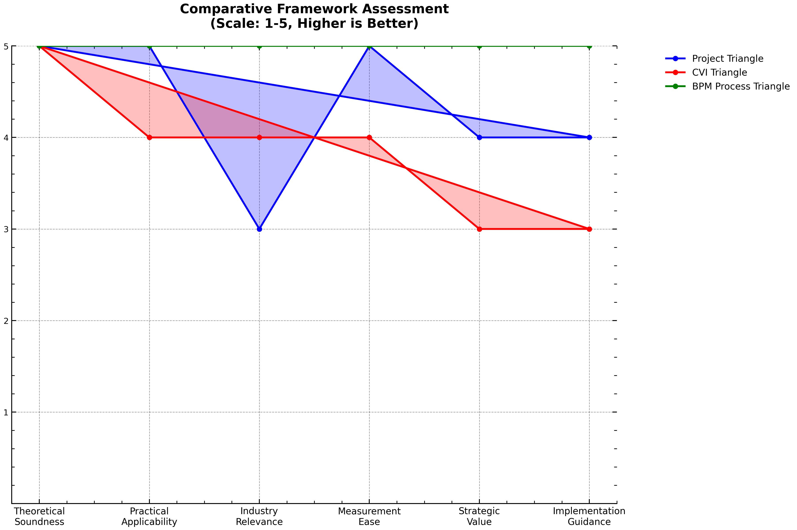
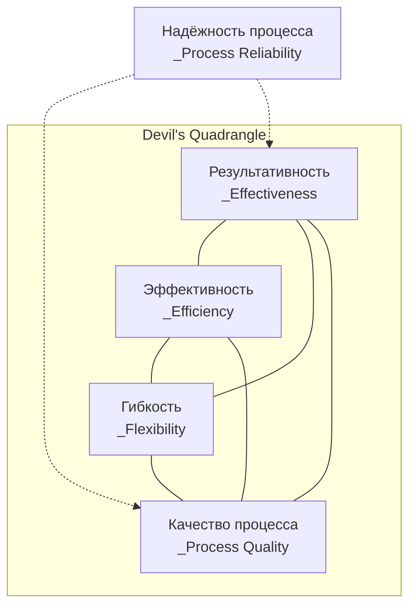

## Process triangle. V1
## 1 Базовый вопрос
Есть проектный треугольник. По аналогии построй процессный треугольник (в рамках теории BPM).

## 📐 Процессный треугольник в BPM: Аналог проектного треугольника

> **Кратко:**  
> В рамках теории BPM (Business Process Management) процессный треугольник строится по аналогии с проектным треугольником и включает три ключевые взаимосвязанные стороны: **Эффективность (Efficiency)**, **Результативность (Effectiveness)** и **Гибкость (Agility)**. Баланс между этими сторонами определяет успешность и конкурентоспособность бизнес-процессов.

---

### 1. Прямой ответ: Как выглядит процессный треугольник в BPM?

**Процессный треугольник** — это концептуальная модель, отражающая три фундаментальных измерения бизнес-процессов:

- **Эффективность (Efficiency):** Насколько быстро и экономно выполняется процесс (затраты, время, ресурсы).
- **Результативность (Effectiveness):** Насколько процесс достигает поставленных целей и удовлетворяет требования клиентов (качество, ценность, соответствие ожиданиям).
- **Гибкость (Agility):** Насколько процесс способен адаптироваться к изменениям внешней среды, требованиям рынка и внутренним условиям.

Эти стороны находятся в постоянном балансе и часто вступают в противоречие друг с другом — улучшение одной стороны может привести к ухудшению другой.

---

### 2. Визуализация: Процессный треугольник BPM


**Эффективность — Результативность — Гибкость**


---

### 3. Теоретическое обоснование и сравнение с проектным треугольником

| Модель                 | Вершина 1         | Вершина 2      | Вершина 3      | Центральный элемент      | Контекст применения         |
|------------------------|-------------------|----------------|----------------|--------------------------|-----------------------------|
| Проектный треугольник  | Сроки (Time)      | Стоимость (Cost)| Объем (Scope)  | Качество (Quality)       | Управление проектами        |
| Процессный треугольник | Эффективность     | Результативность| Гибкость       | Производительность процесса | Управление бизнес-процессами |

- **Эффективность** в BPM аналогична "времени" и "стоимости" в проектном треугольнике.
- **Результативность** соответствует "качеству" и "объему".
- **Гибкость** — уникальная сторона для процессов, отражающая способность быстро реагировать на изменения 
[1](https://www.academia.edu/35467911/Fundamentals_of_Business_Process_Management#:~:text=The%20book%20%22Fundamentals%20of,for%20the%20alleged%20failure) ; [2](https://link.springer.com/book/10.1007/978-3-662-56509-4#:~:text=This%20textbook%20covers%20the,process%20identification%20to%20process) ; [3](https://link.springer.com/chapter/10.1007/978-3-031-16103-2_3#:~:text=Processes%20are%20complex%20phenomena,graph%20databases.%20J.%20Data)
---

### 4. Взаимосвязи и типовые trade-off'ы

| Связь                 | Описание конфликта/баланса                                   | Пример из практики                |
|-----------------------|--------------------------------------------------------------|-----------------------------------|
| Эффективность ↔ Результативность | Быстрота и экономия могут снизить качество; высокое качество требует больше ресурсов | Фастфуд (скорость) vs ресторан (качество) |
| Эффективность ↔ Гибкость         | Стандартизация повышает эффективность, но снижает гибкость | Конвейер vs индивидуальное производство |
| Результативность ↔ Гибкость      | Жесткие стандарты качества ограничивают адаптацию; гибкость может снизить стабильность | Фармацевтика: контроль качества vs быстрый вывод новых препаратов |

---

### 5. Примеры применения в разных отраслях

| Отрасль         | Эффективность (Efficiency) | Результативность (Effectiveness) | Гибкость (Agility)         |
|-----------------|---------------------------|----------------------------------|----------------------------|
| E-commerce      | Время обработки заказа, стоимость | Точность доставки, удовлетворенность клиента | Быстрая реакция на всплески спроса |
| Здравоохранение | Пропускная способность, загрузка ресурсов | Успешность лечения, безопасность | Быстрая адаптация к экстренным ситуациям |
| Производство    | Цикл производства, потери | Качество продукции, соответствие стандартам | Быстрая переналадка под новые заказы |

---

### 6. Практическая ценность и рекомендации

> **Key Takeaway:**  
> Процессный треугольник помогает системно анализировать и оптимизировать бизнес-процессы, выявлять и осознанно управлять компромиссами между эффективностью, результативностью и гибкостью. Это мощный инструмент для стратегического и операционного управления процессами в любой отрасли.

**Рекомендации по использованию:**
- Оцените текущий баланс по трем сторонам треугольника.
- Определите стратегические приоритеты (например, лидерство по издержкам, качеству или скорости реакции).
- Моделируйте последствия изменений одной стороны для других.
- Внедряйте системы мониторинга и регулярно корректируйте баланс в зависимости от изменений рынка и внутренних целей.

---

### 7. Сравнение с существующими моделями

| Модель                 | Сфокусировано на...         | Применимость в BPM |
|------------------------|-----------------------------|--------------------|
| Проектный треугольник  | Проекты, разовые задачи     | Частично           |
| CVI-треугольник        | Операционные процессы       | Частично           |
| Процессный треугольник | Бизнес-процессы end-to-end  | Полностью          |

---

## 🟢 Заключение

**Процессный треугольник** — это универсальная и практически применимая модель для анализа, оптимизации и стратегического управления бизнес-процессами. Он позволяет находить оптимальный баланс между эффективностью, результативностью и гибкостью, что критически важно для устойчивого развития и конкурентоспособности организации в условиях быстро меняющейся среды.

---

> **Используйте процессный треугольник как инструмент для принятия решений, оценки рисков и поисоста в BPM!**

### 2 triangle to quadro
Обычно в проектном треугольнике указывают четыре измерения, т.е. отдельно объем (содержание) и качество (рисуют в центре треугольника). Скорректируй процессный треугольник с учетом этого. 

#### Корректировка процессного треугольника по аналогии с проектным

В классическом проектном треугольнике действительно выделяют четыре измерения: **время**, **стоимость**, **объем (содержание)** — по вершинам треугольника, а **качество** помещают в центр, как результирующую характеристику, зависящую от баланса остальных трех параметров.

---

#### Процессный треугольник с учетом четырех измерений

**Аналогично, в процессном треугольнике для BPM можно выделить:**

- **Вершины треугольника:**
  - **Эффективность** (затраты/ресурсы, скорость выполнения процесса)
  - **Результативность** (достижение целей, ценность для клиента)
  - **Гибкость** (способность адаптироваться к изменениям)

- **Центр треугольника:**
  - **Качество процесса** — интегральная характеристика, отражающая, насколько процесс стабильно и предсказуемо обеспечивает нужный результат при заданных ограничениях по эффективности, результативности и гибкости.

---

#### Визуализация

```
           Результативность
                /\
               /  \
              /    \
             /      \
    Гибкость --------- Эффективность

                (Качество)
```

---

#### Обоснование

- **Качество** в центре процессного треугольника BPM — это аналог того, как в проектном треугольнике качество зависит от объема, времени и стоимости . В BPM качество процесса проявляется в стабильности, предсказуемости, минимизации дефектов и способности удовлетворять требования заинтересованных сторон.
- **Эффективность, результативность и гибкость** — это три стороны, между которыми всегда приходится искать баланс. Например, чрезмерная стандартизация ради эффективности может снизить гибкость, а попытка сделать процесс максимально гибким может снизить его эффективность.

---

#### Итоговая формулировка

**Процессный треугольник с учетом четырех измерений:**
- **Вершины:** Эффективность, Результативность, Гибкость
- **Центр:** Качество процесса — как интегральная функция баланса между тремя сторонами

**Такой подход позволяет более точно анализировать и оптимизировать бизнес-процессы, делая акцент не только на отдельных характеристиках, но и на их влиянии на итоговое качество процесса.**

### 3 Отдельно подсвети надежность процесса - как устойчивость процесса к человеческому фактору исполнителя процесса.

## 🎯 Четырёхмерный процессный треугольник: измерения, KPI, противоречия и надёжность

---

> **Кратко:**  
> В бизнес-процессах выделяют четыре ключевых измерения: результативность, эффективность, гибкость и качество процесса. Для каждого существуют свои KPI и единицы измерения, а попытки улучшить одно измерение часто приводят к ухудшению других. Надёжность процесса — это его устойчивость к человеческому фактору, достигаемая через автоматизацию, стандартизацию и error-proofing.

---

### 1. Обзор четырёх измерений

| Измерение         | Определение                                                                 | Примеры KPI и единиц измерения                | Противоречия с другими измерениями                |
|-------------------|----------------------------------------------------------------------------|-----------------------------------------------|---------------------------------------------------|
| **Результативность**<br/>(Effectiveness) | Достижение целей процесса, удовлетворение потребностей клиента | % выполнения целей, CSAT, NPS, индекс удовлетворённости | Повышение может снизить эффективность и гибкость   |
| **Эффективность**<br/>(Efficiency)       | Минимизация затрат ресурсов на единицу результата             | Время цикла (часы/дни), стоимость за транзакцию ($), производительность (ед./час) | Повышение снижает гибкость и качество             |
| **Гибкость**<br/>(Flexibility)           | Способность адаптироваться к изменениям и исключениям         | Время реакции на изменения (часы/дни), число вариантов процесса, время переналадки | Повышение снижает эффективность и качество         |
| **Качество процесса**<br/>(Process Quality) | Соответствие стандартам, стабильность и предсказуемость результата | Доля дефектов (%), FPY, уровень соответствия стандартам (%) | Повышение снижает эффективность и гибкость         |

---

### 2. Детализация: KPI и единицы измерения

#### **Результативность (Effectiveness)**
- **KPI:** % достижения целей, CSAT (оценка удовлетворённости клиента), NPS (индекс лояльности)
- **Единицы:** проценты (%), баллы по шкале (1–10), абсолютные значения (кол-во завершённых проектов)
- **Пример:** 95% заказов доставлены вовремя, CSAT = 8,7/10

#### **Эффективность (Efficiency)**
- **KPI:** Время цикла, стоимость за транзакцию, производительность, уровень загрузки ресурсов
- **Единицы:** часы, дни, $, %, ед./час
- **Пример:** Время цикла — 2 дня, стоимость — $5/транзакция

#### **Гибкость (Flexibility)**
- **KPI:** Время реакции на изменения, число вариантов процесса, среднее время решения инцидентов
- **Единицы:** минуты, часы, дни, количество вариантов, %
- **Пример:** Время реакции на изменение — 4 часа, поддерживается 5 вариантов процесса

#### **Качество процесса (Process Quality)**
- **KPI:** Доля дефектов, FPY (доля бездефектного выполнения), уровень соответствия стандартам
- **Единицы:** %, количество дефектов, стандартное отклонение
- **Пример:** Доля дефектов — 0,5%, FPY — 98%

---

### 3. Противоречия между измерениями

- **Эффективность vs. Гибкость:** Автоматизация и стандартизация ради эффективности ограничивают возможность быстро адаптироваться к изменениям.
- **Качество vs. Эффективность:** Введение дополнительных проверок ради качества увеличивает затраты времени и ресурсов.
- **Результативность vs. Эффективность:** Для достижения максимальных результатов могут потребоваться дополнительные ресурсы, что снижает эффективность.
- **Гибкость vs. Качество:** Увеличение числа вариантов процесса усложняет поддержание стабильного качества.

> **Key Takeaway:**  
> Оптимизация одного измерения часто приводит к компромиссам по другим. Балансировка — ключ к устойчивому развитию процессов.

---

### 4. Визуализация: Четырёхмерный процессный треугольник (Devil’s Quadrangle) в Mermaid


*Надёжность процесса выделена как фактор, влияющий на качество и результативность.*

---

### 5. Надёжность процесса: устойчивость к человеческому фактору

**Надёжность процесса** — это способность процесса обеспечивать стабильные результаты независимо от человеческих ошибок и вариабельности исполнителей.  
**Ключевые методы повышения надёжности:**
- **Автоматизация:** Снижение зависимости от человеческих действий, устранение рутинных ошибок.
- **Стандартизация:** Чёткие инструкции, чек-листы, унификация процедур.
- **Error-proofing (poka-yoke):** Встроенные механизмы предотвращения и обнаружения ошибок.
- **Обучение и развитие персонала:** Повышение компетентности и осознанности.
- **Организационная устойчивость:** Внедрение культуры непрерывного улучшения и управления рисками.

> **Key Finding:**  
> Чем выше степень автоматизации и стандартизации, тем меньше влияние человеческого фактора и выше надёжность процесса.

---

### 6. Итоговая таблица: Измерения, KPI, противоречия

| Измерение      | KPI/Метрики                        | Единицы         | Противоречия с другими измерениями         |
|----------------|------------------------------------|-----------------|--------------------------------------------|
| Результативность | % достижения целей, CSAT, NPS      | %, баллы        | Снижает эффективность, гибкость            |
| Эффективность    | Время цикла, стоимость, производительность | часы, $, %      | Снижает гибкость, качество                 |
| Гибкость         | Время реакции, число вариантов     | часы, количество | Снижает эффективность, качество            |
| Качество         | Доля дефектов, FPY, соответствие   | %, количество   | Снижает эффективность, гибкость            |

---

## 🟢 Заключение

Четырёхмерная модель оценки процессов (результативность, эффективность, гибкость, качество) позволяет комплексно анализировать и совершенствовать бизнес-процессы. Однако между этими измерениями существуют неизбежные противоречия, требующие баланса. Надёжность процесса — это отдельный аспект, обеспечивающий устойчивость к человеческому фактору через автоматизацию, стандартизацию и error-proofing, что критически важно для стабильности и качества результата.

---

**Источники:**
- https://pmc.ncbi.nlm.nih.gov/articles/PMC5069235/#:~:text=Dumas%20et%20al.%20%282013%29,of%20business%20process%20performance
- https://pmc.ncbi.nlm.nih.gov/articles/PMC5069235/#:~:text=The%20study%20found%20that,and%20quality%20as%20key
- https://link.springer.com/chapter/10.1007/978-3-319-59466-8_1#:~:text=The%20quadrangle%20depicts%20the,%28time%2C%20cost%2C%20quality%20and
- https://process-pattern.app/resources/bpm/process-performance#:~:text=The%20devil%27s%20quadrangle%20illustrates,time%2C%20cost%2C%20quality%2C%20and
- https://www.mdpi.com/2078-2489/15/11/724#:~:text=In%20business%20process%20redesign%2C,be%20included%20in%20this
- https://pmc.ncbi.nlm.nih.gov/articles/PMC5069235/#:~:text=The%20study%20suggests%20that,measurement%20frameworks%20in%20academic
- https://www.intechopen.com/chapters/9672#:~:text=The%20key%20performance%20indicators,reliability%2C%20process%20quality%20and
- https://process-pattern.app/resources/bpm/process-performance#:~:text=Process%20flexibility%20refers%20to,to%20changes%20in%20process
- https://process-pattern.app/resources/bpm/process-performance#:~:text=Process%20quality%20can%20be,of%20successfully%20executed%20process
- https://www.ebsco.com/research-starters/business-and-management/process-management-quality#:~:text=Process%20Management%20for%20Quality,designed%20into%20products%20not
- 2
- https://www.mdpi.com/2079-8954/13/4/256#:~:text=Step%201%20%28Generate%20the,in%20China%2C%20the%20suggested
- https://pmc.ncbi.nlm.nih.gov/articles/PMC8185488/#:~:text=The%20Five%20Diamond%20Method,and%20exploitation%20in%20process
- https://www.bpminstitute.org/resources/articles/case-study-business-process-management-applying-best-practices-sales-and-operatio/#:~:text=There%20is%20a%2050%25,to%2020%25%20reduction%20in
- https://www.emerald.com/insight/content/doi/10.1108/BPMJ-10-2021-0677/full/html#:~:text=In%20our%20example%2C%20students,tradeoff%2C%20we%20now%20draw
- https://www.mdpi.com/2071-1050/13/4/1906#:~:text=We%20further%20defined%20the,despite%20those%20limitations%2C%20we
- https://www.bpminstitute.org/resources/articles/case-study-business-process-excellence-building-culture-excellence/#:~:text=Coors%20Brewing%20Company%20started,company%E2%80%99s%20strategic%20goals%20and
-3
- https://www.researchgate.net/publication/313267328_A_Systematic_Literature_Review_on_the_Architecture_of_Business_Process_Management_Systems#:~:text=These%20are%20Pareto%20trade%2Doffs.,formulate%20practical%20recommendations.%20Their
- https://www.emerald.com/bpmj/article/28/8/1/257175/The-influence-of-BPM-supportive-culture-and#:~:text=Typical%20interferences%20are%20through,employees%E2%80%99%20process%20conformance%20drawing
- https://www.6sigma.us/lean-tools/poka-yoke-six-sigma/#:~:text=poka%2Dyoke%2C%20which%20translates%20from,errors%20nearly%20impossible%20to
- https://kaizen.com/insights/poka-yoke-processes-error-proof/#:~:text=Poka%20Yoke%20aims%20to,satisfaction%20by%20turning%20into

- https://www.6sigma.us/lean-tools/poka-yoke-six-sigma/#:~:text=poka%2Dyoke%20mechanisms%20fall%20into,the%20operator%20to%20initiate
- https://www.6sigma.us/lean-tools/poka-yoke-six-sigma/#:~:text=Control%20poka%2Dyoke%20automatically%20interrupts,until%20the%20defect%20gets
- https://kaizen.com/insights/poka-yoke-processes-error-proof/#:~:text=Implementing%20Poka%20Yoke%20systems,preventing%20errors%20at%20the
- https://www.givainc.com/blog/people-process-technology-framework/#:~:text=Automation%20and%20Optimization%3A%20Reducing,manual%20tasks%20to%20increase
- https://www.kpifire.com/blog/poka-yoke/#:~:text=Six%20Principles%20of%20Poka%2DYoke%3A,Errors%20When%20They%20Do
- https://www.learnleansigma.com/guides/error-proofing-poka-yoke/#:~:text=Common%20error%2Dproofing%20techniques%20include,and%20standardizing%20and%20simplifying
- https://www.sciencedirect.com/science/article/abs/pii/S0952197625021086#:~:text=RE%20characterizes%20systems%20through,pressure%2C%20and%20recover%20essential
- https://www.sciencedirect.com/science/article/abs/pii/S0952197625021086#:~:text=RE%20characterizes%20systems%20through,pressure%2C%20and%20recover%20essential
- https://www.sciencedirect.com/science/article/abs/pii/S0952197625021086#:~:text=managers%20should%20formally%20embed,upgrades%20and%20crisis%20training
- https://www.learnleansigma.com/guides/error-proofing-poka-yoke/#:~:text=Foster%20a%20culture%20of,participate%20in%20the%20error%2Dproofing
- 4
- https://www.sciencedirect.com/science/article/abs/pii/S0166361520300890#:~:text=risk%2Daware%20business%20process%20management,of%20an%20organization%27s%20business
- https://www.sciencedirect.com/science/article/abs/pii/S0952197625021086#:~:text=embedding%20resilience%20metrics%E2%80%94such%20as%20system%20robustness%20and%20operational%20flexibility%E2%80%94directly%20into%20risk%20analyses
- https://www.sciencedirect.com/science/article/abs/pii/S0166361520300890#:~:text=BPRIM%20%28Business%20Process%2DRisk%20Integrated,and%20including%20risk%20management
- https://www.sciencedirect.com/science/article/abs/pii/S0166361520300890#:~:text=BPRIM%20provides%20insights%20and,process%20managers%20in%20their
- https://www.kpifire.com/blog/poka-yoke/#:~:text=Poka%2DYoke%20is%20a%20Japanese,cornerstone%20concept%20in%20quality
- https://www.givainc.com/blog/people-process-technology-framework/#:~:text=People%2C%20Process%2C%20Technology%20%28PPT%29,operational%20workflows%2C%20and%20technological
- https://www.givainc.com/blog/people-process-technology-framework/#:~:text=The%20PPT%20framework%20helps,performance%20and%20drive%20digital
- https://tikalacademy.com/what-is-poka-yoke#:~:text=Contact%20Method%3A%20This%20type,to%20fit%20in%20certain
- https://kaizen.com/insights/poka-yoke-processes-error-proof/#:~:text=Examples%20of%20Poka%20Yoke%3A,Automatic%20validations%20in%20digital
- https://www.learnleansigma.com/guides/error-proofing-poka-yoke/#:~:text=Measuring%20the%20effectiveness%20of,comparing%20before%20and%20after
- 5
- https://www.kpifire.com/blog/poka-yoke/#:~:text=This%20%27building%2Din%27%20of%20quality,waste%20and%20improving%20overall
- https://www.6sigma.us/lean-tools/poka-yoke-six-sigma/#:~:text=Examples%20of%20Poka%2DYoke%20in,Orientation%2C%20Motion%20Sensors%2C%20Alert
- https://www.sciencedirect.com/science/article/abs/pii/S0166361520300890#:~:text=R%2DBPM%20aims%20to%20improve,robustness%20of%20business%20process
- https://research.aimultiple.com/process-kpis/#:~:text=Process%20effectiveness%20is%20the,that%20it%20satisfies%20the
- https://www.processmaker.com/blog/how-to-effectively-use-process-metrics-in-business-process-analysis/#:~:text=Customer%20satisfaction%20or%20CSAT%3A,meets%20or%20exceeds%20customer
- https://www.rhythmsystems.com/blog/kpi-examples-list#:~:text=Customer%3A%20Customer%20satisfaction%20score%2C,retention%20rate%2C%20average%20transaction
- https://research.aimultiple.com/process-kpis/#:~:text=Customer%20satisfaction%3A%20How%20well,process%20meets%20the%20customer%E2%80%99s
- https://www.indeed.com/career-advice/career-development/process-metrics#:~:text=Quality%20rate%20%3D%20%28Total,of%20units%20produced%29%20x
- https://www.clearpointstrategy.com/blog/18-key-performance-indicators#:~:text=the%20four%20categories%20of,Financial%2C%20Customer%2C%20Process%20and
- https://www.heflo.com/blog/process-metrics#:~:text=Efficiency%20Metrics%20%E2%80%93%20Measure,money%2C%20or%20manpower%20are
- 6
- https://www.cflowapps.com/performance-metrics/#:~:text=Efficiency%20%7C%20Achieving%20maximum,well%20are%20resources%20being
- https://www.processmaker.com/blog/how-to-effectively-use-process-metrics-in-business-process-analysis/#:~:text=Resource%20utilization%3A%20This%20measures,are%20used%20in%20a
- https://blog.proactioninternational.com/en/process-improvement-metrics-boost-performance#:~:text=Resource%20utilization%20rate%3A%20Efficiency,machines%2C%20raw%20materials%29%20are
- https://research.aimultiple.com/process-kpis/#:~:text=Process%20cycle%20time%20measures,to%20complete%20a%20given
- https://www.heflo.com/blog/process-metrics#:~:text=Cycle%20Time%3A%20Measures%20the,run%20from%20beginning%20to
- https://www.cflowapps.com/performance-metrics/#:~:text=Cycle%20Time%20refers%20to,process%20from%20start%20to
- https://www.processmaker.com/blog/how-to-effectively-use-process-metrics-in-business-process-analysis/#:~:text=Cycle%20time%3A%20This%20is,process%20from%20start%20to
- https://blog.proactioninternational.com/en/process-improvement-metrics-boost-performance#:~:text=Cycle%20time%3A%20Total%20time,process%20from%20start%20to
- https://www.indeed.com/career-advice/career-development/process-metrics#:~:text=Cycle%20time%20is%20the,process%20from%20beginning%20to
- https://research.aimultiple.com/process-kpis/#:~:text=Takt%20time%3A%20Time%20to,the%20consistency%20in%20unit
- 7
- https://www.cflowapps.com/performance-metrics/#:~:text=Takt%20Time%20is%20the,unit%20while%20meeting%20customer
- https://www.indeed.com/career-advice/career-development/process-metrics#:~:text=Takt%20time%20is%20the,unit%20before%20making%20the
- https://www.cflowapps.com/performance-metrics/#:~:text=Changeover%20Time%20is%20the,process%20or%20task%20to
- https://research.aimultiple.com/process-kpis/#:~:text=Mean%20time%20to%20issue,an%20issue%20after%20it%E2%80%99s
- https://www.cflowapps.com/performance-metrics/#:~:text=Mean%20Time%20to%20Repair,a%20failed%20system%20or
- https://research.aimultiple.com/process-kpis/#:~:text=Error%20rate%3A%20The%20number,during%20the%20entire%20process
- https://www.cflowapps.com/performance-metrics/#:~:text=Defect%20Rate%20measures%20the,defective%20products%20within%20total
- https://blog.proactioninternational.com/en/process-improvement-metrics-boost-performance#:~:text=Defect%20rate%3A%20Percentage%20of,total%20number%20of%20parts
- https://www.heflo.com/blog/process-metrics#:~:text=First%20Pass%20Yield%20%28FPY%29%3A,completed%20correctly%20without%20needing
- https://www.cflowapps.com/performance-metrics/#:~:text=First%20Pass%20Yield%20%28FPY%29,first%20attempt%20without%20requiring
- 8
- https://www.6sigma.us/six-sigma-in-focus/process-indicators/#:~:text=First%20pass%20yield%3A%20The,a%20process%20without%20requiring
- https://www.cflowapps.com/performance-metrics/#:~:text=Order%20Accuracy%20tracks%20the,percentage%20of%20correctly%20fulfilled
- https://www.processmaker.com/blog/how-to-effectively-use-process-metrics-in-business-process-analysis/#:~:text=Standard%20deviation%3A%20This%20measures,in%20a%20set%20of
- https://www.pcg-services.com/using-a-balanced-scorecard-to-measure-your-key-performance-indicators/#:~:text=Internal%20process%20perspective%20%E2%80%93,needed%20to%20meet%20customer
- https://www.pcg-services.com/using-a-balanced-scorecard-to-measure-your-key-performance-indicators/#:~:text=Balanced%20scorecards%20have%20long,a%20framework%20to%20manage
- https://balancedscorecard.org/bsc-basics-overview/#:~:text=For%20each%20objective%20on,measurement%20tool%2C%20the%20BSC
- https://hbr.org/1992/01/the-balanced-scorecard-measures-that-drive-performance-2#:~:text=What%20you%20measure%20is,more%20on%20Balanced%20scorecard
- https://www.6sigma.us/six-sigma-in-focus/process-indicators/#:~:text=Effective%20KPIs%20are%20closely,attainable%2C%20relevant%2C%20and%20time%2Dbound
- https://www.cflowapps.com/performance-metrics/#:~:text=Mean%20Time%20Between%20Failures,between%20system%20or%20equipment
- https://www.processmaker.com/blog/how-to-effectively-use-process-metrics-in-business-process-analysis/#:~:text=Compliance%20rate%3A%20This%20measures,of%20standard%20rules%20or

## 2 Comment
### Humor
- Треугольник будет выпит! Будь он параллелепипед, Будь он круг, едрена вошь ...
