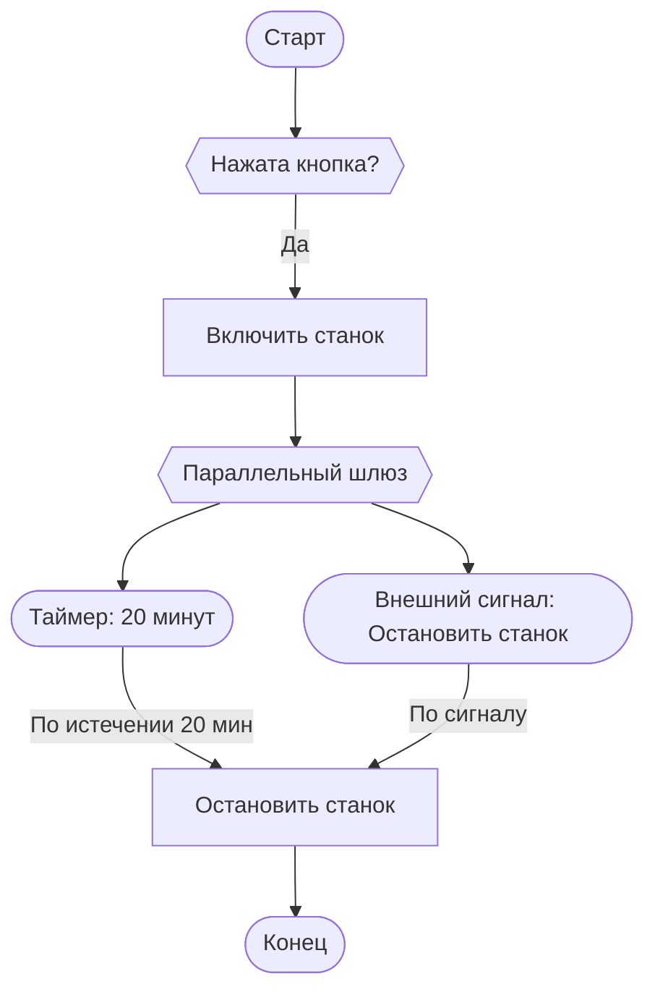

#### 1 Задача
**По кнопке включается станок, который работает по таймеру 20 минут (это первый процесс). И есть внешний сигнал на выходе второго процесса, по внешнему сигналу станок прекращает работу. Покажи схему в нотации markdown для размещения на github.**
#### **Описание задачи**

- **Процесс 1:** По нажатию кнопки включается станок, который работает по таймеру 20 минут.
- **Процесс 2:** Есть внешний сигнал, который может остановить станок до истечения таймера.

#### **BPMN-диаграмма в Markdown (для GitHub)**

Для размещения на GitHub удобно использовать [Mermaid](https://mermaid-js.github.io/mermaid/#/) — популярный синтаксис для визуализации диаграмм в Markdown.



#### **Пояснения к схеме**

- **Параллельный шлюз** (`ParallelSplit`) используется для одновременного ожидания двух событий: истечения таймера и внешнего сигнала.
- **Станок останавливается** при наступлении любого из событий (таймер или внешний сигнал).
- **Диаграмма** легко вставляется в README.md на GitHub с помощью блока ```mermaid.

#### **Кратко о BPMN-элементах**

- **Стартовое событие** — начало процесса.
- **Задача** — действие (включить станок).
- **Параллельный шлюз** — позволяет слушать несколько событий одновременно.
- **Промежуточное событие** — таймер или внешний сигнал.
- **Конечное событие** — завершение процесса [[5]].

### 2 BPMN-схема

#### **Корректная BPMN-схема в Markdown (Mermaid) для GitHub**

Вы правы: предыдущий пример был в стиле flowchart, а не BPMN. В Mermaid поддержка BPMN ограничена, но с 2023 года появилась базовая поддержка BPMN-диаграмм. Вот как можно изобразить ваш процесс с использованием BPMN-нотации в Mermaid для GitHub:

```mermaid
bpmn
    startEvent(id=start, name="Старт")
    task(id=turnOn, name="Включить станок")
    parallelGateway(id=gw1, name="Ожидание события")
    intermediateCatchEvent(id=timer, name="Таймер 20 мин", eventDefinitionType=timer)
    intermediateCatchEvent(id=signal, name="Внешний сигнал", eventDefinitionType=signal)
    task(id=turnOff, name="Остановить станок")
    endEvent(id=end, name="Конец")

    start --> turnOn --> gw1
    gw1 --> timer --> turnOff
    gw1 --> signal --> turnOff
    turnOff --> end
```

---

#### **Пояснения к BPMN-элементам**

- **startEvent** — старт процесса.
- **task** — действия: включение и остановка станка.
- **parallelGateway** — параллельное ожидание двух событий.
- **intermediateCatchEvent** с типом **timer** — ожидание истечения 20 минут.
- **intermediateCatchEvent** с типом **signal** — ожидание внешнего сигнала.
- **endEvent** — завершение процесса.

---

#### **Почему именно так**

- В BPMN для выбора между событиями (таймер или сигнал) используется **event-based gateway** (событийный шлюз), но в Mermaid пока нет его поддержки, поэтому используется **parallelGateway** как ближайший аналог для иллюстрации одновременного ожидания событий.
- Такая схема наглядно показывает, что станок выключается либо по таймеру, либо по внешнему сигналу.

---

Если нужна схема в виде BPMN XML или SVG для профессиональных инструментов (например, Camunda Modeler), дайте знать!
