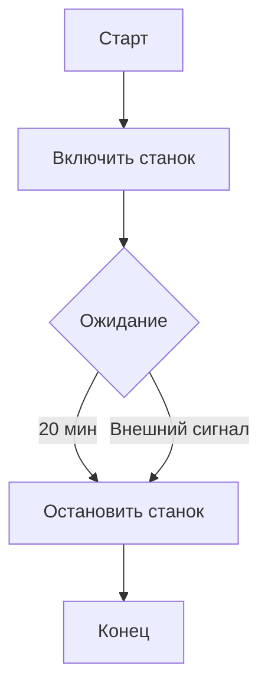
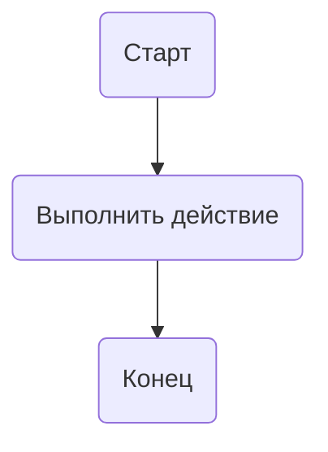

#### 1 Задача
**По кнопке включается станок, который работает по таймеру 20 минут (это первый процесс). И есть внешний сигнал на выходе второго процесса, по внешнему сигналу станок прекращает работу. Покажи схему в нотации markdown для размещения на github.**
#### **Описание задачи**

- **Процесс 1:** По нажатию кнопки включается станок, который работает по таймеру 20 минут.
- **Процесс 2:** Есть внешний сигнал, который может остановить станок до истечения таймера.

#### **BPMN-диаграмма в Markdown (для GitHub)**

Для размещения на GitHub удобно использовать [Mermaid](https://mermaid-js.github.io/mermaid/#/) — популярный синтаксис для визуализации диаграмм в Markdown.


#### **Пояснения к схеме**

- **Параллельный шлюз** (`ParallelSplit`) используется для одновременного ожидания двух событий: истечения таймера и внешнего сигнала.
- **Станок останавливается** при наступлении любого из событий (таймер или внешний сигнал).
- **Диаграмма** легко вставляется в README.md на GitHub с помощью блока ```mermaid.

#### **Кратко о BPMN-элементах**

- **Стартовое событие** — начало процесса.
- **Задача** — действие (включить станок).
- **Параллельный шлюз** — позволяет слушать несколько событий одновременно.
- **Промежуточное событие** — таймер или внешний сигнал.
- **Конечное событие** — завершение процесса [[5]].

### 2 BPMN-схема
#### **Почему не отображается BPMN-схема в Mermaid на GitHub**

Вы столкнулись с ошибкой, потому что GitHub (и большинство Markdown-редакторов) **не поддерживает BPMN-диаграммы в Mermaid**. На данный момент поддерживаются только такие типы диаграмм, как `flowchart`, `sequenceDiagram`, `classDiagram`, `stateDiagram`, и некоторые другие, но не `bpmn`.

---

#### **Что делать?**

**1. Используйте flowchart для иллюстрации процесса в Markdown:**

Если вам нужно показать процесс в Markdown (например, на GitHub), используйте flowchart-нотацию Mermaid, которая поддерживается:



---

**2. Для настоящей BPMN-схемы:**

- Используйте специализированные BPMN-редакторы: Camunda Modeler, Bizagi Modeler, Signavio и др. Там можно создать схему с нужными событиями, шлюзами и экспортировать её в PNG, SVG или BPMN XML.
- Вставьте изображение схемы в Markdown с помощью тега ``.

---

#### **Вывод**

- **В Markdown на GitHub BPMN-схемы через Mermaid не поддерживаются.**
- Для иллюстрации используйте flowchart или приложите картинку, созданную в BPMN-редакторе.

Если нужна помощь с BPMN XML или экспортом схемы — дайте знать!

### 3 попытка 2

#### You've hit your free quota for the Auto Agent.

#### For more usage of the Auto Agent, learn more at: https://you.com/plans.

Answering your question with the Express Agent:

#### BPMN-схема для размещения на GitHub

Поскольку GitHub не рендерит BPMN напрямую в Markdown, лучший способ — создать BPMN-схему в формате XML с помощью онлайн-редактора (например, [bpmn.io](https://demo.bpmn.io/)) и затем:

- Выложить BPMN-файл в репозиторий,
- Добавить в README ссылку на этот файл,
- Или экспортировать диаграмму в PNG/SVG и вставить изображение в README.

---

#### Пример простой BPMN-схемы в XML (для загрузки в bpmn.io или другой BPMN-редактор):

```xml
<?xml version="1.0" encoding="UTF-8"?>
<bpmn:definitions xmlns:bpmn="http://www.omg.org/spec/BPMN/20100524/MODEL"
                  xmlns:bpmndi="http://www.omg.org/spec/BPMN/20100524/DI"
                  xmlns:dc="http://www.omg.org/spec/DD/20100524/DC"
                  xmlns:di="http://www.omg.org/spec/DD/20100524/DI"
                  id="Definitions_1"
                  targetNamespace="http://bpmn.io/schema/bpmn">
  <bpmn:process id="Process_1" isExecutable="false">
    <bpmn:startEvent id="StartEvent_1" name="Старт"/>
    <bpmn:task id="Task_1" name="Выполнить действие"/>
    <bpmn:endEvent id="EndEvent_1" name="Конец"/>
    <bpmn:sequenceFlow id="Flow_1" sourceRef="StartEvent_1" targetRef="Task_1"/>
    <bpmn:sequenceFlow id="Flow_2" sourceRef="Task_1" targetRef="EndEvent_1"/>
  </bpmn:process>
  <bpmndi:BPMNDiagram id="BPMNDiagram_1">
    <bpmndi:BPMNPlane id="BPMNPlane_1" bpmnElement="Process_1">
      <bpmndi:BPMNShape id="StartEvent_1_di" bpmnElement="StartEvent_1">
        <dc:Bounds x="100" y="100" width="36" height="36"/>
      </bpmndi:BPMNShape>
      <bpmndi:BPMNShape id="Task_1_di" bpmnElement="Task_1">
        <dc:Bounds x="200" y="80" width="100" height="80"/>
      </bpmndi:BPMNShape>
      <bpmndi:BPMNShape id="EndEvent_1_di" bpmnElement="EndEvent_1">
        <dc:Bounds x="350" y="100" width="36" height="36"/>
      </bpmndi:BPMNShape>
      <bpmndi:BPMNEdge id="Flow_1_di" bpmnElement="Flow_1">
        <di:waypoint x="136" y="118"/>
        <di:waypoint x="200" y="118"/>
      </bpmndi:BPMNEdge>
      <bpmndi:BPMNEdge id="Flow_2_di" bpmnElement="Flow_2">
        <di:waypoint x="300" y="118"/>
        <di:waypoint x="350" y="118"/>
      </bpmndi:BPMNEdge>
    </bpmndi:BPMNPlane>
  </bpmndi:BPMNDiagram>
</bpmn:definitions>
```

---

#### Как разместить на GitHub

1. Создайте файл `process.bpmn` с этим содержимым и загрузите в репозиторий.
2. В README добавьте ссылку:

```markdown
[BPMN диаграмма процесса](process.bpmn)
```

3. Для визуализации в README можно добавить экспортированное изображение диаграммы:

```markdown

```

(где `process.png` — экспорт из BPMN-редактора)

---

#### Альтернативный вариант — Mermaid flowchart для GitHub

Если нужна простая визуализация прямо в README, используйте flowchart Mermaid:



GitHub рендерит такой код автоматически.

---

Если хотите, могу помочь с генерацией более сложной BPMN-схемы или с экспортом в изображение!
