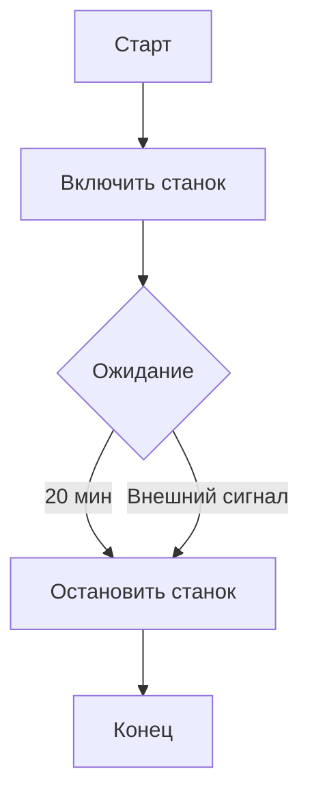

#### 1 Задача
**По кнопке включается станок, который работает по таймеру 20 минут (это первый процесс). И есть внешний сигнал на выходе второго процесса, по внешнему сигналу станок прекращает работу. Покажи схему в нотации markdown для размещения на github.**
#### **Описание задачи**

- **Процесс 1:** По нажатию кнопки включается станок, который работает по таймеру 20 минут.
- **Процесс 2:** Есть внешний сигнал, который может остановить станок до истечения таймера.

#### **BPMN-диаграмма в Markdown (для GitHub)**

Для размещения на GitHub удобно использовать [Mermaid](https://mermaid-js.github.io/mermaid/#/) — популярный синтаксис для визуализации диаграмм в Markdown.


#### **Пояснения к схеме**

- **Параллельный шлюз** (`ParallelSplit`) используется для одновременного ожидания двух событий: истечения таймера и внешнего сигнала.
- **Станок останавливается** при наступлении любого из событий (таймер или внешний сигнал).
- **Диаграмма** легко вставляется в README.md на GitHub с помощью блока ```mermaid.

#### **Кратко о BPMN-элементах**

- **Стартовое событие** — начало процесса.
- **Задача** — действие (включить станок).
- **Параллельный шлюз** — позволяет слушать несколько событий одновременно.
- **Промежуточное событие** — таймер или внешний сигнал.
- **Конечное событие** — завершение процесса [[5]].

### 2 BPMN-схема
#### **Почему не отображается BPMN-схема в Mermaid на GitHub**

Вы столкнулись с ошибкой, потому что GitHub (и большинство Markdown-редакторов) **не поддерживает BPMN-диаграммы в Mermaid**. На данный момент поддерживаются только такие типы диаграмм, как `flowchart`, `sequenceDiagram`, `classDiagram`, `stateDiagram`, и некоторые другие, но не `bpmn`.

---

#### **Что делать?**

**1. Используйте flowchart для иллюстрации процесса в Markdown:**

Если вам нужно показать процесс в Markdown (например, на GitHub), используйте flowchart-нотацию Mermaid, которая поддерживается:



---

**2. Для настоящей BPMN-схемы:**

- Используйте специализированные BPMN-редакторы: Camunda Modeler, Bizagi Modeler, Signavio и др. Там можно создать схему с нужными событиями, шлюзами и экспортировать её в PNG, SVG или BPMN XML.
- Вставьте изображение схемы в Markdown с помощью тега ``.

---

#### **Вывод**

- **В Markdown на GitHub BPMN-схемы через Mermaid не поддерживаются.**
- Для иллюстрации используйте flowchart или приложите картинку, созданную в BPMN-редакторе.

Если нужна помощь с BPMN XML или экспортом схемы — дайте знать!

### 3 попытка 2

#### **Почему не отображается BPMN-схема в Mermaid на GitHub**

Вы столкнулись с ошибкой, потому что GitHub (и большинство Markdown-редакторов) **не поддерживает BPMN-диаграммы в Mermaid**. На данный момент поддерживаются только такие типы диаграмм, как `flowchart`, `sequenceDiagram`, `classDiagram`, `stateDiagram`, и некоторые другие, но не `bpmn`.

---

#### **Что делать?**

**1. Используйте flowchart для иллюстрации процесса в Markdown:**

Если вам нужно показать процесс в Markdown (например, на GitHub), используйте flowchart-нотацию Mermaid, которая поддерживается:


---

**2. Для настоящей BPMN-схемы:**

- Используйте специализированные BPMN-редакторы: Camunda Modeler, Bizagi Modeler, Signavio и др. Там можно создать схему с нужными событиями, шлюзами и экспортировать её в PNG, SVG или BPMN XML.
- Вставьте изображение схемы в Markdown с помощью тега ``.

---

#### **Вывод**

- **В Markdown на GitHub BPMN-схемы через Mermaid не поддерживаются.**
- Для иллюстрации используйте flowchart или приложите картинку, созданную в BPMN-редакторе.

Если нужна помощь с BPMN XML или экспортом схемы — дайте знать!
