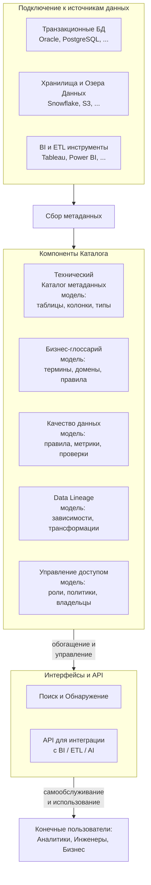
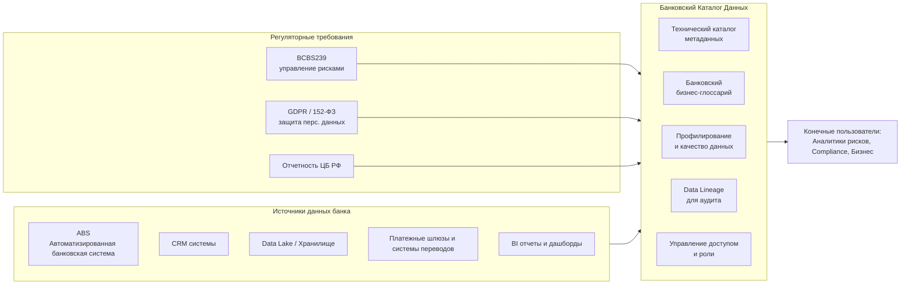

## 1
В теме Управление данными \ качество данных ключевой элемент Каталог данных \ Каталог МетаДанных.  
Это одно и тоже или нет? Если разное, то в чем различие? Какая структура \ архитектура?  
Есть ли типовой Каталог данных \ Каталог МетаДанных банка? Если нет, то сформируй свой (детальный и с пояснениями).  
Какая последовательность (шаги подробно) составления Каталогов? Какие детальные методики для этого? Какие инструменты? 

**Каталог данных и Каталог метаданных — это не одно и то же.** Их ключевое различие кроется в масштабе и предназначении: первый управляет всем жизненным циклом данных для человека и бизнеса, второй решает конкретную техническую задачу для машин. Для понимания лучше всего начать с определения, в котором четко разделены эти понятия. По своей сути, каталог данных — это *система или сервис, который хранит метаданные в структурированной форме, предоставляет поиск, автоматическую индексацию и API-доступ к метаданным*. Он является централизованной платформой, объединяющей метаданные, бизнес-контекст, политики и т.д..

Каталог (или реестр) метаданных (Metadata Catalog/Store), напротив, — это специализированное техническое хранилище, предназначенное для хранения и управления в первую очередь технической информацией о данных (схемы, типы, форматы). Он необходим для работы вычислительных движков, таких как Spark, Trino и др.. В отличие от каталога данных, такой технический каталог обычно не имеет функционала для бизнес-пользователей по управлению политиками доступа, качеством и определению данных.

## Архитектура и Структура: Эталонный Паттерн

Для наглядного представления архитектуры и того, как данные проходят путь от источника до потребителя через все компоненты управления метаданными, используем простую блок-схему:

Представленная схема иллюстрирует ключевые компоненты архитектуры корпоративного каталога данных:

*   **1. Подключение к источникам данных (Сбор метаданных):** С помощью специализированных коннекторов извлекаются исходные метаданные из:
    *   Транзакционных баз данных (Oracle, PostgreSQL, ...).
    *   Хранилищ и озер данных (Snowflake, S3, ...).
    *   BI и ETL инструментов (Tableau, Power BI, ...).

*   **2. Технический Каталог Метаданных (ядро):** Служит местом для хранения технических метаданных, собранных на первом этапе. В эту модель входят сущности, описывающие таблицы, колонки, типы данных, первичные и внешние ключи и другую техническую информацию. Этот компонент часто называют «метастором» (metastore).

*   **3. Компоненты Каталога Данных (функциональные слои):** Технические метаданные служат основой для обогащения, в ходе которого создаются и наполняются другие компоненты:
    *   **Бизнес-глоссарий:** Модель, содержащая бизнес-термины и их определения, снимающие неоднозначности в коммуникации между бизнесом и IT. Сюда же входят правила, политики и владельцы данных.
    *   **Управление качеством данных:** Модель с правилами, метриками и результатами проверок, используемая для оценки и мониторинга состояния данных.
    *   **Data Lineage (происхождение данных):** Модель, представляющая связи и зависимости данных, а также все трансформации, через которые они проходят на своем пути.
    *   **Управление доступом:** Модель, определяющая роли (Data Owner, Data Steward и т.д.), политики безопасности и контроля версий.

*   **4. Интерфейсы и API (Функциональность):** Предоставляют пользователям инструменты для взаимодействия с каталогом:
    *   **Поиск и обнаружение данных:** Основной функционал для аналитиков и бизнес-пользователей.
    *   **API для интеграции:** Позволяют подключать каталог к существующим BI, ETL и AI-системам, а также автоматизировать процессы.

## Типовой каталог для банка

Хотя единого «типового» решения не существует из-за специфики каждого банка, можно предложить детализированную модель, отталкиваясь от лучших практик и особенностей индустрии. Пользователи Т-Банка ищут в своем каталоге Data Detective по ключевым словам «данные о продажах BNPL», а отчёты о банковских картах опираются на справочники ЦБ РФ. Аналитику Нордик-банка нужно соблюдать стандарт BCBS239 при поиске данных, а венгерский OTP Bank уже внедрил систему Enterprise Metadata Management. Эти примеры выделяют следующие ключевые аспекты банковского каталога.

### Пример архитектуры каталога банка

Конкретные виды метаданных в банковском контексте:

*   **Технический каталог метаданных (ядро):**
    *   Таблицы с транзакциями, остатками, клиентами, продуктами.
    *   Колонки: тип данных (NUMBER, VARCHAR2, DATE), ограничения (PRIMARY KEY, FOREIGN KEY, NOT NULL), комментарии.
    *   Связи между таблицами, схемы баз данных.
    *   Источники данных: АБС, CRM, Data Lake.

*   **Банковский бизнес-глоссарий:**
    *   `Клиент`: Определение, является ли он физическим, юридическим лицом или ИП.
    *   `Продукт`: Кредитная карта, дебетовая карта, вклад, кредит наличными.
    *   `Транзакция`: Зачисление, списание, перевод, платеж.
    *   `Риск-метрика`: PD, LGD, EAD, скоринговый балл.
    *   `Отчетность 0409152`: Ссылка на форму отчетности ЦБ РФ.

*   **Управление качеством данных:**
    *   **Правило полноты:** Проверка, что для всех клиентов заполнено поле `ИНН`.
    *   **Правило точности:** Сверка итогов транзакций за день с выпиской из клиринговой системы.
    *   **Правило своевременности:** Контроль того, что данные из АБС попадают в хранилище не позднее T+1.

*   **Data Lineage (происхождение данных):** Прослеживание пути данных для отчета по капиталу (например, Basel III) от финальной витрины через несколько ETL-преобразований к конкретным таблицам и колонкам в АБС.

*   **Управление доступом и роли:**
    *   **Data Owner:** Руководитель риск-департамента (утверждает правила доступа к данным скоринга).
    *   **Data Steward:** Кредитный аналитик (отвечает за корректность справочника кодов просрочек).
    *   **Data Custodian:** Инженер данных в департаменте ИТ (технически реализует политики доступа).

## Пошаговая инструкция по созданию каталога

Построение каталога — это не разовый ИТ-проект, а внедрение новой системы управления знаниями о данных. Успех зависит от тщательного планирования, вовлечения всех заинтересованных сторон и постоянного развития. Предлагается следующий детализированный план, основанный на лучших отраслевых практиках:

**Этап 1: Стратегическое планирование и определение целей**

*   **Действие:** Определите измеримые и достижимые цели, прежде чем выбирать технологию.
*   **Пример цели:** «Сократить время на поиск и проверку данных для регуляторного отчета 0409152 с 5 дней до 4 часов». Или «Обеспечить полную прослеживаемость (lineage) данных для всех KPI совета директоров в течение 3 месяцев».

**Этап 2: Аудит текущего ландшафта данных**

*   **Действие:** Проведите инвентаризацию ваших данных. Составьте список всех систем-источников, хранилищ, озер данных, ETL/ELT процессов, BI-платформ и т.д.. Оцените их зрелость и поддерживаемые форматы.

**Этап 3: Выбор пилотного проекта**

*   **Действие:** Выберите один, четко определенный, высокоприоритетный бизнес-кейс для первого внедрения. Это снизит риски и продемонстрирует быструю ценность.
*   **Пример пилота:** Не стоит пытаться охватить все данные банка. Начните с «Отчета по просроченной задолженности для Комитета по рискам».

**Этап 4: Определение требований и выбор инструмента**

*   **Действие:** На основе бизнес-целей и пилотного кейса сформулируйте функциональные и нефункциональные требования (масштабируемость, безопасность, интеграция с существующими системами). Затем приступайте к выбору инструмента.

**Этап 5: Развертывание и настройка**

*   **Действие:** Установите выбранное решение. Настройте подключения к источникам данных, определенным на пилотном проекте. Настройте базовые роли доступа.

**Этап 6: Сбор и загрузка метаданных**

*   **Действие:** Запустите процессы сканирования источников данных для сбора технических метаданных. Это можно сделать как автоматически (с помощью crawler-ов), так и вручную.

**Этап 7: Обогащение метаданных и наполнение каталога**

*   **Действие:** Это ключевой этап, на котором технические метаданные превращаются в полезную информацию.
*   **Что делать:** Вручную или с помощью инструментов заполните бизнес-глоссарий (определения терминов, политики, владельцы) для выбранных пилотных данных. Добавьте правила качества и визуализируйте их lineage.

**Этап 8: Обучение и внедрение**

*   **Действие:** Проведите обучение для всех групп пользователей. Покажите, как каталог решает их конкретные задачи.

**Этап 9: Запуск в эксплуатацию и мониторинг**

*   **Действие:** Переведите каталог в продуктивную среду. Мониторьте его использование, собирайте обратную связь и отслеживайте KPI (например, количество успешных поисков, снижение времени на инциденты).

**Этап 10: Итеративное развитие и масштабирование**

*   **Действие:** Каталог данных — это живая система. Планируйте новые итерации развития, добавляя новые источники данных, улучшая процессы обогащения и внедряя более сложные возможности.

## Методологии и стандарты

*   **DAMA-DMBOK2:** Свод знаний по управлению данными, выделяющий управление метаданными (Metadata Management) как ключевую область.
*   **ГОСТ Р ИСО/МЭК (ISO/IEC standards):** Стандарты информационных технологий, регламентирующие процессы сбора, хранения и использования метаданных.
*   **FAIR (Findable, Accessible, Interoperable, Reusable):** Принципы, делающие данные и их метаданные искомыми, доступными, совместимыми и пригодными для повторного использования.
*   **DCAT (Data Catalog Vocabulary):** Словарь и стандарт W3C для описания каталогов данных и метаданных, что обеспечивает совместимость (interoperability) систем.

## Ключевые инструменты

Современный рынок предлагает множество решений, которые можно условно разделить на три категории: централизованные платформы с богатым функционалом, технические каталоги для управления метаданными на уровне платформ данных, и открытые экосистемы, которые компании могут адаптировать под себя.

*   **Коммерческие централизованные платформы:** Разработаны для крупных предприятий и предлагают полный спектр функций по управлению данными. К ним относятся такие системы, как **Collibra** и **Alation**.

*   **Российские системы:** Учитывают локальную специфику и требования регуляторов. Примеры: **Arenadata Catalog** (отличается более чем 60 коннекторами к российским системам и встроенными инструментами качества).

*   **Инструменты от облачных провайдеров:** Обычно интегрированы в экосистему конкретного облака. Пример: **AWS Glue Data Catalog**.

*   **Open Source:** Популярный выбор, позволяющий компаниям строить решение под себя. Самые известные: **DataHub** (используется Островком наряду с собственным решением для двухуровневой архитектуры), **Open Metadata** и **Amundsen**.

*   **Технические каталоги (Metastores):** Hive Metastore (классический инструмент в экосистеме Hadoop для хранения схем таблиц), **Unity Catalog** от Databricks, Polaris от Snowflake и другие.

## Источники информации

Для систематизации знаний и углубленного изучения можно опираться на следующие работы:

1.  DAMA International. **DAMA-DMBOK: Data Management Body of Knowledge** (2nd Edition). Техническая библиотека  (Data Management Association). — Фундаментальный свод знаний.
2.  «Data Governance Institute». **Framework и Best Practices** (DGI). — https:--datagovernance.com/
3.  Журнал «**Harvard Data Science Review**» — https:--hdsr.mitpress.mit.edu/
4.  Глоссарий и стандарты **Data Management Association (DAMA)** — https:--www.dama.org/

### 1.1 term
В анализе данных (Data Lineage)В сфере IT термин используется как «родословная данных». Это процесс отслеживания полного пути информации — от ее изначального источника через все базы данных и преобразования (трансформации) до финального отчета.  
Исходно: Линидж (англ. lineage) — древняя форма устройства родственных объединений, основанная на генеалогическом принципе, см. [wiki](https://ru.wikipedia.org/wiki/%D0%9B%D0%B8%D0%BD%D0%B8%D0%B4%D0%B6).

