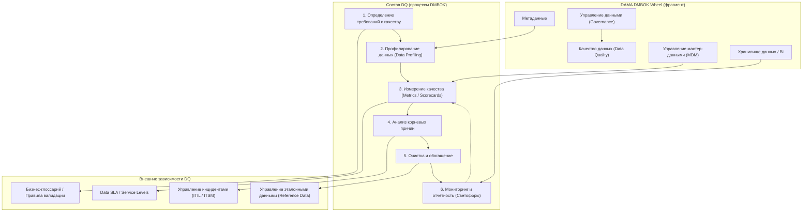

# DM.DQ.C1
## v1
Ниже представлен структурированный ответ, полностью соответствующий вашему запросу. Я скорректировал и дополнил сценарий, сохранив его логику, но усилив терминологически и методически.

---

## Часть 1. Место DQ в управлении данными и состав DQ (mermaid)

В соответствии с эталонной моделью **DAMA-DMBOK2 (Data Management Body of Knowledge)**, «Качество данных» (Data Quality) — это не изолированная активность, а одно из 11 основных знаний (Knowledge Areas), расположенное на «колесе» DAMA. Оно находится на стыке с «Обработкой метаданных», «Управлением мастер-данными» (MDM) и «Хранилищем данных» (BI/Analytics).

Ниже представлена диаграмма mermaid, показывающая внутренние компоненты DQ и внешние зависимости:

**Пояснение связей:**
- **DQ1 (Требования)** зависят от бизнес-глоссария и нормативных актов.
- **DQ2 (Профилирование)** невозможно без метаданных (описания структур).
- **DQ3 (Измерения)** транслируются в Data SLA (внутренние соглашения).
- **DQ6 (Мониторинг)** — это те самые «светофоры», которые видны пользователю.

---

## Часть 2. Скорректированный рассказ (сценарий DM.DQ.C1)

### 2.1 Сценарий с терминологической корректировкой
#### DM.DQ.C1
**Задача:** Сотруднику Финансово-аналитического управления (далее ФАУ) банка подготовить BI-отчет. Отчет строится «по кнопке» на данных корпоративного хранилища [DWH].

**1. Первая линия обороны (мониторинг операционной готовности DWH).**
ФАУ смотрит на дашборд [Data Quality Dashboard] индикаторов готовности [Data Readiness Indicators]. Светофоры показывают фазы загрузки: «день открыт» → красный; «загрузка идет» → желтый; «данные загружены» → зеленый. Для каждого хранилища — свой индикатор [SLA for Data Delivery]. При переоткрытии дня (аварийное событие) статус ранее сформированных отчетов инвалидируется [Data Lineage и State Management]. *Ссылка на DMBOK: раздел «Data Storage and Operations — Operational Readiness».*

**2. Вторая линия обороны (проверка качества исходных записей).**
Это мониторинг соответствия [Data Conformance] и целостности [Data Integrity].

- *Пример 1 (полнота [Completeness]).* Для анкет FATCA/CRS: среднее заполнение полей <70% → красный, 70–90% → желтый, >90% → зеленый.
- *Пример 2 (согласованность [Consistency]).* Разные значения клиента в CRM и АБС → красный. Допустимые различия (ё/е) → желтый (исключение [Acceptable Deviation]).
- *Проблема MDM:* В CRM «золотая запись» [Golden Record]. Операционист забыл нажать «передать в АБС2» → несогласованность. Это классический дефект синхронизации [Master Data Synchronization Defect].
- *Форматный контроль [Format Validity]:* в числовом поле буква «О» (не ноль) → красный.

ФАУ видит светофоры. Если качество приемлемо — нажимает «Сформировать отчет». Если нет — создает инцидент [Data Incident] через workflow-движок для Дата-стюарда. Дата-стюард в рамках SLA [Data Service Level Agreement] устраняет проблему, возможно, эскалируя Владельцу данных [Data Owner]. *Ссылка на DMBOK: раздел «Data Quality — Root Cause Analysis and Improvement».*

**3. Третья линия обороны (финальный контроль отчета).**
После формирования отчета запускаются:
- **Внутриформенный контроль:** равенство дебета и кредита (актив = пассив) с допустимым округлением (желтый) или без (зеленый/красный).
- **Межформенный контроль:** сравнение с промежуточными значениями других форм отчетности (имеющих взаимосвязь с формируемой).
- **Контроль динамики:** Отчет текущего месяца сравнивается с предыдущим. Отклонение >5% без комментария — красный (аномалия).
- **Бенчмаркинг:** Сверка с внешним индикатором (например, ставка ЦБ). Расхождение >0.1% — красный.

*Ссылка на DMBOK: раздел «Data Quality — Measurement and Reporting».*

### 2.2 Слабые стороны исходного примера и предложения по усилению

| Слабая сторона | Почему плохо | Как усилить (рекомендация) |
|----------------|--------------|-------------------------------|
| **Нет классификации измерений качества** | Смешаны полнота, согласованность, формат. Нет весов. | Ввести 6 основных измерений [DQ Dimensions]: Точность, Полнота, Согласованность, Своевременность, Уникальность, Валидность. Для каждого — свою шкалу и вес в интегральной оценке. |
| **Светофоры субъективны** | «70% — желтый» не обосновано бизнес-риском. | Привязать цвет к ожидаемому финансовому или регуляторному ущербу. Красный → риск штрафа или прямых потерь. Желтый → операционные риски. Зеленый → риск в допуске. |
| **Нет автоматической эскалации** | ФАУ звонит по телефону — это ручной режим, не масштабируется. | Интегрировать DQ-дашборд с Service Desk (ITSM) через API. Клик по красному светофору → автоматический тикет с телом проблемы. |
| **Игнорируется история качества** | Не видно динамику (ухудшается или улучшается). | Добавить тренды на дашборд: стрелка вверх/вниз за 7 дней. «Желтый при падении» хуже, чем «желтый при росте». |
| **Переоткрытие дня — слабое звено** | Нет точного механизма пересчета. | Ввести [Data Versioning] и тег «действителен на момент». При переоткрытии — создается новая версия набора, старые отчеты помечаются как «deprecated». |

Исходный [prompt1.md](https://github.com/bpmbpm/doc/blob/main/EA/DataQuality/case/case1/prompt1.md) 

---

## Часть 3. Мероприятия для реализации сценария

### 3.1 Подготовительные мероприятия в рамках Data Quality

1. **Разработка политики качества данных** [Data Quality Policy] — документ, фиксирующий цели, роли и измеримые цели.
2. **Профилирование источников** [Data Profiling] — анализ DWH, CRM, АБС на предмет актуальных дефектов.
3. **Определение метрик качества** [DQ Metrics Definition] — для каждого измерения (полнота, точность) задана формула и пороги (красный/желтый/зеленый).
4. **Настройка DQ-движка** (например, Informatica DQ, Talend DQ или SQL-скриптов) для автоматического расчета метрик по расписанию.
5. **Настройка дашборда светофоров** (Power BI / Tableau / специализированный модуль).
6. **Создание каталога допустимых отклонений** [Acceptable Deviation Register] (ё/е, разные форматы дат и т.д.).
7. **Согласование SLA по качеству** с бизнес-подразделениями (время реакции дата-стюарда, целевые цвета).

### 3.2 Подготовительные мероприятия в других блоках DAMA DMBOK

| Блок DAMA | Конкретные мероприятия |
|-----------|------------------------|
| **Управление архитектурой данных** | Разработать схему линий обороны (1,2,3) в архитектуре. Определить, где живет метрика качества (в DWH или отдельном хранилище качества). |
| **Управление метаданными** | Завести бизнес-глоссарий: что такое «полнота анкеты FATCA», «золотая запись». Связать технические поля с бизнес-терминами. |
| **Управление мастер-данными (MDM)** | Внедрить процедуры автоматической синхронизации золотой записи с АБС (вместо ручных кнопок). Настроить регламентные рассылки при изменениях. |
| **Управление хранением и BI** | Реализовать механизм версионирования наборов данных (data version tags) для поддержки переоткрытия дня. |
| **Управление инцидентами (часть ITIL, но стыкуется)** | Настроить интеграцию DQ-дашборда с ITSM (ServiceNow/Jira SM). Определить категорию «Инцидент качества данных». |

---

## Часть 4. Ролевой состав с расширенным описанием

| Роль | Расширенное описание | Действия в сценарии |
|------|----------------------|----------------------|
| **Пользователь данных** (Data Consumer, он же ФАУ) | Бизнес-роль, принимающая решения на основе отчета. Не отвечает за исправление данных, но инициирует процесс через инцидент. | Смотрит светофоры, принимает решение «ехать или нет», создает инцидент, если качество неприемлемо. |
| **Дата-стюард** (Data Steward) | Операционная роль, отвечающая за качество данных на ежедневном уровне. Имеет права на исправление в ограниченном наборе систем (MDM, CRM). | Принимает инцидент, проводит первичный анализ (корень — ошибка операциониста или технический сбой), исправляет или эскалирует. |
| **Владелец данных** (Data Owner) | Стратегическая роль, обычно руководитель бизнес-направления (например, Розничный блок). Утверждает бюджет на улучшение качества, устанавливает приоритеты. | Участвует в определении порогов светофора (компромисс TQM vs Lean). Подписывает SLA. При эскалации утверждает изменения в процессах. |
| **Инженер данных** (Data Engineer) | Техническая роль, настраивающая DQ-движок, пайплайны, дашборды и механизмы версионирования. | Реализует расчет метрик «полноты», «согласованности». Чинит автоматические проверки при сбоях. |
| **Владелец процесса «Закрытие дня»** | Отвечает за операционный график и аварийные переоткрытия. | Уведомляет DQ-систему о переоткрытии через API, чтобы инвалидировать отчеты. |
| **BI-разработчик** | Строит финальный отчет и реализует «третью линию» — межформенный контроль и бенчмаркинг. | Добавляет в отчет триггерные проверки (актив=пассив, сравнение с прошлым периодом). |

---

**Итог:** Сценарий DM.DQ.C1 при усилении приобретает черты промышленного DQ-процесса, совместимого с DAMA DMBOK и лучшими практиками управления инцидентами. Главный вывод: **светофор — это не технический индикатор, а бизнес-соглашение о допустимом уровне потерь**.

