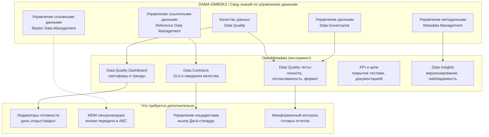
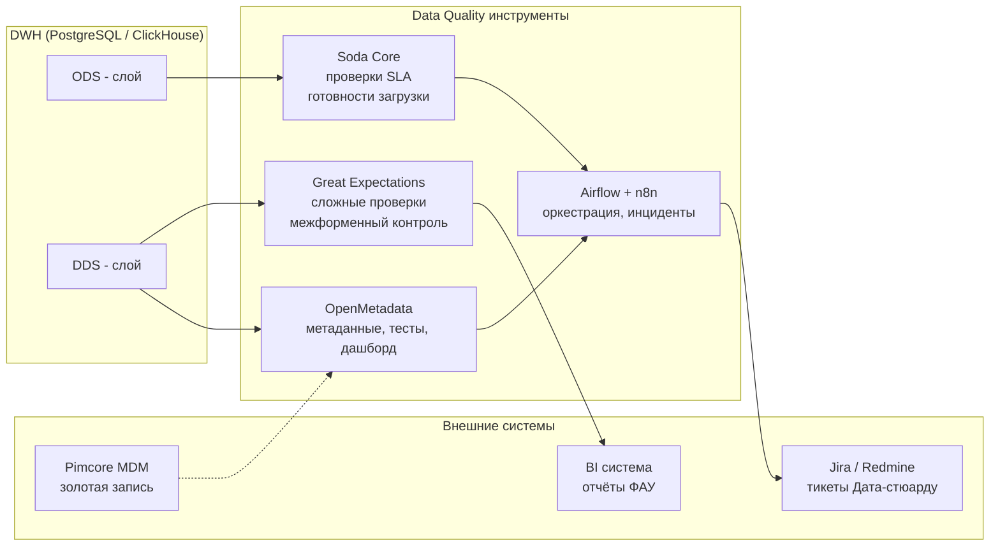

# 1 OpenMetadata
Распиши указанный сценарий в предположении, что "Качество данных" реализовано на инструменте  OpenMetaData. Если каких-то возможностей не хватает, то укажи каких и на каких инструментах OpenSource их можно реализовать (и интегрировать). 

Отличный вопрос. OpenMetadata действительно позволяет реализовать большинство проверок из сценария DM.DQ.C1, но с определёнными нюансами. Разберём подробно.

---

## Часть 1. OpenMetadata как инструмент для реализации сценария DM.DQ.C1

### 1.1 Общая характеристика OpenMetadata

OpenMetadata — это унифицированная платформа для обнаружения данных, наблюдаемости (observability) и управления данными . Ключевая особенность: она работает поверх DWH и BI, не заменяя их, а предоставляя единый слой управления.

Согласно **DAMA-DMBOK (2-е издание / DAMA-DMBOK2: Data Management Body of Knowledge)** — на русском «Свод знаний по управлению данными»  — OpenMetadata закрывает следующие области знаний (Knowledge Areas):
- **Качество данных (Data Quality)** — центральная функция платформы
- **Управление метаданными (Metadata Management)** — основа платформы
- **Управление основными данными (Master Data Management)** — частично, через прослеживаемость
- **Управление ссылочными данными (Reference Data Management)** — через глоссарий и теги

---

### 1.2 Возможности OpenMetadata для реализации каждой линии сценария

| Линия / Функция сценария DM.DQ.C1 | Возможность в OpenMetadata | Ограничения |
|-----------------------------------|----------------------------|-------------|
| **1-я линия: индикаторы готовности загрузки DWH** | Через Data Contracts — SLA раздел (Refresh frequency, Max latency)  | Нет встроенного «светофора дня открыт/закрыт». Требуется настройка кастомных метрик |
| **Переоткрытие дня и инвалидация отчётов** | Механизм версионирования данных через Data Insights | Нет автоматической инвалидации отчётов при переоткрытии |
| **2-я линия: полнота (Completeness) — «заполнение анкеты >90%»** | ✅ **Есть**. Dimensional Validation для тестов Not Null с группировкой по типу анкеты  | — |
| **2-я линия: согласованность (Consistency) — «данные клиента одинаковы в разных системах»** | Через Data Contracts — Quality Expectations, ссылающиеся на тест-кейсы  | Нет встроенной «золотой записи» и кнопок синхронизации (это задача MDM) |
| **2-я линия: проверка формата (буква О вместо 0)** | ✅ **Есть**. Тесты на Regex, допустимые значения (Allowed Values) | — |
| **Светофоры и дашборд** | ✅ **Есть**. Data Quality Dashboard с цветовой индикацией | Пороги (красный/жёлтый/зелёный) задаются в тест-кейсах |
| **Инциденты (вызов Дата-стюарда)** | ✅ **Есть**. Интеграция с ITSM через webhooks (в enterprise-версии частично) | В Open Source версии — ограниченный встроенный workflow |
| **3-я линия: межформенный контроль отчета** | ❌ **Нет**. OpenMetadata проверяет источники, а не сформированные BI-отчёты | Требуется дополнительный инструмент |

---

### 1.3 Диаграмма: OpenMetadata в контексте DAMA DMBOK



---

## Часть 2. Анализ возможностей: что OpenMetadata умеет, чего не умеет

### 2.1 Что OpenMetadata умеет хорошо

| Возможность | Как реализовать | Ссылка на DAMA DMBOK |
|-------------|----------------|----------------------|
| **Профилирование данных** | Автоматическое при ingestion | Data Quality — Data Profiling |
| **Измерение качества по измерениям (dimensions)** | Completeness, Accuracy, Consistency, Timeliness  | Data Quality — Data Quality Dimensions |
| **Группировка результатов по бизнес-измерениям** | Dimensional Validation — например, проверка качества по типу анкеты FATCA/CRS  | Data Quality — Root Cause Analysis |
| **Data Contracts** | Формализация SLA между Data Producer и Consumer  | Data Quality — Service Level Agreements for Data |
| **Дашборды и тренды** | Встроенные Data Quality Dashboard и исторические графики  | Data Quality — Monitoring and Reporting |
| **KPI по качеству** | Постановка целей по покрытию тестами, документации  | Data Governance — Metrics |

### 2.2 Чего не хватает в OpenSource-версии OpenMetadata

| Недостаток | Почему критично для сценария DM.DQ.C1 | Как обойти / дополнить |
|------------|---------------------------------------|------------------------|
| **Нет встроенных индикаторов «день открыт/закрыт»** | Первая линия обороны требует отслеживания статуса операционного дня | Использовать **Airflow** или **Prefect** с кастомным сенсором + отправкой статуса в OpenMetadata через API |
| **Ограниченный workflow инцидентов** | Дата-стюард не получает автоматический тикет при красном светофоре | Интегрировать с **Apache Airflow + Jira** (через webhook) или использовать **n8n** как оркестратор |
| **Нет MDM-функции «золотая запись» и кнопок синхронизации** | Проблема несогласованности CRM и АБС не решается внутри OpenMetadata | Внедрить **Open Source MDM** (например, **Pimcore MDM** или **Ataccama ONE Community**) и интегрировать через API |
| **Нет проверки готовых BI-отчётов (межформенный контроль)** | Третья линия обороны не реализована | Использовать **Great Expectations** или **Soda Core** для пост-процессинга отчётов  |
| **Пагинация дашборда (баг: отображает не более 10 пайплайнов)** | Проблема версии 1.6.3, в более новых версиях исправлена  | Обновить OpenMetadata до актуальной версии |

---

## Часть 3. Упрощённая схема реализации сценария DM.DQ.C1 на OpenSource-инструментах

### 3.1 Архитектура «микросервисов качества данных»



### 3.2 Упрощённый сценарий DM.DQ.C1 (адаптированный)

**Задача:** Сотрудник ФАУ банка готовит отчёт на основе данных DWH. Все инструменты OpenSource.

**1-я линия (готовность DWH):** Soda Core  проверяет, закрыт ли операционный день и загружены ли данные. Статус отправляется в OpenMetadata через API. ФАУ видит на дашборде OpenMetadata статус «День закрыт, данные загружены».

**2-я линия (качество источников):** OpenMetadata выполняет регулярные тесты :
- **Полнота анкет FATCA** — тест `column_values_to_be_not_null` с группировкой (dimensional validation) по типу анкеты.
- **Согласованность клиента** — кросс-табличный тест через Great Expectations  (OpenMetadata сам не умеет сравнивать записи между разными системами без кастомных скриптов).
- **Формат полей** — встроенные regex-тесты OpenMetadata.

Результаты — цветные индикаторы на дашборде.

**Инциденты:** При красном светофоре Airflow (DAG-триггер) создаёт задачу в Jira для Дата-стюарда.

**3-я линия:** После формирования отчёта Great Expectations запускает межформенный контроль (актив = пассив). Результат — дополнительный светофор.

---

## Часть 4. Что нужно доработать при выборе OpenMetadata

### 4.1 Обязательные дополнения

| Компонент | Инструмент | Что даёт |
|-----------|------------|----------|
| **Проверка готовности загрузки** | Soda Core + Airflow | Статус «день открыт/закрыт» |
| **Управление инцидентами** | n8n + Jira / Redmine | Автоматические тикеты Дата-стюарду |
| **MDM (золотая запись)** | Pimcore MDM или Ataccama ONE Community | Синхронизация данных между CRM и АБС |
| **Межформенный контроль отчётов** | Great Expectations  | 3-я линия обороны |

### 4.2 Настройка метрик и порогов

В OpenMetadata пороги (красный/жёлтый/зелёный) задаются через **Data Quality Test Cases**:

```yaml
# Пример конфигурации теста полноты
test_name: column_values_to_be_not_null
column: fatca_form_fields
params:
  threshold_green: 0.95      # >95% заполнено -> зелёный
  threshold_yellow: 0.70     # 70-95% -> жёлтый
  # <70% -> красный
dimension: fatca_form_type   # группировка по типу анкеты
```

---

## Часть 5. Расшифровка ролей с учётом OpenMetadata

| Роль | В OpenMetadata | Расширенное описание |
|------|----------------|----------------------|
| **Data Consumer (ФАУ)** | Просмотр Data Quality Dashboard | Видит светофоры, принимает решение. Не имеет прав на изменение тестов или данных. |
| **Data Steward** | Редактор тест-кейсов, владелец тестов | Создаёт и настраивает DQ-тесты в OpenMetadata, смотрит результаты, инициирует исправления . |
| **Data Owner** | Утверждает KPI и Data Contracts | Задаёт цели через Insights KPI . Подписывает SLA в Data Contracts . |
| **Data Engineer** | Администрирует OpenMetadata и пайплайны | Настраивает ingestion, коннекторы к DWH, интеграцию с Airflow и Great Expectations. |

---

## Итог: возможно ли реализовать DM.DQ.C1 на OpenMetadata?

**Да, возможно, но:**
1. **OpenMetadata не является самостоятельным решением.** Он выполняет функции централизованного управления метаданными, визуализации качества и оркестрации простых тестов .
2. **Требуются дополнения** для индикаторов готовности, MDM, инцидентов и межформенного контроля.
3. **Самый слабый элемент** — workflow инцидентов в Open Source версии.

**Рекомендуемая стратегия:** OpenMetadata как **фронтальная витрина** (дашборды, глоссарий, тест-кейсы), а реальные проверки и оркестрацию отдать специализированным OpenSource инструментам — Soda Core, Great Expectations, Airflow.
