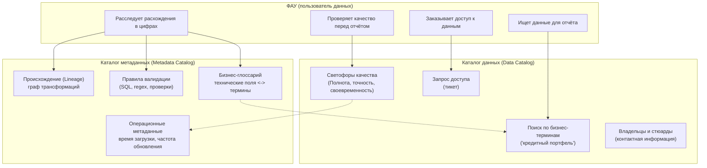

## 1

Вернемся к сценарию сценария DM.DQ.C1.  
Составь три схожих сценария, которые позволят показать "Качество данных для чайников" на примере практических кейсов. От совсем простого до более сложного. 
Также составь четвёртый и пятый сценарий взаимодействия пользователя данных (ФАУ) с Каталогом данных и Каталогом МетаДанных. 

Отличный запрос. Ниже представлена **линейка сценариев "Качество данных для чайников"** — от простейшего бытового до корпоративного, а затем два дополнительных сценария про **Каталог данных** и **Каталог метаданных**.

---

# Часть 1. Линейка сценариев DM.DQ от простого к сложному

## Сценарий DM.DQ.C0 (базовый, «бытовой»)

### Название: «Список покупок»

**Контекст:** Мама просит сына (12 лет) купить в магазине продукты. Данные — это список покупок.

**Сценарий:**

1. Мама пишет список от руки: «Молоко, хлеб, яйца, масло, помидоры».
2. Сын идёт в магазин. В магазине выясняется:
   - **Ошибка 1 (полнота [Completeness])** : Мама забыла указать «соль» — данных не хватает.
   - **Ошибка 2 (точность [Accuracy])** : Мама написала «масло», а не уточнила — сливочное или подсолнечное.
   - **Ошибка 3 (своевременность [Timeliness])** : Список составлен утром, а к вечеру помидоры в магазине закончились.
3. Сын звонит маме (создаёт **инцидент [Data Incident]** ), уточняет. Вместо 10 минут на покупки уходит 25.
4. Мама делает вывод: в следующий раз список должен быть структурированным — категории, единицы измерения, допустимая замена.

**Ссылка на DAMA DMBOK (англ/рус):** *Data Quality — Data Quality Dimensions / Качество данных — Измерения качества данных*

**Чему учит:** Качество данных измеряется по разным критериям (полнота, точность, своевременность), и дефекты данных создают потери времени.

---

## Сценарий DM.DQ.C2 (средний, «отчёт для руководителя»)

### Название: «Прогноз продаж, который не сбылся»

**Контекст:** Менеджер отдела продаж готовит отчёт по прогнозу выручки на квартал. Данные берутся из CRM-системы.

**Сценарий:**

1. Менеджер формирует отчёт «Прогноз по воронке продаж» в BI-системе.
2. Он видит зелёный светофор качества — система говорит «данные хорошие».
3. Но через неделю реальная выручка оказалась на 30% ниже прогноза.
4. Анализ причин:
   - **Устаревшие данные [Data Currency]** : Менеджеры не закрывали сделки, которые «зависли» 3 месяца.
   - **Проблема уникальности [Uniqueness]** : Один и тот же клиент в CRM повторялся 3 раза с разными суммами. Прогноз автоматически суммировал их все.
   - **Нет валидации [Validation]** : В поле «вероятность закрытия» менеджеры вводили 100% по умолчанию, даже для холодных контактов.
5. Менеджер обращается к **Дата-стюарду** . Тот настраивает:
   - Автоматическую проверку на дубликаты
   - Правило: «вероятность закрытия» не может быть 100% для сделок старше 60 дней
   - Светофор: красный, если >10% сделок в воронке старше 90 дней

**Ссылка на DAMA DMBOK:** *Data Quality — Root Cause Analysis and Improvement / Качество данных — Анализ корневых причин и улучшение*

**Чему учит:** Зелёный светофор не гарантирует бизнес-успех. Нужны правильные измерения и своевременность обновления.

---

## Сценарий DM.DQ.C3 (сложный, полноценный DM.DQ.C1 из начала)

### Название: «Банковский отчёт для регулятора»

**Контекст:** Сотрудник ФАУ банка готовит отчёт по требованиям ЦБ. Полный сценарий — см. в исходном описании DM.DQ.C1.

**Ключевые элементы, которые добавлены:**

| Элемент | Что показывает «чайнику» |
|---------|--------------------------|
| **Три линии обороны** | Качество контролируется не один раз, а на всех этапах: от загрузки до финального отчёта |
| **Светофоры как компромисс (TQM vs Lean)** | «Жёлтый» — это не плохо, это сознательный выбор между затратами на качество и бизнес-риском |
| **Data Contracts** | Договорённость между ФАУ (потребитель) и Владельцем данных (поставщик) о том, какое качество достаточно |
| **Инциденты и SLA** | Дата-стюард обязан исправить проблему не «когда-нибудь», а за регламентное время |

**Ссылка на DAMA DMBOK:** *Data Quality — Service Level Agreements for Data / Качество данных — Соглашения об уровне обслуживания для данных*

---

# Часть 2. Сценарии взаимодействия с Каталогом данных и Каталогом метаданных

## Сценарий DM.DQ.C4 (взаимодействие с Каталогом данных)

### 2.1 Что такое Каталог данных (Data Catalog) простыми словами

**Аналогия:** Это как картотека в библиотеке, но не для книг, а для наборов данных (таблиц, отчётов, файлов). В картотеке указано: где лежит книга (полка, ряд), кто автор, о чём книга. В каталоге данных — где лежат данные (база данных, схема, таблица), кто владелец, какое у них качество.

**Согласно DAMA DMBOK (англ/рус):** *Data Catalog относится к области Metadata Management / Управление метаданными, обеспечивая обнаружение данных (data discovery)*

### 2.2 Сценарий: «ФАУ ищет данные для нового отчёта»

**Контекст:** ФАУ банка получил задание от регулятора — срочно подготовить отчёт «Структура кредитного портфеля по отраслям». Данные есть, но где — неизвестно.

**Действия ФАУ в Каталоге данных:**

1. **Поиск:** ФАУ вводит в строку поиска каталога «кредитный портфель», «отрасль», «ОКВЭД».

2. **Результат поиска:** Каталог показывает 3 набора данных:
   - `dwh.loan.portfolio` (основной кредитный портфель)
   - `dwh.counterparty.industry` (справочник отраслей по клиентам)
   - `mdm.okved_reference` (эталонный справочник ОКВЭД)

3. **Просмотр метаданных (кратко):** ФАУ кликает на `dwh.loan.portfolio` и видит:
   - **Владелец данных:** Иванов И.И. (Кредитный департамент)
   - **Дата-стюард:** Петрова А.С.
   - **Качество (светофоры):** Полнота = 94% (зелёный), Точность = 87% (жёлтый), Обновление = сегодня 02:00
   - **Глоссарий:** Поле `loan_amount` — «Сумма выданного кредита в рублях»
   - **Профиль данных:** Минимум, максимум, среднее, нулевые значения

4. **Взаимосвязи (lineage):** ФАУ видит, откуда пришли эти данные (из АБС и CRM) и какие отчёты уже используют этот набор.

5. **Принятие решения:** Видя жёлтый светофор по точности, ФАУ решает использовать другой набор данных — `dwh.loan.verified`, где точность 99% (но обновляется раз в неделю). Компромисс между свежестью и точностью.

6. **Заказ доступа:** ФАУ нажимает кнопку «Запросить доступ» — в каталоге создаётся тикет для Владельца данных.

**Ссылка на DAMA DMBOK:** *Metadata Management — Data Catalog and Discovery / Управление метаданными — Каталог данных и обнаружение*

**Ключевые выводы для «чайника»:**

| Что даёт Каталог данных | Без каталога | С каталогом |
|------------------------|--------------|-------------|
| **Найти данные** | Спросить у 10 человек, написать 5 писем | Поиск за 10 секунд |
| **Понять качество** | Узнать после того, как отчёт уже сформирован | Увидеть до начала работы |
| **Узнать владельца** | Гадать или искать в org-структуре | Кликнуть и увидеть |
| **Проследить происхождение** | Смотреть код ETL (часы) | Графическая схема за 1 минуту |

---

## Сценарий DM.DQ.C5 (взаимодействие с Каталогом метаданных)

### 3.1 Что такое Каталог метаданных и чем отличается от Каталога данных

**Важное различие (частая путаница):**

| | Каталог данных (Data Catalog) | Каталог метаданных (Metadata Catalog) |
|--|------------------------------|----------------------------------------|
| **Что внутри** | Наборы данных (таблицы, файлы) + их бизнес-описание | Описание **структуры, связей, форматов** данных |
| **Для кого** | Бизнес-пользователи (ФАУ, аналитики) | Технические специалисты (разработчики, инженеры данных, дата-стюарды) |
| **Пример записи** | «Таблица `clients` содержит ФИО и паспорт, качество — зелёный» | «В таблице `clients` поле `passport` имеет тип STRING, маску ввода «1234 123456», внешний ключ к таблице `passport_types`» |
| **Поиск** | По бизнес-терминам («клиенты», «выручка», «отчёт») | По техническим именам, типам данных, схемам |

**Аналогия:** Каталог данных — это меню в ресторане с названиями блюд и ценами. Каталог метаданных — это рецепты: состав, граммовка, техпроцесс.

**Согласно DAMA DMBOK:** *Оба инструмента относятся к Metadata Management, но Data Catalog — это подмножество для бизнес-пользователей, а Metadata Catalog — полная техническая картина / Data Catalog is a subset for business users, Metadata Catalog is the complete technical picture*

### 3.2 Сценарий: «ФАУ не может понять, почему цифры в отчёте не сходятся»

**Контекст:** ФАУ подготовил отчёт по просроченной задолженности. Но сумма в отчёте не совпадает с суммой, которую дал другой аналитик. ФАУ идёт в Каталог метаданных (но обычно он идёт в тот же Data Catalog, но с расширенными техническими правами).

**Действия ФАУ в Каталоге метаданных:**

1. **Просмотр происхождения данных (Data Lineage):** ФАУ открывает таблицу `rep.overdue_report` и смотрит lineage:
   ```
   rep.overdue_report
      ↑ (SQL Join)
   dwh.loan.overdue — поле overdue_amount
      ↑ (ETL job #451)
   ods.abc.loan_table — поле loan_debt
   ```
2. **Обнаружение проблемы:** В метаданных видно, что поле `loan_debt` в слое ODS имеет **два разных определения** (две бизнес-термина привязаны к одному техническому полю):
   - Определение А (Кредитный департамент): «Основной долг без процентов»
   - Определение Б (Бухгалтерия): «Основной долг + просроченные проценты»

3. **Проверка правил валидации [Validation Rules]** : ФАУ смотрит в каталоге метаданных, какие правила применялись при ETL:
   ```sql
   -- Правило из метаданных
   CASE 
      WHEN loan_status = 'OVERDUE' THEN loan_amount * 1.1
      ELSE loan_amount
   END AS loan_debt
   ```
   Оказывается, инженер данных добавил коэффициент 1.1 для просрочки, но не задокументировал это в бизнес-глоссарии.

4. **Результат:** ФАУ создаёт инцидент Дата-стюарду с конкретной ссылкой на поле и правило. Дата-стюард исправляет либо правило, либо документацию.

**Ссылка на DAMA DMBOK:** *Metadata Management — Business Metadata, Technical Metadata, Operational Metadata / Управление метаданными — Бизнес-метаданные, технические метаданные, операционные метаданные*

### 3.3 Точки соприкосновения ФАУ с Каталогами



### 3.4 Что видит ФАУ, а что не видит (разграничение)

| Действие / вопрос ФАУ | Каталог данных | Каталог метаданных |
|-----------------------|----------------|---------------------|
| «Где лежит таблица с клиентами?» | ✅ Да (название, схема) | ✅ Да |
| «Какое у неё качество?» | ✅ Да (светофоры) | ❌ Нет (это не техническая метаинформация, а результат DQ) |
| «Какие поля в таблице?» | ✅ Да (список) | ✅ Да (плюс типы данных, длины) |
| «Какое поле откуда пришло?» | ❌ Только верхнеуровнево | ✅ Да (полный lineage до источника) |
| «Какой SQL-запрос её создал?» | ❌ Нет | ✅ Да |
| «Почему в поле `amount` могут быть отрицательные значения?» | ❌ Нет | ✅ Да (правило валидации или его отсутствие) |
| «Кто владелец данных?» | ✅ Да | ❌ Нет (это бизнес-роль, а не техническая) |

---

# Часть 3. Сводная таблица: пять сценариев одним взглядом

| Сценарий | Название | Ключевое понятие | Основной инструмент | Уровень сложности |
|----------|----------|-------------------|---------------------|-------------------|
| **DM.DQ.C0** | Список покупок | Измерения качества (полнота, точность, своевременность) | Бумага + ручка (аналогия) | ★☆☆☆☆ |
| **DM.DQ.C2** | Прогноз продаж | Светофор не гарантирует успех. Уникальность, валидация | CRM + BI | ★★☆☆☆ |
| **DM.DQ.C1** | Банковский отчёт | Три линии обороны, Data Contracts, SLA, инциденты | DWH + DQ-инструмент (OpenMetadata) | ★★★★☆ |
| **DM.DQ.C4** | Поиск данных для отчёта | Каталог данных (Data Catalog) | Data Catalog | ★★★☆☆ |
| **DM.DQ.C5** | Расхождение в цифрах | Каталог метаданных (происхождение, правила, глоссарий) | Metadata Catalog | ★★★★☆ |

---

## Итоговое резюме

**Для «чайника» главное запомнить:**

1. **Качество данных** — это не «хорошо/плохо», а соответствие ожиданиям. Те же данные могут быть качественными для одной задачи и некачественными для другой.

2. **Светофор** — это компромисс. Красный не всегда «всё пропало», а зелёный не всегда «можно спать спокойно».

3. **Каталог данных** — это витрина для бизнес-пользователя. Там ищут, смотрят качество, узнают владельца.

4. **Каталог метаданных** — это технический чертёж. Туда заглядывают, когда «что-то пошло не так», чтобы понять, как данные на самом деле преобразовывались.

5. **Идеальный инструмент** сочетает оба каталога + DQ + lineage. OpenMetadata пытается быть таким, но OpenSource-версия требует доработок (см. предыдущий ответ).
