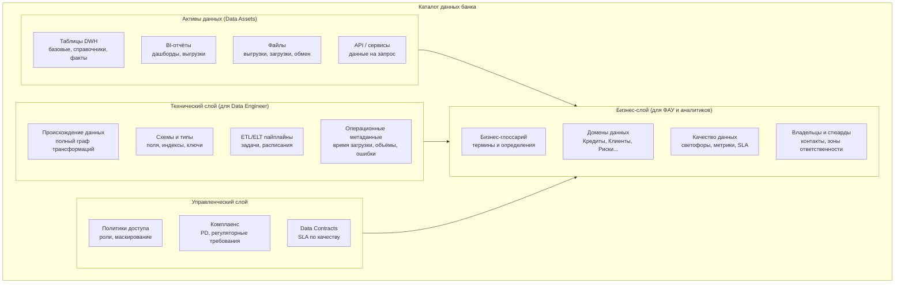
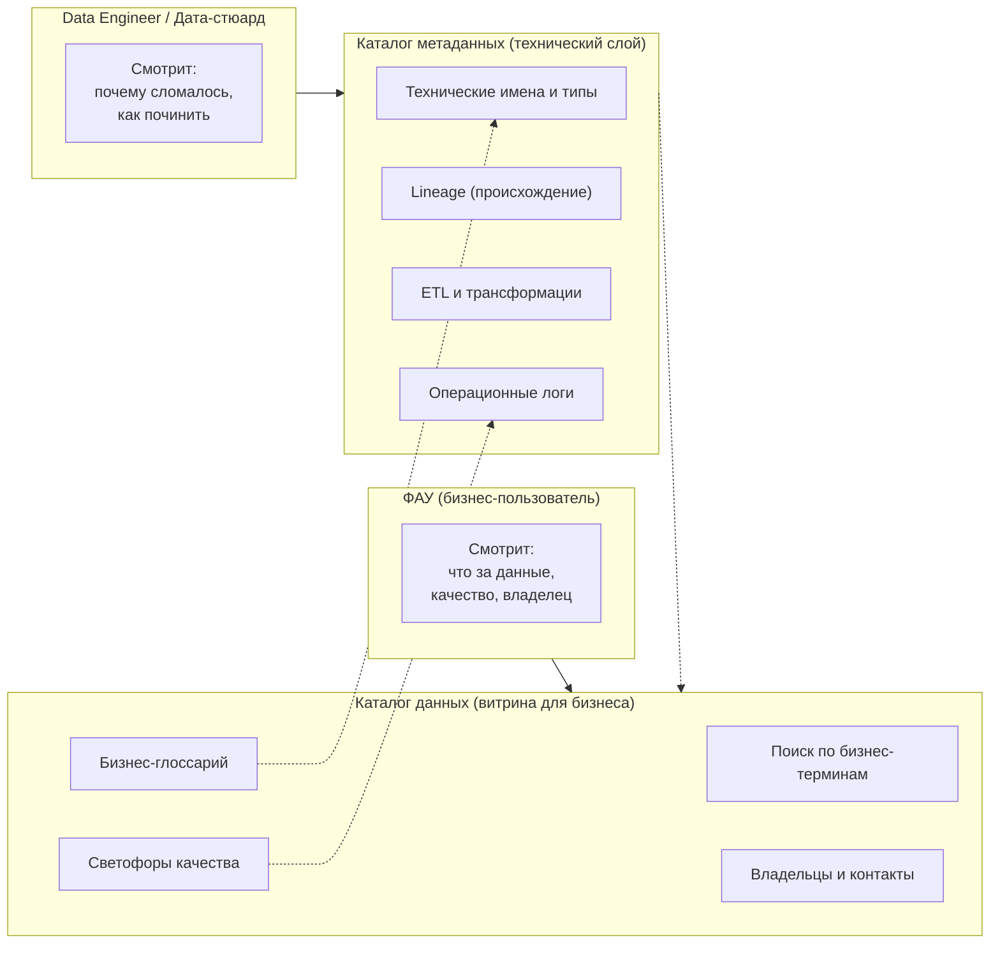

## 2

Возвращаемся к банковской тематике. Ниже представлена **структура Каталога данных банка** — как он устроен, из каких разделов состоит, как с ним работает ФАУ и другие роли.

---

# Часть 1. Структура Каталога данных банка

## 1.1 Что такое Каталог данных банка (Data Catalog) — определение

**Data Catalog (Каталог данных)** согласно **DAMA DMBOK2 (англ/рус)** — это *"централизованное хранилище метаданных, обеспечивающее обнаружение, понимание и доверие к данным" / "a centralized metadata repository enabling data discovery, understanding, and trust"*.

Для банка каталог данных — это **единая точка входа**, где любой сотрудник (от аналитика до риск-менеджера) может:
- Найти нужный набор данных (таблицу, отчёт, файл, витрину)
- Понять, что означают поля (бизнес-глоссарий)
- Оценить качество данных (светофоры, метрики)
- Узнать, кто владеет данными и к кому обращаться с вопросами
- Понять, откуда пришли данные (происхождение / lineage) и куда уходят

---

## 1.2 Высокоуровневая структура каталога (модель)



---

## 1.3 Детальная структура по разделам

### Раздел 1. Активы данных (Data Assets)

Это «что» хранится в каталоге — единицы учёта.

| Тип актива | Примеры в банке | Что содержит запись в каталоге |
|------------|----------------|-------------------------------|
| **Таблица DWH** | `dwh.loan.agreements`, `dwh.customer.fatca` | Название, схема, владелец, DQ-светофоры, частота обновления |
| **Справочник (Reference Data)** | `ref.currency_codes`, `ref.okved`, `ref.bank_branches` | Версионирование, дата начала/конца действия, источник истины |
| **Витрина данных (Data Mart)** | `mart.credit_risk.overdue`, `mart.reporting.101_form` | BI-назначение, дата последнего обновления, проверки качества |
| **BI-отчёт** | «Дашборд просрочки 90+», «Отчёт по FATCA» | Ответственный BI-разработчик, график обновления, пользователи |
| **API / сервис** | `api/get_client_profile`, `api/credit_score` | Формат ответа, лимиты, SLA по доступности |
| **Файловый обмен** | `/incoming/cbr/exchange_rates.xml` | Тип файла, маска имени, расписание загрузки |

**Ссылка на DAMA DMBOK:** *Data Storage and Operations / Хранение данных и операции*

---

### Раздел 2. Бизнес-слой (главный для ФАУ)

#### 2.1 Бизнес-глоссарий (Business Glossary)

Связывает технические имена с бизнес-смыслом.

| Бизнес-термин | Техническая реализация | Определение | Владелец термина |
|---------------|------------------------|-------------|------------------|
| **Клиент** | `dwh.customer.cust_id`, `mdm.customer.golden_id` | Физическое или юридическое лицо, имеющее хотя бы один продукт в банке | Руководитель CRM |
| **Просроченная задолженность** | `loan.overdue_amount` | Сумма основного долга и процентов, не оплаченная в срок >1 дня | Кредитный департамент |
| **Эффективная ставка** | `loan.effective_rate_calculated` | Ставка с учётом комиссий и страховок, метод расчёта #345 | Казначейство |
| **FATCA/CRS статус** | `customer.fatca_status` | Код участия клиента в американском/международном налоговом законодательстве | Комплаенс |

**Ссылка на DAMA DMBOK:** *Data Governance — Business Glossary / Управление данными — Бизнес-глоссарий*

#### 2.2 Домены данных (Data Domains)

Группировка активов по бизнес-областям банка.

```
Каталог данных банка
├── Кредитный домен
│   ├── Кредитные договоры
│   ├── Графики платежей
│   ├── Просрочка
│   └── Залоги
├── Клиентский домен (CRM / MDM)
│   ├── Физические лица
│   ├── Юридические лица
│   ├── Анкеты FATCA/CRS
│   └── Связи клиент-продукт
├── Финансовый домен (Главная книга)
│   ├── Баланс
│   ├── Отчёт о прибылях/убытках
│   ├── Резервы
│   └── Внутрибанковские обороты
├── Расчётный домен
│   ├── Транзакции
│   ├── Платежи
│   └── Остатки на счетах
├── Рисковый домен
│   ├── Кредитные рейтинги
│   ├── Лимиты
│   └── Стресс-тесты
└── Комплаенс и отчётность
    ├── Отчётность ЦБ (формы 101, 102, 123)
    ├── FATCA/CRS отчётность
    └── ПОД/ФТ (мониторинг)
```

**Ссылка на DAMA DMBOK:** *Data Governance — Data Domains / Управление данными — Домены данных*

#### 2.3 Качество данных (для бизнес-пользователя)

Что видит ФАУ в каталоге для каждого актива:

| Поле | Пример | Что означает |
|------|--------|--------------|
| **Общий статус** | 🟢 Зелёный | Все ключевые метрики в норме |
| **Полнота** | 94% (зелёный) | Заполнено 94% критических полей |
| **Точность** | 87% (жёлтый) | 87% записей прошли кросс-валидацию с системой-источником |
| **Своевременность** | 99% (зелёный) | 99% обновлений укладываются в SLA (D-1) |
| **Уникальность** | 0.2% дублей (зелёный) | Допустимо <1% |
| **Последняя проверка** | 2026-06-05 02:30 | Время последнего прогона DQ-тестов |
| **Дата следующих метрик** | 2026-06-06 02:30 | Регламентная проверка |

**Ссылка на DAMA DMBOK:** *Data Quality — Metrics and Scorecards / Качество данных — Метрики и оценочные карты*

#### 2.4 Владельцы и стюарды

Для каждого актива в каталоге указано:

| Роль | Кто это | Что видит ФАУ | Зачем ФАУ |
|------|---------|---------------|-----------|
| **Data Owner (Владелец данных)** | Руководитель бизнес-направления (например, Директор кредитного департамента) | Имя, должность, контактный email | Для стратегических вопросов: «почему у нас низкое качество?», «когда выделите бюджет?» |
| **Data Steward (Дата-стюард)** | Операционный специалист (например, старший аналитик кредитного отдела) | Имя, Telegram/Slack, номер внутреннего телефона | Для оперативных вопросов: «исправьте эту запись», «почему у клиента X паспорт не обновлён?» |
| **Technical Steward (Технический стюард)** | Инженер данных / ETL-разработчик | Имя, ссылка на сервисный деск | Для технических проблем: «не загрузилась таблица», «сломался парсер» |

**Ссылка на DAMA DMBOK:** *Data Governance — Roles and Responsibilities / Управление данными — Роли и обязанности*

---

### Раздел 3. Технический слой (для Data Engineer, не для ФАУ)

Кратко для понимания взаимосвязей:

| Компонент | Что содержит | Как связано с ФАУ |
|-----------|--------------|-------------------|
| **Линейдж (Lineage)** | Граф: `Источник (АБС) → ODS → DDS → Витрина → Отчёт` | Когда ФАУ видит несоответствие цифр, он может «спуститься» по lineage, чтобы найти источник расхождения |
| **Схема данных** | Типы полей, первичные/внешние ключи, индексы | ФАУ может проверить, почему в поле `amount` появились буквы (тип STRING вместо NUMERIC) |
| **ETL метаданные** | Какие джобы, в какое время, с какими ошибками | ФАУ видит «красный» по свежести и видит в метаданных: «ETL job не выполнен из-за ошибки» |
| **Операционная мета** | Объём записей, частота апдейтов, задержки | ФАУ оценивает, можно ли доверять данным как «свежим» |

**Ссылка на DAMA DMBOK:** *Metadata Management — Technical Metadata / Управление метаданными — Технические метаданные*

---

### Раздел 4. Управленческий слой (Governance)

| Компонент | Пример в банке | Для чего ФАУ |
|-----------|----------------|--------------|
| **Политики доступа** | «Данные по FATCA доступны только сотрудникам комплаенс с L3» | ФАУ видит, что доступ закрыт, и запрашивает его через каталог |
| **Data Contracts** | «Для отчёта 101: качество по просрочке — не ниже жёлтого, своевременность — D-1 к 08:00» | ФАУ знает, на что может рассчитывать |
| **Регуляторные метки** | Поле `passport_number` имеет тег «ПДн» (персональные данные) + «регуляторный риск» | ФАУ понимает, что с этими данными нужно работать осторожно |

**Ссылка на DAMA DMBOK:** *Data Governance — Policies and Rules / Управление данными — Политики и правила*

---

## 1.4 Как ФАУ работает с каталогом (типовые действия)

| Действие | Что ФАУ делает | Что видит / получает |
|----------|----------------|----------------------|
| **Поиск данных для нового отчёта** | Вводит «просрочка 90+» в поиск | Список таблиц, витрин, отчётов с этим термином |
| **Проверка качества перед формированием отчёта** | Кликает на таблицу, смотрит светофоры | Полнота 94% (зелёный), Точность 87% (жёлтый) → решает, использовать или искать другой источник |
| **Понять, что означает поле** | Наводит на поле `ovd_amount` | Всплывает бизнес-термин: «Просроченная задолженность — сумма платежей, не оплаченных в срок» |
| **Сообщить о проблеме** | Нажимает кнопку «Сообщить о проблеме с данными» | Создаётся тикет Дата-стюарду с автоматическим приложением — скриншотом данных и ссылкой на актив |
| **Запросить доступ** | Кликает «Запросить доступ к набору данных» | Форма с обоснованием, согласование с Data Owner |
| **Понять, почему цифры не сходятся** | Смотрит lineage актива | Граф: от каких источников зависит таблица, какие трансформации применялись |

---

# Часть 2. Взаимосвязь Каталога данных и Каталога метаданных в банке

## 2.1 Упрощённая схема



## 2.2 Пример: как метаданные «поднимаются» в каталог данных

| Техническая метаинформация (Метакаталог) | Преобразование | Что видит ФАУ (Каталог данных) |
|------------------------------------------|----------------|-------------------------------|
| `dwh.loan.overdue` — таблица, время последнего обновления 2026-06-05 02:00 | Расчёт свежести: 05.06.2026 02:00, сейчас 06.06.2026 10:00 = 32 часа | Светофор по свежести: 🟡 жёлтый (SLA D-1 нарушен, но данные есть) |
| В поле `cust_type` 15% значений NULL | Профилирование → метрика полноты | Полнота = 85% → 🟡 жёлтый |
| ETL job #451 упал вчера, рестарт через 30 минут | Операционные метаданные | Плашка: «Данные за вчера загружаются, ожидайте» |
| Поле `inn` имеет внешний ключ на `ref.inn_validator` | Техническая связь | Подсказка: «ИНН проверяется через справочник ФНС, обновление ежеквартально» |

---

# Часть 3. Практический пример: запись в каталоге данных банка

### Актив данных: `dwh.credit.overdue_daily`

```yaml
# Запись в Каталоге данных банка (как её видит ФАУ)

asset_name: "Ежедневный срез просроченной задолженности"
asset_type: "Таблица DWH"
domain: "Кредитный домен"
business_glossary_link: "/glossary/overdue_debt"

# Качество данных (светофоры)
quality:
  overall: "YELLOW"  # жёлтый
  metrics:
    completeness: { value: 94%, status: "GREEN", threshold_min: 90% }
    accuracy: { value: 87%, status: "YELLOW", threshold_min: 95% }
    timeliness: { value: 99%, status: "GREEN", threshold: D-1 }
    uniqueness: { value: 0.3%, status: "GREEN", threshold_max: 1% }
  last_check: "2026-06-05 02:30:00"
  next_check: "2026-06-06 02:30:00"

# Владельцы
owners:
  data_owner: "Иванов И.И., Директор кредитного департамента, i.ivanov@bank.ru"
  data_steward: "Петрова А.С., Старший аналитик, a.petrova@bank.ru, доб. 1234"
  technical_steward: "Сидоров В.П., Инженер данных, v.sidorov@bank.ru"

# Схема (только бизнес-поля для ФАУ)
fields:
  - name: "client_id"
    business_term: "Идентификатор клиента (золотая запись MDM)"
  - name: "overdue_amount"
    business_term: "Сумма просроченного основного долга (рубли, без процентов)"
  - name: "overdue_days"
    business_term: "Количество дней просрочки, считая с даты неисполненного платежа"

# Происхождение (краткий lineage для ФАУ)
lineage_summary:
  sources: ["АБС Кредитный модуль (таблица loan_repayments)", "CRM (статус клиента)"]
  last_updated: "2026-06-05 02:00:00"
  full_lineage_link: "/lineage/dwh.credit.overdue_daily"

# Доступ
access:
  policy: "Требуется L2 доступ + подписанное согласие на работу с ПДн"
  request_link: "/request-access/dwh.credit.overdue_daily"

# Контракт качества (SLA)
data_contract:
  consumer: "ФАУ, отчёт по просрочке для регулятора"
  agreed_quality: "Полнота не ниже 90%, точность не ниже 95%"
  current_status: "Точность 87% — НЕ СООТВЕТСТВУЕТ. Создан инцидент DQ-042"
```

---

# Итог

**Структура Каталога данных банка** строится на трёх уровнях:

| Уровень | Для кого | Основное содержимое |
|---------|----------|---------------------|
| **Бизнес-слой** | ФАУ, аналитики, риск-менеджеры | Поиск, светофоры качества, глоссарий, владельцы |
| **Технический слой** | Data Engineer, Дата-стюард | Lineage, схемы, ETL, операционные метаданные |
| **Управленческий слой** | Governance, комплаенс | Политики доступа, Data Contracts, регуляторные метки |

**Ключевая идея:** Каталог данных — это не просто «список таблиц». Это **активный инструмент**, где ФАУ:
- Принимает решение, доверять данным или нет (через светофоры)
- Понимает смысл данных (через глоссарий)
- Знает, к кому обратиться (через владельцев)
- Видит происхождение (через lineage)

**Ссылка на DAMA DMBOK (англ/рус):** *Data Management — Metadata Management / Управление данными — Управление метаданными, разделы "Data Catalog", "Business Glossary", "Data Lineage"*
