## 1

Ниже представлен **набор слайдов обучающего курса «Качество данных для Чайников»** на основе сценария DM.DQ.C1. Каждый слайд содержит:
- Простую картинку/схему в mermaid
- Фразу «для чайников» (жирным)
- Перевод на профессиональный язык DAMA DMBOK (курсивом)

---

## Слайд 1. Титульный слайд

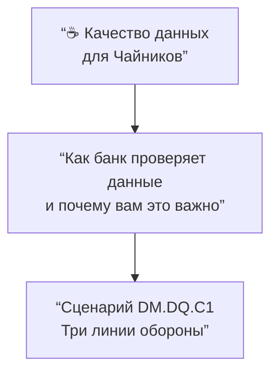

**«Для чайников»:** Вы думаете, данные в банке — это просто цифры в компьютере? А вот и нет. Их качество проверяют трижды, как в охране аэропорта.

**Проф-язык (DAMA DMBOK):** *Data Quality — это система контроля на всех этапах жизненного цикла данных: от операционной загрузки до бизнес-отчётности. В сценарии DM.DQ.C1 реализованы три линии обороны (Three Lines of Defense) для управления качеством данных.*

---

## Слайд 2. Что такое «Качество данных» — одна картинка

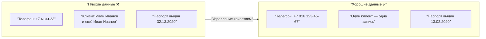

**«Для чайников»:** Хорошие данные — как хороший кофе: без посторонних примесей, в правильной чашке и вовремя.

**Проф-язык (DAMA DMBOK):** *Data Quality оценивается по шести измерениям: полнота (Completeness), точность (Accuracy), согласованность (Consistency), своевременность (Timeliness), уникальность (Uniqueness), валидность (Validity). В сценарии используются 4 из них.*

---

## Слайд 3. Три линии обороны — общая схема

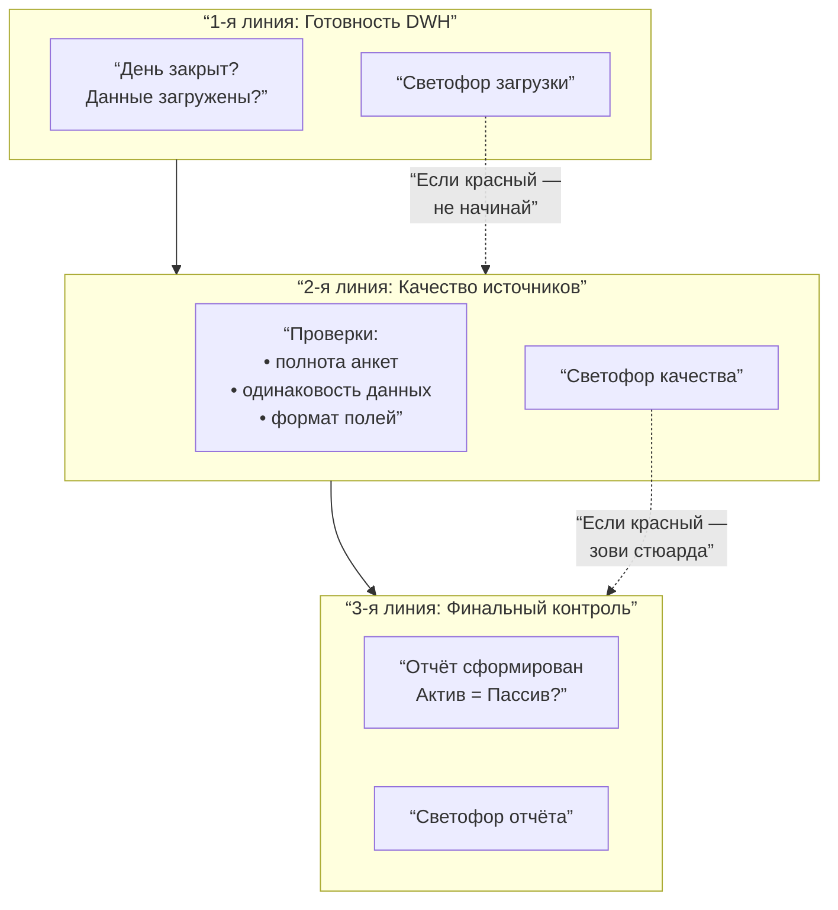

**«Для чайников»:** Представьте, что вы летите на самолёте. Сначала проверяют, готов ли самолёт (1-я линия), потом — багаж и документы (2-я линия), а перед вылетом — ещё раз всё вместе (3-я линия). С данными — то же самое.

**Проф-язык (DAMA DMBOK):** *В сценарии DM.DQ.C1 реализованы три уровня контроля: операционная готовность (Operational Readiness), соответствие требованиям качества (Data Conformance) и валидация бизнес-отчётности (Business Validation).*

---

## Слайд 4. Первая линия: Как узнать, что данные «свежие»?

### Светофор готовности хранилища (DWH)

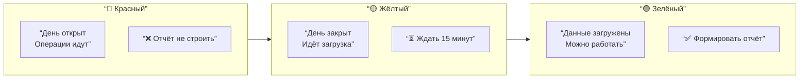

**«Для чайников»:** Представьте, что данные — это хлеб в пекарне. Пока тесто месят (красный) — рано. Пока пекут (жёлтый) — подождите. Когда испекли и остудили (зелёный) — можно брать.

**Проф-язык (DAMA DMBOK):** *Первая линия обороны реализует измерение своевременности (Timeliness) через мониторинг статусов ETL-пайплайнов и SLA загрузки данных в DWH. Красный = операционный день не закрыт, жёлтый = пост-процессинг, зелёный = данные ready для потребителей.*

---

## Слайд 5. Что такое светофор качества — легенда

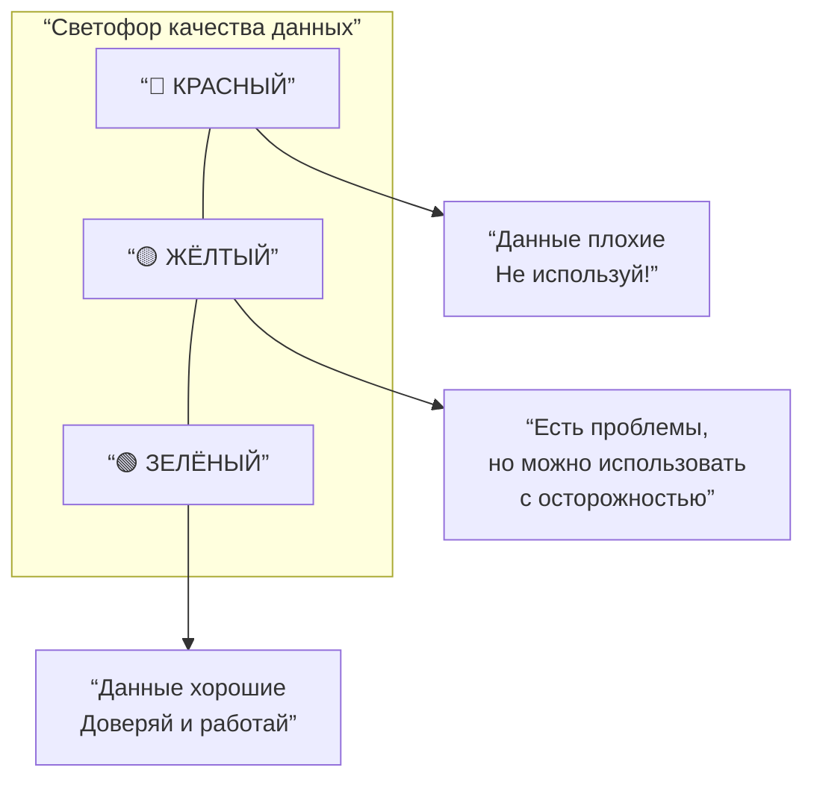

**«Для чайников»:** Светофор качества — это как индикатор заряда на телефоне. Красный — садись, не трогай. Жёлтый — ещё поработает, но скоро сядет. Зелёный — полный порядок.

**Проф-язык (DAMA DMBOK):** *Цветовая индикация (RAG — Red/Amber/Green) отражает пороговые значения ключевых показателей качества (Data Quality KPIs). Пороги устанавливаются как компромисс между потребителем данных (требует максимума) и владельцем данных (требует экономически обоснованного уровня).*

---

## Слайд 6. Вторая линия: Проверяем исходные данные (пример 1 — полнота анкеты)

### Проверка: насколько заполнена анкета клиента (FATCA/CRS)

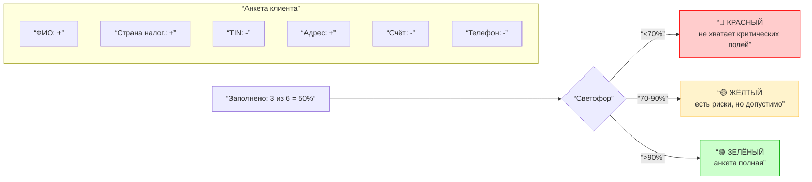

**«Для чайников»:** Это как экзамен. Если вы ответили на 70% вопросов — «троечка» (жёлтый), на 90% — «пятёрка» (зелёный). Банк сам решает, сколько полей в анкете должны быть заполнены, чтобы доверять клиенту.

**Проф-язык (DAMA DMBOK):** *Измерение полноты (Completeness) с группировкой по типу анкеты. Расчёт среднего процента заполненных атрибутов. Применяется измерение dimensional validation — качество оценивается не в целом, а в разрезах (по типу клиента, по продукту).*

---

## Слайд 7. Вторая линия: Проверяем исходные данные (пример 2 — одинаковость клиента)

### Согласованность данных: один клиент — разные данные в разных системах

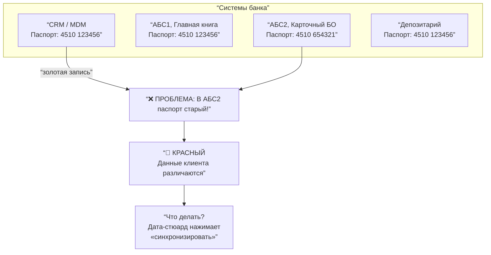

**«Для чайников»:** Клиент поменял паспорт. В одной системе данные обновили, в другой — забыли. Теперь банк не знает, какой паспорт настоящий. Это как если бы в паспортном столе и в поликлинике были разные ваши фамилии. Красный светофор — нужно срочно чинить.

**Проф-язык (DAMA DMBOK):** *Измерение согласованности (Consistency) и точности (Accuracy) данных между системами. Проблема возникает из-за нарушения синхронизации мастер-данных (MDM Synchronization Defect), когда «золотая запись» (Golden Record) не разослана во все потребительские системы. Решение — автоматизация MDM-пайплайнов или тикет Дата-стюарду.*

---

## Слайд 8. Вторая линия: Дата-стюард и инцидент

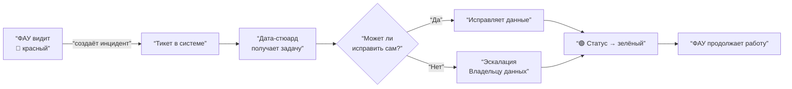

**«Для чайников»:** Вы увидели красный светофор. Не паникуйте. Нажмите «Сообщить» — и появится специальный человек (Дата-стюард). Он как аварийный комиссар: либо сам чинит, либо зовёт главного. А вы ждёте зелёный и спокойно работаете дальше.

**Проф-язык (DAMA DMBOK):** *Управление инцидентами качества данных (Data Quality Incident Management) по модели ITIL. Определены роли: Data Steward (оперативное исправление), Data Owner (стратегическое решение). SLA регламентирует время реакции (Response Time) и восстановления (Resolution Time).*

---

## Слайд 9. Третья линия: Финальная проверка отчёта

### Межформенный контроль: АКТИВ = ПАССИВ

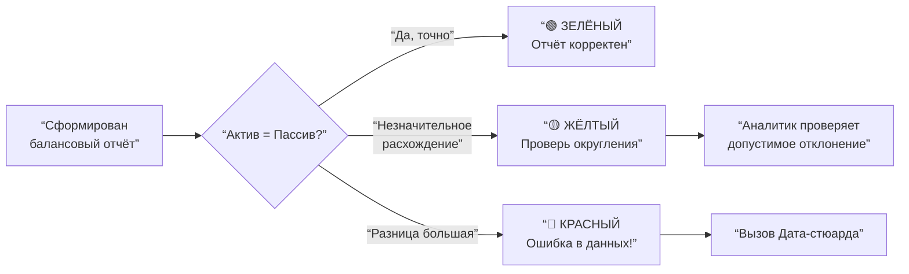

**«Для чайников»:** Вы собрали отчёт, всё зелёное. Но перед отправкой начальнику — ещё одна проверка. Как на кассе: чек сошёлся с деньгами в кошельке? Если да — зелёный. Если нет — красный, ищите ошибку.

**Проф-язык (DAMA DMBOK):** *Третья линия — бизнес-валидация (Business Validation) и межформенный контроль (Cross-form Validation). Проверяются агрегированные показатели на соответствие базовым законам предметной области (баланс, равенство дебета и кредита). Допустимые отклонения задаются в Data Quality Rules.*

---

## Слайд 10. Компромисс: почему зелёный не всегда 100%

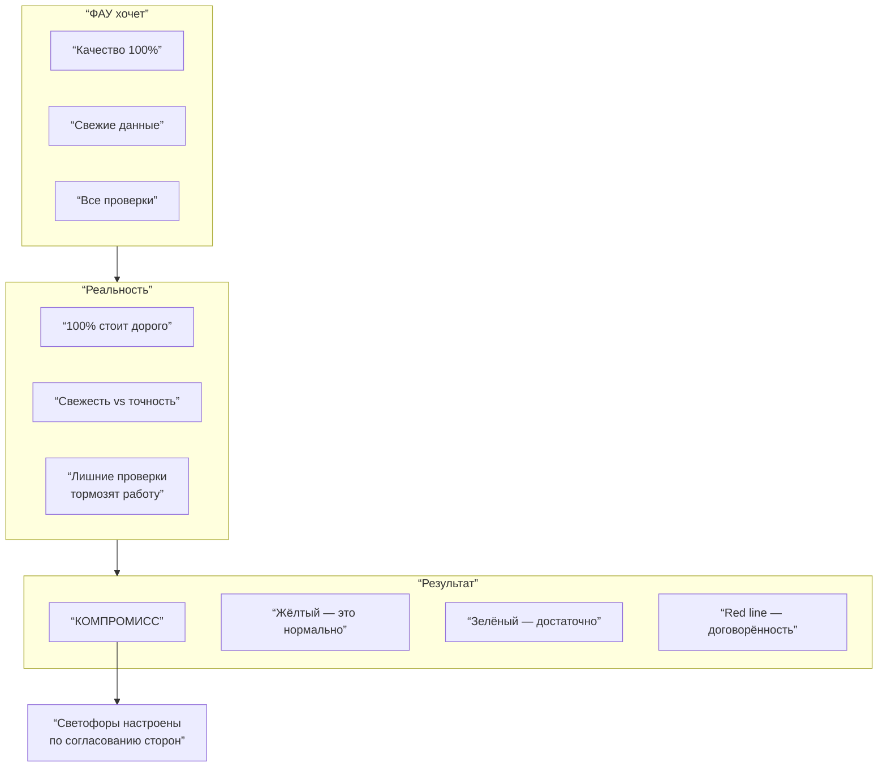

**«Для чайников»:** Вы хотите, чтобы всё было идеально? Но идеал стоит бешеных денег и времени. Банк выбирает «достаточно хорошо». Жёлтый светофор — не «плохо», а «мы договорились, что так можно». Как скорость на дороге: не 100% соблюдение, а разумные пределы.

**Проф-язык (DAMA DMBOK):** *Конфликт TQM (Total Quality Management — качество любой ценой) и Lean (бережливое качество — устранение избыточных потерь). Решение — Data Service Level Agreements (Data SLA) и Data Contracts, где заранее фиксируются приемлемые пороги качества для каждого типа отчёта и каждой роли потребителя.*

---

## Слайд 11. Итоговая схема «Три линии обороны» (полная версия)

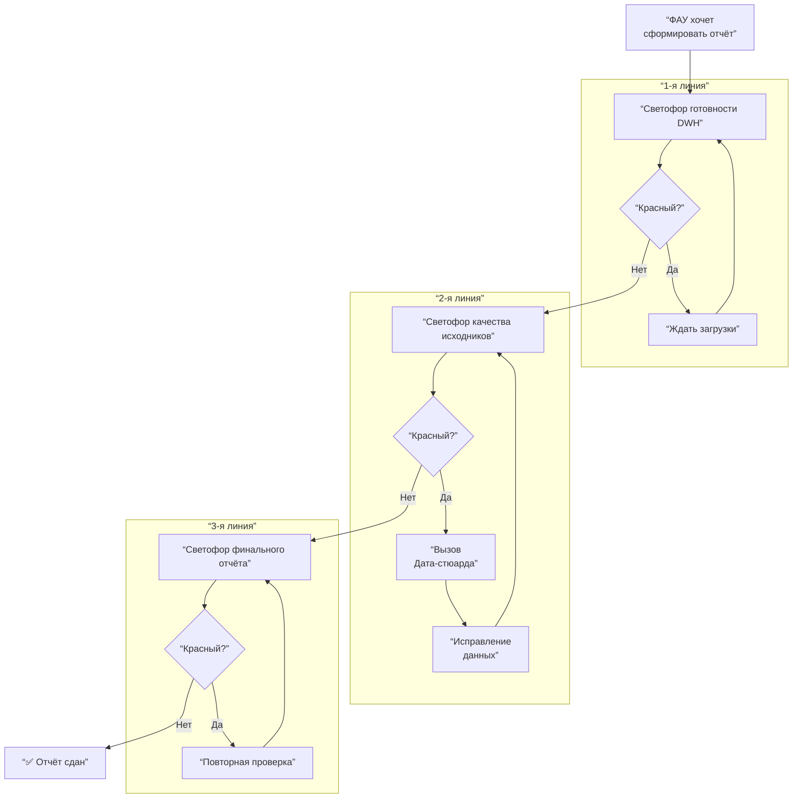

**«Для чайников»:** Это полный путь от идеи отчёта до его сдачи. Три светофора, две возможности остановиться и позвать на помощь, одна гарантия, что отчёт не уйдёт с ошибкой.

**Проф-язык (DAMA DMBOK):** *Сквозной процесс управления качеством данных (End-to-end Data Quality Process) с обратными связями и точками принятия решений (Decision Gates). Интегрирован с управлением инцидентами (Incident Management) и SLA.*

---

## Слайд 12. Резюме: зачем всё это банку?

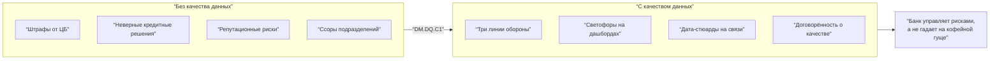

**«Для чайников»:** Банк без качества данных — это повар без рецепта. Что-то сварит, но вряд ли вы захотите это есть. А с качеством — всё прозрачно, надёжно и каждый знает, за какой светофор отвечает.

**Проф-язык (DAMA DMBOK):** *Data Quality — это не техническая прихоть, а инструмент управления операционными, репутационными и регуляторными рисками. Внедрение сценария DM.DQ.C1 позволяет снизить стоимость данных (Cost of Poor Data Quality, COPQ), повысить доверие (Trust in Data) и соответствовать требованиям ЦБ РФ и международных регуляторов.*

---

## Приложение. Справочная таблица: сценарий DM.DQ.C1 и DAMA DMBOK

| Что видит «чайник» | Проф-термин (DAMA DMBOK) | Раздел DAMA DMBOK |
|--------------------|--------------------------|-------------------|
| Светофор загрузки DWH | Operational Readiness, Timeliness | Data Storage and Operations |
| «День открыт/закрыт» | Batch Window Status | Data Warehouse Management |
| Красный светофор качества | Non-conformance / DQ Alert | Data Quality — Monitoring |
| Проверка заполнения анкеты | Completeness Measurement | Data Quality — Dimensions |
| Одинаковость клиента в системах | Cross-system Consistency, MDM Sync | MDM — Golden Record |
| Золотая запись | Golden Record, Source of Truth | MDM — Reconciliation |
| Дата-стюард чинит данные | Data Stewardship, DQ Incident Response | Data Governance — Roles |
| Жёлтый светофор | Acceptable Deviation / Tolerant Zone | Data Quality — Service Levels |
| Компромисс TQM vs Lean | Cost of Quality vs Cost of Poor Quality | Data Quality — Business Case |
| Межформенный контроль | Cross-form Validation, Reconciliation | Data Quality — Business Rules |

---

**Конец набора слайдов.** Курс рассчитан на 15–20 минут с разбором каждого слайда. Рекомендуется сопровождать реальными примерами из вашего банка и давать слушателям возможность «потыкать» светофоры в демо-стенде.

