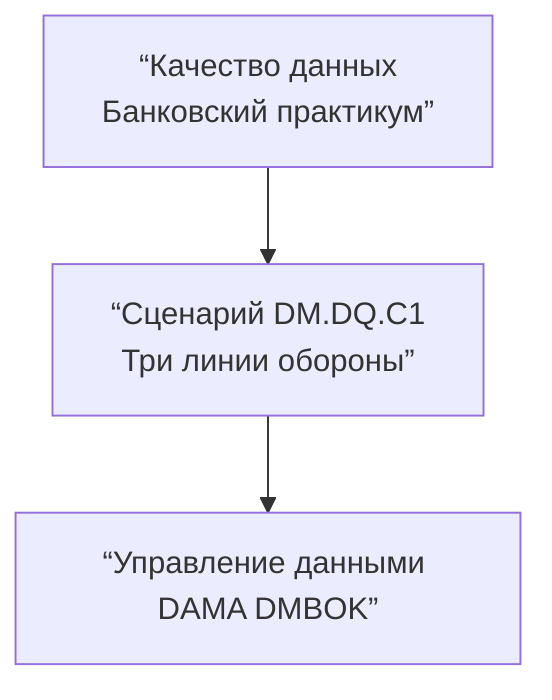
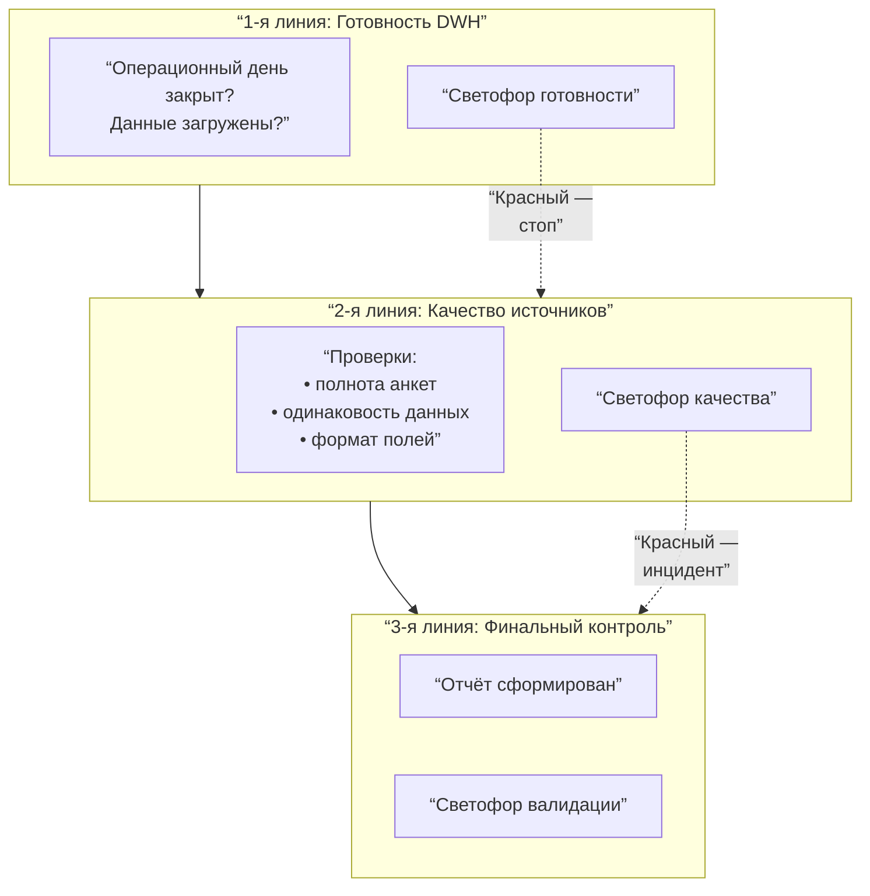
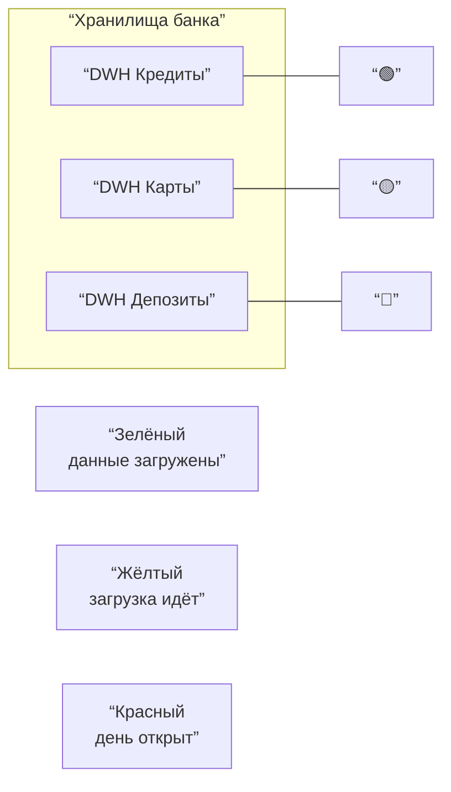
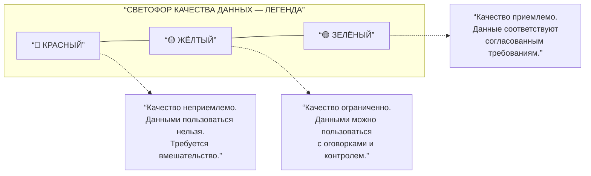
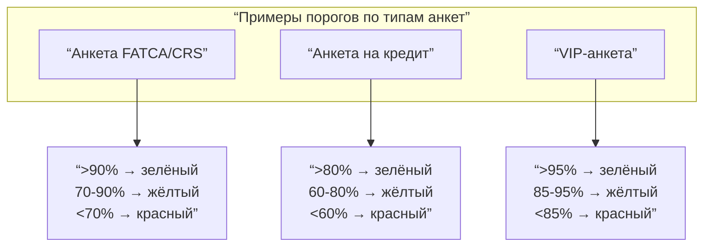
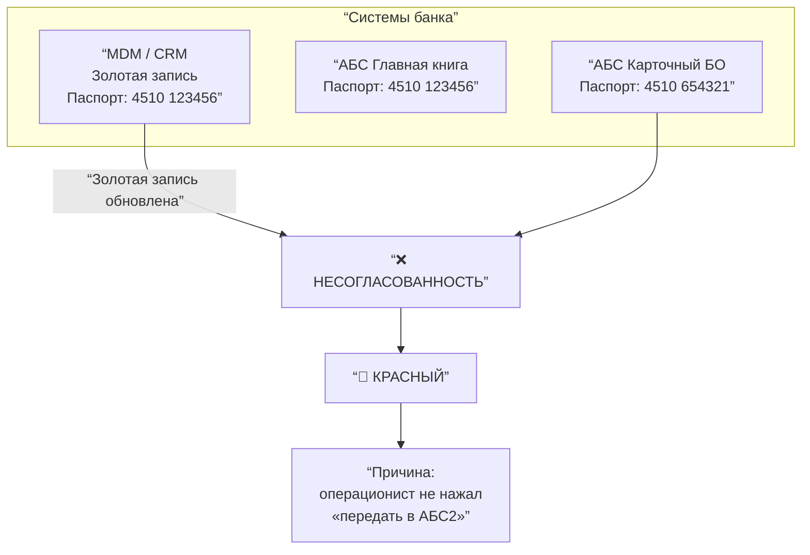
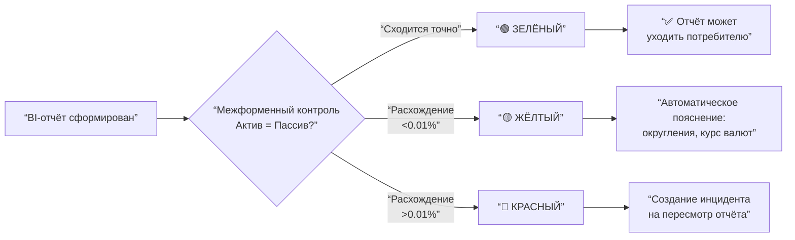
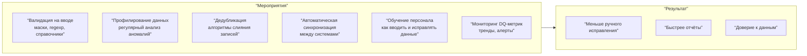
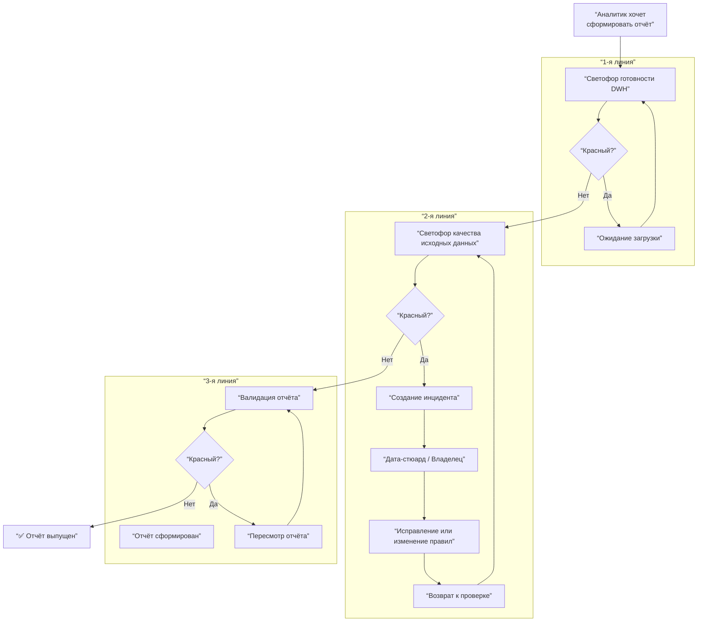
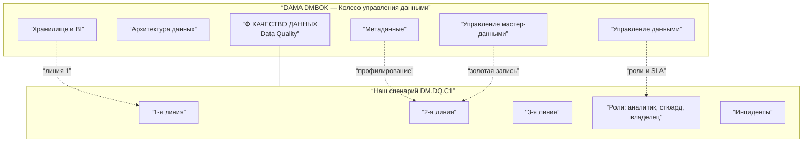

## v2

Принял все замечания. Ниже — **исправленная и дополненная версия курса** из 13 слайдов.

- «Для чайников» → два варианта: **«Банковский аналитик»** (простой) и **«Эксперт»** (продвинутый)
- Из DAMA-части убраны ссылки на ЦБ и регуляторов
- Добавлены примеры качественных/некачественных данных и мероприятий
- Светофоры выровнены и расположены вертикально
- Дата-стюард и эскалация — детализированы
- Добавлен слайд 13 с местом DQ в колесе DAMA

---

# Слайд 1. Титульный слайд



**Пояснение к рисунку:** Титульный слайд задаёт структуру курса: три линии контроля качества данных банка в терминах профессионального стандарта DAMA.

**Банковский аналитик:** Прежде чем вы сформируете любой отчёт в банке, данные проходят тройной контроль. Так банк защищает себя от ошибок.

**Эксперт:** Data Quality — это система последовательных проверок, которая встраивается в жизненный цикл данных от операционной загрузки до бизнес-отчётности.

---

# Слайд 2. Что такое качество данных — примеры

```mermaid
flowchart LR
    subgraph BAD [“❌ НЕКАЧЕСТВЕННЫЕ ДАННЫЕ”]
        B1[“Телефон: +7 ыыы-23<br>(формат нарушен)”]
        B2[“Клиент: Иван Иванов<br>Клиент: И. Иванов<br>Клиент: Ivanov I.<br>(три записи = один человек)”]
        B3[“Дата паспорта: 32.13.2020<br>(не существует)”]
        B4[“Остаток по кредиту: -5000₽<br>(минус — невозможен)”]
    end
    
    subgraph GOOD [“✅ КАЧЕСТВЕННЫЕ ДАННЫЕ”]
        G1[“Телефон: +7 916 123-45-67”]
        G2[“Один клиент = одна запись<br>с мастер-идентификатором”]
        G3[“Дата паспорта: 13.02.2020”]
        G4[“Остаток по кредиту: 5000₽”]
    end
    
    BAD -->|“Мероприятия:<br>валидация, дедубликация,<br>контроль форматов”| GOOD
```

**Пояснение к рисунку:** Слева — типичные дефекты данных в банке: неверный формат, дубликаты, невозможные значения. Справа — исправленные данные. Между ними — мероприятия по повышению качества.

**Банковский аналитик:** Некачественные данные — это когда вы звоните клиенту по телефону, а там «ыыы». Или когда один и тот же клиент — три разные записи. Банк тратит деньги на такие ошибки.

**Эксперт:** Ключевые мероприятия по повышению качества: валидация на вводе (маски ввода, regexp), дедубликация записей (алгоритмы нечёткого сравнения), контроль ссылочной целостности, автоматическая проверка допустимых диапазонов.

---

# Слайд 3. Три линии обороны — общая схема



**Пояснение:** Три последовательных барьера контроля. Каждый барьер имеет свой «светофор». Если на любом этапе загорается красный — процесс останавливается до устранения проблемы.

**Банковский аналитик:** Это как досмотр в аэропорту: сначала проверяют багаж, потом документы, потом сажают в самолёт. На каждом этапе могут завернуть.

**Эксперт:** Модель трёх линий обороны (Three Lines of Defense) адаптирована для управления качеством данных. Каждая линия отвечает за свой уровень зрелости: операционная готовность, соответствие правилам качества, бизнес-валидация.

---

# Слайд 4. Первая линия: готовность хранилища (вертикальный светофор)

### Рисунок 4А. Вертикальный светофор

```mermaid
flowchart TD
    subGRAPH SEMAPHORE [“🚦 СВЕТОФОР ГОТОВНОСТИ DWH”]
        RED[“🔴”]
        YELLOW[“🟡”]
        GREEN[“🟢”]
    end
    
    RED --- YELLOW --- GREEN
    
    RED_TEXT[“День открыт<br>Операции идут”]
    YELLOW_TEXT[“День закрыт<br>Идёт загрузка”]
    GREEN_TEXT[“Данные загружены<br>Можно работать”]
    
    RED -.-> RED_TEXT
    YELLOW -.-> YELLOW_TEXT
    GREEN -.-> GREEN_TEXT
```

**Пояснение:** Вертикальное расположение повторяет дорожный светофор. Красный сверху — стоп. Жёлтый — предупреждение. Зелёный снизу — разрешение.

**Банковский аналитик:** Красный — ещё нельзя строить отчёт, идёт операционный день. Жёлтый — потерпите 15–20 минут, данные загружаются. Зелёный — всё готово, нажимайте кнопку.

**Эксперт:** Измерение своевременности (Timeliness). Статусы определяются данными из оркестратора ETL. Красный соответствует открытому batch-окну, жёлтый — выполнению post-processing, зелёный — достижению целевого SLA (например, D-1 к 08:00).

### Рисунок 4Б. Альтернативная визуализация — индикаторы хранилищ



**Банковский аналитик:** У банка несколько хранилищ. У каждого — свой светофор. Вы смотрите на все и решаете, каким данным доверять.

**Эксперт:** Мульти-хранилищная среда требует отдельных индикаторов для каждого домена. Потребитель данных (аналитик) принимает решение на основе агрегированного статуса.

---

# Слайд 5. Что такое светофор качества — легенда (горизонтальное выравнивание)



**Пояснение:** Легенда задаёт единую шкалу интерпретации цветов. Все три цвета расположены горизонтально для удобства чтения.

**Банковский аналитик:** Красный — беги. Жёлтый — осторожно, проверяй. Зелёный — работай спокойно.

**Эксперт:** RAG (Red-Amber-Green) — стандарт индустрии для визуализации измерителей качества. Пороги определяются в Data Service Level Agreements (SLA). Красный означает нарушение критического порога (например, точность <90%), жёлтый — нахождение в зоне допустимых рисков, зелёный — соответствие целевому уровню.

---

# Слайд 6. Вторая линия: проверка полноты анкеты FATCA/CRS

### Рисунок 6А. Механизм расчёта

```mermaid
flowchart LR
    subgraph ANKETA [“Анкета клиента (FATCA/CRS)”]
        F1[“ФИО”]
        F2[“Страна налогового резидентства”]
        F3[“TIN (налоговый номер)”]
        F4[“Адрес”]
        F5[“Номер счёта”]
        F6[“Телефон”]
        F7[“Дата рождения”]
    end
    
    STATE[“Заполнено: 5 из 7 полей<br>= 71%”]
    RULE{“Правило:<br>зелёный >90%<br>жёлтый 70-90%<br>красный <70%”}
    
    ANKETA --> STATE --> RULE
    RULE --> RESULT[“🟡 ЖЁЛТЫЙ”]
```

**Пояснение:** Рассчитывается процент заполненных полей в анкете. Результат сравнивается с пороговыми значениями, заданными бизнесом.

**Банковский аналитик:** Чем больше полей заполнено, тем лучше банк знает клиента. Если заполнено мало — это риск. Если почти всё — зелёный свет.

**Эксперт:** Измерение полноты (Completeness) с группировкой по типу анкеты (dimensional validation). Расчёт среднего процента непустых значений по критическим полям.

### Рисунок 6Б. Примеры порогов для разных типов анкет



**Банковский аналитик:** Для разных продуктов — разные требования. VIP-клиента нужно знать досконально, а для простой кредитки достаточно базовых данных.

**Эксперт:** Data Quality Rules конфигурируются индивидуально для каждого типа данных (домена, продукта, класса клиента). Это отражает бизнес-приоритеты и готовность платить за качество.

---

# Слайд 7. Вторая линия: согласованность клиента в разных системах



**Пояснение:** Один и тот же клиент описывается по-разному в разных системах. Золотая запись в MDM — источник истины. Расхождение сигнализирует об ошибке синхронизации.

**Банковский аналитик:** Клиент поменял паспорт. В MDM обновили, в АБС1 тоже, а в карточный бэк-офис забыли отправить. Теперь у банка два паспорта на одного человека.

**Эксперт:** Согласованность (Consistency) между системами. Проблема классифицируется как дефект синхронизации мастер-данных (MDM Synchronization Defect). Источником истины является золотая запись (Golden Record). Мероприятия: автоматизация выгрузок из MDM во все потребительские системы, регулярная сверка, мониторинг неудачных синхронизаций.

---

# Слайд 8. Вторая линия: Дата-стюард и инцидент (детализированный)

### Рисунок 8А. Полная схема обработки инцидента

```mermaid
flowchart TD
    ANALYST[“Аналитик видит<br>🔴 красный”]
    ANALYST -->|“Нажимает<br>«Сообщить»”| TICKET[“Автоматический тикет<br>(система инцидентов)”]
    
    TICKET --> STEWARD[“Дата-стюард<br>принимает инцидент”]
    
    STEWARD --> DIAG{“Диагностика:<br>в чём причина?”}
    
    DIAG -->|“Ошибка в данных<br>(можно исправить)”| FIX_DIRECT[“Исправляет данные”]
    DIAG -->|“Проблема в процессе<br>или системы сломана”| ESCALATE[“Эскалация Владельцу данных”]
    
    FIX_DIRECT --> TEST1{“Данные исправлены?”}
    TEST1 -->|Да| STATUS_GREEN[“🟢 Статус зелёный”]
    TEST1 -->|Нет| FIX_DIRECT
    
    ESCALATE --> OWNER[“Владелец данных<br>принимает решение”]
    OWNER -->|“Утверждает исправление”| FIX_OWNER[“Техническая команда чинит”]
    OWNER -->|“Меняет порог качества”| CHANGE_RULE[“Корректирует правило<br>(новый жёлтый/зелёный)”]
    
    FIX_OWNER --> TEST2{“Исправлено?”}
    TEST2 -->|Да| STATUS_GREEN
    TEST2 -->|Нет| FIX_OWNER
    
    CHANGE_RULE --> STATUS_GREEN
    
    STATUS_GREEN --> ANALYST_NEXT[“Аналитик<br>продолжает работу”]
```

**Пояснение:** Детальная схема от момента обнаружения красного светофора до восстановления зелёного статуса. Показаны два пути: прямое исправление (Дата-стюардом) и эскалация (Владельцу данных). Зелёный статус наступает только после подтверждения исправления или изменения правил.

**Банковский аналитик:** Нажали «Сообщить» — пришёл Дата-стюард. Если проблема в одной записи — починил сам. Если системная — позвал начальника. Начальник либо велит чинить, либо меняет правило (например, жёлтый вместо красного). Только после этого вы видите зелёный и работаете дальше.

**Эксперт:** Data Quality Incident Management включает: регистрацию инцидента (в ITSM), диагностику, классификацию (Data Error vs Process Error vs System Error), назначение исполнителя (Data Steward или Data Owner), исправление, верификацию, закрытие. SLA: TTR (Time to Resolve) — для Data Steward, TTQ (Time to Qualify) — для эскалации.

### Рисунок 8Б. Роли и их зоны ответственности

```mermaid
flowchart LR
    subgraph ROLES [“Роли в инциденте”]
        ANALYST_R[“Аналитик<br>(инициатор)”]
        STEWARD_R[“Дата-стюард<br>(оператор)”]
        OWNER_R[“Владелец данных<br>(стратег)”]
    end
    
    subgraph ACTIONS [“Действия”]
        A1[“Обнаружить”]
        A2[“Исправить запись”]
        A3[“Исправить процесс”]
        A4[“Изменить порог”]
    end
    
    ANALYST_R --> A1
    STEWARD_R --> A2
    OWNER_R --> A3
    OWNER_R --> A4
```

**Банковский аналитик:** Аналитик — глаза. Дата-стюард — руки. Владелец данных — голова.

**Эксперт:** Распределение ответственности в соответствии с RACI-матрицей процесса Data Quality.

---

# Слайд 9. Третья линия: финальная проверка отчёта



**Пояснение:** После формирования отчёта запускаются дополнительные проверки, которые невозможно (или дорого) выполнять на уровне исходных данных — например, балансовые равенства, сравнение с прошлым периодом, бенчмаркинг.

**Банковский аналитик:** Даже если исходные данные зелёные, отчёт может «не сойтись». Это как чек: сумма товаров может совпадать с оплатой, а может и нет. Третья линия это проверяет.

**Эксперт:** Бизнес-валидация (Business Validation) отчёта. Примеры: кросс-форменный контроль (Cross-form Validation), динамический контроль (отклонение от предыдущего периода), контроль границ (outlier detection), бенчмаркинг (сравнение с внешним источником). Технически реализуется как отдельный слой DQ-тестов на витринах/отчётах.

---

# Слайд 10. Компромисс: почему зелёный не всегда 100%

```mermaid
flowchart TD
    subgraph BUSINESS [“Позиция аналитика (потребителя)”]
        B1[“Хочу 100% качество”]
        B2[“Все поля заполнены”]
        B3[“Все проверки включены”]
    end
    
    subgraph REALITY [“Реальность”]
        R1[“100% стоит денег<br>(контроль, доработка, ручной ввод)”]
        R2[“100% замедляет работу<br>(каждая проверка — время)”]
        R3[“Иногда 100% невозможно<br>(данные от внешних систем)”]
    end
    
    subgraph RESULT [“Компромисс”]
        C1[“Зелёный = достаточно<br>для данной задачи”]
        C2[“Жёлтый = допустимо,<br>но с контролем”]
        C3[“Красный = недопустимо”]
    end
    
    BUSINESS --> REALITY
    REALITY --> RESULT
```

**Пояснение:** Установка порогов светофора — это компромисс между желаемым качеством и затратами на его достижение.

**Банковский аналитик:** Вы хотите всё идеально? Это дорого и медленно. Банк выбирает разумный компромисс: для отчёта регулятору — строгие требования, для внутренней аналитики — мягче.

**Эксперт:** Data Quality измеряется не в абсолютных величинах, а в степени пригодности для использования (Fitness for Purpose). Пороги определяются в Data Service Level Agreements. Может быть несколько SLA для одного набора данных, но разных потребителей.

---

# Слайд 11. Дополнительные мероприятия по повышению качества данных



**Пояснение:** Качество данных не ограничивается контролем и исправлением. Оно обеспечивается целым комплексом проактивных и реактивных мероприятий.

**Банковский аналитик:** Чтобы реже видеть красный светофор, нужно не только чинить, но и предотвращать: научить людей правильно заполнять анкеты, настроить автоматическую проверку телефонов, исключить дубли при создании клиента.

**Эксперт:** DAMA DMBOK выделяет мероприятия на всех уровнях: операционные (валидация, очистка), аналитические (профилирование, корневой анализ), организационные (обучение, роли стюардов), технологические (автоматизация ETL, MDM).

---

# Слайд 12. Итоговая схема «Три линии обороны» (полная)



**Пояснение:** Сквозной процесс с обратными связями. Каждая линия может вернуть на предыдущий этап или инициировать внешнее исправление.

**Банковский аналитик:** Весь процесс от желания сделать отчёт до его выпуска. Если загорелся красный — не паникуйте, система подскажет, что делать, и вернёт вас на правильный путь.

**Эксперт:** End-to-end DQ process с точками принятия решений (decision gates) и интеграцией с управлением инцидентами. Петли обратной связи позволяют не терять контекст при исправлениях.

---

# Слайд 13. Место качества данных в управлении данными (колесо DAMA)



**Пояснение:** Качество данных — одно из 11 знаний DAMA DMBOK, но оно тесно связано с другими областями: метаданными (профилирование), MDM (золотая запись), хранилищем (линия 1), управлением данными (роли, политики, SLA).

**Банковский аналитик:** Качество данных — не «отдельная программа», а неотъемлемая часть всей работы с данными в банке. Оно опирается на архитектуру, метаданные, мастер-данные и управление.

**Эксперт:** Согласно DAMA-DMBOK2, Data Quality взаимодействует с:
- Metadata Management — для профилирования, правил валидации
- Master Data Management — для обеспечения согласованности золотой записи
- Data Warehousing & BI — для мониторинга готовности
- Data Governance — для определения ролей, политик, SLA

Сценарий DM.DQ.C1 демонстрирует эти взаимосвязи на практическом банковском примере.

---

# Сводная таблица мероприятий по каждому примеру

| Пример некачественных данных | Тип дефекта | Мероприятие по повышению качества |
|------------------------------|-------------|-----------------------------------|
| Телефон: +7 ыыы-23 | Нарушение формата | Валидация на вводе: регулярное выражение для телефона |
| Три записи одного клиента | Дубликат | Дедубликация при загрузке, алгоритмы нечёткого сравнения |
| Дата паспорта: 32.13.2020 | Невозможное значение | Проверка допустимых диапазонов дат |
| Остаток по кредиту: -5000 | Нарушение бизнес-правила | Ограничение: сумма не может быть отрицательной |
| Паспорт в АБС2 не обновлён | Несогласованность | Автоматическая рассылка из MDM во все системы |
| Анкета FATCA заполнена на 50% | Низкая полнота | Повышение требований к вводу, обязательные поля |

---

## Подготовка к выгрузке

Данный набор из 13 слайдов готов к конвертации в PowerPoint/Word через любой из способов, описанных ранее. Рекомендую **Pandoc + mermaid-filter** для автоматической сборки со всеми схемами.
