## v2

Ниже представлен **полный исправленный курс «Качество данных. Банковский практикум»** из 13 слайдов. Все диаграммы проверены на синтаксис mermaid, ошибки исправлены.

---

# ПОЛНЫЙ КУРС: КАЧЕСТВО ДАННЫХ. БАНКОВСКИЙ ПРАКТИКУМ

## Сценарий DM.DQ.C1 — Три линии обороны

---

## Слайд 1. Титульный слайд

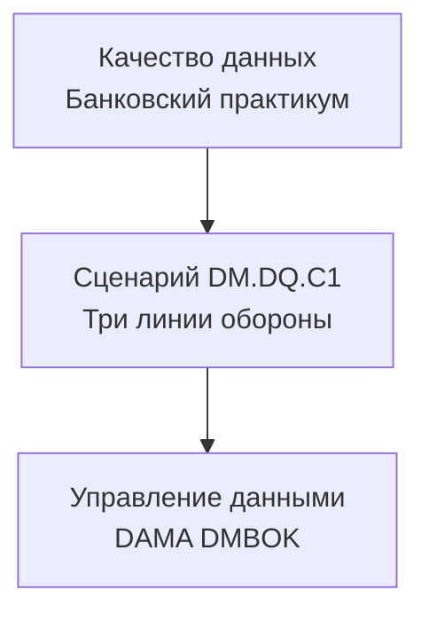

**Пояснение к рисунку:** Титульный слайд задаёт структуру курса: три линии контроля качества данных банка в терминах профессионального стандарта DAMA.

**Банковский аналитик:** Прежде чем вы сформируете любой отчёт в банке, данные проходят тройной контроль. Так банк защищает себя от ошибок.

**Эксперт:** Data Quality — это система последовательных проверок, которая встраивается в жизненный цикл данных от операционной загрузки до бизнес-отчётности.

---

## Слайд 2. Что такое качество данных — примеры

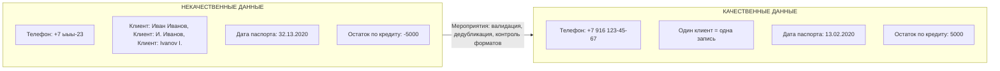

**Пояснение к рисунку:** Слева — типичные дефекты данных в банке: неверный формат, дубликаты, невозможные значения. Справа — исправленные данные. Между ними — мероприятия по повышению качества.

**Банковский аналитик:** Некачественные данные — это когда вы звоните клиенту по телефону, а там «ыыы». Или когда один и тот же клиент — три разные записи. Банк тратит деньги на такие ошибки.

**Эксперт:** Ключевые мероприятия по повышению качества: валидация на вводе (маски ввода, regexp), дедубликация записей (алгоритмы нечёткого сравнения), контроль ссылочной целостности, автоматическая проверка допустимых диапазонов.

---

## Слайд 3. Три линии обороны — общая схема

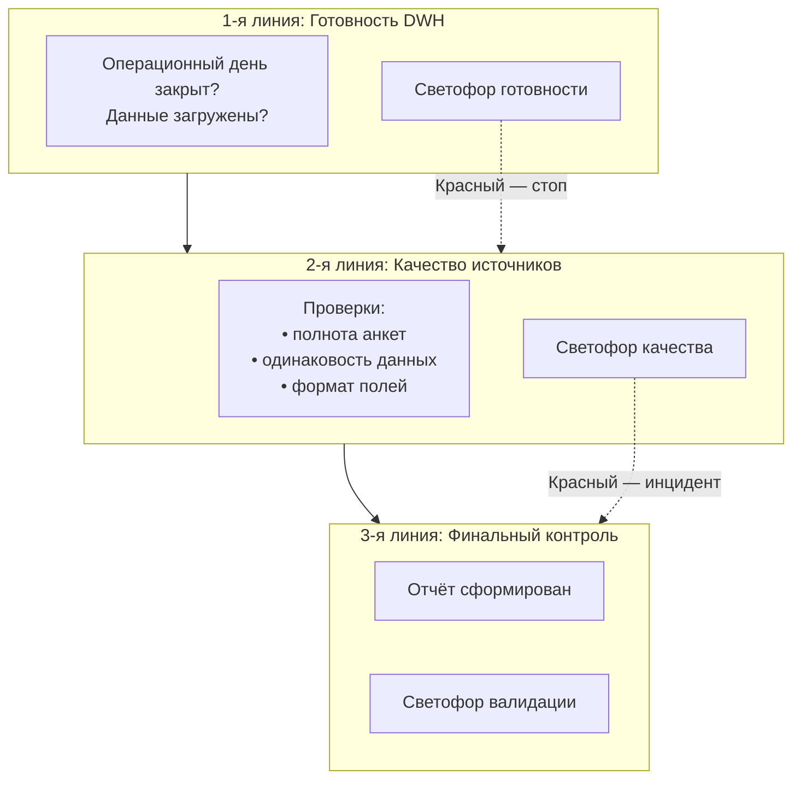

**Пояснение к рисунку:** Три последовательных барьера контроля. Каждый барьер имеет свой «светофор». Если на любом этапе загорается красный — процесс останавливается до устранения проблемы.

**Банковский аналитик:** Это как досмотр в аэропорту: сначала проверяют багаж, потом документы, потом сажают в самолёт. На каждом этапе могут завернуть.

**Эксперт:** Модель трёх линий обороны (Three Lines of Defense) адаптирована для управления качеством данных. Каждая линия отвечает за свой уровень зрелости: операционная готовность, соответствие правилам качества, бизнес-валидация.

---

## Слайд 4. Первая линия: готовность хранилища (вертикальный светофор)

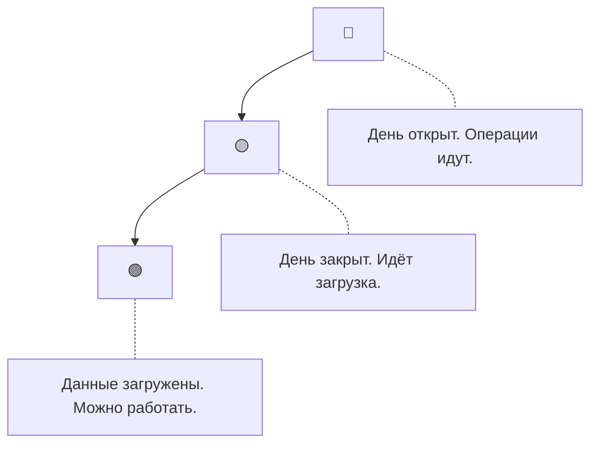

**Пояснение к рисунку:** Вертикальное расположение повторяет дорожный светофор. Красный сверху — стоп. Жёлтый — предупреждение. Зелёный снизу — разрешение.

**Банковский аналитик:** Красный — ещё нельзя строить отчёт, идёт операционный день. Жёлтый — потерпите 15–20 минут, данные загружаются. Зелёный — всё готово, нажимайте кнопку.

**Эксперт:** Измерение своевременности (Timeliness). Статусы определяются данными из оркестратора ETL. Красный соответствует открытому batch-окну, жёлтый — выполнению post-processing, зелёный — достижению целевого SLA.

---

## Слайд 5. Что такое светофор качества — легенда

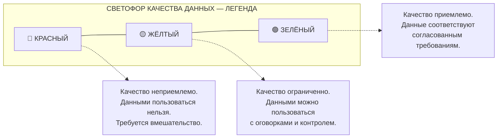

**Пояснение к рисунку:** Легенда задаёт единую шкалу интерпретации цветов. Все три цвета расположены горизонтально для удобства чтения.

**Банковский аналитик:** Красный — беги. Жёлтый — осторожно, проверяй. Зелёный — работай спокойно.

**Эксперт:** RAG (Red-Amber-Green) — стандарт индустрии для визуализации измерителей качества. Пороги определяются в Data Service Level Agreements (SLA).

---

## Слайд 6. Вторая линия: проверка полноты анкеты FATCA/CRS

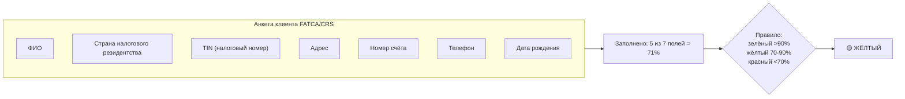

**Пояснение к рисунку:** Рассчитывается процент заполненных полей в анкете. Результат сравнивается с пороговыми значениями, заданными бизнесом.

**Банковский аналитик:** Чем больше полей заполнено, тем лучше банк знает клиента. Если заполнено мало — это риск. Если почти всё — зелёный свет.

**Эксперт:** Измерение полноты (Completeness) с группировкой по типу анкеты (dimensional validation). Расчёт среднего процента непустых значений по критическим полям.

---

## Слайд 7. Вторая линия: согласованность клиента в разных системах

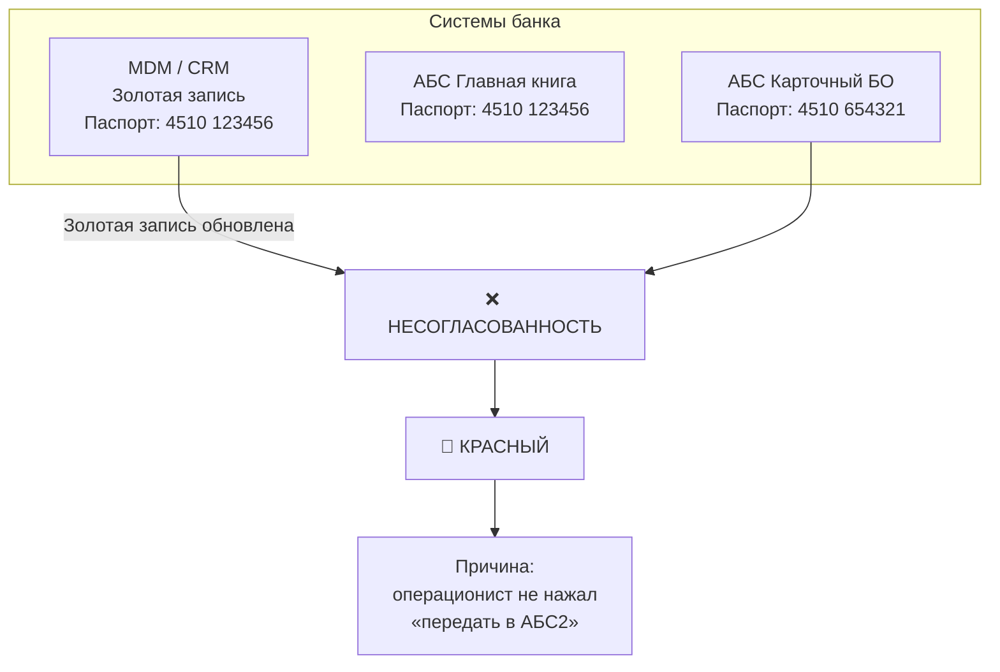

**Пояснение к рисунку:** Один и тот же клиент описывается по-разному в разных системах. Золотая запись в MDM — источник истины. Расхождение сигнализирует об ошибке синхронизации.

**Банковский аналитик:** Клиент поменял паспорт. В MDM обновили, в АБС1 тоже, а в карточный бэк-офис забыли отправить. Теперь у банка два паспорта на одного человека.

**Эксперт:** Согласованность (Consistency) между системами. Проблема классифицируется как дефект синхронизации мастер-данных (MDM Synchronization Defect). Мероприятия: автоматизация выгрузок из MDM во все потребительские системы.

---

## Слайд 8. Вторая линия: Дата-стюард и инцидент (детализированная схема)

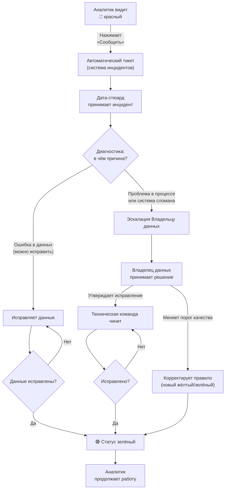

**Пояснение к рисунку:** Детальная схема от момента обнаружения красного светофора до восстановления зелёного статуса. Показаны два пути: прямое исправление (Дата-стюардом) и эскалация (Владельцу данных). Зелёный статус наступает только после подтверждения исправления или изменения правил.

**Банковский аналитик:** Нажали «Сообщить» — пришёл Дата-стюард. Если проблема в одной записи — починил сам. Если системная — позвал начальника. Начальник либо велит чинить, либо меняет правило. Только после этого вы видите зелёный.

**Эксперт:** Data Quality Incident Management включает: регистрацию инцидента, диагностику, классификацию, назначение исполнителя, исправление, верификацию, закрытие. SLA регламентирует время реакции и восстановления.

---

## Слайд 9. Третья линия: финальная проверка отчёта

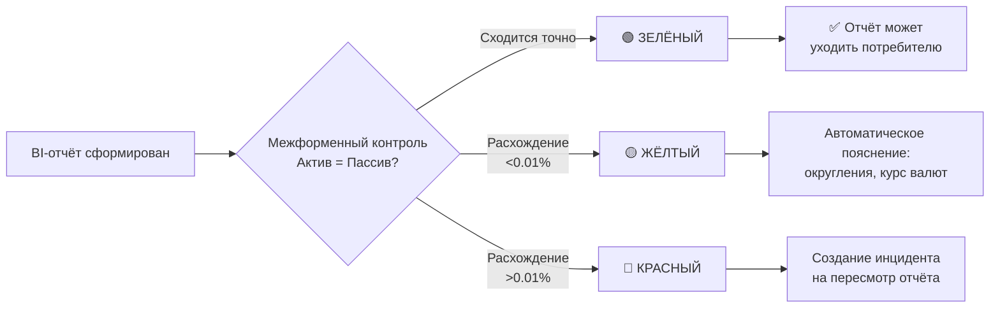

**Пояснение к рисунку:** После формирования отчёта запускаются дополнительные проверки, которые невозможно (или дорого) выполнять на уровне исходных данных — например, балансовые равенства.

**Банковский аналитик:** Даже если исходные данные зелёные, отчёт может «не сойтись». Это как чек: сумма товаров может совпадать с оплатой, а может и нет. Третья линия это проверяет.

**Эксперт:** Бизнес-валидация (Business Validation) отчёта. Примеры: кросс-форменный контроль, динамический контроль (отклонение от предыдущего периода), контроль границ.

---

## Слайд 10. Компромисс: почему зелёный не всегда 100%

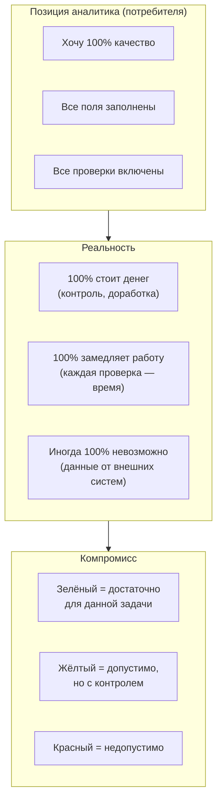

**Пояснение к рисунку:** Установка порогов светофора — это компромисс между желаемым качеством и затратами на его достижение.

**Банковский аналитик:** Вы хотите всё идеально? Это дорого и медленно. Банк выбирает разумный компромисс: для отчёта регулятору — строгие требования, для внутренней аналитики — мягче.

**Эксперт:** Data Quality измеряется не в абсолютных величинах, а в степени пригодности для использования (Fitness for Purpose). Пороги определяются в Data Service Level Agreements.

---

## Слайд 11. Дополнительные мероприятия по повышению качества данных

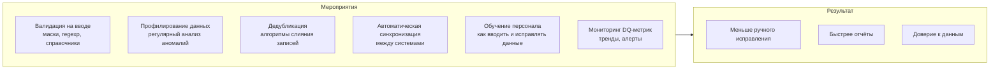

**Пояснение к рисунку:** Качество данных не ограничивается контролем и исправлением. Оно обеспечивается целым комплексом проактивных и реактивных мероприятий.

**Банковский аналитик:** Чтобы реже видеть красный светофор, нужно не только чинить, но и предотвращать: научить людей правильно заполнять анкеты, настроить автоматическую проверку телефонов.

**Эксперт:** DAMA DMBOK выделяет мероприятия на всех уровнях: операционные (валидация, очистка), аналитические (профилирование), организационные (обучение), технологические (автоматизация ETL, MDM).

---

## Слайд 12. Место качества данных в управлении данными (колесо DAMA)

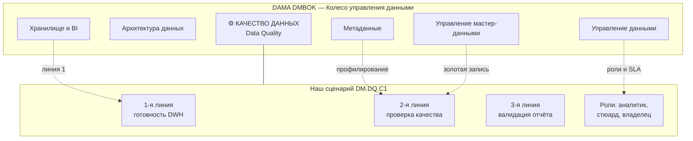

**Пояснение к рисунку:** Качество данных — одно из 11 знаний DAMA DMBOK, но оно тесно связано с другими областями: метаданными (профилирование), MDM (золотая запись), хранилищем (линия 1), управлением данными (роли, политики, SLA).

**Банковский аналитик:** Качество данных — не «отдельная программа», а неотъемлемая часть всей работы с данными в банке. Оно опирается на архитектуру, метаданные, мастер-данные и управление.

**Эксперт:** Согласно DAMA-DMBOK2, Data Quality взаимодействует с Metadata Management (профилирование), Master Data Management (согласованность), Data Warehousing (мониторинг готовности), Data Governance (роли и SLA).

---

## Слайд 13. Итоговая схема «Три линии обороны» (полная версия)

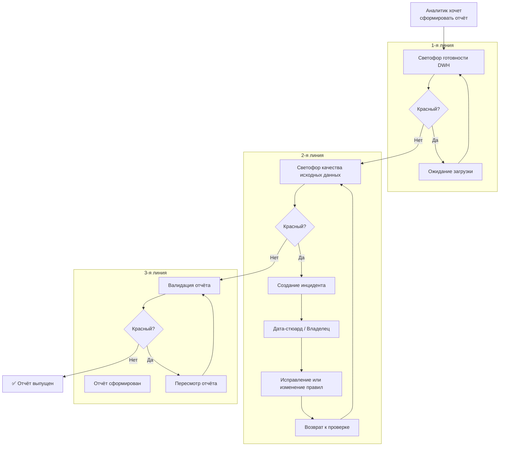

**Пояснение к рисунку:** Сквозной процесс с обратными связями. Каждая линия может вернуть на предыдущий этап или инициировать внешнее исправление.

**Банковский аналитик:** Весь процесс от желания сделать отчёт до его выпуска. Если загорелся красный — не паникуйте, система подскажет, что делать, и вернёт вас на правильный путь.

**Эксперт:** End-to-end DQ процесс с точками принятия решений (decision gates) и интеграцией с управлением инцидентами. Петли обратной связи позволяют не терять контекст при исправлениях.

---

# Приложение. Сводная таблица мероприятий

| Пример некачественных данных | Тип дефекта | Мероприятие по повышению качества |
|------------------------------|-------------|-----------------------------------|
| Телефон: +7 ыыы-23 | Нарушение формата | Валидация на вводе: регулярное выражение для телефона |
| Три записи одного клиента | Дубликат | Дедубликация при загрузке, алгоритмы нечёткого сравнения |
| Дата паспорта: 32.13.2020 | Невозможное значение | Проверка допустимых диапазонов дат |
| Остаток по кредиту: -5000 | Нарушение бизнес-правила | Ограничение: сумма не может быть отрицательной |
| Паспорт в АБС2 не обновлён | Несогласованность | Автоматическая рассылка из MDM во все системы |
| Анкета FATCA заполнена на 50% | Низкая полнота | Повышение требований к вводу, обязательные поля |

---

# Резюме (текстовое)

**Банковский аналитик:** Три линии обороны, три светофора, две точки остановки и одна гарантия, что отчёт не уйдёт с ошибкой.

**Эксперт:** Data Quality управляется через измерение, мониторинг, инциденты и SLA. Ключевой принцип: качество определяется пригодностью для конкретной задачи. Сценарий DM.DQ.C1 демонстрирует эти принципы на практическом банковском примере.

---

## Инструкция по сборке курса

1. Сохраните весь текст выше в файл `kurs_dq.md`
2. Установите Pandoc и mermaid-filter:
   ```bash
   npm install -g mermaid-filter
   pip install pandoc
   ```
3. Скомпилируйте в Word и PowerPoint:
   ```bash
   pandoc kurs_dq.md -o Kurs_DQ.docx --filter mermaid-filter
   pandoc kurs_dq.md -o Kurs_DQ.pptx --filter mermaid-filter
   ```

**Итоговый документ:** 13 слайдов с корректно отображаемыми mermaid-схемами.
