## v3
Кроме терминов и отсылок к DAMA дополнительно укажи отсылки к Data Quality Assessment Framework (DQAF). 

# КУРС (СЛАЙДЫ 1-13)

```markdown
---
title: "Качество данных. Банковский практикум"
author: "Департамент управления данными"
date: "2026-06-09"
---

# Слайд 1. Титульный слайд

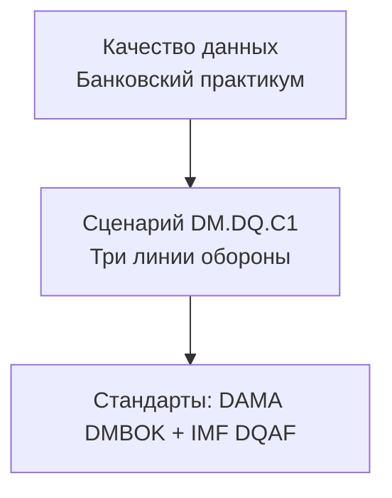

**Пояснение к рисунку:** Курс построен на пересечении двух мировых стандартов в области управления данными: DAMA DMBOK (глава 13 «Качество данных») и DQAF МВФ.

**Банковский аналитик (CRM/кредитование):** Представьте, что вы работаете в кредитном отделе. Ежедневно вы смотрите на досье клиента в CRM. От качества этих данных зависит, выдадите вы кредит или нет. Данные проходят тройной контроль.

**Эксперт (продвинутый уровень):** Data Quality — система последовательных проверок, встраиваемая в жизненный цикл данных от ODS до витрин данных.

---

# Слайд 2. Что такое качество данных — примеры из банковской практики

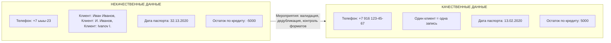

**Банковский аналитик (операционист CRM):** Вы вводите телефон клиента, но система позволяет сохранить «+7 ыыы-23». Кредитный конвейер не может дозвониться — заявка отклоняется.

**Эксперт (Data Steward):** DAMA DMBOK2, глава 13, раздел 1.3 — шесть измерений качества. DQAF, Dimension 3 «Accuracy and Reliability».

---

# Слайд 3. Три линии обороны — общая схема

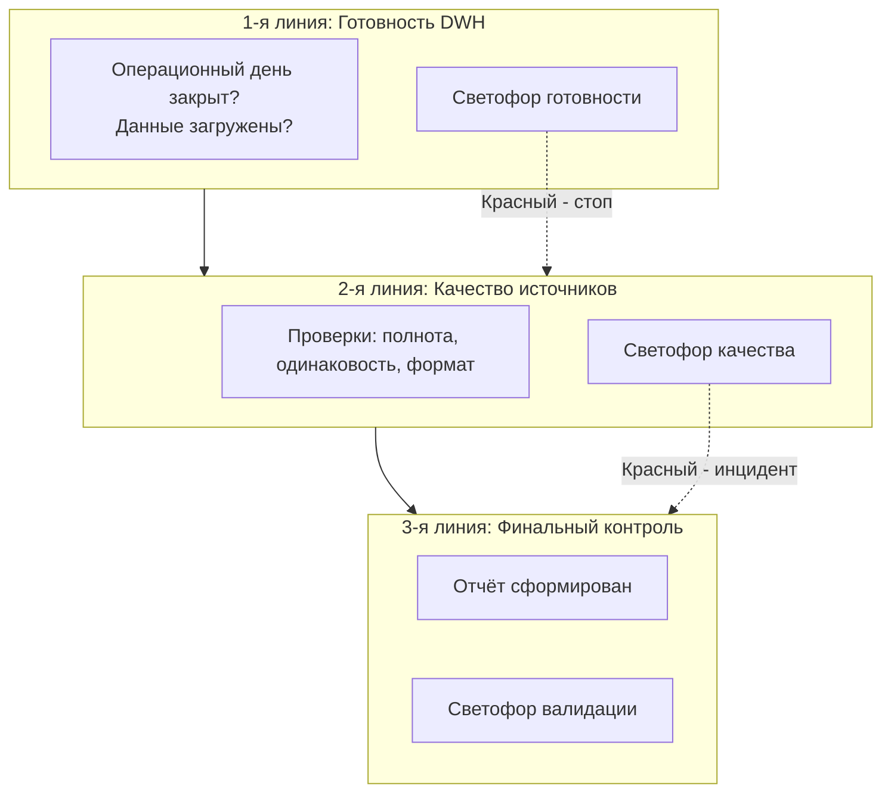

**Банковский аналитик (кредитный инспектор):** Это как согласование кредитной заявки. Сначала проверяют документы, потом — правильность заполнения, потом — условия кредитного комитета.

**Эксперт:** DAMA DMBOK2, глава 13, раздел 5.2 — Three Lines of Defense. DQAF, Dimension 4 «Serviceability».

---

# Слайд 4. Первая линия: вертикальный светофор

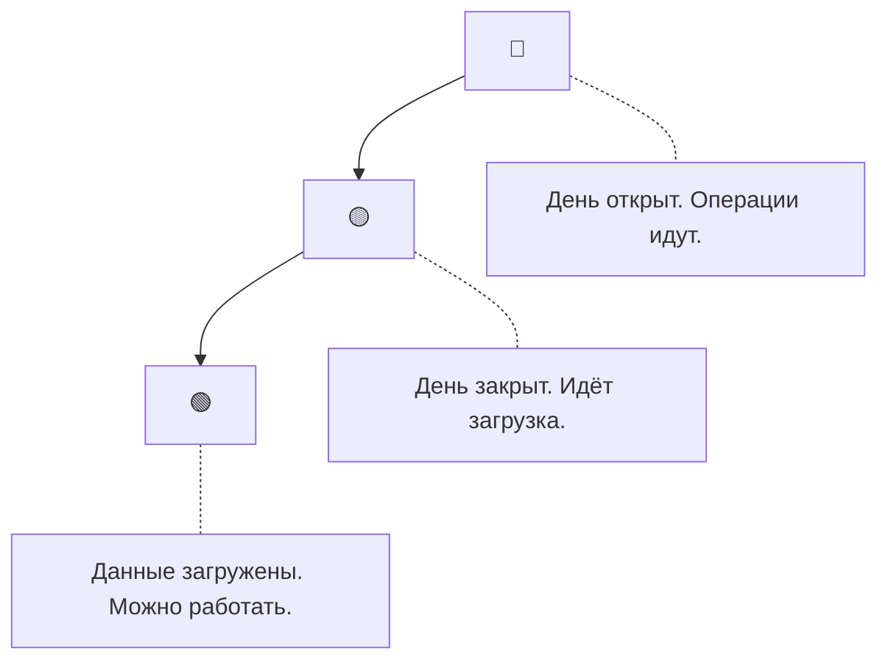

**Банковский аналитик (ФАУ):** В 9 утра красный — день не закрыт. В 10 жёлтый — загрузка идёт. В 10:30 зелёный — можно формировать отчёт.

**Эксперт (инженер DWH):** DAMA DMBOK2, глава 13 — Timeliness. DQAF, Dimension 4.1 «Periodicity and timeliness».

---

# Слайд 5. Что такое светофор качества — легенда

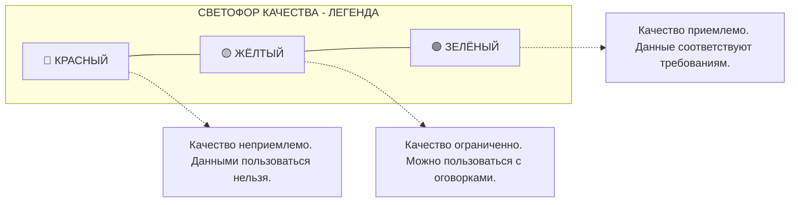

**Банковский аналитик (кредитный инспектор):** Красный — заявка на стоп-лист. Жёлтый — запросить дополнительные документы. Зелёный — отправить на одобрение.

**Эксперт:** DQAF, Dimension 0.3 «Relevance» — качество относительно потребностей пользователя.

---

# Слайд 6. Вторая линия: проверка полноты анкеты

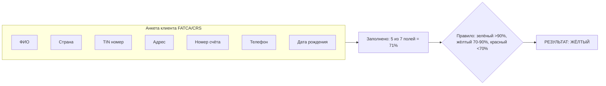

**Банковский аналитик (комплаенс):** Анкета FATCA заполнена на 86% — не хватает TIN. Светофор жёлтый. Без TIN банк не может отчитаться перед регулятором.

**Эксперт:** DAMA DMBOK2, глава 13 — Completeness. DQAF, Dimension 3.1 «Source data».

---

# Слайд 7. Вторая линия: согласованность клиента

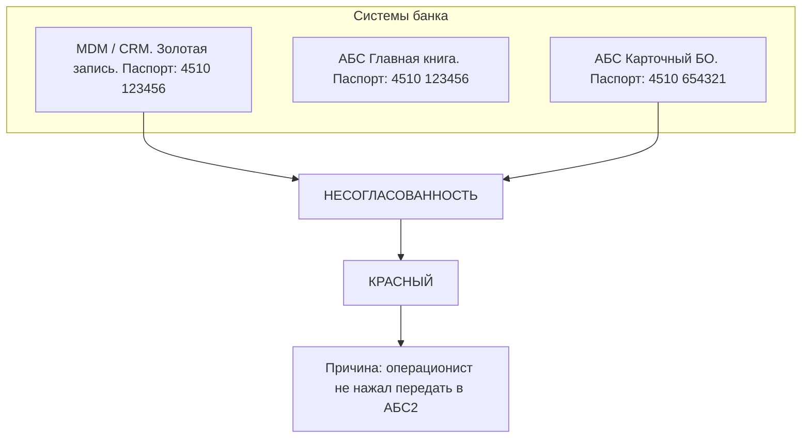

**Банковский аналитик (операционист MDM):** Клиент поменял паспорт. В MDM обновили, в АБС2 забыли. Теперь в карточной системе старый паспорт — клиент не может снять деньги.

**Эксперт:** DAMA DMBOK2, глава 13 — Consistency. DQAF, Dimension 3.2 «Assessment of source data», Dimension 4.2 «Consistency».

---

# Слайд 8. Вторая линия: Дата-стюард и инцидент

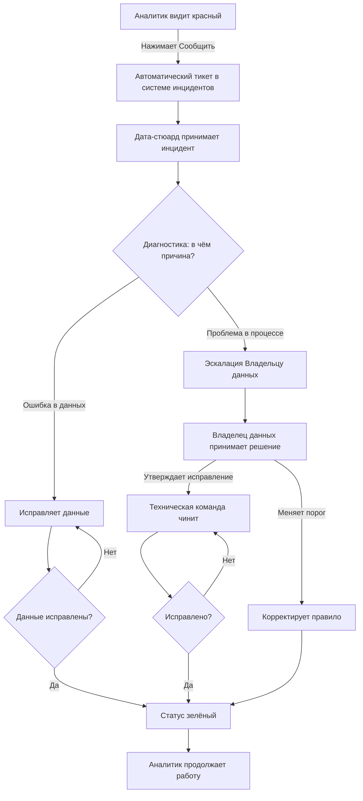

**Банковский аналитик (кредитный инспектор):** Нажали «Сообщить» — пришёл Дата-стюард. Если проблема в одной записи — починил сам. Если системная — позвал начальника.

**Эксперт:** DAMA DMBOK2, глава 13, раздел 2.7 — Data Quality Operations. DQAF, Dimension 0.4 «Other quality management».

---

# Слайд 9. Третья линия: финальная проверка отчёта

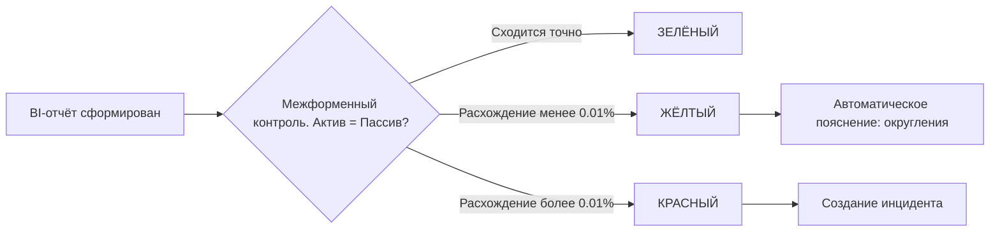

**Банковский аналитик (ФАУ):** Вы сформировали отчёт по форме 101. Актив сошёлся с пассивом — зелёный, можно отправлять в ЦБ.

**Эксперт:** DQAF, Dimension 3.4 «Assessment and validation of intermediate data and statistical outputs».

---

# Слайд 10. Компромисс: почему зелёный не всегда 100%

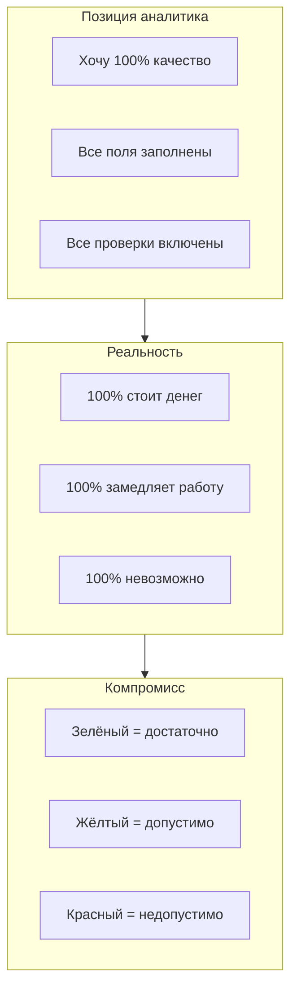

**Банковский аналитик (руководитель кредитного конвейера):** Если проверять каждое из 100 полей, выдача кредита займёт 5 минут. При 200 заявках — 16 часов. Невозможно.

**Эксперт:** DAMA DMBOK2, глава 13 — Fitness for Purpose. DQAF, Dimension 0.3 «Relevance».

---

# Слайд 11. Мероприятия по повышению качества данных

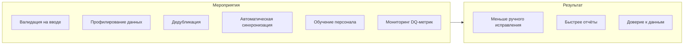

**Банковский аналитик:** Только контролем проблему не решить. Нужно настроить валидацию в CRM, запустить профилирование, автоматизировать MDM.

**Эксперт:** DAMA DMBOK2, глава 13, раздел 4 — Techniques. DQAF, Dimension 3.2.

---

# Слайд 12. Место DQ в DAMA и DQAF

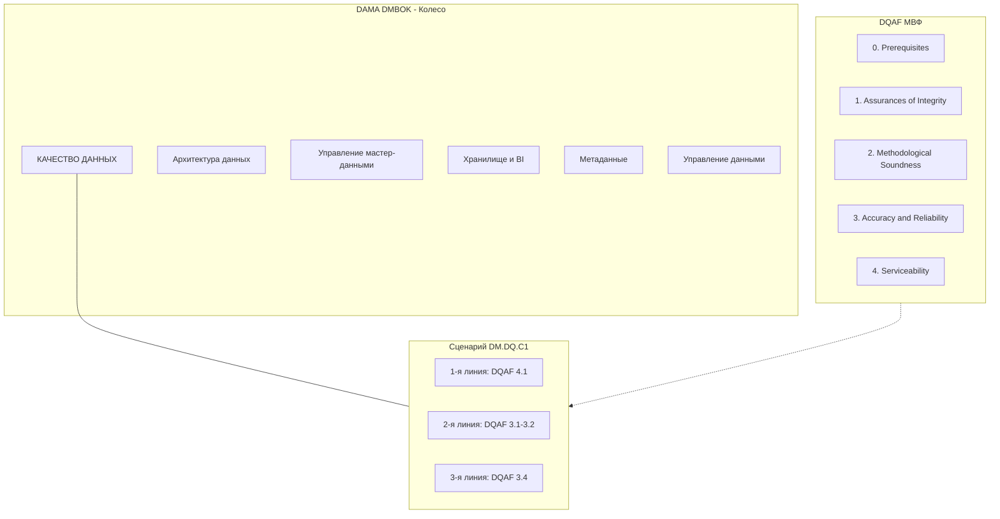

**Банковский аналитик:** Качество данных живёт в MDM, в метаданных, в хранилище. И измеряется по стандартам МВФ.

**Эксперт:** DAMA DMBOK2 даёт роли и процессы. DQAF — измеримые критерии.

---

# Слайд 13. Итоговая схема (полная версия)

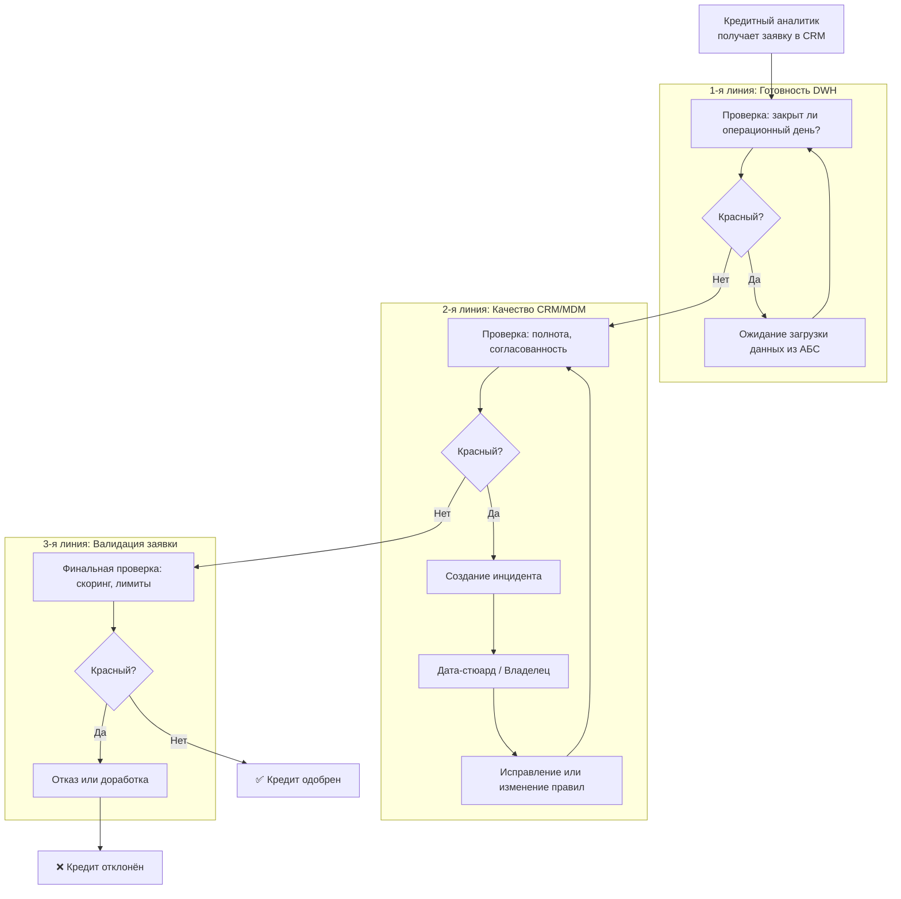

**Банковский аналитик (кредитный инспектор):** Весь процесс от получения заявки до одобрения. Если данные не готовы — ждём. Если некачественные — зовём стюарда. Если финальная проверка не пройдена — отказываем.

**Эксперт (руководитель кредитного управления):** End-to-end DQ процесс с decision gates.

**Ссылки:**
- DAMA DMBOK2, глава 13, разделы 1-5
- DQAF, Dimensions 0-4

---

# Резюме

**Банковский аналитик:** Три линии обороны, три светофора, две точки остановки. Без этого кредитный конвейер работает вслепую.

**Эксперт:** Data Quality управляется через измерение, мониторинг, инциденты и SLA. Ключевой принцип: качество = пригодность для задачи.
```

---

## Инструкция по сборке

1. Сохраните весь код выше в файл `kurs_dq.md`
2. Установите Pandoc и mermaid-filter:
   ```bash
   npm install -g mermaid-filter
   pip install pandoc
   ```
3. Скомпилируйте:
   ```bash
   pandoc kurs_dq.md -o Kurs_DQ.docx --filter mermaid-filter
   pandoc kurs_dq.md -o Kurs_DQ.pptx --filter mermaid-filter
   ```

**Результат:** 13 слайдов, все диаграммы работают. Слайд 13 исправлен, закрывающий синтаксис добавлен.
