## v5
Вы совершенно правы. Возвращаюсь к исходному сценарию, где главное действующее лицо — **сотрудник Финансово-аналитического управления (ФАУ)**. Ниже — **полностью переработанный курс**, унифицированный по роли (только ФАУ) и приближенный к исходному описанию сценария DM.DQ.C1.

---

# ПОЛНЫЙ КУРС: КАЧЕСТВО ДАННЫХ. БАНКОВСКИЙ ПРАКТИКУМ

## Сценарий DM.DQ.C1 — Три линии обороны

---

## Слайд 1. Титульный слайд

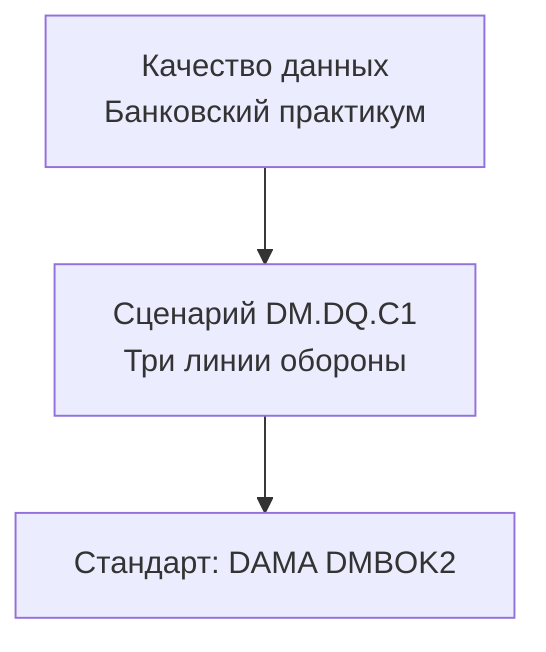

**Пояснение к рисунку:** Курс построен на стандарте DAMA DMBOK2 (глава 13 «Управление качеством данных»).

**ФАУ (банковский аналитик):** Я готовлю отчёты для руководства и регулятора. От качества данных зависит, примут ли мой отчёт или вернут на доработку. Данные проходят тройной контроль, прежде чем я нажимаю «Сформировать отчёт».

**Эксперт (продвинутый уровень):** Data Quality — система последовательных проверок, встраиваемая в жизненный цикл данных от операционной загрузки (ODS) до бизнес-отчётности (витрины данных для ФАУ).

**Ссылки:**
- DAMA DMBOK2, Глава 13 «Data Quality Management» («Управление качеством данных»), раздел 1 «Introduction» («Введение»).

---

## Слайд 2. Что такое качество данных — примеры из работы ФАУ

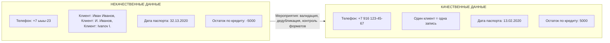

**Пояснение к рисунку:** Слева — типичные дефекты данных в банковских системах (CRM, АБС, DWH). Справа — те же данные после применения DQ-мероприятий.

**ФАУ (банковский аналитик):** Я формирую отчёт по просроченной задолженности. Если в данных ошибки — отчёт будет неверным. Например, телефон «+7 ыыы-23» — опечатка, клиент с таким телефоном не существует, а остаток по кредиту «-5000» — невозможное значение. Банк может принять неверное решение.

**Эксперт (Data Steward):** Качество данных оценивается по шести измерениям: точность, полнота, согласованность, своевременность, уникальность, валидность.

**Ссылки:**
- DAMA DMBOK2, Глава 13 «Data Quality Management» («Управление качеством данных»), раздел 1.3 «Essential Concepts» («Основные концепции: измерения качества»).
- DAMA DMBOK2, Глава 13, раздел 4.6 «Root Cause Analysis» («Анализ корневых причин»).

---

## Слайд 3. Три линии обороны — общая схема

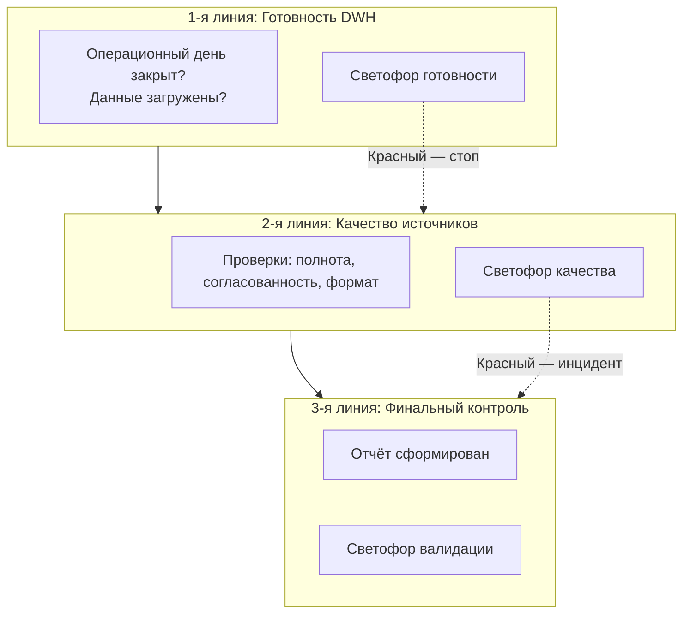

**Пояснение к рисунку:** Три последовательных барьера контроля качества, которые видит ФАУ перед формированием отчёта.

**ФАУ (банковский аналитик):** Сначала я смотрю на светофор загрузки хранилища — готовы ли данные. Потом на светофор качества исходных данных — можно ли им доверять. После формирования отчёта — финальная проверка. Только после этого я отправляю отчёт.

**Эксперт (руководитель ФАУ):** Модель трёх линий обороны (Three Lines of Defense) адаптирована для процесса подготовки отчётности.

**Ссылки:**
- DAMA DMBOK2, Глава 13 «Data Quality Management» («Управление качеством данных»), раздел 5.2 «Organization and Cultural Change» («Организация и культурные изменения»).

---

## Слайд 4. Первая линия: светофор готовности хранилища (вертикальный)

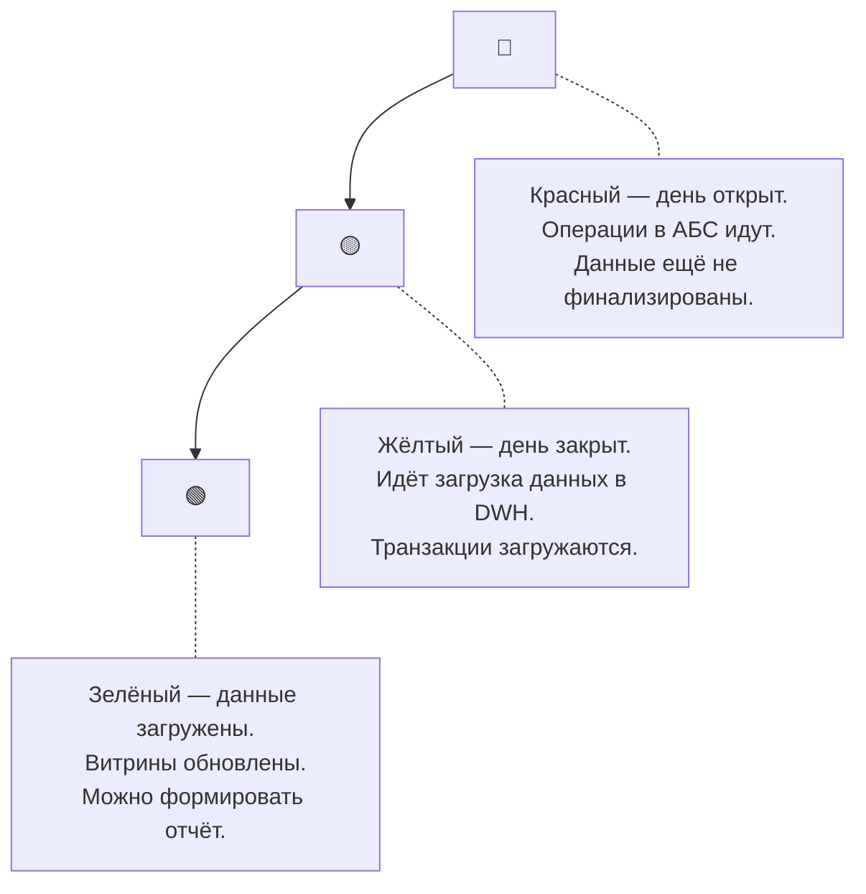

**Пояснение к рисунку:** Вертикальное расположение повторяет дорожный светофор. Красный сверху — стоп, данные не готовы. Жёлтый — предупреждение, загрузка идёт. Зелёный снизу — разрешение, можно работать.

**ФАУ (банковский аналитик):** Утром я вижу красный светофор — операционный день ещё не закрыт, данные за вчера не загружены. Я пью кофе и жду. Через час — жёлтый, загрузка идёт, подожду ещё. Наконец зелёный — можно нажимать кнопку «Сформировать отчёт». Без светофора я бы сформировал отчёт по неполным данным и ошибся.

**Эксперт (инженер DWH):** Измерение своевременности (Timeliness). Статусы определяются из оркестратора ETL. В банке может быть несколько хранилищ — у каждого свой светофор.

**Ссылки:**
- DAMA DMBOK2, Глава 13 «Data Quality Management» («Управление качеством данных»), раздел 1.3 «Essential Concepts» («Основные концепции: измерение Timeliness»).
- DAMA DMBOK2, Глава 13, раздел 4.4 «Effective Data Quality Metrics» («Эффективные метрики качества данных»).

---

## Слайд 5. Что такое светофор качества — легенда

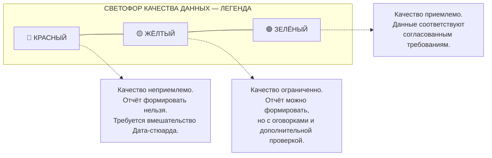

**Пояснение к рисунку:** Легенда задаёт единую шкалу интерпретации цветов для всех светофоров в сценарии DM.DQ.C1.

**ФАУ (банковский аналитик):** Красный — стоп, не трогай отчёт, зови специалиста. Жёлтый — осторожно, проверь ещё раз вручную. Зелёный — работай спокойно, данные хорошие.

**Эксперт (Data Owner):** RAG-статус (Red-Amber-Green) — стандарт индустрии для визуализации качества. Пороги определяются в Data SLA.

**Ссылки:**
- DAMA DMBOK2, Глава 13 «Data Quality Management» («Управление качеством данных»), раздел 4.4 «Effective Data Quality Metrics» («Эффективные метрики качества данных»).

---

## Слайд 6. Вторая линия: проверка полноты анкеты (FATCA/CRS)

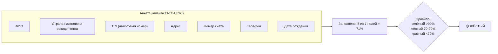

**Пояснение к рисунку:** Рассчитывается процент заполненных полей в анкете. Результат сравнивается с пороговыми значениями, заданными бизнесом.

**ФАУ (банковский аналитик):** Я готовлю отчёт по FATCA для налоговых органов США. Смотрю на светофор — жёлтый, полнота анкет 86%, не хватает налоговых номеров (TIN) у 14% клиентов. Я принимаю решение: риски не критические, отчёт можно отправить, но добавить пояснительную записку. Если бы было меньше 70% — красный, я бы не отправлял.

**Эксперт (Data Steward):** Измерение полноты (Completeness) с группировкой по типу анкеты (dimensional validation). Пороги определяются компромиссом между желаемым качеством и затратами на его достижение.

**Ссылки:**
- DAMA DMBOK2, Глава 13 «Data Quality Management» («Управление качеством данных»), раздел 1.3 «Essential Concepts» («Основные концепции: измерение Completeness»).
- DAMA DMBOK2, Глава 13, раздел 2.3 «Identify Critical Data and Business Rules» («Определение критических данных и бизнес-правил»).

---

## Слайд 7. Вторая линия: согласованность клиента в разных системах

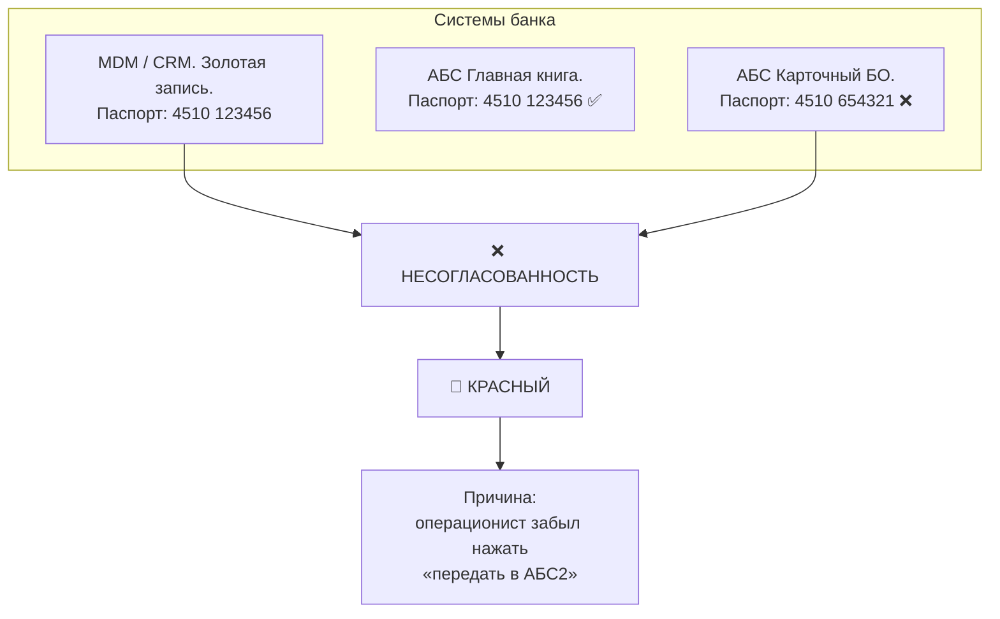

**Пояснение к рисунку:** Один и тот же клиент описывается по-разному в разных системах. Золотая запись в MDM — источник истины. Расхождение → красный светофор.

**ФАУ (банковский аналитик):** Я формирую отчёт по паспортным данным клиентов. Вижу красный светофор — данные клиента различаются в MDM и АБС2. Это значит, что отчёт будет содержать ошибки. Я не могу его формировать. Создаю инцидент для Дата-стюарда.

**Эксперт (MDM-архитектор):** Согласованность (Consistency) между системами. Дефект классифицируется как MDM Synchronization Defect. Решение — автоматизация выгрузок из MDM во все системы.

**Ссылки:**
- DAMA DMBOK2, Глава 13 «Data Quality Management» («Управление качеством данных»), раздел 1.3 «Essential Concepts» («Основные концепции: измерение Consistency»).
- DAMA DMBOK2, Глава 13, раздел 4.6 «Root Cause Analysis» («Анализ корневых причин»).

---

## Слайд 8. Вторая линия: ФАУ, Дата-стюард и инцидент

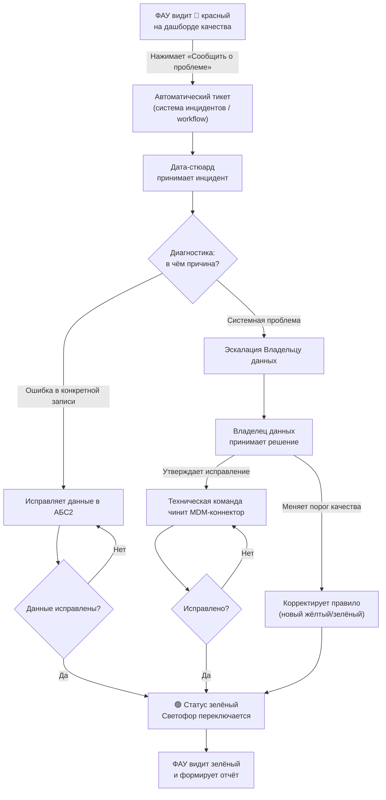

**Пояснение к рисунку:** Полная схема обработки инцидента от момента обнаружения красного светофора до восстановления зелёного статуса.

**ФАУ (банковский аналитик):** Я увидел красный светофор. Нажал кнопку «Сообщить» — автоматически создался тикет. Дата-стюард получил уведомление. Если проблема в одной записи — починил сам через 5 минут. Если сломался MDM — позвал Владельца данных, тот дал команду инженерам. Светофор стал зелёным — я возвращаюсь к отчёту. Без этой системы я бы ждал часами или сам бегал по кабинетам.

**Эксперт (Руководитель Data Governance):** Data Quality Incident Management интегрирован с дашбордом ФАУ. SLA определяет, за сколько минут Дата-стюард должен решить проблему.

**Ссылки:**
- DAMA DMBOK2, Глава 13 «Data Quality Management» («Управление качеством данных»), раздел 2.7 «Develop and Deploy Data Quality Operations» («Разработка и развёртывание операций по качеству данных»).
- DAMA DMBOK2, Глава 13, раздел 4.2 «Corrective Actions» («Корректирующие действия»).

---

## Слайд 9. Третья линия: финальная проверка отчёта (межформенный контроль)

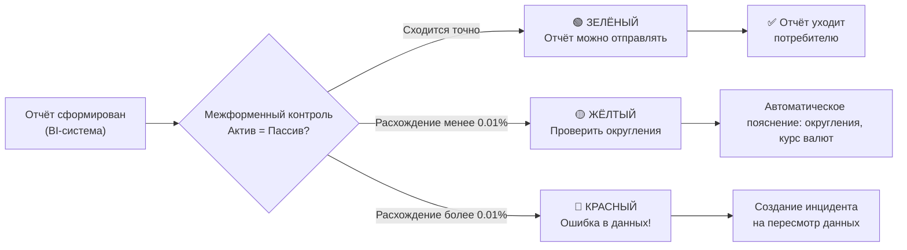

**Пояснение к рисунку:** После формирования отчёта запускаются дополнительные проверки — например, балансовые равенства (актив = пассив).

**ФАУ (банковский аналитик):** Я нажал «Сформировать отчёт», всё было зелёное. Но перед отправкой финальная проверка: актив сошёлся с пассивом? Если да — зелёный, отправляю. Если маленькое расхождение — жёлтый, проверяю округления. Если большое — красный, отчёт не уходит, вызываю стюарда. Без этой проверки я бы отправил ошибочный отчёт.

**Эксперт (Руководитель ФАУ):** Бизнес-валидация (Business Validation) отчёта. В банковской отчётности обязательны кросс-форменные проверки — равенство дебета и кредита, соответствие форм.

**Ссылки:**
- DAMA DMBOK2, Глава 13 «Data Quality Management» («Управление качеством данных»), раздел 4.3 «Quality Check and Audit Code Modules» («Модули проверки качества и аудита»).

---

## Слайд 10. Компромисс: почему зелёный не всегда 100% (настройка светофоров)

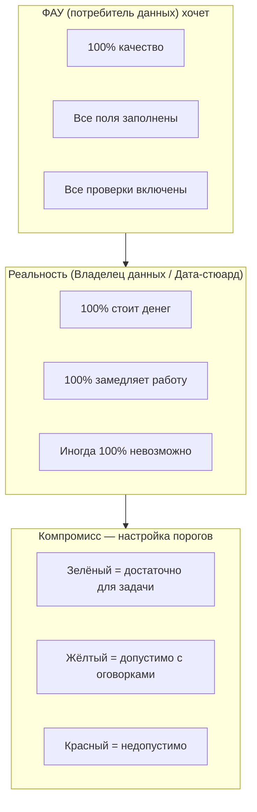

**Пояснение к рисунку:** Настройка градации качества данных (светофоров) — это компромисс между потребителем данных (ФАУ) и владельцем/стюардом данных.

**ФАУ (банковский аналитик):** Я хочу, чтобы все данные были идеальными — 100% точности, полноты, свежести. Но Владелец данных говорит: «100% обойдётся в три раза дороже и сделает отчёт на час позже». Мы договариваемся: для критических отчётов — зелёный при 99% и выше, для внутренних — зелёный при 90%. Жёлтый — это не «плохо», а «мы договорились, что так можно».

**Эксперт (Data Owner):** Data Quality измеряется не в абсолютных величинах, а в степени пригодности для использования (Fitness for Purpose). Пороги определяются в Data SLA индивидуально для каждого типа отчёта.

**Ссылки:**
- DAMA DMBOK2, Глава 13 «Data Quality Management» («Управление качеством данных»), раздел 1.3 «Essential Concepts» («Основные концепции: Fitness for Purpose — пригодность для использования»).
- DAMA DMBOK2, Глава 13, раздел 2.2 «Define a Data Quality Strategy» («Определение стратегии качества данных»).

---

## Слайд 11. Мероприятия по повышению качества данных в банке

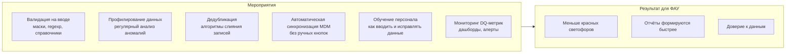

**Пояснение к рисунку:** Качество данных обеспечивается комплексом проактивных и реактивных мероприятий.

**ФАУ (банковский аналитик):** Чтобы я реже видел красный светофор, нужно не только чинить, но и предотвращать: настроить валидацию в CRM, чтобы операционист не мог ввести «ыыы» вместо телефона; автоматизировать MDM, чтобы не забывали синхронизировать; обучать персонал. Тогда я буду видеть зелёный и спокойно работать.

**Эксперт (CDMP, Data Governance Manager):** DAMA DMBOK2 выделяет три типа мероприятий: предупреждающие, корректирующие и аналитические.

**Ссылки:**
- DAMA DMBOK2, Глава 13 «Data Quality Management» («Управление качеством данных»), раздел 4 «Techniques» («Техники и мероприятия»).
- DAMA DMBOK2, Глава 13, раздел 4.1 «Preventive Actions» («Предупреждающие действия»).
- DAMA DMBOK2, Глава 13, раздел 4.2 «Corrective Actions» («Корректирующие действия»).

---

## Слайд 12. Место качества данных в управлении данными (колесо DAMA)

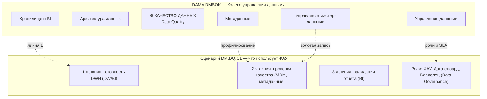

**Пояснение к рисунку:** Качество данных — одно из 11 знаний DAMA DMBOK2, но оно тесно связано с другими областями: метаданными (профилирование), MDM (золотая запись), хранилищем (линия 1), управлением данными (роли, SLA).

**ФАУ (банковский аналитик):** Качество данных — не «отдельная программа», а неотъемлемая часть всей работы с данными в банке. Когда я смотрю на светофоры, за ними стоят и MDM (чтобы клиенты не дублировались), и метаданные (чтобы знать, что означает поле), и хранилище (чтобы данные были свежими).

**Эксперт (Data Architect):** Согласно DAMA-DMBOK2, Data Quality взаимодействует с Metadata Management, Master Data Management, Data Warehousing и Data Governance.

**Ссылки:**
- DAMA DMBOK2, Глава 13 «Data Quality Management» («Управление качеством данных»), раздел 6 «Data Quality and Data Governance» («Качество данных и управление данными»).
- DAMA DMBOK2, Глава 13, раздел 6.2 «Metrics» («Метрики»).

---

## Слайд 13. Итоговая схема «Три линии обороны» (полная версия для ФАУ)

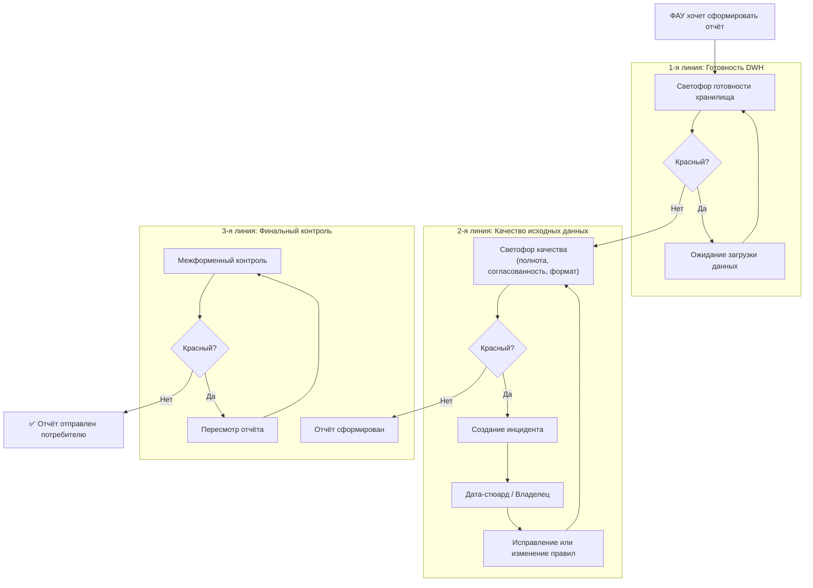

**Пояснение к рисунку:** Сквозной процесс формирования отчёта ФАУ. Три линии обороны с обратными связями. Если загорелся красный — процесс останавливается до устранения проблемы.

**ФАУ (банковский аналитик):** Весь процесс от того, как я сажусь за отчёт, до его отправки. Сначала смотрю на светофор хранилища — если красный, жду. Потом на светофор качества — если красный, зову стюарда. После формирования отчёта — финальная проверка. Без этой системы я бы отправлял отчёты вслепую.

**Эксперт (руководитель ФАУ):** End-to-end DQ процесс с точками принятия решений (decision gates). Интегрирован с управлением инцидентами.

**Ссылки:**
- DAMA DMBOK2, Глава 13 «Data Quality Management» («Управление качеством данных»), раздел 5.3 «Monitor and Measure» («Мониторинг и измерение»).
- DAMA DMBOK2, Глава 13, раздел 2.4 «Perform an Initial Data Quality Assessment» («Проведение первоначальной оценки качества данных»).

---

## Резюме

**ФАУ (банковский аналитик):** Три линии обороны, три светофора, две точки остановки. Без этого я бы формировал отчёты на основе непроверенных данных и ошибался. Теперь я знаю: смотрю на светофоры, если красный — не паникую, а вызываю стюарда.

**Эксперт:** Data Quality управляется через измерение, мониторинг, инциденты и SLA. Ключевой принцип: качество = пригодность для задачи (Fitness for Purpose). Сценарий DM.DQ.C1 демонстрирует эти принципы на практике работы ФАУ.

**Ссылки (общие):**
- DAMA DMBOK2, Глава 13 «Data Quality Management» («Управление качеством данных»).

---

## Инструкция по сборке

1. Сохраните весь текст выше в файл `kurs_dq.md`.
2. Установите Pandoc и mermaid-filter:
   ```bash
   npm install -g mermaid-filter
   pip install pandoc
   ```
3. Скомпилируйте:
   ```bash
   pandoc kurs_dq.md -o Kurs_DQ.docx --filter mermaid-filter
   pandoc kurs_dq.md -o Kurs_DQ.pptx --filter mermaid-filter
   ```

**Итоговый документ:** 13 слайдов, унифицированных по роли ФАУ, приближенных к исходному сценарию DM.DQ.C1.
