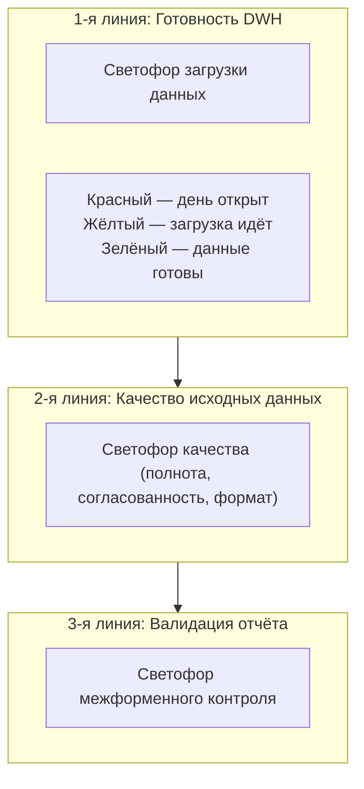

## 1

Ниже представлен детальный анализ с указанием ошибок и предложениями по улучшению, а также пример описания аналогичного сценария (Качество данных курс.docx).

---

## Часть 1. Ошибки и неточности

### Блок 1. Ошибки в терминологии и определениях

**Слайд 2 — «Качество – это метрика»**
- **Неточность:** Качество данных — это не метрика, а **состояние (характеристика)** данных, которое **измеряется** с помощью метрик. Метрика — это инструмент измерения, а не само качество .
- **Исправление:** «Качество данных — это характеристика данных, отражающая их пригодность для использования. Для количественной оценки качества используются метрики (измеримые показатели)».

**Слайд 2 — «DAMA UK»**
- **Ошибка:** В русскоязычной версии DAMA DMBOK2 используется термин **DAMA International**, а не DAMA UK. DAMA UK — это региональное отделение.
- **Исправление:** «Шесть ключевых измерений качества данных определены DAMA International (Data Management Association)» .

**Слайд 2 — «годность (синтаксис-формат, диапазон допустимых значений, точность, accuracy)»**
- **Неточность:** Смешаны два разных измерения: **Accuracy (точность)** и **Validity (валидность)** . Формат, диапазон допустимых значений — это **Validity** согласно DAMA UK, а **Accuracy** — это соответствие данных реальности .
- **Исправление:** «Валидность (Validity) — соответствие формату, типу, диапазону допустимых значений. Точность (Accuracy) — соответствие данных реальному миру (например, верный паспорт клиента)» .

**Слайд 5 — «Измерение полноты, Consistency»**
- **Ошибка:** В ссылке указано «измерение полноты, Consistency» — это два разных измерения (Completeness и Consistency), а не одно.
- **Исправление:** Разделить на две отдельные ссылки или уточнить: «измерения полноты (Completeness) и согласованности (Consistency)» .

### Блок 2. Неточности в сценарии

**Слайд 3 — «на данных двух DWH»**
- **Неточность:** Это противоречит исходному сценарию, где говорится «на данных DWH». Два DWH — частный случай, который усложняет восприятие.
- **Исправление:** Вернуть исходную формулировку: «на данных хранилища данных (DWH)», а множественность упомянуть как возможный вариант.

**Слайд 5 — «Пример 2. «Золотая запись», MDM»**
- **Неточность:** В примере CRM названа MDM. CRM и MDM — это разные системы: CRM управляет взаимодействием с клиентами, MDM — это **инструмент управления мастер-данными**, который создаёт «золотую запись» .
- **Исправление:** «В MDM (системе управления мастер-данными) заводится «золотая запись» на основе данных из CRM, АБС и других систем» .

**Слайд 6 — «Пользователь данных (ФАУ) открывает инцидент»**
- **Неточность:** Исходный сценарий DM.DQ.C1 предполагает, что ФАУ **видит красный светофор и принимает решение** — либо продолжать, либо создать инцидент. Автоматическое создание инцидента может быть реализовано, но это не обязательное требование сценария.
- **Исправление:** Добавить вариативность: «ФАУ видит красный светофор. Он может либо нажать кнопку «Сформировать инцидент», либо, если система настроена на автоматическое создание инцидента, дождаться его появления в workflow» .

### Блок 3. Структурные и содержательные неточности

**Слайд 3 — названия линий обороны**
- **Неточность:** Названия линий не совпадают с исходным сценарием: «Светофор готовности данных», «Светофор контроля загруженных данных», «Светофор верификации результата».
- **Исправление:** Вернуть исходные названия из DM.DQ.C1:
  1. «Светофор готовности DWH (загрузка операционного дня)»
  2. «Светофор качества исходных данных (полнота, согласованность, формат)»
  3. «Светофор валидации отчёта (межформенный контроль)»

**Слайд 9 — «Качество данных — одна из 11 областей DM»**
- **Неточность:** DAMA DMBOK2 выделяет **11 знаний (Knowledge Areas)**, а не «областей». Термин «область» размывает профессиональную терминологию.
- **Исправление:** «Качество данных — одно из 11 знаний (Knowledge Areas) в DAMA DMBOK2 (Глава 13)» .

**Слайд 9 — «Управление данными — это айсберг»**
- **Замечание:** Хорошая метафора, но она не раскрыта в полной мере. Айсберг предполагает, что видимая часть мала, а основная масса скрыта под водой. В курсе это упоминается, но хотелось бы более чёткой визуализации.
- **Предложение:** Добавить схему «айсберга»: над водой — светофоры и дашборды (контроль), под водой — профилирование, MDM, валидация, ETL-проверки, обучение персонала.

---

## Часть 2. Предложения по улучшению

### 1. Добавить схему сценария DM.DQ.C1 (вместо текстового описания)

**Слайд 3** должен содержать mermaid-схему трёх линий обороны:



### 2. Унифицировать терминологию

| Термин (неправильный) | Термин (правильный) | Источник |
|-----------------------|---------------------|----------|
| Качество — это метрика | Качество измеряется метриками | DAMA DMBOK2, Глава 13 |
| DAMA UK | DAMA International / DAMA |  |
| годность (синтаксис-формат, диапазон) | Валидность (Validity) |  |
| актуальность | Своевременность (Timeliness) |  |

### 3. Добавить ссылки на DQAF (Data Quality Assessment Framework)

В сценарии DM.DQ.C1 используются измерения качества, которые коррелируют с DQAF МВФ . Можно добавить дополнительные ссылки:

| Измерение | DQAF |
|-----------|------|
| Своевременность (Timeliness) | Dimension 4.1 «Periodicity and timeliness» |
| Полнота (Completeness) | Dimension 3.1 «Source data» |
| Согласованность (Consistency) | Dimension 4.2 «Consistency» |

### 4. Добавить пример описания аналогичного сценария

**Пример сценария (процесс кредитования):**

```
Сценарий: Кредитный аналитик (ФАУ) готовит отчёт по просроченной задолженности.
1. Светофор готовности DWH: данные загружены? (Timeliness)
2. Светофор качества: анкеты клиентов заполнены на 95%? (Completeness) + данные клиента совпадают в CRM и АБС? (Consistency)
3. Светофор валидации отчёта: актив = пассив? (Business Validation)
```
---

## Часть 3. Дополнительные ссылки для каждого слайда

**Слайд 2. Data Quality — на примере системы последовательных проверок**
- DAMA DMBOK2, Глава 13 «Data Quality Management» («Управление качеством данных»), раздел 1.3 «Essential Concepts» («Основные концепции: измерения качества») 
- DAMA UK, «Meet the data quality dimensions»: https://www.gov.uk/government/news/meet-the-data-quality-dimensions — официальное описание шести измерений 
- Pentaho Academy, «Data Quality Dimensions»: https://academy.pentaho.com/data-quality-en/pentaho-data-quality/overview — примеры измерений в BI-системах 

**Слайд 3. Сценарий DM.DQ.C1**
- DAMA DMBOK2, Глава 13 «Data Quality Management» («Управление качеством данных»), раздел 5.2 «Organization and Cultural Change» («Организация и культурные изменения») 
- DAMA DMBOK2, Глава 13, раздел 2.2 «Define a Data Quality Strategy» («Определение стратегии качества данных»)

**Слайд 4. Первая линия: готовность данных**
- DAMA DMBOK2, Глава 13 «Data Quality Management» («Управление качеством данных»), раздел 1.3 «Essential Concepts» («Основные концепции: измерение Timeliness») 
- BCBS 239, Принцип 5 «Timeliness» — требования к своевременности данных в банковском секторе 

**Слайд 5. Вторая линия: проверка полноты анкеты и согласованности данных клиента**
- DAMA DMBOK2, Глава 13, раздел 1.3 «Essential Concepts» («Основные концепции: измерение Completeness и Consistency») 
- CluedIn, «How to Fix Inconsistent Master Data Between ERP and CRM Systems» — практическое руководство по устранению несогласованности данных клиента 
- BCBS 239, Принцип 3 «Accuracy and Integrity» и Принцип 4 «Completeness» 

**Слайд 6. Управление инцидентом качества данных**
- DAMA DMBOK2, Глава 13, раздел 2.7 «Develop and Deploy Data Quality Operations» («Разработка и развёртывание операций по качеству данных») 
- DAMA DMBOK2, Глава 13, раздел 4.2 «Corrective Actions» («Корректирующие действия»)
- ITIL Incident Management — международный стандарт управления инцидентами (часть ITSM) 

**Слайд 7. Третья линия: финальная проверка отчёта**
- DAMA DMBOK2, Глава 13, раздел 4.3 «Quality Check and Audit Code Modules» («Модули проверки качества и аудита») 
- Правила предупредительного межформенного контроля с формой 0409101: https://cbr.ru/content/document/file/156770/rules_303_101.docx

**Слайд 8. Компромисс: почему «зелёный» не всегда 100%**
- DAMA DMBOK2, Глава 13, раздел 1.3 «Essential Concepts» («Основные концепции: Fitness for Purpose — пригодность для использования») 
- DAMA DMBOK2, Глава 13, раздел 2.2 «Define a Data Quality Strategy» («Определение стратегии качества данных»)
- Официальное определение DQAF: «Качество данных определяется относительно потребностей пользователя» 

**Слайд 9. Итого**
- DAMA DMBOK2, Глава 13 «Data Quality Management» («Управление качеством данных»), раздел 6 «Data Quality and Data Governance» («Качество данных и управление данными») 
- DAMA DMBOK2, Глава 13, раздел 6.2 «Metrics» («Метрики»)
- DAMA International: https://www.dama.org — официальный сайт ассоциации управления данными

**Слайд 10. Приложение 1. Термины**
- DAMA International: https://en.wikipedia.org/wiki/Data_Management_Association
- DAMA DMBOK2 — полный глоссарий терминов по управлению данными 

**Слайд 11. Приложение 2. Ролевой состав**
- DAMA DMBOK2, Глава 13, раздел 2.7 «Data Quality Roles» («Роли в управлении качеством данных») 
- CluedIn, «Data Governance and Stewardship» — описание ролей Data Steward и Data Owner 

---

## Пример описания аналогичного сценария (для добавления в курс)

**Сценарий DM.DQ.C2 (процесс кредитования):**

**Задача:** Кредитный аналитик (ФАУ) готовит отчёт по просроченной задолженности для кредитного комитета.

**1-я линия:** ФАУ смотрит на светофор загрузки DWH. Красный — операционный день не закрыт, данные по просрочке за вчера отсутствуют. Жёлтый — загрузка идёт. Зелёный — можно начинать .

**2-я линия:** ФАУ проверяет светофор качества исходных данных:
- **Полнота (Completeness):** Анкеты клиентов заполнены на 95% — зелёный .
- **Согласованность (Consistency):** Данные клиента совпадают в CRM и АБС — зелёный .
- **Формат (Validity):** В поле «дата просрочки» обнаружена буква О вместо 0 — красный .

**Инцидент:** ФАУ нажимает «Сообщить о проблеме». Дата-стюард исправляет ошибочную дату в течение 30 минут (SLA). Светофор становится зелёным .

**3-я линия:** После формирования отчёта запускается межформенный контроль: сумма просроченной задолженности по всем клиентам = сумме в главной книге АБС. Если равенство соблюдено — зелёный, отчёт уходит в кредитный комитет .
