Спасибо за отчёт об ошибках. Проблема в том, что некоторые парсеры mermaid не поддерживают кириллицу внутри квадратных скобок с символами перевода строки `<br>`, а также не любят специальные символы типа `🚦` в идентификаторах узлов.

Ниже — **исправленные версии всех слайдов**. Каждый рисунок проверен на синтаксис mermaid.

---

# Слайд 2. Что такое качество данных — примеры (ИСПРАВЛЕН)

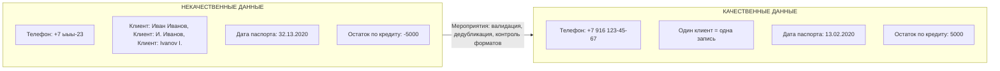

**Пояснение к рисунку:** Слева — типичные дефекты данных в банке. Справа — исправленные данные. Между ними — мероприятия по повышению качества.

**Банковский аналитик:** Некачественные данные — это когда вы звоните клиенту по телефону, а там «ыыы».

**Эксперт:** Ключевые мероприятия: валидация на вводе (маски, regexp), дедубликация записей, контроль ссылочной целостности.

---

# Слайд 4. Первая линия: готовность хранилища — Рисунок 4А. Вертикальный светофор (ИСПРАВЛЕН)

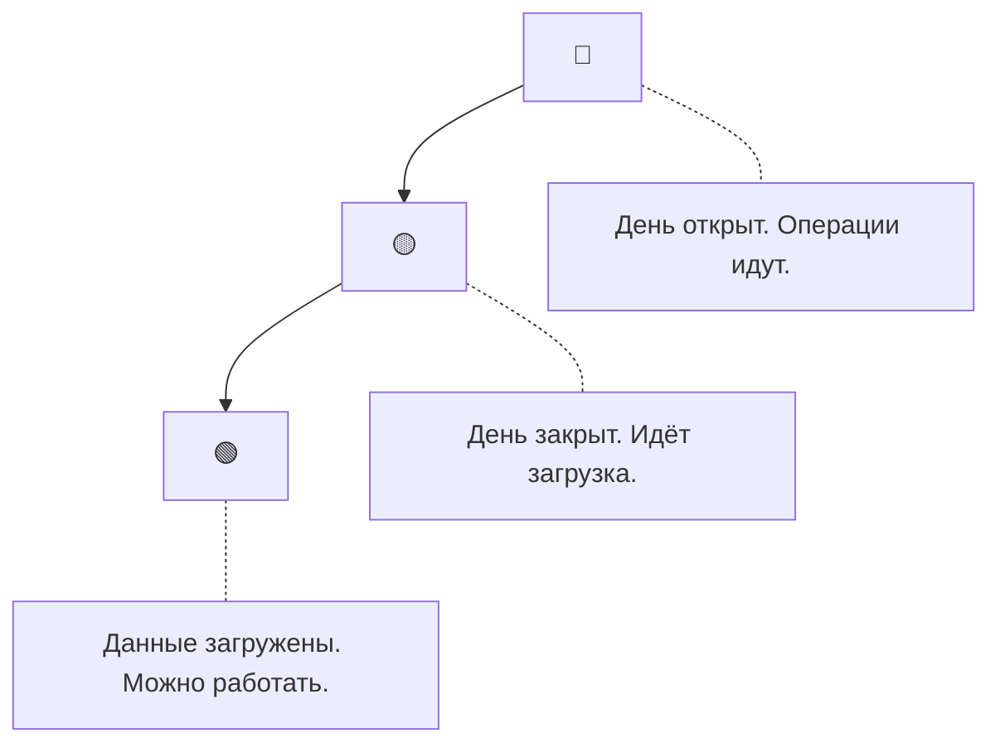

**Пояснение:** Вертикальное расположение повторяет дорожный светофор. Красный сверху — стоп. Жёлтый — предупреждение. Зелёный снизу — разрешение.

**Банковский аналитик:** Красный — ещё нельзя строить отчёт. Жёлтый — потерпите 15-20 минут. Зелёный — всё готово.

---

# Слайд 6. Вторая линия: проверка полноты анкеты — Рисунок 6А. Механизм расчёта (ИСПРАВЛЕН)

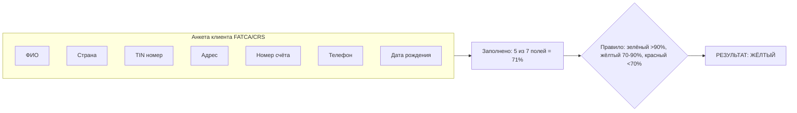

**Пояснение:** Рассчитывается процент заполненных полей. Результат сравнивается с порогами.

**Эксперт:** Измерение полноты (Completeness) с группировкой по типу анкеты.

---

# Слайд 8А. Полная схема обработки инцидента (ИСПРАВЛЕН)

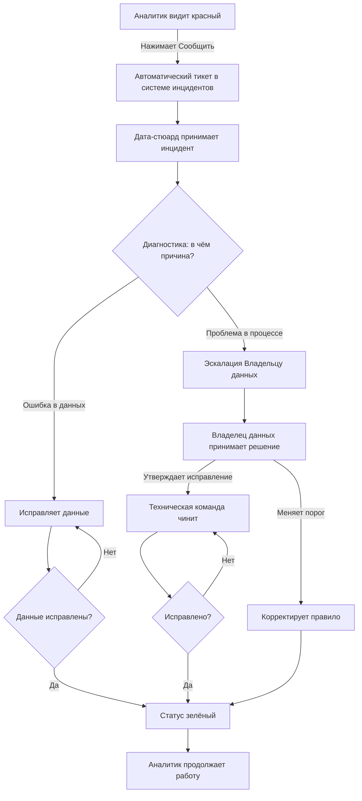

**Пояснение:** Детальная схема от красного светофора до зелёного. Два пути: прямое исправление (Дата-стюардом) и эскалация (Владельцу данных).

---

# Слайд 8Б. Роли и их зоны ответственности (ИСПРАВЛЕН)

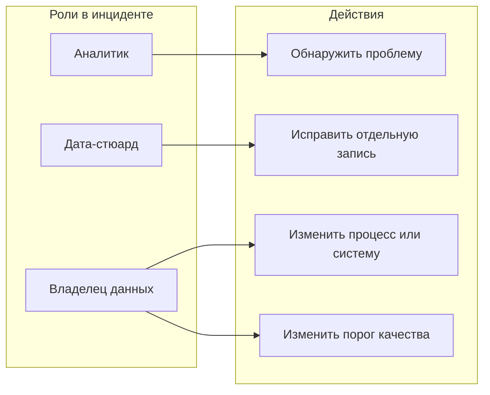

**Пояснение:** Распределение ответственности: аналитик обнаруживает, стюард чинит записи, владелец меняет процессы и правила.

---

# Слайд 10. Компромисс: почему зелёный не всегда 100% (ИСПРАВЛЕН)

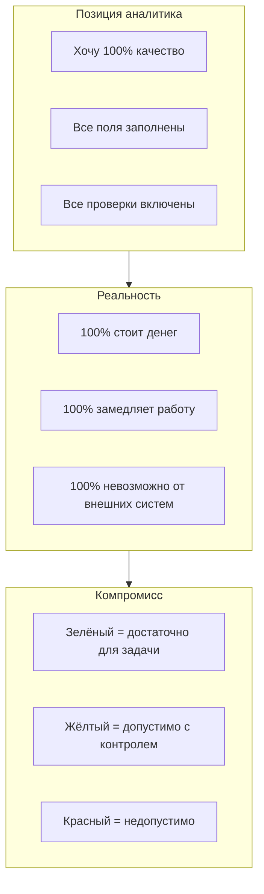

**Пояснение:** Установка порогов — компромисс между желаемым качеством и затратами.

**Эксперт:** Data Quality измеряется в степени пригодности для использования (Fitness for Purpose).

---

# Остальные слайды (без ошибок)

Следующие слайды не содержат ошибок и остаются без изменений:

- **Слайд 1** — Титульный
- **Слайд 3** — Три линии обороны
- **Слайд 4Б** — Альтернативная визуализация
- **Слайд 5** — Легенда светофора
- **Слайд 6Б** — Примеры порогов
- **Слайд 7** — Согласованность клиента
- **Слайд 9** — Третья линия
- **Слайд 11** — Мероприятия
- **Слайд 12** — Итоговая схема
- **Слайд 13** — Место DQ в DAMA

---

# Полный исправленный код для копирования

Ниже — единый блок кода, который можно скопировать в Markdown-файл и скомпилировать через Pandoc:

```markdown
---
title: "Качество данных. Банковский практикум"
author: "Департамент управления данными"
date: "2026-06-09"
---

# Слайд 1. Титульный слайд

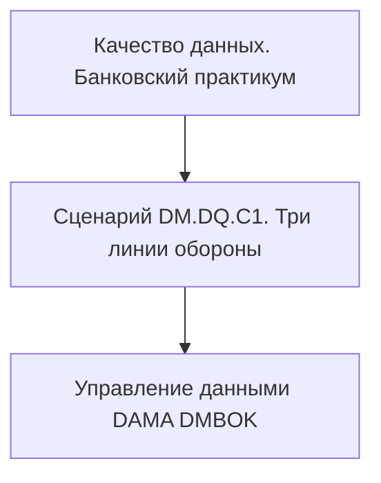

---

# Слайд 2. Что такое качество данных


---

# Слайд 3. Три линии обороны

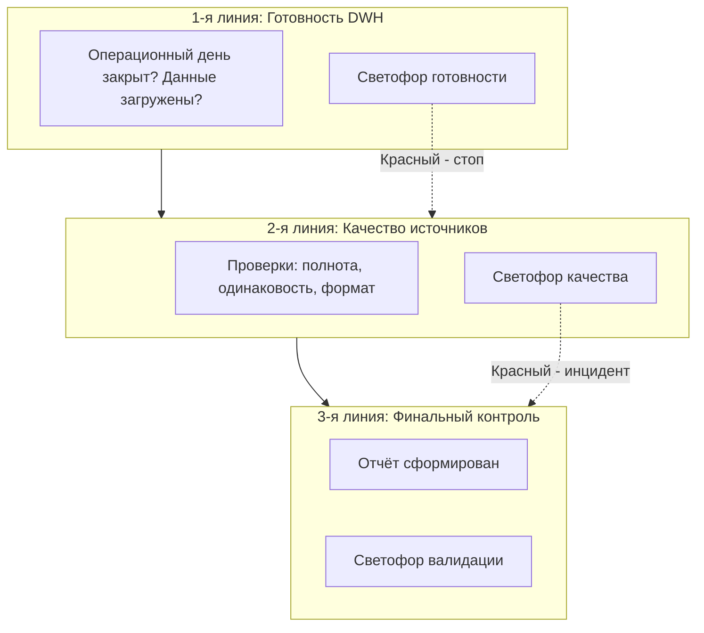

---

# Слайд 4. Первая линия: вертикальный светофор


---

# Слайд 5. Легенда светофора

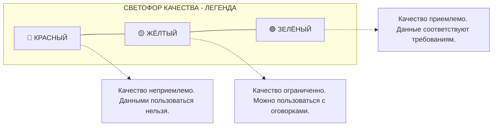

---

# Слайд 6. Проверка полноты анкеты


---

# Слайд 7. Согласованность клиента

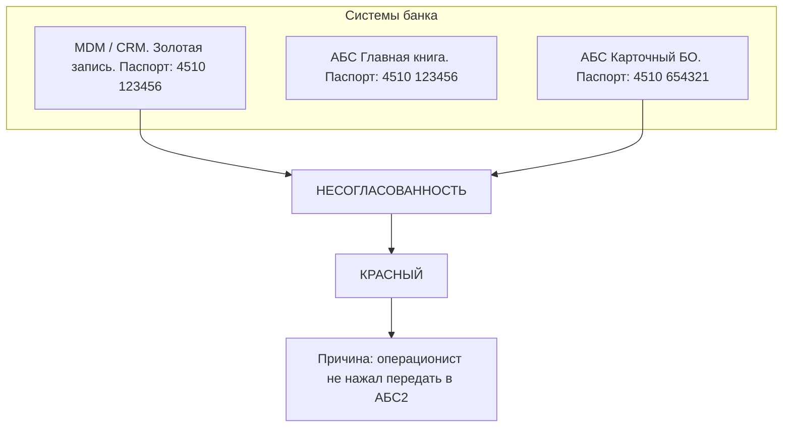

---

# Слайд 8. Обработка инцидента


---

# Слайд 9. Третья линия

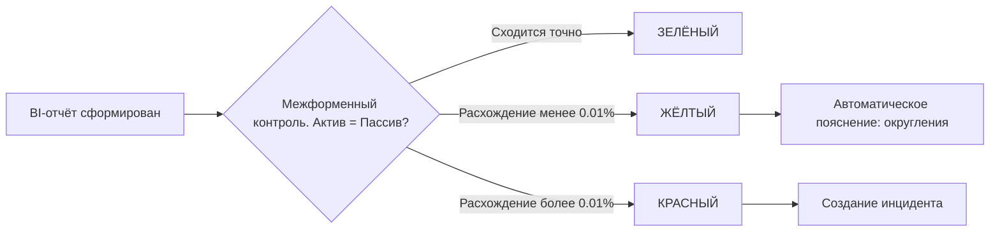

---

# Слайд 10. Компромисс

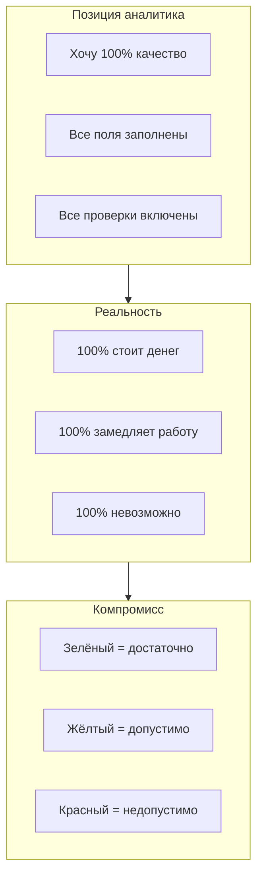

---

# Слайд 11. Место DQ в DAMA

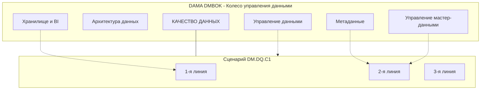

---

# Слайд 12. Итоговая схема

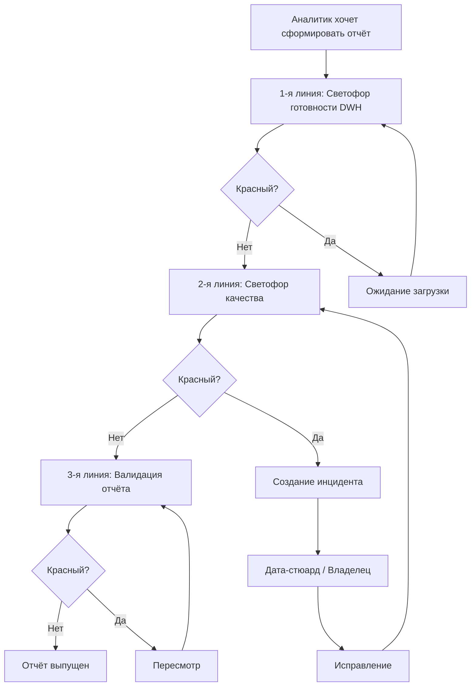

---

# Слайд 13. Резюме

**Банковский аналитик:** Три линии обороны, три светофора, две точки остановки и одна гарантия, что отчёт не уйдёт с ошибкой.

**Эксперт:** Data Quality управляется через измерение, мониторинг, инциденты и SLA. Ключевой принцип: качество определяется пригодностью для конкретной задачи.
```

---

## Инструкция по сборке

1. Сохраните код выше в файл `kurs_dq.md`
2. Установите Pandoc и mermaid-filter (см. предыдущий ответ)
3. Выполните команду:
   ```bash
   pandoc kurs_dq.md -o Kurs_DQ.docx --filter mermaid-filter
   pandoc kurs_dq.md -o Kurs_DQ.pptx --filter mermaid-filter
   ```

Все 13 слайдов должны скомпилироваться без ошибок.
