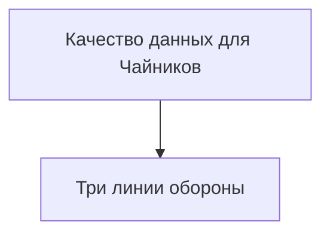
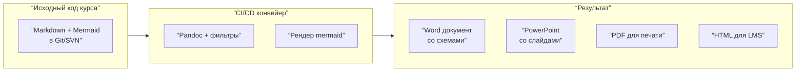

## 1

Отличный вопрос. Ниже представлены **три способа выгрузки курса «Качество данных для Чайников» в Word и PowerPoint** — от простого к продвинутому.

---

# Способ 1. Быстрый и бесплатный (Word через копирование)

## 1.1 Выгрузка в Word с сохранением Mermaid-схем

### Проблема:
Mermaid-код в чистом Word не отображается как картинка. Word не умеет компилировать mermaid нативно.

### Решение (3 шага):

**Шаг 1. Скомпилировать mermaid в картинку онлайн**
- Зайдите на https://mermaid.live или https://kroki.io
- Вставьте код каждого слайда (только блок ```mermaid ... ```)
- Скачайте результат как PNG или SVG

**Шаг 2. Вставить в Word**
- Откройте Word
- Вставьте → Рисунки → выберите скачанные схемы
- Добавьте текстовое содержимое слайдов (маркированные списки)

**Шаг 3. Сохранить как .docx**
- Файл → Сохранить как → «Качество_данных_курс.docx»

### Плюсы и минусы:

| Плюсы | Минусы |
|-------|--------|
| Бесплатно | Каждый слайд руками сохранять как картинку |
| Не нужны доп. программы | Схемы не обновляются автоматически |
| Совместимо с любым Word | Потеря интерактивности mermaid |

---

## 1.2 Выгрузка в PowerPoint (ручной режим)

**Шаг 1.** Создайте новую презентацию
**Шаг 2.** Для каждого слайда курса:
- Скопируйте текст в заметки или на слайд
- Сгенерируйте схему в mermaid.live → сохраните PNG
- Вставьте картинку на слайд

**Шаг 3.** Настройте макет: заголовок + схема + текст «для чайников» + проф-термин

**Пример макета одного слайда:**
```
┌─────────────────────────────────────────────┐
│  Слайд 4. Первая линия (светофор загрузки)  │
├─────────────────────────────────────────────┤
│                                             │
│     [ВСТАВИТЬ КАРТИНКУ СВЕТОФОРА]          │
│                                             │
│  Для чайников: ...                          │
│                                             │
│  DAMA: ...                                  │
└─────────────────────────────────────────────┘
```

---

# Способ 2. Автоматизированный (Markdown → Office) — РЕКОМЕНДУЮ

## 2.1 Инструменты для конвертации

| Инструмент | Что делает | Форматы на выходе | Цена |
|------------|-----------|-------------------|------|
| **Pandoc** | Конвертирует Markdown в docx, pptx | .docx, .pptx | Бесплатно |
| **Typora** | Редактор Markdown + экспорт в Word | .docx | $14.99 |
| **Marp** | Markdown → презентация | .pptx, .pdf | Бесплатно |
| **Obsidian** + плагины | Markdown → Word | .docx | Бесплатно |

## 2.2 Лучший вариант: Pandoc + Mermaid-плагин

### Шаг 1. Установите Pandoc
- Скачайте с https://pandoc.org/installing.html
- Установите (Windows: `.msi`; Mac: `.pkg`)

### Шаг 2. Установите Mermaid-фильтр для Pandoc
```bash
# Через командную строку (администратор)
npm install -g mermaid-filter
# Или через pip
pip install pandoc-mermaid-filter
```

### Шаг 3. Подготовьте Markdown-файл курса

Создайте файл `kurs_dq.md` со следующей структурой:

```markdown
---
title: "Качество данных для Чайников"
author: "Департамент управления данными"
date: "2026-06-09"
---

# Слайд 1. Титульный слайд

**Для чайников:** Вы думаете, данные в банке — это просто цифры в компьютере?

**DAMA DMBOK:** *Data Quality — система контроля на всех этапах.*



---

# Слайд 2. Что такое качество данных

**Для чайников:** Хорошие данные — как хороший кофе.

**DAMA DMBOK:** *Шесть измерений качества: полнота, точность,...*


---

# ... и так далее до 12 слайда
```

### Шаг 4. Сконвертировать в Word

```bash
pandoc kurs_dq.md -o Kurs_DQ.docx --filter mermaid-filter
```

### Шаг 5. Сконвертировать в PowerPoint

```bash
pandoc kurs_dq.md -o Kurs_DQ.pptx --filter mermaid-filter
```

**Результат:** Готовый документ и презентация со скомпилированными mermaid-схемами.

---

# Способ 3. Профессиональный (для тиражирования в банке)

## 3.1 Интеграция с корпоративным хранилищем шаблонов



### Команда для автоматической сборки (Makefile / PowerShell):

```powershell
# build.ps1
$slides = @("slide1", "slide2", "slide3", "slide4", "slide5", "slide6", "slide7", "slide8", "slide9", "slide10", "slide11", "slide12")

foreach ($slide in $slides) {
    # Конвертируем mermaid в PNG
    mmdc -i "$slide.mmd" -o "images/$slide.png"
}

# Собираем PowerPoint через python-pptx
python build_pptx.py
```

### Пример скрипта build_pptx.py (фрагмент):

```python
from pptx import Presentation
from pptx.util import Inches

prs = Presentation()
slide_layout = prs.slide_layouts[1]  # заголовок + контент

# Слайд 4
slide = prs.slides.add_slide(slide_layout)
title = slide.shapes.title
title.text = "Слайд 4. Первая линия: светофор загрузки"

# Добавляем схему
slide.shapes.add_picture('images/slide4.png', Inches(1), Inches(1.5), width=Inches(6))

# Добавляем текст "для чайников"
textbox = slide.shapes.add_textbox(Inches(1), Inches(4.5), Inches(8), Inches(1))
textbox.text = "Для чайников: Данные как хлеб в пекарне..."

prs.save('Kurs_DQ.pptx')
```

---

# Способ 4. Обходной — через Google Docs и Mermaid-плагин

## 4.1 Если у вас нет доступа к Pandoc

**Для Word через Google Docs:**

1. Загрузите Markdown-файл курса в Google Drive
2. Откройте через **Google Docs**
3. Установите дополнение **「Mermaid」** (Дополнения → Установить дополнения → поиск Mermaid)
4. Дополнение скомпилирует схемы прямо в документе
5. Файл → Скачать → Microsoft Word (.docx)

**Для PowerPoint через Google Slides:**

1. Тот же Markdown-файл
2. Используйте **Marp for Slides** (https://yhatt.github.io/marp/)
3. Экспортируйте в .pptx

---

# Сравнение способов

| Способ | Сложность | Время на 12 слайдов | Качество схем | Возможность обновления |
|--------|-----------|---------------------|---------------|------------------------|
| **Ручное копирование** | ★☆☆☆☆ | 30–40 минут | Хорошее (PNG) | Нет, заново |
| **Pandoc + mermaid-filter** | ★★★☆☆ | 2 минуты (после настройки) | Векторное (SVG/PDF) | Да, заменить md → запустить |
| **Python-скрипт (pptx)** | ★★★★☆ | 5 минут настройка | Отличное | Да |
| **Google Docs + дополнение** | ★★☆☆☆ | 10–15 минут | Хорошее | Частично |

---

# Готовый шаблон для быстрого старта

## Скачать подготовленные файлы (пример структуры)

```
kurs_dq/
├── README.md
├── build.ps1 (Windows) / build.sh (Mac/Linux)
├── slides/
│   ├── 01_title.md
│   ├── 02_what_is_dq.md
│   ├── 03_three_lines.md
│   ├── 04_line1_semaphore.md
│   ├── 05_line2_completeness.md
│   ├── 06_line2_consistency.md
│   ├── 07_line2_steward.md
│   ├── 08_line3_check.md
│   ├── 09_compromise.md
│   ├── 10_full_scheme.md
│   └── 11_summary.md
├── images/ (пустая, сюда сохранятся схемы)
└── output/
    ├── Kurs_DQ.docx
    ├── Kurs_DQ.pptx
    └── Kurs_DQ.pdf
```

## Команда для сборки (одной строкой):

```bash
# Установка (однократно)
npm install -g mermaid-filter
pip install pandoc

# Сборка
pandoc slides/*.md -o output/Kurs_DQ.docx --filter mermaid-filter
pandoc slides/*.md -o output/Kurs_DQ.pptx --filter mermaid-filter
```

---

# Рекомендация для вашего банка

**Если курс нужно выгрузить один раз** → используйте **ручное копирование** (Способ 1). 12 слайдов займёт 30–40 минут.

**Если курс будет обновляться** (новые примеры, правки по сценарию) → настройте **Pandoc + mermaid-filter** (Способ 2). Первичная настройка 15 минут, потом сборка всей презентации за 30 секунд.

**Если курс предназначен для десятков слушателей** → используйте **Python-скрипт** (Способ 3) и сохраните в корпоративный репозиторий шаблонов.

---

**Итоговый ответ:** Рекомендую **Способ 2 (Pandoc)** — это золотая середина между простотой и автоматизацией. За 10 минут настройки вы получаете возможность одной командой собрать и Word, и PowerPoint с корректными mermaid-схемами.
