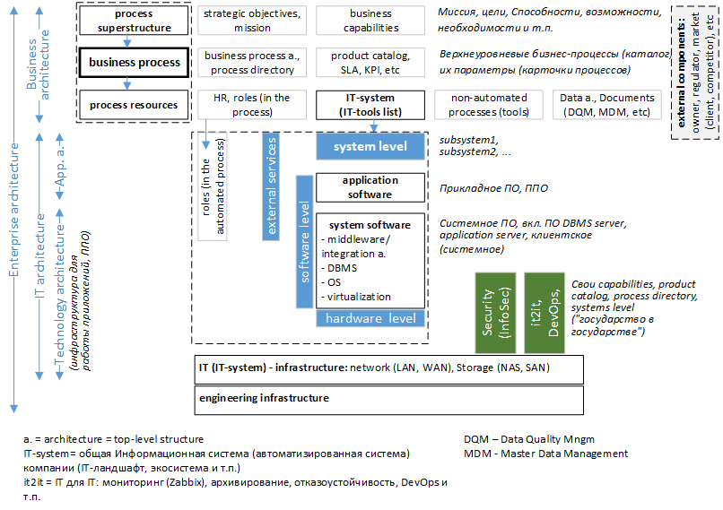
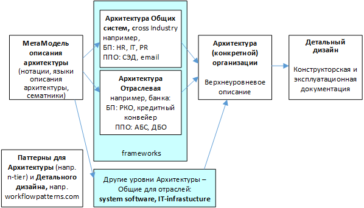

### Enterprise architecture framework-2
#### Intro
Взгладов на Enterprise architecture framework (EAF) много, см. [wiki](https://en.wikipedia.org/wiki/Enterprise_architecture_framework) ; [sewiki](http://sewiki.ru/%D0%9A%D0%B0%D1%82%D0%B5%D0%B3%D0%BE%D1%80%D0%B8%D1%8F:%D0%90%D1%80%D1%85%D0%B8%D1%82%D0%B5%D0%BA%D1%82%D1%83%D1%80%D0%BD%D1%8B%D0%B5_%D0%BF%D0%BE%D0%B4%D1%85%D0%BE%D0%B4%D1%8B) ; [top10 EAF](https://terrafirma.com.au/architecture/top-10-enterprise-architecture-frameworks/). Одних только xxAF (Architecture Framework) сколько: IAF, E2AF, FEAF, TEAF, DoDAF, MODAF, NAF, TOGAF и другие [HEAF](https://scialert.net/fulltext/?doi=tasr.2016.33.43).   
Есть схожие термины, например, [Инженерия предприятия](http://sewiki.ru/%D0%98%D0%BD%D0%B6%D0%B5%D0%BD%D0%B5%D1%80%D0%B8%D1%8F_%D0%BF%D1%80%D0%B5%D0%B4%D0%BF%D1%80%D0%B8%D1%8F%D1%82%D0%B8%D1%8F), но в целом это про моделирование Предприятия и его составных частей, прежде всего информационных.    
Ниже показан еще один EAF с кодовым названием **version 2**.  
**Терминологическое введение**  
- *Enterprise architecture* - архитектура предприятия, корпоративная архитектура. В "широком смысле слова" ("поздний" Захман) - это архитектура всей компании (предприятия).  В "узком смысле слова" ("ранний" Захман) - это только архитектура ИТ-системы: [A framework for information systems architecture](https://studfile.net/preview/5762248/page:4/)  
- *Архитектура*, применительно к EA, - это всего лишь "верхнеуровневая структура" (концепт \ онтология \ верхнеуровневая метамодель). В [ГОСТ Р 57100-2016/ISO/IEC/IEEE 42010:2011](https://npalib.ru/2016/09/22/gost-r-57100-2016-iso-iec-ieee-42010-2011-id272523/p6/) : "3.2 архитектура (системы) (architecture):  Основные понятия или свойства системы" и далее "Концептуальная модель структуры архитектуры ... Концептуальная модель элементов и связей описания архитектуры" в целом про тоже.  
Итого: a. = architecture = top-level structure   
Не путать с *Чистая архитектура* - [подход к разработке программного обеспечения](https://habr.com/ru/articles/905148/)  
- *Framework* - элалонная модель, концептуальный шаблон. "Мир идей" - как одна из идей (онтологий) подхода к описанию EA.  
На основе какой-либо EAF (прототипе) строится EA конкретной компании, т.е. от  эталонной "верхнеуровневой структуры" к описанию конкретной "верхнеуровневой структуры" конкретной компании ("Мир вещей в крупную клетку"). Следующий шаг - детализация этого описания ("Мир вещей подробно"), например, детализация каталога верхнеуровневых процессов каталогом детальных процессов или детализация архитектуры ИТ-системы в CMDB и т.д. Пример показан на рис. 2.   
- *IT-system* - общая ("единая", даже если представлена "зоопарком" подсистем) Информационная система (ИС) компании, "он же": автоматизированная система (АС), IT-ландшафт, экосистема, Информационно-телекоммуникационная система компании (ИТКС). Вместо "компании" можно расширить: корпорации, министерства, правительства, государства.  
- *Инфраструктура* (лат. infra — «ниже, под» + лат. structura — «строение», «расположение») - обеспечение базиса. Лучше уточнять название инфраструктуры и название базиса: инженерная инфраструктура ИТ-системы (обеспечение функционарования ИТ-системы), ИТ-инфраструктура процессной архитектуры (обеспечение ИТ-инструментарием для выполнения бизнес-процессов). Обычно под Технологической Архитектурой подраумевают Инфраструктуру для реализации Прикладного уровня (ППО, Application, Application layer). Иногда технологическую Инфраструктуру называют технической Инфраструктурой.  
- *Mission & Business model*
    - Бизнес-модель, framework / шаблон деятельности (структура), например, интернет-магазин, Uber, франчайзи, маркетплейс и т.п.  
Описание БМ (framework / шаблон формализации), например, [Business model canvas](https://ru.wikipedia.org/wiki/%D0%9A%D0%B0%D0%BD%D0%B2%D0%B0_%D0%B1%D0%B8%D0%B7%D0%BD%D0%B5%D1%81-%D0%BC%D0%BE%D0%B4%D0%B5%D0%BB%D0%B8)  
    - Бизнес-стратегия (стратегия долгосрочная \ краткосрочная), например, А) демпингуем рынок -> разоряем конкурентов –> потом взвинчиваем цены; Б) Продаем продукт ниже себестоимости, но зарабытываем на его поддержке и доработке.
    - Mission / strategic objectives Стратегические цели - ключевой итог дейятельности на определенный период времени (обычно долгосрочный), например, А) Войти в ТОР-10 лидеров рынка (определнного сегмента) ; Б) Получить такой - то объем прибыли; В) Создаем бизнес, можно даже убыточный, главное – легализация нового (созданного) актива. 

#### 1.1 EAF Samples & MataModel
Подборкка примеров Frameworks собрана в [domen_EA.md](https://github.com/bpmbpm/doc/blob/main/EA/GOST/domen_EA.md).   
За основу возьмем [схему](https://blogger.googleusercontent.com/img/b/R29vZ2xl/AVvXsEg86WC93GrNXJZR4NOaxTb-v_CcKggw2MKtjGfRh-Rr1i7qt-ynMXoC6pzyrC_4i9eMErAMPYf3juoz86pfF5O3dJkIGiCYNr51dIvDzSXaHsEXJYMcnvldmu_dwR4eyGKMsU5LAq-p9DYF/s16000/architecturetypes+%25281%2529.png) из [itarch.info](https://www.itarch.info/2020/05/what-is-it-architecture-and-different.html), но схему EAF сделаем процесс-центричной, т.е. в центре "Бизнес-процесс" (базис). Выше него надстройка (superstructure), скорее "идеологическая надстройка". Для реализации бизнес-процессов (целевой выход целевого процесса - продукт компании) требуются ресурсы: исполнители (роли, реализуемые через HR) и инструменты (инструментальные ресурсы процесса): от ИТ-системы до дырокола. Три указанных сущности образуют 
[Business architecture](https://github.com/bpmbpm/doc/tree/main/EA/BizArch).  
В том же TOGAG "Бизнес-процесс" "размыт", см. [30. Content Metamodel, chap30](https://pubs.opengroup.org/architecture/togaf9-doc/arch/chap30.html), включая [B.capabilities, B.Service, Function, value stream](https://pubs.opengroup.org/architecture/togaf9-doc/arch/Figures/34_contentfwk6.png).  
[Метамодель Процесса](https://github.com/bpmbpm/doc/blob/main/METAMODEL/PROCESS/process.md) можно интерпретировать как математическую функцию, для вычисления которой (для исполнения процесса, где результат - выход процесса) требуются аргументы: HR (role), it-system (или дырокол), входные данные и события. Классический BPM (Scheer, ARIS 1992) определял process = function, т.е. [как синонимы](https://habr.com/ru/articles/763910/). 

#### 1.2 EAF version 2
ЕА фреймворк №2 показан на рис 1.
  
Рис. 1 Фреймворк №2 корпоративной архитектуры  

Ключевым инструментом бизнес-процесса является ИТ-система (ИТ-подсистемы). Логика бизнес-процесса "руками" ИТ-системы "перемалывает" входные данные (Data Architecture, Data Catalog, Documents, etc) в выходные: в целевом случае в содержание Продуктового каталога компании (Company Products Catalog).  
it2it = IT для IT: мониторинг (Zabbix), архивирование, отказоустойчивость и т.п. Фактически it2it - это выделенная "спец ИТ-компания" для Компании (государство в государстве). У этой "спец ИТ-компании" не Каталог ИТ-услуг (в понимании ITIL \ ITSM), а  "технологические сервисы", которые нужны (напрямую) только самому ИТ-подразделению. На примере мониторинга: если бизнесу нужен BAM (Businesses activity monitoring), то ИТ-службе мониторинг сети \ оборудования (HP OpenView, Zabbix и т.п.). Как составная часть выделяется Development & Operations (разработка, тестирование, развертывание, можно добавить и проектную деятельность / ИТ-проекты).
В отдельный домен также "традиционно" выделен security: от политики ИБ компании, моделей угроз до ПАК (програмно-аппратные комплексы).
#### 1.3 Detailed design
Идея: *EA framework (эталонная модель)-> EA конкретной компании (верхнеуровневая модель)-> Детальный дизайн (детальная модель)* поеказана на рис. 2.
   
Рис. 2 EAF + архитектура компании + Детальный дизайн

Указанный в примере подход к формализации "Состав ИС / АС" уже требует регулятор, например, ЦБ как в формате 0409072 формы (пример "кракозябры GRC\CMDB" см. 18-МР Приложение 1), так и в формате [ФТК](https://naufor.ru/download/conference/online_10122024/pres/6.pdf#page=8) , [Папка по ФТК](https://github.com/bpmbpm/doc/tree/main/EA/GOST/FTK). Для этого сделаны справочники, см. 18-МР, 850П (787П/779П), Приказ Минцифры  от 22.09.20 № 486 [Классификатор программ для электронных вычислительных машин и баз данных](https://adm.digital.gov.ru/app/uploads/2023/09/prikaz-%E2%84%96-486.pdf).  
EAF - это тоже своего рода классификатор (таксономия / онтология), основная проблема в его качестве (логичности), детальности (подробности) и практичности: применимости и полезности для реальной работы по формализации архитектуры ("леса") и детальных элементов ("деревьев", Detailed design) комапнии и ее ИТ-системы. Картинки типа [Иерархия описаний архитектур](https://intuit.ru/studies/mini_mba/944/courses/152/lecture/4236?page=8) я бы изобразил иначе, см. рис. 3.

  
Рис. 3 МетаБлоки описания Архитектуры 

Смысл в том, что процессы определяют прикладной уровень (ППО), а сами процессы (процесс = бизнес-процесс) могут быть универсальными или специфичными для отрасли. Специфичные процессы для отрасли требуют специфичного ПО - специального ПО (например, Автоматизириванная банковская система вместо, ДБО), а универсальные процессы (сross Industry) реализуются "Общим" ПО (CRM, HR, СЭД), см. [ГОСТ 34.003-90 ОПО vs СПО](https://dokipedia.ru/paragraph/5150744/49)  

#### 1.4 Business architecture
В слое (уровне, домене) Бизнес-архитектура наиболее понятными и объективными является Каталог продуктов и Архитектура процессов (см. направление BPM). Основная надстройка над ними (Каталог продуктов как связующее звено) - [слой мотивации](https://habr.com/ru/companies/otus/articles/722134/), миссия, цели и т.п. - не подлежат объктивному контролю и поэтому субьективны (т.е. рисовать можно все, что угодно, "бумага все стерпит").  
См. также: https://github.com/bpmbpm/doc/blob/main/EA/BizArch/
##### Objective control
Можно проектировать системы (любые) "сверху-вниз" или "снизу-вверх". Архитектуру ИТ-системы можно собрать инструментальным (с помощью инструментов) способом, например, архитектуру сети. Выполняем раскрытие сети / сканирование и визуализацию сети (Network discovery, Network detector), например, через HP OpenView Network Node Manager [и др.](https://www.auvik.com/franklyit/blog/network-discovery-software/), и далее через обощение и агрегацию формируем сетевую архитектуру.   
С процессами (с высоким уровнем автоматизации) аналогично: Запускаем "раскрытие процессов" - Process Mining и далее детальные полученные процессы агрегиуем в верхнеуровневые (т.е. формируем архитектуру процессов). Есть программы, позволяющие [автоматически формировать схемы процессов верхнего уровня](https://fox-manager.com/wiki/doku.php?id=fox-manager-2.0-bpa:4.-%D0%BF%D1%80%D0%BE%D1%86%D0%B5%D1%81%D1%81%D1%8B:%D1%81%D1%85%D0%B5%D0%BC%D1%8B-%D0%B2%D0%B7%D0%B0%D0%B8%D0%BC%D0%BE%D0%B4%D0%B5%D0%B9%D1%81%D1%82%D0%B2%D0%B8%D0%B9).  
Это примеры "объективного контроля", осуществляемого "инструментальным способом".  Такие техники позволяют как инструментальным способом (снизу-вверх) через обобщение строить архитектуру или как при проектировании "снизу-вверх" инструментальным способом подтверждать (хотя бы частично) построенную.    
Пока подобных техник для superstructure (условно "Mision Mining"), которые бы вычисляли реальные мисиии или цели компании (не декларируемые), - не встречал. Не удивлюсь, если появлнение Mision Mining у многих компаний на экран выдаст результат: "300% по Марксу".  

### 2 Business capabilities
2.1 Говоря о Business architecture постоянно употребляют странное название business capabilities. Лучше бы его вообще не использовали, т.к. оно только больше запутывает и приносит вреда, чем пользы: провоцирует многочисленные дискуссии по его поводу и вообще отказ от его перевода (оправдывая сложностью перевода).    
Capability - Способность/Возможность предприятия делать или преобразовывать нечто, [помогающее достичь бизнес-цели или целевого показателя бизнеса](https://conf.uml2.ru/Files/1656184417_-dlya-uchastnikov.pdf).  
Иногда их переводят бизнес-компетенции см. [Экспресс-курс по моделированию бизнес-компетенций](https://habr.com/ru/companies/otus/articles/697838/) 
например, модель бизнес-компетенций – это как бы BIAN Service Landscape, где есть  Business Capability по имени [Loans (Кредиты)](https://priandoyo.wordpress.com/2020/04/22/bian-framework-for-banking/#jp-carousel-11291), см. [BIAN Framework for Banking](https://priandoyo.wordpress.com/2020/04/22/bian-framework-for-banking/)
Или [карта бизнес-возможностей страховой компании](https://bizzdesign.com/blog/improving-the-use-of-capabilities-in-business-architecture/).  
Где-то рядом с «business capabilities» и «business functions» (но мы то знаем, что function = process).

2.2 Чтобы просто рассказать, что такое Бизнес способность\возможность\компетенция зайдем из далека. Есть детальные процессы, в основе которых workflow - см. [workflowpatterns.com](http://www.workflowpatterns.com/) и docflow. Они агрегируются в верхнеуровневые процессы компании, которые называются в
- BIZBOK: [Value Streams](https://processrenewal.com/business-architecture-essentials-the-business-architecture-landscape/bizbok/), поток ценности; 
- Lean / BABOK: [VSM, Value Stream Mapping](https://babok-school.ru/blog/vsm-example-babok-technique/), картирование потоков создание ценности; 
- BPM / CBOK: [VAD]( https://github.com/bpmbpm/SemanticBPM/blob/main/docs/VAD/README.md), value added chain diagram (Michael Porter) - цепочка добавленной ценности).

Верхнеуровневые процессы обычно не имеют логику ветвления (AND\OR\XOR) и представляют собой шаги: сделай раз, сделай два …
Если убрать сведения о шагах, то получим предельный уровень декомпозиции, где будет только название процесса. У процесса всегда есть вход и выход, а все эти три компонента образуют «модель черного ящика», где нам важны только входные элементы и выходные и название самого «черного ящика». Часто нам и входные элементы не важны, поэтому остаётся связка: Название процесса (название «черного ящика») и его выход. Это и есть Бизнес способность\возможность. В общем случае – это не уровень иерархии «верхнеуровневости», а тип абстракции, т.е. на любом уровне можно говорить об этой сущности.  
Процесс («черный ящик», без содержания ящика \ процесса) связан со своим результатом (выходом), т.е. продуктом процесса, продуктом компании. Например, Продукт «Перевод» - есть выход Процесса «Перевод», поэтому business capability «Перевод» (процесс перевода денег) может иметь одноименную позицию в каталоге продуктов «Продукт «Перевод». Или процесс (business capability): «HR Mgmt», продукт «HR».  
Для чего это выдумали? Кроме того, чтобы всех запутать (можно было просто применить тип процесса «Черный ящик» и не придумывать непонятные сущности) чтобы обыграть следующую ситуацию, когда не важно, как реализован процесс, т.е. достаточно считать его «черным-черным ящиком». Объединяются два банка, у каждого свой ДБО (ПО дистанционного банковского обслуживания или процесс «ДБО» – не важно). Варианты объединения: а) в каждом оставить «как было», т.е. у каждого банка будет (хотя бы первое время) свой ДБО (и будет зоопарк из двух вендоров), б) заменить на один из существующих или в) внедрить третий (новый). Во всех случаях будет «business capability» = «ДБО», т.е. вывод: Нужен какой-нибудь ДБО.   

2.3 Why (strategy) / How (process) / What (capabilities) Пол Хармон.  
 «Business capability» – это то, [что делает предприятие] (https://www.ins-pi.com/blog/business-capabilities), как в процессной формулировке «Производство табуретки» (что делать, какую обобщенную операцию) или в продуктовой «Продукт - табуретка» (what, что сделать, какой результат) - не важно. Утверждения, что способность – это совсем не результат (не результат процесса), видятся мне ошибочными, т.к. они не только часто одноименны, но и в целом концепт «черного ящика» - это в основном про результат. 
How (process) – как делать (табуретку) – это уже детализация шагов процесса (VAD, VSM), включая Who / Where / When (кто – исполнитель, где / когда). На вопрос почему и зачем (why) отвечает стратегия.  
В целом: «Business capability» - это лишняя сущность, которая нечего не проясняет, но возбуждает споры. Ее можно заменить на «Процесс верхнего уровня» или Карта процессов верхнего уровня (Capability Map) = Архитектура процессов компании. Или процесс «как черный ящик» - как некая абстракция «способности производить результат» (продукт), при этом «способность производить результат» это как раз про процесс \ функцию. При этом «производить результат» напрямую связно с названием результата (именем продукта, при необходимости с обобщённым названием, группой).  

2.4 Интерпретации Бизнес-способности от  
- [А. Белайчук](https://bpms.ru/post/20230514-processes-and-capabilities/).
- М. Смирнов:
    - [Так ли уж близки корпоративная архитектура и бизнес-процессы?](https://mxsmirnov.com/2015/05/10/business-capability/)
    - Как устроена бизнес-архитектура [видео]( https://www.youtube.com/watch?v=o01OfitHMnM) ; [презентация](https://squidex.jugru.team/api/assets/srm/5ab05aca-8427-46f8-9492-3328a6b44ec8/kak-ustroena-biznes-arhitekturamaksim-smirnov.pdf)
- [Чуен Сит](https://www.jibility.com/blog/business-capability-definition), «Бизнес-возможности — это материальные и нематериальные строительные блоки бизнеса, которые дают ему возможность делать то, что он делает».

### 3 Отдельные уточнения
#### Process Framework
Архитектура процессов:
- Process Architecture Framework, Эталонная Архитектура процессов. Есть отраслевые, есть универсальные. Примеры APQC Process Classification Framework (PCF), [CoreStream Process Framework](https://vc.ru/id1412386/1951507-klyuchevye-processy-organizatsii-s-corestream-i-apqc), BIAN (банковский);
- Архитектура процессов реальной компании - вырхнеуровневое описание процессов компании (реестр, схемыб RACI и т.п.). 
Не путать Архитектурe процессов (процессную архитектуру) с [Метамоделью процесса](https://github.com/bpmbpm/doc/blob/main/METAMODEL/PROCESS/process.md).
#### Формализация декомпозиции (документирование)
Каждый компонент архитектуры и детального дизайна должен быть классифицирован и идентифицирован (иметь идентификатор / децимальный номер) и желательно паспорт (паспортизация). Вариант оформления декомпозиции - ЕСКД ГОСТ 2.711-82 СХЕМА ДЕЛЕНИЯ ИЗДЕЛИЯ НА СОСТАВНЫЕ ЧАСТИ.
#### Блок из ru-нормативки
- Критичная архитектура (не путать с критической информационной инфраструктурой в терминах 187-ФЗ «О безопасности критической информационной инфраструктуры»), введенная [850П](https://normativ.kontur.ru/document?moduleId=1&documentId=493775) (787П / 779П), см. [рисунок](https://ib-bank.ru/bisjournal/post/1872) ниже:
  
- Основные уровни информационной инфраструктуры ГОСТ Р 57580.1-2017 см. [п. 6.2](https://meganorm.ru/Index2/1/4293744/4293744380.htm):
    - системные уровни:
        - аппаратное обеспечение;
        - сетевое оборудование;
        - сетевые приложения и сервисы;
        - серверные компоненты виртуализации, программные инфраструктурные сервисы;
        - операционные системы, СУБД, серверы приложений;    
    - уровень АС и приложений, эксплуатируемых для оказания фин услуг в рамках бизнес-процессов и технологических процессов фин организации
#### Плохие сочетания и определения
- *Системная архитектура*. Лучше говорить "information systems architecture" (Захман), т.е. Архитектура IT-системы компании. Эта архитектура будет включать Архитектуру приложений, Архитектуру системного ПО, оборудование и далее IT-инфраструктуру (сети, СХД и т.п.), а всем им нужна еще и инфраструктура следующего слоя - инженерная (охлаждение, бесперебойное питание и др.) 
- *Информационная архитектура*. То ли про архитектуру информации, [данных, хранилищ](https://habr.com/ru/companies/otus/articles/911874/), то ли про архитектуру информационной системы. 
- *Архитектура инфраструктуры* (инфраструктурная архитектура). Не понятно о какой инфраструктуре речь, т.к. любая система, слой\уровень является инфраструктурным для для более верхнеуровневого. Сама IT-система (архитектура IT-system) - это инфраструктура для Архитектуры процессов (процессной архитектуры) или Бизнес-архитектуры.  

#### notes
##### Enterprise architecture vs Enterprise engineering
- «Архитектура предприятия» - часть инжиниринга предприятия, НАЦИОНАЛЬНАЯ АССОЦИАЦИЯ АРХИТЕКТОРОВ ПРЕДПРИЯТИЯ [Е.З. Зиндер](https://enterprisearchitect.ru/data/documents/ZINDER-Rasshiryayushchayasya-Paradigma-Inzhiniringa-Predpriyatiya.pdf) ; [Архитектура предприятия в контексте бизнес-реинжиниринга](https://www.iemag.ru/analitics/detail.php?ID=18024) ; [GERAM](http://sewiki.ru/GERAM)
#### link
- [A Pattern-based Approach to Enterprise Architecture Management](https://mediatum.ub.tum.de/doc/808722/808722.pdf)
- [Список стилей и шаблонов архитектуры программного обеспечения](https://en.wikipedia.org/wiki/List_of_software_architecture_styles_and_patterns) ; [Многоуровневая архитектура](https://en.wikipedia.org/wiki/Multitier_architecture) ; [Архитектурное решение](https://en.wikipedia.org/wiki/Architectural_decision)
- Лекции [Лекция 2: Построение архитектуры организации](https://intuit.ru/studies/courses/532/388/lecture/9003?page=1) ; [Лекция 7: Бизнес-архитектура](http://bodrenko.org/ap/ap-l7.htm)
- [Расширенный язык моделирования предприятий ( EEML )](https://en.wikipedia.org/wiki/Extended_Enterprise_Modeling_Language)
- [Ecosystems Enterprise Architecture Atlas Demo](https://www.dragon1.com/demo/enterprise-architecture-atlas-template)

#### Archimate
- с семантикой: 
- [Архимейт по-русски: метод описания информационной структуры](https://ailev.livejournal.com/955954.html)
- выше упомянутые: [слой мотивации](https://habr.com/ru/companies/otus/articles/722134/)
