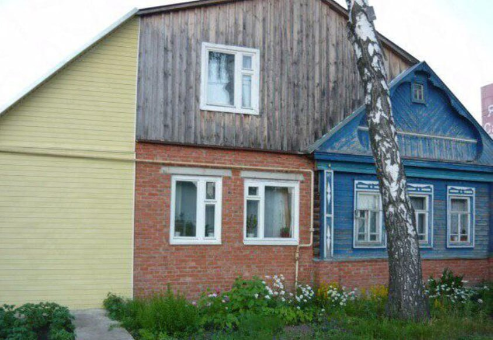

### Holy Grail
Священные вопросы в BPM и EA - однотипны (на форумах обоих типов однотипны и обычно уходят в холивар): какая нотация лучше (как рисовать схемы), нужно ли вообще рисовать процессные \ архитектурные картинки, кто их поймет, кому это нужно, они быстро устаривают, на них рисуют "не пойми что" и т.п.    
Единственное, что в BPM еще есть - это Процессный подход \ Процессное управление (общий смысл: За все хорошее и против всего плохого), а в EA нет подобного "идеологического скрепа".    
Вопросы типа: (публичную ссылку оттуда не сделать):   
*помоему  наше сообщество делится на две группы :*
- те , кто  считают что  можно нарисовать картинку которая отвечает на все вопросы, просто надо придумать нотацию 
- те кто точно знают что это невозможно, потому что эту нотацию кроме автора никто не будет понимать

*Смысл спича был не о том что хорошо картинки или плохо, а о том что вера в то что люди должны и могут видеть за одинакорвыми описаниями мира одинаковые миры неистребима и лечится только личным опытом попыток договаривать лдей чтоб они приняловместное решение*  
Люди даже одни и те же картинки видят по разному.

В разедле 2 будут фрагменты обсуждений, но вначале общий посыл: моделирование архитектур и процессов еще на начальном уровне развития, например, по сравнению с той же картографией. Пока мы только имеем не очень осознанные (субъективные) арх-нотации. Онтологического стержня у них особо не вижу (каждый сам что-то додумывает).  
Но это не страшно, для начала хотя бы через шаблонизацию их сравнивать между собой.  
Подобное было с процессными нотациями, см. http://www.workflowpatterns.com/  т.е.что нечто подобное хорошо было бы сделать с архитектурными нотациями.  

#### 1 Enterprise - Model - Notation
Есть предприятие и его архитектура. Есть **модель архитектуры** и диаграммы-проекции (картинки, иллюстрирующие фрагмент модели). 
Полагаю, что верны утверждения.  По точности: а) модель может бесконечно приближаться к своему прототипу. б) визуализация модели (т.е. набор диаграмм) может быть абсолютно точной (относительно модели). 
Вопрос только в трудозатратах и качестве методологии моделирования.
Что нельзя смоделировать и про какие контексты речь?

В целом нотации - это синтаксические обертки, которые являются просто контейнером для передачи семантики. 
Семантика представляет собой семантическую обертку смысла (тоже контейнер). И конечная задача (мега цель) - это как раз передать другим (и себе заодно) исходный смысл через эти две обертки. Там правда еще одна обертка смысла есть - онтология, поэтому путь длинный. И на практике конечно не обязательный, т.к. "можно скосить", часто достигнув цели (т.е. примерного понимания окружающими арх - схемы). Однако я про "капитальный подход": онтология - семантика - синтаксис (графическая нотация).

#### Возражения
- Вот некоторые и предлагают с архитектурой так же - вместо попытки нарисовать все и вся на одной схеме делать цифровые многомерные модели. Но архитектура даже не "геоид", тут и с цифровыми моделями слабая ясность.
Одно можно сказать - строить цифровые модели опираясть на нотацию плоских схем - не самое продуктивное занятие.
- Попытки нарисовать все на одной схеме - это почти всегда попытки показать, что система очень сложная и ее очень трудно проектировать, поэтому архитектор молодец.
В то время как рациональная (с точки зрения проектирования) цель ровно обратная - вытащить на рисунок тот уровень абстракции, которые уляжется в голове примерно целиком. Иной ценности схемы вряд ли могут нести.  
А полную сложность лучше все таки текстом (возможно кодом) выражать.

**Мое видение на возражения:** пока просто не научились ни модель (метаМодель) / синтаксическую обертку строить, ни под нее разные нотации (синтаксические обертки типа С4, Архимейт и т.п.). Онтология BPM и EA - это пока не изученные области. 

В целом: Конечно реальное Предприятие - это не его модель, а модель (полная модель предприятия) - это не диаграмма. Тем не менее набор диаграмм (с правильной Метамоделью \ онтологией) может с определенной точностью описать модель объекта. А модель объекта с определенной точностью может описать сам реальный объект.    
Или Реальный Карандаш - это не модель карандаша, а модель карандаша - это не какая-либо одна или две его проекции (разрез) или формула, т.е. на пара диаграмм (чертежей) и расчетов (например, прочностных).   

#### 1.1 Аналогия с картографией
В картографии как раз эти проблемы решены: и с проекциями разнообразными договорились и с легендами (на картах). Пересчет координат из одной системы в другую и т.п. 
Такой же уровень формализма (формальная семантика) должен быть и у архитекторов. А примеров больше, - тот же ЕСКД.
Открывая карту в зависимости от масштаба будут отображаться только определнные типы объектов. Шкала масштабов стандартизована. Вообще, очень много чего стандартизовано (есть институты картографии). Изображение рельефа, карта высот (разрезы) и т.п. Военная топография, наприемр, с 60-х годов КР без спутниковой навигации огибают рельеф и т.п. Это все к тому, что качество моделирования, уровень формализма (формальная семантика и синтаксис - легендирование) намного превосходят BPM \ EA, что и позволяет применять гео-моделирование на ином уровне. 

### 2 Обсуждение в группе
#### информация vs диаграмма
- можете обяъснить, какое отношение информация на любых диаграммах имеет к архитектуре?
Это обычно два-три view для двух-трех viewpoint, при том, что архитектура предполагает десятки разных viewpoint.
  - Диаграмма, это проекция архитектуры на какой то контекст, в котором отброшенные детали являются несущественными. В контексте развертывания несущественной деталью будет business value, в контексте оргпроцессов почти неважен стек и т.п.  
Сколько таких контекстов, столько и диаграмм.

#### Не важно как рисовать
Как есть разные view, так есть и разные viewpoint-ы, полагаю у каждого они немного свои. Однако на ходу изобретать очередную нотацию - это тоже перебор. ArchiMate + BPMN + UML более чем полный набор для описания всего чего угодно. А если за картинками есть ещё табличные представления со спецификациями и требованиями - получается полноценный архитектурный репозиторий. Если информация в репозитории кому-то полезна - им пользуются, а внешний вид - хорошо, если он соответствует общепризнанным стандартам. Думаю, метрики оценки полноты и качества - важнее собственно языка описания.

Если картинка помогает в принятии решений, то это уже прорыв. Мы сейчас опустим разговоры об уровне зрелости организации, где Большие, Красивые, Цветастые картинки за спиной в кабинете придают вес. Так что, как инструмент коммуникации и принятия решений - схемы/картинки - это прямо киллер фича :)

#### Рисуют, чтобы фиксировать для себя
- Лично мне картинки нужны не для того чтобы кому-то что-то объяснять, а чтобы удерживать целое у себя в голове. Для объяснений есть арх.комы, ВКС-ы, личные встречи - много болтовни и картинки там не главное.
- не только архитекторы для себя рисуют схемы, чтобы самому себе что то объяснить / закрепить. Это нормально. Иногда статьи пишут (и на хабре) ровно для этого: самому себе объяснить: когда читаешь свой же текст - некоторые вещи воспринимаешь иначе.
- Вот аналогично, хоть и с расширением: мне «картинки» помогают и самому лучше разобраться и другому «на пальцах» объяснить, что есть что.
Вся прелесть «картинок» в том, что лично я текст в голове могу обрабатывать 30-60 секунд, а на «картинку» взглянул и сразу верхнеуровнево становится понятно, что есть что.
«Картинки» рисовал для себя еще со времен, когда был middle-разработчиком. Например, какая-то сложная интеграция Системы A с Системой C, для которой используется промежуточное звено в виде Системы B с очень странным API. Даже просто читая последнее предложение уже становится не по себе, тут же возникают вопросы:
1)А зачем это промежуточное звено B?
2)Какие протоколы общения поддерживают Система A и C?
3)и т.д.
А когда у тебя есть «картинка», на которой все грамотно отражено, вопросы отпадают сами собой.
Но, есть одно жирное «но»: некоторые архитектурные схемы, модели их описания являются не особо формализованными (C4, например), что вызывает целый ряд проблем. Вспоминается старый мем: «У нас есть N стандартов на одно и тоже! Это возмутительно! Нужно создать один универсальный… Прошло полгода, теперь у нас есть (N+1) стандарт».
Лично мне бы хотелось, чтобы в индустрию пришел человек с непререкаемым авторитетом (как например, дядюшка Боб в разработке, хотя сейчас есть индивиды, которые и на него катят бочку) и принес «универсальный священный Грааль», который будет однозначным, автоматически устранять все коллизии, споры… Но это лишь мои глупые наивные мечты

#### Картинка - лучше текста
- графика - это "более человеческое" (по восприятию) и картинки на скалах появились намного раньше букв. Сила "графического представления" - схемы (даже не в очень понятной нотации) на уровне подсознания обрабатываются спец - сопроцессором (условно "человеческими" ROP/TMU) и более "естественны" человеку. Уже соединение стрелкой "двух чего" вызывает ассоциацию связанности.

##### Лучше текста, но когда много стрелок ...
- я не понимаю что может восприниматься на той чуши что я много раз видел с 10-12к иконок и 32к стрелок. вот объясните мне, кто это будет читать?проблема не в самих по себе схемах. а в том как по итогу их делают, вот я помню у нас арх когда мы доделали систему и передавали в эксплуатацию в фку налог сервис тоже пришёл, первый раз за всё время, нарисовал 4 схемы в А1 формате. и никто из эксплуатации налог сервиса их ни разу не открыл. Потом я в банке увидел 40 человек что эти схемы рисует. не ясно для кого
  - Умение читать схемы - это не встроенный атрибут аудитории (увы). 
Если схемы рисуются, то надо на целевую аудиторию тратить месяцы, чтобы научить их читать эти схемы (хотя бы что принято выделять элементами на схеме в компании).  
Те же электросхемы (прародитель всех схем) нужно изучать как читать - "архитектурные" (что бы тут ни имелось в виду) также.  
Иначе у нас и появляются схемы на 10к элементов - от палочной системы, или непонимания зачем это нужно (ну или это никому не нужно)
  - вот в том то и дело что 40 человек только их и рисует. в жизни проекта они никак не участвуют. они тупо рисуют кд схемы и сетевые схемы по 10-30к иконок. а потом ибшникам показывают какие конкретно иконки они туда добавили, но никто более эти схемы никогда не смотрел и нигде не использовал. в итоге 120 человек сидят и рисуют эти стрелки и иконки. я такое видел в фнс и в псб.  
типа сетевая схема почтового сервера, кластера хадупа.... просто под ярн hdfs и тд своя иконка стрелки и в этом аду человек сидит и добавляет новые иконки и стрелки при любом изменении.
  - Если эти схемы помогают согласовать решение для запуска в работу, закупку и пр. подобные вопросы - то они свою задачу выполняют. Если отдельный исполнитель в своем силосе , сильно ограниченный по доступному контексту, будучи вне матрицы коммуникаций, где эти схемы обсуждаются, ставит клеймо «не нужно», то это очень смелое заявление.
  
#### К терминам
если быть точным, то  
1) есть разные viewpoint, которые описывают, вообще говоря, разные системы с их архитектурой
2) описание архитектуры - всегда текст, так как у нас нет других таких полнофункциональных методов коммуникации. 
3) для некоторых текстов нужна иллюстрация для упрощения понимания, там появляются диаграммы.  
Когда ставят знак равенства между "картинкой с диаграммой" и "архитектурой", то скорее всего плохо понимают, что такое архитектура )

В головах у многих сложилось, что **архитектура это диаграмма**

- тут никто не приравнивает описание архитектуры к пачке диаграмм-рисунков. И никто не утверждает, что для какого-то viewpoint достаточно только диаграммы без каких-то текстовых пояснений.   
И Тогда твое высказывание получается про то,  что существует много viewpoint, для которых достаточно текста-списка-таблицы, а вот дополнительные диаграммы рисунки - не нужны (не упрощают восприятие). И их таких больше, чем тех, где диаграммы-рисунки полезны
В таком виде спорно, но правдоподобно. Можно попробовать посчитать.  
А тогда остается вторая часть про важность: что эти бездиаграммные viewpoint в целом существенно важнее тех, что с диаграммой
  -  Если бы все (или хотя бы многие) понимали, что диаграммы - только иллюстрация, я бы так не реагировал. Увы, большинство архитекторов под 'архитектурой' понимает картинку и даже не в archimate, а в C4, что очень грустно и печально. И программисты массово думают, что архитектура - это про картинки 
     - Ты просто слова подругому используешь. Ты арх принципы называешь архитектурой 

##### онтология - семантика - синтаксис (графическая нотация)
Онтология - это про "мир идей": как в нем формализованы \ определены используемые в описании понятия. Семантика - семантическая обертка - это про то, каким языком (DSL, например, Linked Data) передаются смыслы \ знания. Это язык знаний (атом знания - это триплет), например, RDF, это язык запросов к знаниям \ смыслам, например, SPARQL, это вычисления одних смыслов из других (reasoner).  
Синтаксис, например, текстовый - это тот же "родной язык" (набор из букв и сам алфавит). Графический синтаксис - это нотации для графического представления смыслов в виде квадратиков со стрелками.  
"В основах" - можно считать идею Семантического треугольника Фрегэ.

### 3 Рекомендации
Конечно, поэтому важны обе составляющие:  
1) Схемы для различных уровней архитектуры и стейкходеров. - на одной схеме для всех нельзя все показать.  
2) ADR и описание технических решений с требуемой детализацией - деталями не стоит перегружать схему, да и важно закрепить их текстом от разной интерпретации.

Какую часть архитектуры важно донести до других людей в лёгком для восприятия (визуальном) виде, то и надо включить в диаграмму

### 4 Отвлеченно
#### system
- Что есть система? Если в каком то объекте можно выделить взаимосвязанные составные части (подсистемы), то это и есть "система". В ГОСТ выделяли комплект и комплекс:
  - Комплект (набор) — это полный набор предметов, которые дополняют друг друга и могут использоваться отдельно,
  - Комплекс (система) — это совокупность взаимосвязанных элементов, которые выполняют общую функцию и составляют единое целое.  
Комплект - это просто набор, где элементы имеют простую связ типа "элемент лежит в одной коробке".  

- Одно предприятие, одна система (ит - система предприятия), одна  архитектура (ит-архитектура). Более того, даже один процесс (нулевой / корневой):
https://github.com/bpmbpm/doc/blob/main/BPM/theory/company-wide-process.md  
- аналог в ЕСКД "Схема деления изделия на составные части" [ГОСТ pdf](https://tehpis.ru/upload/gost-eskd/ESKD_GOST_2_711_82.pdf), где Изделие = Предприятие. Это такая большая схема (видел даже размерами 3х5 метров) - иерархия, где каждый элементик идентифицирован и показано его "место" в общей "схеме Изделия".
- Система и архитектура. Что вкладывется в понятие архитектура? Обычно это просто верхнеуровневая структура. Орг-структура до отдела - это архитектура организационного обеспечения (HR). Архитектура предприятия - это просто хоть и с полным охватам "по ширине", но только верхнеуровневое представление компании, укрупненная модель компании. Конечно, часто даже при углублении (в детали) используют слово "архитектура", но это просто от незрелости науки о ЕА (в той же картографии более четко все: крупный масштаб и мелкий).
- Поэтому мы и говорим: Одно предприятие = одна система = одна модель. В этой модели уже много подсистем: орг-структура, бизнес-архитектура, ИТ-архитектура и т.п. При этом, ИТ-архитектура (как верхнеуровневая модель единой ИТ-системы компании) - тоже одна.
- ссылки к термину "система - конструкция"
  - Это есть дуализм — система представляет из себя пару из **Функции и Конструкции** [mellarius.ru](https://mellarius.ru/systems-engineering). Определение системы через **emergent** - свойства, обусловленные взаимодействием его (холон) / её (системы) частей.   
  - Система представляет собой единство функции, конструкции, процесса и множества других групп описаний. Фишка в том, чтобы научиться разговаривать в этой терминологии и профессионализироваться в тех или иных системных рассмотрениях. https://ailev.livejournal.com/920248.html 
  - [Понятие системы и конструкции. Их место в проектировании информационных систем](https://habr.com/ru/articles/328192/)
#### system environment, company environment
*Клиент компании, регулятор и акционер – они же вне «периметра компании», вне контура системы.*   
Да, поэтому можно ввести «Окружение компании» (ближайшее окружение компании), «эко-система системы» и т.п. Для описания деятельности используем формализацию процессов, в которых участвуют «внешние элементы»: клиент, регулятор и акционер. Они - участники (роли) в процессах, которые входят в периметр компании. Более того, это основные \ ключевые процессы компании. Вообще именно на основе этой троицы и нужно проводить классификацию верхнеуровневых процессов (группа продуктовые процессы), т.е. классификацию процессов (сквозных, кросс-функциональных) по их продукту: 
- продукты клиентам (из каталога продуктов компании)
- продукты регулятору (обязательная отчетность)
- продукты акционеру  

Окружение системы – это аналог Окружение функции в Aris. Вообще, когда я формализую процессы, то ставлю вначале Предваряющие, а в конце Последующие процессы, т.е. формально Предваряющие и Последующие процессы не входят в состав (в границы) процесса, но в схеме процесса показаны (отдельным типом конечно, чтобы потом можно было автоматом делать семантический разбор схемы процесса). Окружение процесса или системы (контекст) – это то смысловое окружение, которое помогает понять значение объекта (процесса \ системы).  
Если совсем формально, то можно ввести градацию: Окружение системы (компании) первого порядка – когда внешний элемент («ролевой», типа клиент, регулятор и акционер или иной природы) – как объект присутствует в артефакте (схеме) системы, но формально не включен в состав системы. Т.е. «первое касание» в каком – любо взаимодействии с системой.  
Элементы Окружения системы (компании) также формализуются, описываются как объекты, только с типом, например, «смежный элемент системы». Да, они не входят в справочник объектов системы (условно - в схему деления изделия на составные части), но они фиксируются в справочнике объектов окружения. иногда обозначают [system in operational environment](https://mellarius.ru/systems-engineering).   
Пример. Есть компания (система) и делаем вторую - как клон: сменили только ИНН и счет в банке и т.п. Архитектура компании (системы) осталась прежней (даже внутренние ip могут остаться без изменений и штатное расписание), но клиенты, акционеры – новые (новое окружение системы). Система формально новая (ИНН), а ее архитектура – старая (без изменений).    
    
#### example of architecture

