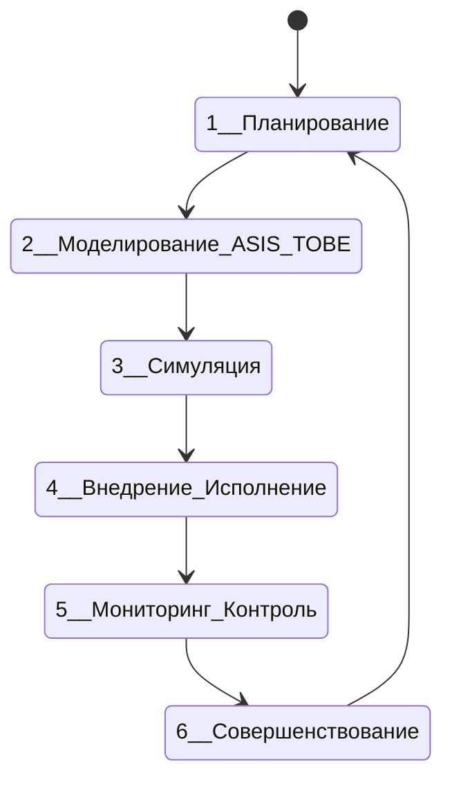
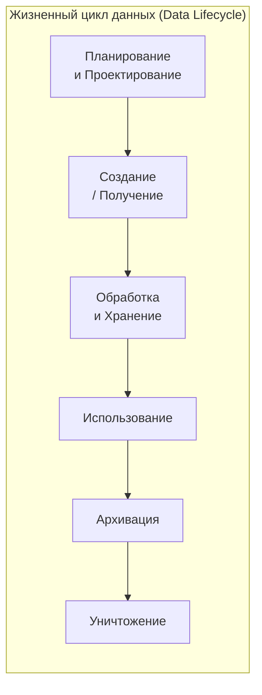
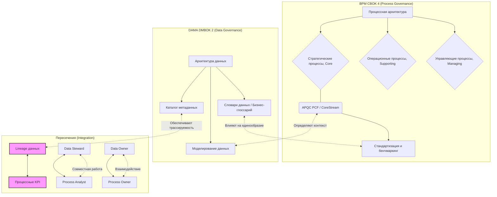

## 1
BPM CBOK 4 и DAMA DMBOK 2, хотя и являются авторитетными сводами знаний, созданы для решения разных задач.

Если **BPM CBOK** сосредоточен на процессе и потоке работ, то **DAMA DMBOK 2** делает ставку на актив — данные, которые обрабатываются в рамках этих процессов. Для максимально полного анализа этих двух профессиональных систем, я структурировал сравнение в серии таблиц ниже, чтобы можно было наглядно увидеть их сходства и различия.

---

### 1. Общее сопоставление BPM CBOK 4 и DAMA DMBOK 2

Эта таблица отражает ключевые различия на самом высоком уровне, показывая, как позиционируются и для кого предназначены эти два фундаментальных руководства.

| Характеристика | BPM CBOK 4 | DAMA DMBOK 2 |
| :--- | :--- | :--- |
| **Полное название** | Business Process Management Common Body of Knowledge | Data Management Body of Knowledge |
| **Издатель** | ABPMP (Association of Business Process Management Professionals) | DAMA International (Data Management Association) |
| **Центральный объект** | Бизнес-процессы, их потоки, роли и взаимодействия | Данные как ключевой актив, на протяжении всего его жизненного цикла |
| **Главная цель** | Обеспечить стандарт знаний для управления и оптимизации сквозных бизнес-процессов для достижения стратегических целей | Предоставить полный и структурированный свод знаний для управления данными как корпоративным активом |
| **Основной фокус** | **Динамика**: Как работа движется и трансформируется от начала до конца (от запроса до результата). | **Статика и семантика**: Что представляют собой данные (сущности, атрибуты, правила), их структура и качество. |
| **Целевая аудитория** | BPM-практики: владельцы процессов, бизнес-аналитики, архитекторы процессов, руководители, менеджеры по трансформации | Data Management-специалисты: администраторы БД, архитекторы данных, аналитики, инженеры данных, CDO, stewards |
| **Ключевой принцип** | Процессно-ориентированное управление — сквозные процессы, создающие ценность для клиента, выше функциональной иерархии | Данные — это корпоративный актив. Управление ими требует общеорганизационного подхода, стандартов и дисциплины |

### 2. Сравнение областей знаний (Knowledge Areas)

Структура областей знаний наиболее наглядно демонстрирует предметную область каждого руководства.

| BPM CBOK 4 | DAMA DMBOK 2 |
| :--- | :--- |
| 9 областей знаний, интегрированных в жизненный цикл BPM | 11 основных областей знаний (функциональных доменов) |
| **Уровень Организации / Бизнес-архитектура**: - Business Process Management (основы и принципы) - Strategic Alignment & Business Architecture (стратегическое выравнивание и бизнес-архитектура) - Enterprise Process Management (корпоративное процессное управление) - Governance (управление процессами) | **Data Governance** (управление данными, политики, стандарты, stewardship) |
| **Жизненный цикл процесса (анализ и дизайн)**: - Process Modeling (моделирование, визуализация текущего и целевого состояния) - Process Analysis (анализ, выявление узких мест, потерь и проблем) - Process Design (проектирование, реинжиниринг, оптимизация и автоматизация) | **Data Architecture** (архитектура данных, Data Catalog, маппинг данных) **Data Modeling & Design** (моделирование данных, нормализация, схемы) |
| **Жизненный цикл процесса (исполнение и измерение)**: - Process Performance Management (управление эффективностью, KPI процессов) - Technology & Transformation (технологии BPMS, RPA, AI, цифровая трансформация) - Process Mining (добыча процессов из логов событий) | **Data Warehousing & BI** (хранилища данных, озера данных, BI и отчетность) **Data Integration & Interoperability** (ETL/ELT, интеграция, API) **Data Storage & Operations** (хранение БД, операции, администрирование) |
| **Организационные изменения и культура**: - Leadership, Organizational Design & People Management (лидерство, дизайн оргструктуры, управление людьми) - Project & Change Management (проектное управление, управление изменениями) | **Data Quality Management** (управление качеством данных, профилирование, очистка) |
| **Новые темы и технологии версии 4.0**: Agile-методологии, репозитории процессов, минимальное программирование, RPA, блокчейн, AI/ML, Deep Learning, IoT | **Metadata Management** (управление метаданными, бизнес-глоссарий) **Reference & Master Data Management** (MDM, управление справочными данными) |
| *(Прямых аналогов в BPM нет)* | **Data Security** (безопасность данных, привилегии, шифрование, маскирование) |
| *(Прямых аналогов в BPM нет)* | **Document & Content Management** (управление неструктурированными данными: файлами, контрактами, изображениями) |
| **Дополнительно**: Построение карьеры BPM-специалиста, модель компетенций, вопросы этики, управление финансами и рисками процессов | **Дополнительно (Контекстные элементы)**: «Колесо знаний» с 7-ю элементами окружения (цели, культура, зрелость и т.д.), управление этикой данных |

### 3. Сравнение методологий и инструментов (чем они работают)

Здесь приведены основные практические методы, на которые опираются специалисты в каждой из дисциплин.

| Категория | BPM CBOK 4 | DAMA DMBOK 2 |
| :--- | :--- | :--- |
| **Стратегические подходы** | - Стратегические карты (Balanced Scorecard) - Анализ цепочки ценностей (Value Chain Analysis) М. Портера - Agile-методологии (для гибкой адаптации процессов) - Реинжиниринг бизнес-процессов (BPR) | - Стратегическое выравнивание данных с целями бизнеса - Управление изменениями и культурой данных (Data Culture) - Модели зрелости данных (Data Management Maturity - DMM) |
| **Аналитические методы** | - Process Mining (добыча и анализ реальных процессов из логов систем) - SWOT-анализ для процессов - Анализ пяти сил Портера для внешней среды - Симуляционное моделирование (What-if анализ) | - Профилирование данных (Data Profiling) - Анализ происхождения (Lineage) данных - Метрики качества данных (точность, полнота, своевременность и т.д.) - Системный анализ требований к данным |
| **Моделирование и нотации** | - BPMN 2.0 (де-факто стандарт для моделирования) - UML (Activity, Use Case диаграммы) - Value Stream Mapping (картирование потоков создания ценности) | - Концептуальные, логические и физические модели (ER-диаграммы) - Dimensional Modeling (звезда, снежинка) - UML (Class Diagrams) - Нотации для Data Vault, Anchor Modeling |
| **Управление и контроль** | - BPM Lifecycle Framework (5 фаз: от стратегии до измерения) - Центр компетенций BPM (BPM CoE) - Управление портфелем процессов | - Data Governance Operating Model (распределение ролей, полномочий) - Data Stewardship (роль попечителей данных) - Политики, стандарты, регламенты для данных |

### 4. Пересекающиеся методологии: что общего?

Оба свода знаний признают, что для успеха проектов необходимо сочетание лучших практик из разных дисциплин. Вот методологии, которые можно встретить в обоих руководствах:

1.  **Agile (Гибкие методологии)**: В BPM CBOK 4 Agile-методологии добавлены как новые темы для адаптации процессов. В DAMA DMBOK 2 гибкие подходы применяются при разработке моделей данных и управлении изменениями требований к данным. Agile в управлении данными часто называют "DataOps" — там используются те же принципы коротких итераций и обратной связи.
2.  **Lean (Бережливое производство)**: Не являясь явно выделенной главой, мышление Lean пронизывает BPM CBOK, особенно в анализе и устранении потерь в процессах. В DMBOK акцент на Lean виден в управлении качеством данных и оптимизации потоков интеграции данных.
3.  **Управление рисками (Risk Management)**: Оба свода признают важность управления рисками. Для BPM — это риски невыполнения процесса, операционные риски. Для DAMA — это риски утечки данных, юридические риски, риски, связанные с качеством и соответствием регуляторным требованиям.
4.  **Управление изменениями (Change Management)**: Ключевой элемент при внедрении как новых процессов, так и систем управления данными. BPM CBOK уделяет этому особое внимание как части организационного дизайна, а DAMA DMBOK 2 рассматривает это как критический фактор успешного внедрения программ Data Governance.

### 5. Таблица итоговых различий

Данные сравнения подводят итог тому, как каждая дисциплина подходит к решению практических задач и какие результаты дает бизнесу.

| Аспект | BPM CBOK 4 | DAMA DMBOK 2 |
| :--- | :--- | :--- |
| **Что в итоге создается? (Артефакты)** | - Карты процессов (BPMN) - Регламенты и SOP - KPI и панели мониторинга процессов - Требования к BPMS и RPA | - Модели данных (логические/физические) - Словари данных, бизнес-глоссарии, Каталоги метаданных - Политики Data Governance и Data Quality - Архитектура интеграции (Data Warehouse/Data Lake) |
| **Как измеряется успех? (KPI и метрики)** | - Время цикла процесса (Cycle Time) - Стоимость процесса (Process Cost) - Производительность (Throughput) - Удовлетворенность клиента (NPS, CSI) | - Точность, полнота, своевременность данных - Степень соответствия стандартам - Время решения инцидентов качества (MTTR) - Уровень принятия данных (adoption rate) |
| **Какие роли ключевые?** | - Владелец процесса (Process Owner) - Бизнес-аналитик (Business Analyst) - Архитектор процессов (Process Architect) - Менеджер по операционной эффективности | - Владелец данных (Data Owner) - Попечитель данных (Data Steward) - Архитектор данных (Data Architect) - Администратор баз данных (DBA) |
| **Когда применять?** | - Для оптимизации операционной эффективности - Для цифровой трансформации и автоматизации - Для внедрения процессного управления в компании | - Для создания единого источника правды (Golden Source) - Для обеспечения соответствия требованиям (например, GDPR, 152-ФЗ) - Для аналитики и отчетности (BI) |

---

### 6. Выводы и рекомендации

- **BPM CBOK 4** — это ваш выбор, если вы руководите трансформацией бизнеса. Он поможет системно улучшить сквозные процессы, которые создают ценность для клиента, снизить издержки и сделать компанию более гибкой. Он включает новейшие технологические тренды (RPA, AI, Process Mining) для цифровой автоматизации. Фундамент BPM CBOK — процессно-ориентированное управление, где четыре краеугольных камня — это **Ценности, Убеждения, Лидерство и Культура**.

- **DAMA DMBOK 2** — это ваш выбор, если ваша задача — навести порядок с данными. Он незаменим для создания надежной, качественной и безопасной информационной основы для отчетности, аналитики и AI. Он обеспечит единые стандарты для управления данными как стратегическим активом. Ключевые области DAMA DMBOK 2 включают **Data Governance, Data Architecture, Data Quality** и другие.

**В идеале, эти два руководства работают вместе.** Используйте подходы BPM CBOK для оптимизации процессов управления данными (Data Governance, MDM, ETL), а DAMA DMBOK 2 — для обеспечения качества и структурированности данных, которые являются "топливом" для этих процессов.

### 2

Анализ Process Governance и Data Governance показывает два взаимодополняющих, но принципиально разных подхода к управлению. Process Governance фокусируется на циклическом улучшении того, *как* выполняются задачи, а Data Governance — на обеспечении качества и ценности того, *с чем* работают, на протяжении всего его жизненного пути.

### 🔎 Детальное противопоставление Process Governance vs. Data Governance

Предлагаю начать с общего сравнения этих двух областей, чтобы затем углубиться в детали.

| Аспект | Process Governance (Управление процессами) | Data Governance (Управление данными) |
| :--- | :--- | :--- |
| **Основной объект** | Бизнес-процесс (последовательность действий, работ, операций) | Данные как корпоративный актив (их качество, безопасность, ценность) |
| **Ключевой цикл / Фундамент** | **PDCA** (Plan-Do-Check-Act). CBOK прямо утверждает, что большинство жизненных циклов BPM построены в соответствии с циклом PDCA. DMBOK также использует PDCA, но адаптирует его для управления данными. | **Жизненный цикл данных** (от создания до уничтожения) |
| **Главный вопрос** | *Как мы работаем?* Эффективны ли наши действия? | *С чем мы работаем?* Можно ли доверять нашим данным? |
| **Цель** | Обеспечить эффективность, результативность, адаптивность и соответствие процессов стратегии компании. | Обеспечить высокое качество, безопасность, соответствие нормативам и ценность данных на всех этапах их использования. |
| **Ключевые метрики (KPI)** | Время цикла (Cycle Time), стоимость процесса (Process Cost), производительность (Throughput), уровень ошибок, удовлетворенность клиента (NPS, CSI). | Точность (Accuracy), полнота (Completeness), своевременность (Timeliness), консистентность (Consistency), соответствие нормам. |
| **Роль в организации** | Стратегическая и тактическая: связывает стратегию компании с операционной деятельностью. | Стратегическая и техническая: создает среду и правила для надежного использования данных в аналитике, отчетности и операциях. |

---

### 🔄 Циклы и Lifecycle: PDCA vs. Линейдж (Lineage)

Различия между Process Governance и Data Governance особенно заметны при сравнении их базовых концепций — PDCA и Lifecycle.

#### PDCA как движущая сила непрерывных улучшений

CBOK 4 опирается на классический цикл Деминга (PDCA) и расширяет его до **шести этапов**, образуя замкнутый цикл постоянного совершенствования:

*   1.  **Планирование**: Определение стратегических целей, выбор критически важных для улучшения процессов.
*   2.  **Моделирование (AS-IS / TO-BE)**: Анализ текущего ("как есть") состояния и проектирование желаемого ("как должно быть") будущего процесса.
*   3.  **Симуляция**: Тестирование моделей TO-BE в безопасной среде для выявления узких мест и потенциальных проблем до реального внедрения.
*   4.  **Внедрение / Исполнение**: Реализация спроектированного процесса в реальной деятельности компании с обучением сотрудников и управлением изменениями.
*   5.  **Мониторинг и Контроль**: Сбор данных о производительности процесса с помощью KPIs и дашбордов для отслеживания его эффективности.
*   6.  **Совершенствование**: Анализ собранных метрик, выявление корневых причин проблем и инициирование нового цикла улучшений (Kaizen).

#### Lifecycle данных: от рождения до утилизации

Жизненный цикл данных в DMBOK 2 также включает несколько этапов, но его цель — не цикличное улучшение, а **линейдж (Lineage)** — прослеживание пути данных и управление ими на каждом этапе:

*   1.  **Планирование и Проектирование**: Определение требований к данным для будущих продуктов, архитектуры и правил их обработки.
*   2.  **Создание / Получение**: Данные создаются внутри компании (например, заполнение CRM) или получаются из внешних источников.
*   3.  **Обработка и Хранение**: Данные интегрируются, очищаются, трансформируются в витрины и хранятся в базах данных, озерах данных.
*   4.  **Использование**: Данные применяются в отчетах, дашбордах, моделях машинного обучения для поддержки принятия решений.
*   5.  **Архивация**: Данные, которые больше не используются активно, перемещаются в долговременное хранилище (холодное хранилище).
*   6.  **Уничтожение**: Данные, потерявшие ценность и актуальность, удаляются из всех систем в соответствии с политиками компании и требованиями законодательства.

---

### 👤 Владельцы: чем отличается Owner данных от Owner процесса

Несмотря на схожесть названий, это разные роли, которые должны дополнять друг друга. Владелец процесса отвечает за *эффективность выполнения*, а Владелец данных — за *качество и безопасность информации*, которая в этом процессе используется.

| Характеристика | Владелец процесса (Process Owner) | Владелец данных (Data Owner) |
| :--- | :--- | :--- |
| **Основная ответственность** | Дизайн, эффективность, результативность и постоянное улучшение сквозного бизнес-процесса. | Качество, безопасность, соответствие нормативам и ценность конкретного набора данных в рамках своей предметной области (домена). |
| **Фокус внимания** | Действия, потоки работ, роли, взаимодействия, технологии, автоматизация (RPA, BPMS). | Атрибуты, метаданные, происхождение (lineage), правила валидации, политики доступа, классификация данных. |
| **Ключевой вопрос** | "Как сделать так, чтобы процесс был быстрее, дешевле и лучше для клиента?" | "Являются ли данные в этом процессе точными, полными, безопасными и соответствующими стандартам?" |
| **Типичный представитель** | Руководитель отдела продаж, директор по логистике, операционный директор. | Руководитель маркетингового отдела для данных о клиентах, финансовый контролер для данных о транзакциях. |

---

### 🧩 Терминологическое пересечение: что общего в лексиконе BPM и DAMA?

Хотя области разные, они говорят на одном языке, когда речь заходит о базовых принципах управления. Вот некоторые ключевые понятия, объединяющие BPM и DAMA:

| Термин в BPM (Process Governance) | Термин в DAMA (Data Governance) | Общий смысл |
| :--- | :--- | :--- |
| **PDCA (Plan-Do-Check-Act)** | **Data Value Delivery Lifecycle** | Цикл Деминга как основа для непрерывного улучшения качества и управления. |
| **Владелец процесса (Process Owner)** | **Владелец данных (Data Owner)** / **Спонсор данных (Data Sponsor)** | Ответственное лицо (accountability). В BPM — за эффективность процесса, в DAMA — за качество данных. |
| **Организационный дизайн (Organizational Design)** | **Организационная структура управления данными (Data Governance Org. Structure)** | Модель распределения ролей, ответственности и полномочий. |
| **Бизнес-правила (Business Rules)** | **Правила качества данных (Data Quality Rules)** / **Политики (Policies)** | Формализованные инструкции, управляющие поведением сотрудников и систем. |
| **Стандарты (Standards)** | **Стандарты данных (Data Standards)** | Единые требования к форматам, определениям и процедурам. |
| **Риск-менеджмент (Risk Management)** | **Управление рисками данных (Data Risk Management)** | Выявление, оценка и минимизация операционных рисков. |

---

### 🗺️ Взаимосвязи и классификаторы: граф доменов BPM и DAMA

Чтобы наглядно представить, как термины и концепции из двух методологий соотносятся друг с другом, можно использовать следующую схему.

#### Типовые классификаторы процессов

*   **APQC Process Classification Framework (PCF)**: Это общепризнанный отраслевой стандарт, предоставляющий организациям общий язык для описания, бенчмаркинга и совершенствования процессов на разных уровнях.
*   **CoreStream**: Это программная платформа, которая использует PCF для построения иерархии процессов, управления регламентами и нормативами, позволяя интегрировать лучшие практики APQC в корпоративную среду.

---

### 🛠️ Ключевые инструменты и методики

Обе дисциплины опираются на широкий спектр методов и технологий:

*   **Process Governance**: BPMN 2.0 (моделирование), BPMS (системы управления), RPA, Process Mining (анализ по логам), инструменты симуляции.
*   **Data Governance**: Data Catalogs и Metadata Management (Alation, DataHub), MDM (Master Data Management), ETL/ELT средства, Data Quality инструменты (Informatica, Talend), Data Lineage инструменты.
*   **Общие методологии**: Agile, Lean, Change Management, Risk Management.

---

### 💎 Итоги

Process Governance и Data Governance — это две стороны одной медали. Управление процессами задает ритм и эффективность работы, а управление данными обеспечивает качество и надежность "топлива", на котором эта работа совершается. Их эффективное взаимодействие — залог успешной и устойчивой работы любой современной организации.

