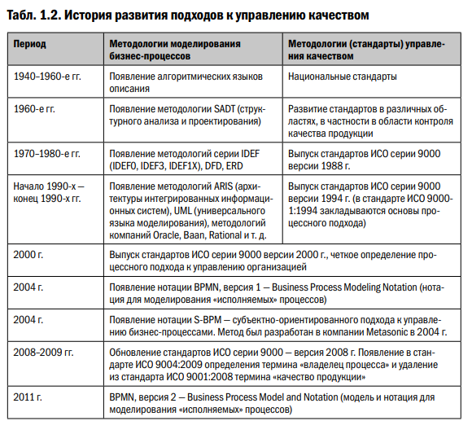

### history
- [wiki](https://ru.wikipedia.org/wiki/ISO_9000)
- [icgrp.ru](https://www.icgrp.ru/docs/list/standards/iso9001/9001-tkb/)

## 1 Base
[Стандарт ISO 9001 и его история](https://dqs-russia.ru/text/standart-iso-9001-i-ego-istoriya/)
- **Предистория**
- 1723: 22 января «Указ Петра I о качестве» - вроде как фейк, т.к. не нашли [Корнилу Белоглазова](https://aif.ru/society/history/god_bez_charki_ili_smertnoe_kaznenie_kakoy_byla_gospriyomka_pri_petre_i), но считается, что "Институт Военной приемки" Петром все же был основан. 
- 1933: Постановление ЦИК и СНК СССР № 84/2562 [«Об ответственности за выпуск недоброкачественной продукции»](https://ru.wikisource.org/wiki/%D0%9F%D0%BE%D1%81%D1%82%D0%B0%D0%BD%D0%BE%D0%B2%D0%BB%D0%B5%D0%BD%D0%B8%D0%B5_%D0%A6%D0%98%D0%9A_%D0%B8_%D0%A1%D0%9D%D0%9A_%D0%A1%D0%A1%D0%A1%D0%A0_%D0%BE%D1%82_08.12.1933_%D0%BE%D0%B1_%D0%BE%D1%82%D0%B2%D0%B5%D1%82%D1%81%D1%82%D0%B2%D0%B5%D0%BD%D0%BD%D0%BE%D1%81%D1%82%D0%B8_%D0%B7%D0%B0_%D0%B2%D1%8B%D0%BF%D1%83%D1%81%D0%BA_%D0%BD%D0%B5%D0%B4%D0%BE%D0%B1%D1%80%D0%BE%D0%BA%D0%B0%D1%87%D0%B5%D1%81%D1%82%D0%B2%D0%B5%D0%BD%D0%BD%D0%BE%D0%B9_%D0%BF%D1%80%D0%BE%D0%B4%D1%83%D0%BA%D1%86%D0%B8%D0%B8)
- **Запад**
- 1959: В США создали стандарт MiL-Q-9858a «Quality Program Requirements» «Требования к программам качества» - где было разъяснено, что должны делать подрядчики, чтобы достигнуть соответствия требованиям.
- 1962: Космическая программа NASA обзавелась своими «quality system requirements», «требования к системе качества» для поставщиков.
- 1968: В НАТО были приняты стандарты AQAP (Allied Quality Assurance Procedures) для поставщиков военного снаряжения. Правительство Великобритании ратифицировало эти стандарты.
- 1969: (за пределы оборонки) Центральный департамент электрификации Великобритании (Central Electricity Generating Board) и Комиссия по энергетике Онтарио (Ontario Hydroin Canada) создают собственный стандарт обеспечения качества для поставщиков. Ранее, в 1966, правительство Великобритании провело первую общенациональную компанию за качество и надежность. Она прошла под лозунгом «качество – дело каждого» (quality is everybody’s business).
- 1971 Британский институт стандартов (BSI – British Standards Institute) опубликовал первый британский (национального уровня) стандарт обеспечения качества – BS 9000, он был создан для электронной промышленности в ответ на большое количество проблем, которые случались в ней – еще одна новая отрасль.
- 1974: BSI публикует BS 5179 «Руководящие указания по обеспечению качества» («Guidelines for Quality Assurance»).
- 1979: BS 5750. Ключевые отраслевые ассоциации смогли согласовать общие подходы к контрактной документации для поставщиков, договорившись отбросить собственные стандарты и пользоваться только BS 5750. BS 5750 не имел ничего общего с методами повышения производительности.
- 1979 основан ISO/TC 176. Технический комитет Международной организации по стандартизации (ISO) должен разработать стандарт управления качеством. В основу лег уже существовавший (военный) британский стандарт BS 5750, который разрабатывался начиная с 1975 года.  
- **Начало ISO 9000**
- 1985: Выпущен первый *проект* серии стандартов ISO 9000 (ISO 9000/1/2/3/4)
- 1986: 28 августа 1986 года DQS выдает первый сертификат ISO 9001 в Германии для компании Hottinger Baldwin Messtechnik GmbH в Дармштадте на основе черновой версии DIN ISO 9001. 
- 1987: Первая версия стандарта, положившая начало серии ISO 9000. Серия стандартов ISO 9001/2/3 опубликована в Германии как демонстрационная модель систем обеспечения качества из 20 элементов в качестве стандартов DIN ISO:
  - DIN ISO 9001 как образец обеспечения качества во всех сферах деятельности компании: проектирование, разработка, производство, сборка и обслуживание клиентов.
  - DIN ISO 9002 как образец обеспечения качества при производстве и сборке.
  - DIN ISO 9003 как модель представления обеспечения качества при окончательном контроле.
- 1994: Внесены улучшения, касающиеся проектирования и разработки, разъяснения требований. Первая редакция (корректировка) ISO 9001. Однако тогда было внесено лишь несколько незначительных изменений, в основном редакционного или концептуального характера.
- 2000: Обновление всей серии, сокращение числа стандартов, объединение ISO 9001, 9002, 9003 в один, с акцентом на процессный подход. Версия 2000 года представляла собой фундаментальный пересмотр и слияние ISO 9001, ISO 9002 и ISO 9003 в единый стандарт.  
  - Переход от QA = обеспечения качества к QM = управлению качеством в 1990-е годы и введение фокуса на процессы стали двумя дальнейшими важными вехами в истории ISO 9001. Концептуальный переход от обеспечения к управлению соответствовал его важности для корпоративной практики. Таким образом, ISO 9001 наконец-то был поднят на уровень менеджмента, руководства, т.е. где на самом деле ответственность лежит на «надлежащем корпоративном управлении».  
  - Пересмотренный стандарт теперь был написан на более понятном языке. Это облегчило использование во всех отраслях. По содержанию процессно-ориентированная структура заменила предыдущие 20 элементов.
  - Еще одной новой особенностью стало усиление внимания к удовлетворенности клиентов и ориентация на основные процессы.
- 2008: Редакция 2000 года (четвертое издание ISO 9001 ) с уточнениями и разъяснениями, без новых требований, повышающая совместимость с ISO 14001. Базовая структура и стратегическая направленность стандарта остались неизменными. 
- 2012: ISO приняла структуру высокого уровня (HLS) и включила ее в Дополнение ISO к директивам ISO/IEC, часть 1. Ядро текста относится к основным требованиям, которые одинаковы для всех известных стандартов систем менеджмента. В зависимости от стандарта ISO они дополняются конкретными требованиями, например,
  - ISO 14001 (окружающая среда),
  - ISO 45001 (охрана труда и безопасность) и
  - ISO 27001 (информационная безопасность).  
Кроме того, единая терминология значительно облегчает применение различных стандартов. Таким образом, различные системы управления будут легче объединяться или интегрироваться в существующую систему управления. 
- 2015: Самый значительный пересмотр, введение Высокоуровневой Структуры (HLS) и Цикла PDCA (Планируй-Делай-Проверяй-Действуй), требование учитывать контекст организации, лидерство и риски. Ключевые нововведения:
  -«Контекст организации», т.е. внутренняя и внешняя среда компании
  - Рассмотрение соответствующих заинтересованных сторон
  - Акцент на ответственности высшего руководства
  - Риск-ориентированный подход, который заменяет, среди прочего, так называемые превентивные меры.
  - «Знания организации», которые впервые названы ресурсом.
- 2026 (Ожидается): Следующая редакция, которая будет опираться на ISO 9001:2015, но добавит фокус на культуру качества, этичное поведение и другие современные требования. 

Семейство стандартов:
- ISO 9000: Основы и словарь.
- ISO 9001: Требования к СМК (системы менеджмента качества).
- ISO 9004: Руководство по улучшению деятельности, ориентированное на устойчивый успех. 

### history link
- [Стандарт ISO 9001 и его история](https://dqs-russia.ru/text/standart-iso-9001-i-ego-istoriya/)
- [Краткая история ISO 9000. Где мы допустили ошибку?](https://1cert.ru/stati/kratkaya-istoriya-iso-9000-gde-my-dopustili-oshibku)
- https://www.iso9001help.co.uk/ISO-9000-history.html
- https://pubmed.ncbi.nlm.nih.gov/7617456/

### info
- [статьи icgrp.ru](https://icgrp.ru/docs/list/article/?action=assortment&parent=18)
- [Двигаться дальше ISO 9000 deming.ru](https://www.deming.ru/TeorUpr/Quality_Collection/17_Dvigatsa_dalshe_ISO9000.htm)

## 2 glava_1.pdf
- [glava_1.pdf](https://www.mann-ivanov-ferber.ru/assets/files/bookparts/the-process-approach-to-management/glava_1.pdf)

  - 1970s-80s IDEF-методология создана на средства ВВС США [(ICAM)](https://en.wikipedia.org/wiki/IDEF) и в дальнейшем передана миру (как и DoD стек TCP\IP)
