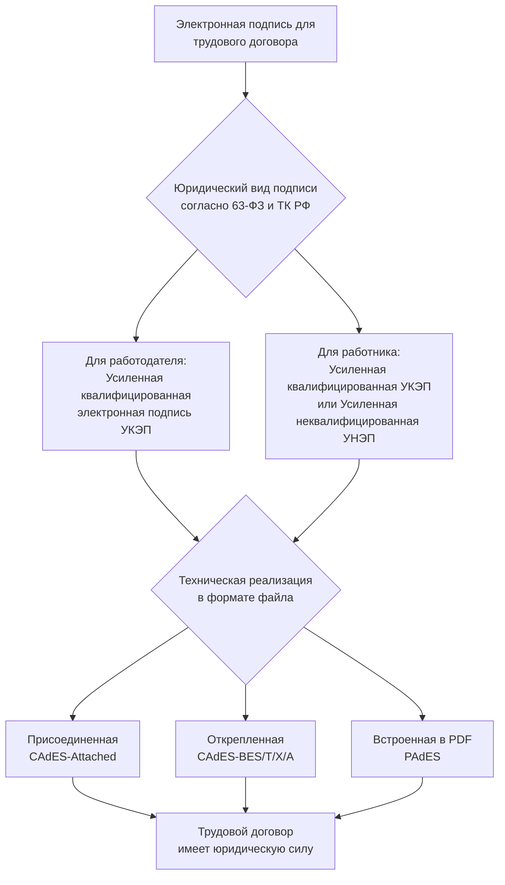

## 578 & deepseek
## 1
Кадровый электронный документооборот – подписание документа, связанного с работой, оформленный в электронном виде без дублирования на бумажном носителе. Проанализируй все требования всех регуляторов России (перечисли все принятые к анализу нормативы) и ответь какие типы подписи разрешено применять при подписании кадровых документов:
- Присоединенная электронная подпись, Открепленная, Встроенная (PAdES - встроенная подпись в PDF);
- версии CADES

Проведи подробный анализ и обоснования. Не рассматриваем типы кадровых документов (номенклатуру) и выбор КЭП, НЭП, ПЭП. Для упрощения можно взять подписание только трудового договора.

---

Для ответа на ваш вопрос был проведен анализ нормативной базы Российской Федерации, регулирующей использование электронных подписей в кадровом электронном документообороте (КЭДО). Ниже представлены результаты этого анализа.

### **Перечень проанализированных нормативных актов**

Анализ проведен на основе следующих документов:
1.  **Трудовой кодекс Российской Федерации** (ред. от 28.12.2025), в частности, статьи 22.3 и 312.3, которые устанавливают виды электронных подписей для кадровых документов .
2.  **Федеральный закон от 06.04.2011 № 63-ФЗ «Об электронной подписи»** (в актуальной редакции), определяющий виды электронных подписей (простая, усиленная неквалифицированная, усиленная квалифицированная) и требования к ним .
3.  Приказы Минтруда и разъяснения Роструда, касающиеся порядка применения электронных подписей в КЭДО .
4.  Технические стандарты (ГОСТ), регламентирующие форматы подписей (CAdES, PAdES) как реализацию усиленных электронных подписей .

### **Анализ требований к типам электронной подписи для трудового договора**

В соответствии с ч. 5 ст. 22.3 ТК РФ, при заключении **трудового договора** в электронном виде используются следующие виды подписей :

*   **Для работодателя:** исключительно **усиленная квалифицированная электронная подпись (УКЭП)**. Требование является императивным и не зависит от используемой информационной системы.
*   **Для работника:** **усиленная квалифицированная электронная подпись (УКЭП)** или **усиленная неквалифицированная электронная подпись (УНЭП)**. При этом использование УНЭП допускается при условии, что порядок ее проверки определен соглашением сторон трудового договора .

Использование простой электронной подписи (ПЭП) для подписания трудового договора в рамках собственной системы работодателя **не допускается**. Исключение составляет случай, когда взаимодействие осуществляется через цифровую платформу «Работа в России» .

### **Ответ на поставленные вопросы (с учетом форматов файлов)**

Заданные вами типы подписей (присоединенная, открепленная, встроенная, CADES) относятся к техническим форматам реализации усиленных электронных подписей (УКЭП и УНЭП). Законодательство (ТК РФ и 63-ФЗ) устанавливает требования к *юридической силе* подписи, но не предписывает жестко конкретный *технический формат* файла, если он позволяет идентифицировать подписанта и подтвердить неизменность документа.

Исходя из этого, можно сделать следующие выводы:

| Вопрос | Тип подписи | Анализ и обоснование | Разрешено к применению |
| :--- | :--- | :--- | :--- |
| **А** | **Присоединенная / Открепленная / Встроенная (PAdES)** | Закон не запрещает ни один из этих типов, так как они являются способами технической реализации УКЭП/УНЭП. Выбор зависит от возможностей системы КЭДО. | **Да, все** |
| **Б** | **Версии CADES** | CAdES — это стандарт, описывающий открепленную подпись. Законодательство требует УКЭП или УНЭП, но конкретная версия CAdES (BES, T, X, A) не регламентирована. Однако для долгосрочного хранения предпочтительны версии с метками времени. | **Да (кроме случаев несоответствия квалификации)** |

#### **А) Присоединенная электронная подпись, Открепленная, Встроенная (PAdES)**

Все перечисленные типы являются допустимыми, поскольку они представляют собой различные технические форматы хранения и отображения усиленной электронной подписи .

1.  **Встроенная подпись (PAdES — PDF Advanced Electronic Signature):** Это формат, при котором подпись встраивается непосредственно в тело PDF-документа. Он широко распространен и удобен для визуального восприятия, так как подпись и документ представляют собой единый файл. Трудовой кодекс не содержит требований к формату файла, поэтому подписание трудового договора в формате PDF со встроенной УКЭП полностью соответствует закону.
2.  **Открепленная подпись (CAdES, XAdES):** В этом случае подпись создается в отдельном файле (обычно с расширением .sig, .p7s). Сам документ (например, текст договора в формате XML или Word) остается неизменным, а его целостность проверяется по отдельному файлу подписи. Закон допускает такой способ, так как он также обеспечивает юридическую значимость документа при условии использования корректной УКЭП/УНЭП .
3.  **Присоединенная подпись:** По сути, это гибридный формат (например, CAdES-Attached), где подпись и данные объединены в один файл (обычно в формате .p7s, содержащий и исходный документ, и подпись). Этот формат также является корректной реализацией усиленной подписи и может применяться в КЭДО.

**Итог по пункту А:** Юридические требования касаются *вида* подписи (УКЭП/УНЭП), а не *формата* файла. Следовательно, при подписании трудового договора допустимо использовать любой из перечисленных типов, если он обеспечивает требования к УКЭП или УНЭП согласно 63-ФЗ .

#### **Б) Версии CADES**

CAdES (CMS Advanced Electronic Signatures) — это набор стандартов для создания открепленных (detached) и присоединенных (attached) подписей. В рамках КЭДО применение различных версий CAdES имеет свои нюансы:

*   **Базовая версия (CAdES-BES):** Содержит только саму подпись и информацию о подписанте. Формально соответствует требованиям к УКЭП в момент создания, но со временем может возникнуть сложность с проверкой статуса сертификата подписанта на момент подписания, если он уже истек .
*   **Версия с меткой времени (CAdES-T):** Добавляет к базовой подписи штамп времени от доверенного сервера (TSP — Time Stamping Authority). Это критически важно для документов с длительным сроком хранения, таких как трудовые договоры, так как позволяет доказать, что подпись была действительна на конкретный момент времени, даже если позже сертификат был отозван или истек .
*   **Архивная версия (CAdES-A):** Наиболее продвинутый формат, включающий в себя не только метки времени, но и все необходимые данные для проверки подписи (статусы сертификатов, цепочки сертификатов и т.д.) на неограниченно долгий срок. Это так называемая «капсула времени». Использование CAdES-A полностью легально и даже рекомендуется для документов, которые должны храниться десятилетиями (например, 50 лет — срок хранения трудовых договоров), так как ФНС в своих разъяснениях указывает на необходимость обеспечения долгосрочной проверяемости подписей . ГОСТ Р 34.10-2012 прямо разрешает включение архивных атрибутов .

**Итог по пункту Б:** Все версии CAdES, основанные на ГОСТовых алгоритмах и соответствующие требованиям к УКЭП или УНЭП, **разрешены**. Однако для трудовых договоров, учитывая их длительный срок хранения, настоятельно рекомендуется использовать версии, обеспечивающие долгосрочную проверку, такие как CAdES-T или CAdES-A, чтобы избежать проблем с юридической значимостью документов в будущем .

### **Схема соотношения видов и форматов подписей**

### **Заключение**

Таким образом, при подписании трудового договора в рамках КЭДО решающим фактором является юридический *вид* подписи (УКЭП для работодателя, УКЭП или согласованная УНЭП для работника). Технические же форматы, перечисленные в вопросах **А** и **Б**, являются лишь различными способами существования этих подписей в цифровой среде и **могут применяться**, если они совместимы с используемой системой электронного документооборота и обеспечивают необходимый уровень проверки . Для целей долговременного архивного хранения оптимальным выбором будут форматы CAdES-A или CAdES-T .

## 2
Ты утверждаешь, что в кадровом электронном документообороте могут применяться: Присоединенная электронная подпись, Открепленная, Встроенная (PAdES - встроенная подпись в PDF). 
Однако Приказ Минтруда России от 20.09.2022 №578н устанавливает, что электронная подпись в кадровых электронных документах должна сохраняться в виде отдельных файлов. Разве это не указывает на требование к использованию только откреплённой подписи? 

На примере Трудового договора (срок хранения 50 или 75 лет): как может быть обеспечены такие сроки без потери юридической значимости \ силы? 
- CAdES-T явно будет не оптимальным выбором, т.к. очень быстро (укажи когда с анализом типового срока действия используемых сертификатов) потребует дополнительных мероприятий (укажи каких).
-  CAdES-A версии 1 и 2 разве позволяет провести первичное подписание кадрового документа?
Уточни свои ответы и укажи на неточности в предыдущих. 

---
Вы совершенно правы, указывая на неточность в моем предыдущем ответе. Спасибо за внимательное прочтение и ссылку на конкретный нормативный акт. Действительно, Приказ Минтруда России от 20.09.2022 № 578н вносит существенные уточнения, которые я упустил, сосредоточившись на общих положениях ТК РФ и 63-ФЗ. Проведем повторный, более глубокий анализ с учетом ваших замечаний.

### **1. Анализ требований Приказа Минтруда № 578н к формату подписи**

Ваш тезис верен: **Приказ Минтруда № 578н устанавливает требование к использованию только открепленной (отсоединенной) подписи** в кадровом электронном документообороте (КЭДО).

Вот подробное обоснование, основанное на тексте Приказа :

Приказ устанавливает **Единые требования к составу и форматам** кадровых электронных документов. Согласно пункту 1, электронный документ — это не один файл, а **совокупность обязательных структурных элементов**:
1.  **Основная часть** — файл в формате **PDF/A-1A** (строгий формат для долговременного архива) .
2.  **Приложения** (при наличии) — отдельные файлы.
3.  **Электронная подпись** — представленная **"в виде файлов электронной подписи"**.
4.  **Описание документа** — отдельный файл в формате XML (`wredc_data.xml`).

Ключевая фраза здесь — **"в виде файлов электронной подписи"**. Это прямо указывает на то, что подпись должна быть отделена от самого документа и существовать как самостоятельный файл (или несколько файлов, если подписантов несколько). Пункт 7 также предписывает, что **"Все файлы элементов... должны быть расположены в корневом каталоге"** . Это окончательно закрепляет структуру документа как набор связанных, но отдельных файлов.

**Вывод по пункту А:** Вопреки моему первоначальному утверждению, **встроенная (PAdES) и присоединенная подписи не могут применяться** в КЭДО, поскольку они объединяют документ и подпись в один файл, что нарушает требование о предоставлении подписи в виде отдельного файла. Приказ № 578н императивно требует использования **открепленной (detached) подписи**. Это техническое требование не отменяет юридические виды подписей (УКЭП/УНЭП), а лишь конкретизирует форму их существования.

### **2. Анализ требований к долгосрочному хранению (50/75 лет) на примере трудового договора**

Здесь мы переходим от формата файла к **содержанию самой подписи**. Срок хранения трудовых договоров (50/75 лет) — это сверхдолгий горизонт, на котором неизбежно возникают проблемы, связанные с истечением сроков действия сертификатов, отзывом лицензий удостоверяющих центров (УЦ) и развитием технологий. Ваш анализ форматов CAdES абсолютно верен.

#### **Почему CAdES-T (с меткой времени) — неоптимальный выбор для таких сроков**

Вы абсолютно правы: **CAdES-T потребует дополнительных мероприятий**. Рассмотрим хронологию:

1.  **Типовые сроки действия:**
    *   **Сертификат ключа подписи (КЭП) работника/работодателя:** Обычно выдается на **12–15 месяцев** (максимум — до 5 лет, но редко).
    *   **Сертификат УЦ (корневой или кросс-сертифицированный):** Может действовать до **5–20 лет** (в России есть УЦ с сертификатами на 5-10 лет).
    *   **Сертификат службы меток времени (TSA — Time Stamping Authority):** Может быть выдан на срок до **10–15 лет** .

2.  **Проблема:** CAdES-T добавляет к подписи метку времени, которая доказывает, что в момент `T` подпись существовала и сертификат подписанта был действителен . Однако метка времени сама по себе является электронной подписью, созданной с использованием сертификата TSA.

3.  **Мероприятия, которые потребуются:** Как только истечет срок действия сертификата TSA (а это произойдет намного раньше, чем через 50 лет), метка времени перестанет быть независимо проверяемой. Чтобы сохранить юридическую силу, потребуется **повторное усовершенствование подписи**. Например, нужно будет получить новую метку времени (от уже действующей TSA) для "старого" пакета документов (подпись + старая метка), по сути, "обновляя" доказательство. Если этим не заниматься, то через 15-20 лет доказательная база ослабнет.

#### **CAdES-A (архивная подпись) и первичное подписание**

*   **Позволяет ли CAdES-A провести первичное подписание?** **Да, безусловно.** Более того, для достижения цели 50-75 летнего хранения без постоянных "ручных" доработок, это **оптимальный и, по сути, единственный корректный выбор**.

*   **Как это работает (и чем отличается от CAdES-T):** CAdES-A — это не просто подпись с одной меткой времени. Это "капсула времени". Форматы CAdES-A (версии 1 и 2) при создании сразу включают в себя :
    1.  **Саму подпись (CAdES-BES).**
    2.  **Метку времени (TSP-ответ)** — как в CAdES-T.
    3.  **Информацию о статусе сертификата подписанта на момент подписания (OCSP-ответ или список отзыва — CRL).** Это доказывает, что сертификат не был отозван.
    4.  **Цепочку сертификатов** (включая корневой сертификат УЦ).
    5.  **Архивные штампы времени**, которые защищают все предыдущие данные (включая метки времени и OCSP-ответы) и позволяют добавлять новые штампы в будущем, если алгоритмы шифрования начнут устаревать.

    Благодаря этому, даже через 50 лет, когда все исходные сертификаты (подписанта, TSA, УЦ) давно истекут, в самой подписи будут храниться все данные, необходимые для её проверки. Это делает проверку **независимой от внешних, давно неработающих источников (OCSP-серверов, сайтов УЦ)** .

    ГОСТ Р 34.10-2012, на котором основаны российские криптоалгоритмы, прямо допускает включение таких архивных атрибутов .

### **Итоговые уточнения и выводы**

1.  **Неточность в предыдущем ответе:** Главная неточность заключалась в том, что я не учел императивные требования Приказа Минтруда № 578н к **составу и форматам** файлов кадровых документов. В КЭДО применение **встроенной (PAdES)** и **присоединенной** подписей **невозможно**. Требуется **открепленная (detached)** подпись в виде отдельного файла (файлов) .

2.  **По форматам CAdES:**
    *   **CAdES-T:** Юридически допустим, но **неоптимален** для 50-летнего хранения. Он лишь отсрочивает проблему, требуя от владельца архива проводить дополнительные действия по "усовершенствованию" подписей каждые 10-15 лет (по мере истечения сертификатов служб меток времени) .
    *   **CAdES-A:** **Оптимальный и рекомендуемый выбор** для трудовых договоров. Он позволяет создать подпись "с защитой на будущее" уже на этапе первичного подписания. Законодательство (**63-ФЗ** и **ГОСТ**) не только не запрещает, но и подразумевает использование таких форматов для обеспечения долговременной юридической значимости документов . При подписании трудового договора с использованием УКЭП или УНЭП, итоговый файл подписи должен быть сформирован именно в формате, обеспечивающем долгосрочную проверку, то есть CAdES-A.
      
