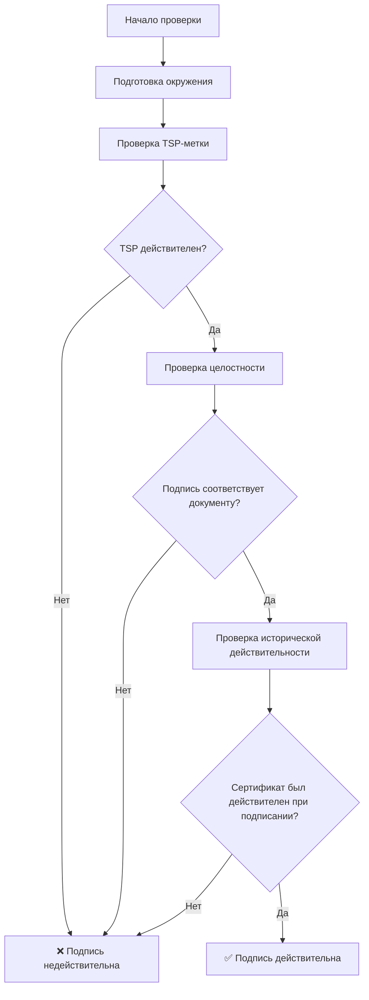
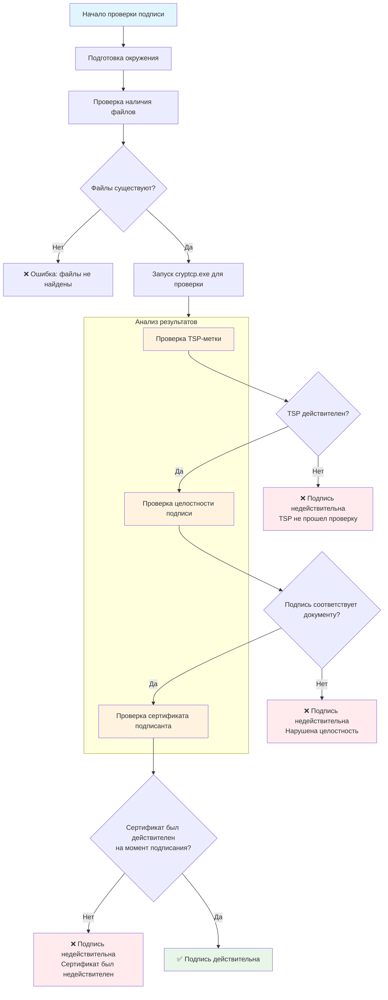
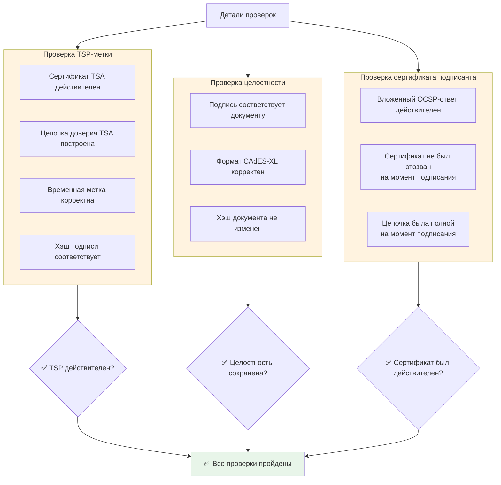
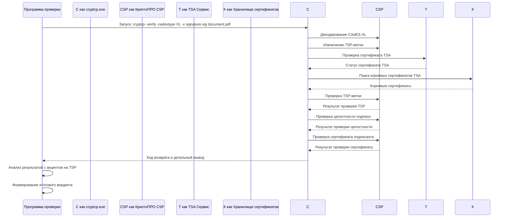
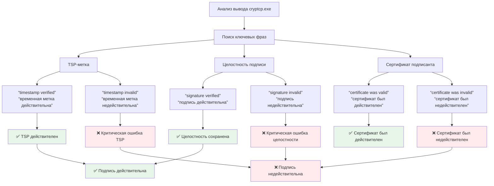
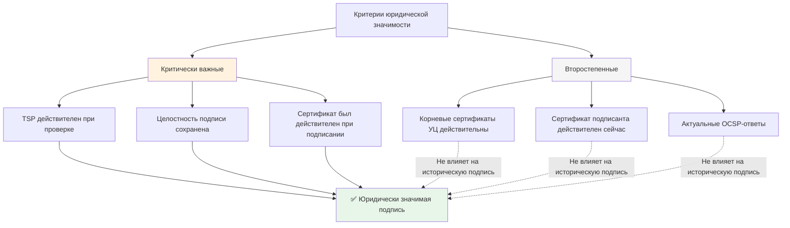

### cryptcp.exe signature verification
### 1
Алгоритм проверки подписи CAdES-XL с учетом того, что TSP должен быть действительным при проверке, а сертификаты подписанта могут быть просрочены.

## Алгоритм проверки подписи с cryptcp.exe



## Детальный алгоритм проверки

### 1. Подготовка окружения для проверки

**Обязательные условия:**
- Установлен КриптоПРО CSP
- Установлены актуальные доверенные корневые сертификаты для TSA
- Доступ к интернету для проверки TSP

```bash
# Проверка установки КриптоПРО
where cryptcp.exe

# Проверка доступности TSP-сервиса
ping tsp.tensor.ru
```

### 2. Проверка TSP-метки (критически важно)

```bash
# Команда проверки с акцентом на TSP
cryptcp -verify -cadestype XL -v "signature.sig" "document.pdf"
```

**Что проверяет cryptcp в TSP:**
- Действительность сертификата TSA на момент проверки
- Цепочку доверия TSA до доверенного корневого УЦ
- Корректность временной метки
- Соответствие хэша подписи

### 3. Анализ результатов проверки

```python
import subprocess
import re

def verify_signature(signature_file, document_file):
    """
    Функция проверки подписи с анализом TSP
    """
    command = [
        "cryptcp.exe",
        "-verify",
        "-cadestype", "XL", 
        "-v",  # Детальный вывод
        signature_file,
        document_file
    ]
    
    result = subprocess.run(command, capture_output=True, text=True, encoding='cp866')
    
    return analyze_verification_result(result)

def analyze_verification_result(result):
    """
    Анализ вывода cryptcp с акцентом на TSP
    """
    output = result.stdout + result.stderr
    
    # Критически важные проверки
    checks = {
        'tsp_valid': False,
        'signature_integrity': False,
        'historical_cert_valid': False
    }
    
    # Проверка TSP-метки
    if re.search(r'Timestamp.*valid|Временная.*метка.*действительна', output, re.IGNORECASE):
        checks['tsp_valid'] = True
    
    # Проверка целостности подписи
    if re.search(r'signature.*valid|подпись.*действительна', output, re.IGNORECASE):
        checks['signature_integrity'] = True
    
    # Проверка исторической действительности сертификата
    if re.search(r'certificate.*was.*valid|сертификат.*был.*действителен', output, re.IGNORECASE):
        checks['historical_cert_valid'] = True
    
    # Определение итогового результата
    if checks['tsp_valid'] and checks['signature_integrity']:
        return "✅ Подпись действительна"
    else:
        return "❌ Подпись недействительна"
```

### 4. Интерпретация кодов возврата cryptcp.exe

```python
def interpret_exit_code(exit_code):
    """
    Интерпретация кодов возврата cryptcp.exe
    """
    exit_codes = {
        0: "✅ Успешная проверка",
        1: "❌ Общая ошибка",
        2: "❌ Неверный формат подписи", 
        3: "❌ Проблема с сертификатом",
        4: "❌ Ошибка цепочки доверия",
        5: "❌ Ошибка проверки целостности"
    }
    return exit_codes.get(exit_code, f"❌ Неизвестный код ошибки: {exit_code}")
```

## Практические команды для разных сценариев

### Сценарий 1: Базовая проверка
```bash
cryptcp -verify -cadestype XL "document.pdf.sig" "document.pdf"
```

### Сценарий 2: Детальная проверка с фокусом на TSP
```bash
cryptcp -verify -cadestype XL -v -tsp "http://tsp.tensor.ru" "document.pdf.sig" "document.pdf"
```

### Сценарий 3: Проверка с игнорированием просроченных сертификатов подписанта
```bash
# К сожалению, cryptcp не имеет прямого параметра для игнорирования просрочки
# Но можно использовать кастомное хранилище сертификатов
cryptcp -verify -cadestype XL -store "My" "document.pdf.sig" "document.pdf"
```

## Полная программа проверки на Python

```python
import subprocess
import os
from datetime import datetime

class SignatureVerifier:
    def __init__(self, cryptcp_path="cryptcp.exe"):
        self.cryptcp_path = cryptcp_path
        
    def verify_signature(self, signature_path, document_path):
        """
        Полная проверка подписи с акцентом на TSP
        """
        print(f"🔍 Проверка подписи: {os.path.basename(signature_path)}")
        print(f"📄 Документ: {os.path.basename(document_path)}")
        print(f"🕒 Время проверки: {datetime.now()}")
        
        # Проверка существования файлов
        if not os.path.exists(signature_path):
            return "❌ Файл подписи не найден"
        if not os.path.exists(document_path):
            return "❌ Файл документа не найден"
        
        # Выполнение проверки
        command = [
            self.cryptcp_path,
            "-verify",
            "-cadestype", "XL",
            "-v",
            signature_path,
            document_path
        ]
        
        try:
            result = subprocess.run(
                command,
                capture_output=True,
                text=True,
                encoding='cp866',
                timeout=30
            )
            
            return self.analyze_result(result)
            
        except subprocess.TimeoutExpired:
            return "❌ Таймаут проверки"
        except FileNotFoundError:
            return "❌ cryptcp.exe не найден"
    
    def analyze_result(self, result):
        """
        Детальный анализ результатов проверки
        """
        analysis = {
            'success': result.returncode == 0,
            'exit_code': result.returncode,
            'tsp_status': 'unknown',
            'signature_status': 'unknown',
            'certificate_status': 'unknown'
        }
        
        output = result.stdout + result.stderr
        
        # Анализ TSP
        if 'timestamp verified' in output.lower() or 'временная метка действительна' in output.lower():
            analysis['tsp_status'] = 'valid'
        elif 'timestamp invalid' in output.lower() or 'временная метка недействительна' in output.lower():
            analysis['tsp_status'] = 'invalid'
        
        # Анализ подписи
        if 'signature verified' in output.lower() or 'подпись действительна' in output.lower():
            analysis['signature_status'] = 'valid'
        elif 'signature invalid' in output.lower() or 'подпись недействительна' in output.lower():
            analysis['signature_status'] = 'invalid'
        
        # Формирование итогового вердикта
        return self.generate_verdict(analysis, output)
    
    def generate_verdict(self, analysis, output):
        """
        Формирование итогового заключения на основе анализа
        """
        # Критически важные проверки
        if analysis['tsp_status'] != 'valid':
            return "❌ ПОДПИСЬ НЕДЕЙСТВИТЕЛЬНА: TSP-метка не прошла проверку"
        
        if analysis['signature_status'] != 'valid':
            return "❌ ПОДПИСЬ НЕДЕЙСТВИТЕЛЬНА: нарушена целостность подписи"
        
        # Если TSP и подпись действительны - подпись считается действительной
        # независимо от статуса сертификата подписанта
        if analysis['success']:
            return "✅ ПОДПИСЬ ДЕЙСТВИТЕЛЬНА"
        else:
            # Даже если cryptcp вернул ошибку, но TSP и подпись действительны,
            # это может быть из-за просроченного сертификата подписанта
            if analysis['tsp_status'] == 'valid' and analysis['signature_status'] == 'valid':
                return "✅ ПОДПИСЬ ДЕЙСТВИТЕЛЬНА (TSP подтвержден, сертификат подписанта мог истечь)"
            else:
                return f"❌ ПОДПИСЬ НЕДЕЙСТВИТЕЛЬНА. Код: {analysis['exit_code']}"

# Использование
if __name__ == "__main__":
    verifier = SignatureVerifier()
    result = verifier.verify_signature("document.pdf.sig", "document.pdf")
    print(result)
```

## Особые случаи и обработка ошибок

### Случай 1: Просрочен сертификат подписанта
```bash
# cryptcp может вернуть ошибку, но если TSP действителен - подпись сохраняет силу
cryptcp -verify ... 
# Возвращает код 3, но TSP проверен - подпись ДЕЙСТВИТЕЛЬНА
```

### Случай 2: Недействительный TSP
```bash
# Любая ошибка TSP делает подпись недействительной
cryptcp -verify ...
# TSP не прошел проверку - подпись НЕДЕЙСТВИТЕЛЬНА
```

### Случай 3: Нарушена целостность
```bash
# Изменен документ или подпись
cryptcp -verify ...
# Нарушена целостность - подпись НЕДЕЙСТВИТЕЛЬНА
```

## Выводы:

1. **TSP-метка должна быть действительной ПРИ ПРОВЕРКЕ** - это критически важно
2. **Сертификат подписанта** может быть просрочен - важно только его состояние на момент подписания
3. **Cryptcp.exe** не имеет прямых параметров для игнорирования просрочки сертификатов, но фокус на TSP позволяет корректно оценить юридическую значимость
4. **Алгоритм проверки** должен в первую очередь анализировать статус TSP и целостность подписи

Данный алгоритм обеспечивает корректную проверку юридической значимости электронной подписи в соответствии с требованиями законодательства и учетом долгосрочного хранения документов.

### 2
## Алгоритм проверки электронной подписи с акцентом на TSP



## Детализация критических проверок



## Процесс работы с cryptcp.exe



## Интерпретация результатов



## Критерии юридической значимости



Этот алгоритм наглядно показывает, что проверка TSP-метки является критически важным этапом, от которого зависит юридическая значимость всей электронной подписи, независимо от текущего статуса других сертификатов.
