## cryptopro CSP
## 1 Базовый Вопрос 
Есть СЭД, где подписание проводится электронной подписью.  
Параметры: 
- Тип подписи: усиленная квалифицированная электронная подпись (УКЭП).
- Выдается аккредитованным центром УЦ Контур (удостоверяющий центр). 
- Формат подписи: CADES-XL. В качестве OCSP сервера используется внешний сервис «УЦ Контур OCSP». 
- TSP – внешний сервис компании Тензор.
- Ключи хранятся в РуТокен.  
- Внутри компании при подписании используются продукты КриптоПРО. 
Нарисуй подробную схему (mermaid) взаимодействия всех компонент рассмотренного решения с указанием протокола, передаваемых данных и состава программных моделей на серверной и клиентской части.

Разбиваю систему на несколько читаемых схем с детализацией.

## Схема 1: Общая архитектура системы

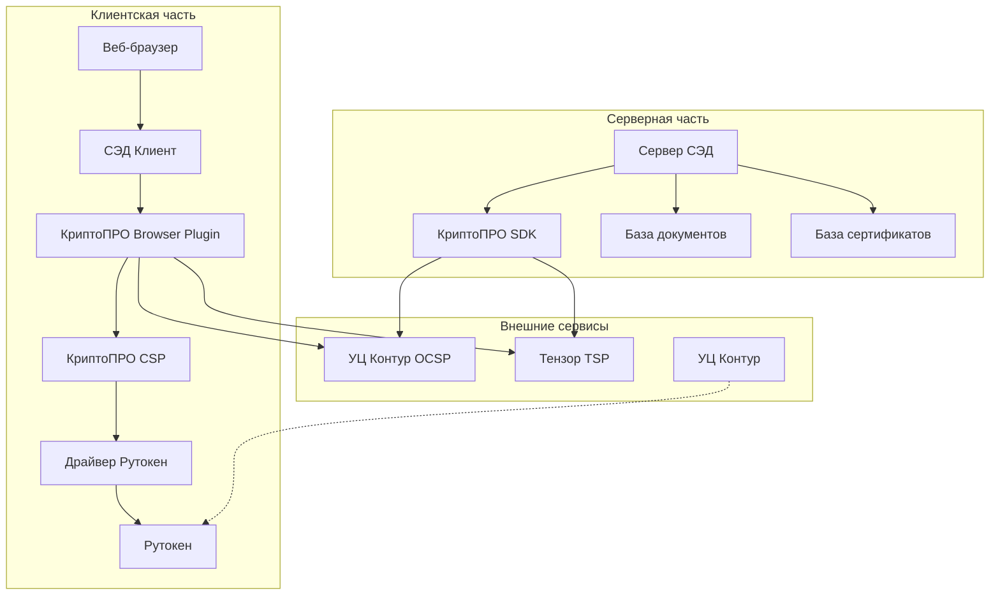

**Компоненты клиентской части:**
- **Веб-браузер** - интерфейс пользователя
- **СЭД Клиент** - JavaScript приложение
- **КриптоПРО Browser Plugin** - плагин для работы с ЭП в браузере
- **КриптоПРО CSP** - криптопровайдер
- **Драйвер Рутокен** - драйвер для работы с токеном
- **Рутокен** - аппаратный носитель ключей

**Компоненты серверной части:**
- **Сервер СЭД** - backend система (Java/.NET)
- **КриптоПРО SDK** - библиотеки для работы с ЭП
- **Базы данных** - хранение документов и сертификатов

## Схема 2: Процесс подписания документа

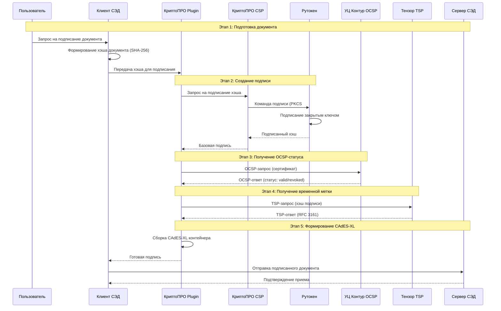

## Схема 3: Формат данных CAdES-XL

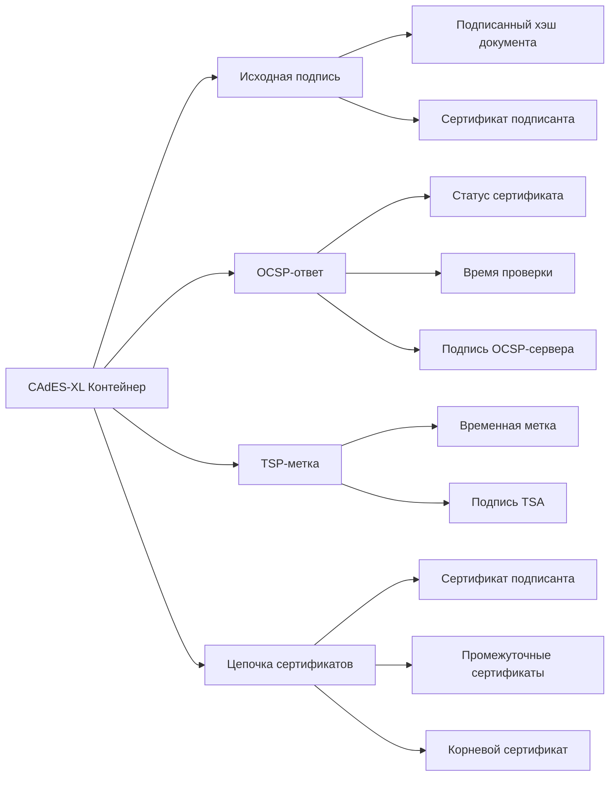

**Состав CAdES-XL:**
- **Подписанные данные** - хэш документа + подпись
- **OCSP-ответ** - подтверждение действительности сертификата
- **TSP-метка** - доказательство времени подписания
- **Полная цепочка сертификатов** - от подписанта до корневого УЦ

## Схема 4: Верификация подписи на сервере

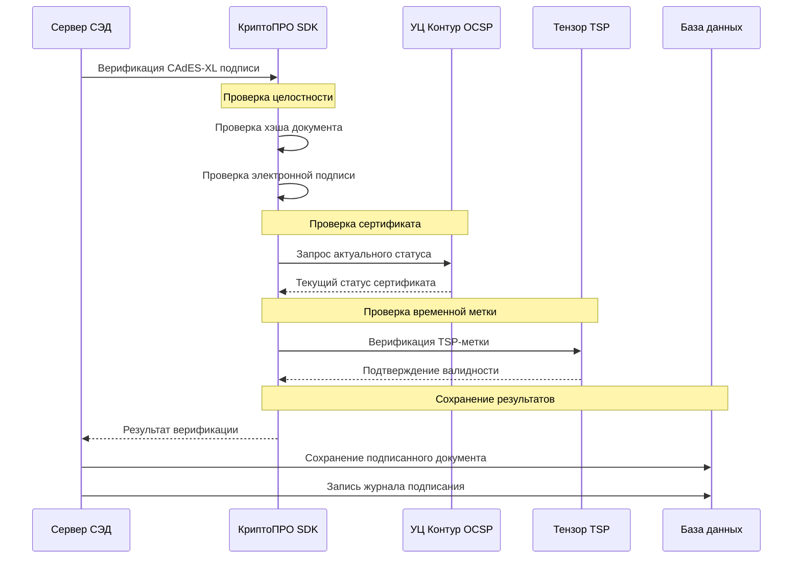

## Технические детали

**Протоколы и форматы:**
- **OCSP:** HTTP/HTTPS, ASN.1 кодирование
- **TSP:** HTTP/HTTPS, RFC 3161
- **Подпись:** CAdES-XL, PKCS#7/CMS
- **Сертификаты:** X.509 v3
- **Хэширование:** SHA-256/512

**Криптографические параметры:**
- **Алгоритмы:** RSA-2048/4096, ECDSA
- **Носитель:** Рутокен ГОСТ 2.0
- **Формат ключей:** PKCS#8, PKCS#12

**Данные передаваемые между компонентами:**
- Хэш документа (32/64 байта)
- Электронная подпись (256/512 байт)
- OCSP-ответ (1-4 КБ)
- TSP-метка (2-8 КБ)
- CAdES-XL контейнер (10-50 КБ)

## 2 Уточнение 1
Места хранения промежуточных и корневых сертификатов на клиентском компьютере.  
Не понятно, зачем нужен  КриптоПРО SDK в серверной части, если подписание производится в клиентской части.   
Будем считать, что на клиенте стоит "Толстый клиент СЭД" и не требуется браузер, КриптоПРО Browser Plugin.  

Учту замечания и предоставлю уточненные схемы.

## Схема 1: Хранилища сертификатов на клиентском компьютере

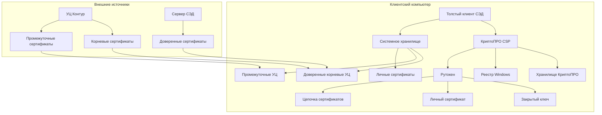

**Детализация хранилищ:**

### 1. Системное хранилище Windows:
- **Доверенные корневые УЦ** (`Cert:\LocalMachine\Root`)
  - Корневые сертификаты УЦ Контур
  - Другие аккредитованные УЦ
- **Промежуточные УЦ** (`Cert:\LocalMachine\CA`)
  - Промежуточные сертификаты УЦ Контур
  - Сертификаты цепочки доверия
- **Личные сертификаты** (`Cert:\CurrentUser\My`)
  - Сертификаты пользователя (копии с Рутокен)

### 2. Хранилище КриптоПРО:
- Файловое хранилище (`%ALLUSERSPROFILE%\Application Data\Crypto Pro`)
- Контейнеры закрытых ключей
- Кэш сертификатов
- Настройки криптопровайдера

### 3. Рутокен:
- Закрытый ключ (не экспортируемый)
- Личный сертификат пользователя
- Возможно: цепочка сертификатов

## Схема 2: Работа с сертификатами при подписании

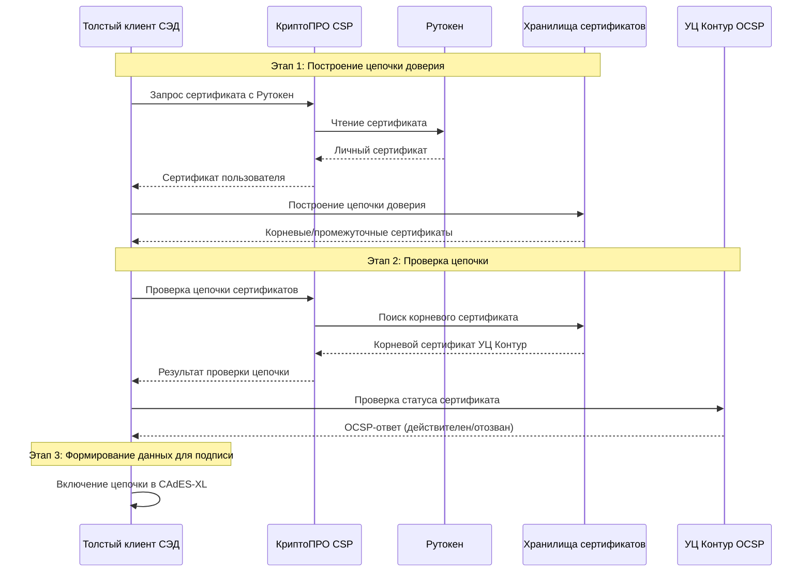

## Схема 3: Роль КриптоПРО SDK на сервере

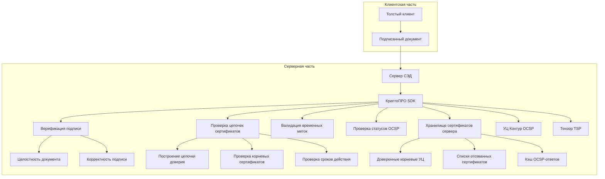

**Задачи КриптоПРО SDK на сервере:**

### 1. Верификация подписи:
- Проверка соответствия подписи документу
- Проверка алгоритмов подписи
- Валидация формата CAdES-XL

### 2. Проверка цепочек сертификатов:
```python
# Пример логики проверки
def verify_certificate_chain(server_cert, intermediate_certs, root_certs):
    # Проверка срока действия всех сертификатов
    check_validity_period(server_cert, intermediate_certs, root_certs)
    
    # Построение и проверка цепочки доверия
    chain = build_trust_chain(server_cert, intermediate_certs, root_certs)
    
    # Проверка политик сертификации
    verify_certificate_policies(chain)
    
    return chain_is_valid
```

### 3. Работа с OCSP и CRL:
- Кэширование OCSP-ответов
- Проверка по спискам отзыва (CRL)
- Валидация подписей OCSP-ответов

### 4. Проверка временных меток:
- Верификация TSP-подписи
- Проверка согласованности времени
- Валидация политик временных меток

## Схема 4: Детальный процесс верификации на сервере

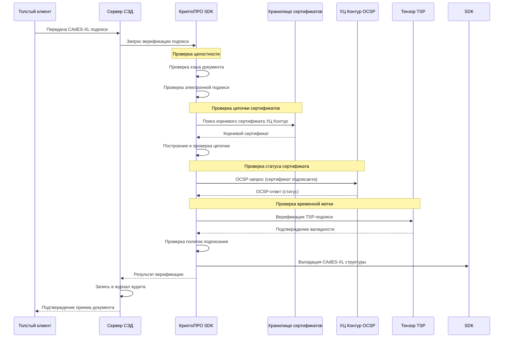

**Преимущества использования КриптоПРО SDK на сервере:**

1. **Единая логика проверки** - одинаковые алгоритмы на клиенте и сервере
2. **Централизованное управление доверенными сертификатами**
3. **Кэширование OCSP-ответов** - снижение нагрузки на УЦ
4. **Детальный аудит** - полная информация о процессе верификации
5. **Соответствие требованиям** - выполнение нормативных требований к ЭП

Это объясняет необходимость КриптоПРО SDK на сервере даже при клиентском подписании.

## 3 Нет, все криптооперации только на клиенте через  КриптоПРО CSP. Корневые и промежуточные сертификаты УЦ хранятся в реестре Windows.

Мы сосредоточимся только на клиентской части, где все криптооперации выполняются с помощью КриптоПРО CSP.
Компоненты: толстый клиент СЭД, КриптоПРО CSP, Рутокен, системное хранилище сертификатов Windows (корневые и промежуточные сертификаты УЦ Контур), а также взаимодействие с внешними сервисами (OCSP УЦ Контур и TSP Тензор).

Процесс подписания документа:
- Подготовка документа и вычисление хэша.
- Подписание хэша с помощью закрытого ключа с Рутокен (через КриптоПРО CSP).
- Получение OCSP-статуса сертификата.
- Получение временной метки от TSP.
- Формирование подписи в формате CAdES-XL, включая цепочку сертификатов, OCSP-ответ и временную метку.
- Поскольку серверная часть не участвует, мы не будем ее включать в схему.

Уточним, что корневые и промежуточные сертификаты УЦ Контур уже установлены в хранилище Windows (в доверенные корневые и промежуточные УЦ соответственно).

## Схема работы криптографических операций на клиентской части

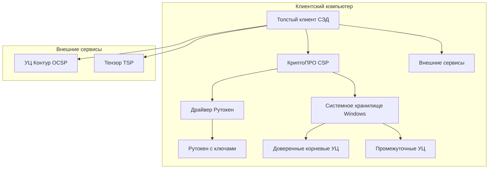

## Детальная схема процесса подписания

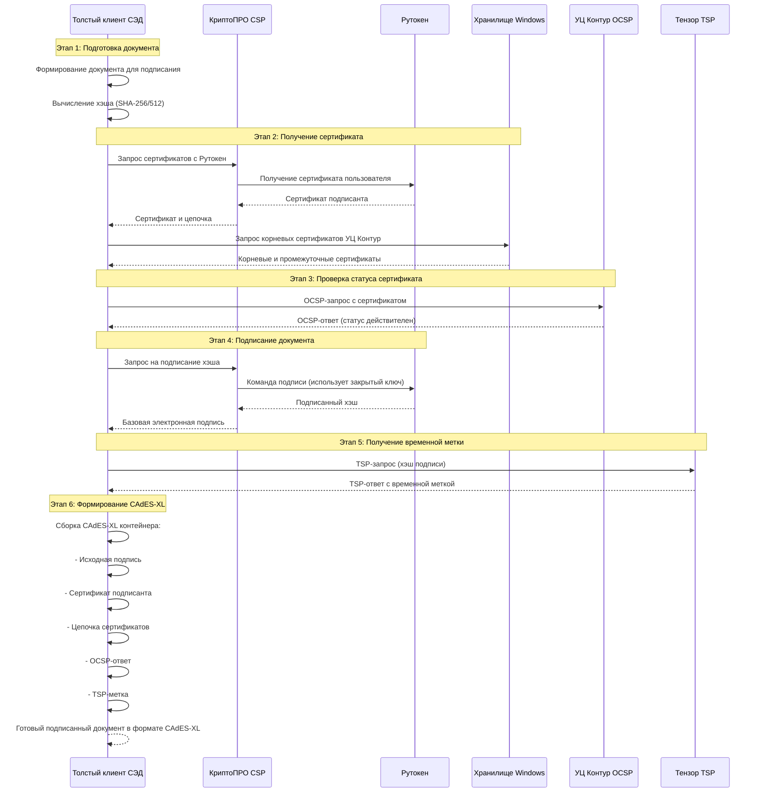

## Схема хранилищ сертификатов Windows

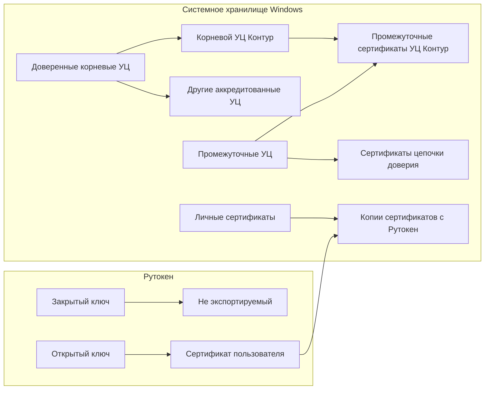

## Технические детали реализации

### 1. Работа с хранилищами сертификатов:

```cpp
// Пример использования CryptoAPI для работы с хранилищами
HCERTSTORE hRootStore = CertOpenSystemStore(0, "ROOT");
HCERTSTORE hCAStore = CertOpenSystemStore(0, "CA");
HCERTSTORE hMyStore = CertOpenSystemStore(0, "MY");

// Поиск сертификата УЦ Контур
PCCERT_CONTEXT pCertContext = CertFindCertificateInStore(
    hRootStore,
    X509_ASN_ENCODING,
    0,
    CERT_FIND_SUBJECT_STR,
    L"УЦ Контур",
    NULL
);
```

### 2. Процесс подписания через КриптоПРО CSP:

```cpp
// Инициализация криптопровайдера
HCRYPTPROV hProv;
CryptAcquireContext(&hProv, NULL, "Crypto-Pro GOST R 34.10-2012 Cryptographic Service Provider", PROV_GOST_2012_256, 0);

// Получение хэша документа
HCRYPTHASH hHash;
CryptCreateHash(hProv, CALG_GR3411, 0, 0, &hHash);
CryptHashData(hHash, pbData, dwDataLen, 0);

// Подписание хэша
DWORD dwSigLen;
CryptSignHash(hHash, AT_SIGNATURE, NULL, 0, NULL, &dwSigLen);
BYTE *pbSignature = new BYTE[dwSigLen];
CryptSignHash(hHash, AT_SIGNATURE, NULL, 0, pbSignature, &dwSigLen);
```

### 3. Формат CAdES-XL контейнера:

```
CAdES-XL Подпись:
├── SignedData
│   ├── Version
│   ├── DigestAlgorithms
│   ├── EncapsulatedContentInfo (документ)
│   ├── Certificates (цепочка сертификатов)
│   └── SignerInfos
│       ├── Version
│       ├── SID (идентификатор подписанта)
│       ├── DigestAlgorithm
│       ├── SignedAttributes
│       ├── SignatureAlgorithm
│       └── SignatureValue
├── OCSPResponse (ответ от УЦ Контур)
└── TimeStampToken (метка от Тензор TSP)
```

### 4. Взаимодействие с внешними сервисами:

**OCSP-запрос:**
- Протокол: HTTP/HTTPS
- Формат: ASN.1
- Данные: серийный номер сертификата
- Ответ: статус (good, revoked, unknown)

**TSP-запрос:**
- Протокол: HTTP/HTTPS
- Формат: RFC 3161
- Данные: хэш от подписи
- Ответ: временная метка с подписью TSA

## Преимущества клиентского подписания:

1. **Безопасность** - закрытые ключи никогда не покидают Рутокен
2. **Производительность** - нет сетевых задержек при криптооперациях
3. **Автономность** - работа без подключения к серверу СЭД
4. **Соответствие требованиям** - УКЭП соответствует 63-ФЗ

Все криптографические операции выполняются локально на клиентском компьютере с использованием установленных корневых и промежуточных сертификатов из хранилища Windows.

## 4 Как на другом аналогичном компьютере проверить подпись? Сертификат подписанты мы вкладываем в подпись и устанавливать его не нужно.

Мы проверяем подпись на другом компьютере. Для проверки нам нужно:
- Убедиться, что у нас установлены корневые и промежуточные сертификаты УЦ, которые выдавали сертификат подписанта.
- Установить цепочку сертификатов до доверенного корневого УЦ.
- Проверить подпись, включая проверку цепочки сертификатов, статуса сертификатов (OCSP или CRL) и временных меток.

При этом сертификат подписанта мы можем извлечь из подписи (если он вложен). Однако, для проверки цепочки нам нужны корневые и промежуточные сертификаты, которые могут быть не вложены в подпись (или вложены, но мы должны доверять им только если они подписаны доверенными УЦ).

Что понадобится на другом компьютере:
- Установленные корневые сертификаты УЦ, которым мы доверяем (например, УЦ Контур).
- Установленные промежуточные сертификаты, если они не вложены в подпись или если мы не хотим полагаться на вложенные.
- Программное обеспечение для проверки подписи (например, КриптоПРО CSP и утилиты или библиотеки для проверки).
- Доступ к OCSP-серверу или CRL для проверки статуса сертификатов (если мы проверяем онлайн).
- Возможно, потребуется настроить доверие к TSA (сервису временных меток) для проверки временных меток.

Сертификат подписанта можно вложить в подпись, и тогда он будет доступен при проверке. Однако, чтобы проверить цепочку, нам нужно иметь корневые и промежуточные сертификаты в хранилище доверенных корневых и промежуточных УЦ.

Важно: мы должны проверить, что сертификат подписанта был выдан доверенным УЦ, и что цепочка построена правильно.

Процесс проверки на другом компьютере:
- Извлечь из подписи сертификат подписанта и цепочку сертификатов (если они вложены).
- Проверить, что корневой сертификат из цепочки установлен в хранилище доверенных корневых сертификатов.
- Проверить цепочку: каждый сертификат в цепочке должен быть подписан вышестоящим сертификатом, до корневого.
- Проверить статус каждого сертификата в цепочке (с помощью OCSP или CRL).
- Проверить временную метку (если есть).
- Проверить саму подпись документа.

Если на другом компьютере не установлены корневые и промежуточные сертификаты, то даже при вложенной цепочке мы не сможем проверить подпись, потому что мы не доверяем корневому сертификату, если он не установлен в хранилище доверенных.

Поэтому на другом компьютере необходимо:
- Установить корневые сертификаты УЦ, которые мы доверяем (например, УЦ Контур).
- Установить промежуточные сертификаты (они могут быть установлены автоматически, если мы доверяем корневому УЦ и цепочка построена правильно, но иногда их нужно устанавливать отдельно).

Кроме того, для проверки подписи в формате CAdES-XL нам понадобится ПО, которое поддерживает этот формат (КриптоПРО CSP, например).

Итак, для проверки на другом компьютере нужно:
- Установить корневые и промежуточные сертификаты УЦ Контур (если они еще не установлены).
- Установить КриптоПРО CSP (или другое ПО, которое умеет проверять CAdES-XL) и настроить хранилища сертификатов.
- Убедиться, что есть доступ к OCSP-серверу УЦ Контур и TSP-серверу Тензор (если проверяем онлайн).
- Передать подписанный документ (вместе с подписью) на другой компьютер.
- Выполнить проверку подписи.

Если мы не проверяем онлайн (без OCSP и TSP), то мы можем проверить только целостность и цепочку сертификатов, но не актуальность статуса сертификата.

Пример кода для проверки подписи с использованием КриптоПРО CSP (C++), но это может быть сделано и с помощью утилит командной строки (cryptcp или cups).

Однако, если мы хотим проверить подпись без установки КриптоПРО CSP, то это может быть проблематично, так как требуется поддержка формата и алгоритмов.

Вывод: на другом компьютере нужно установить:
- Корневые и промежуточные сертификаты УЦ.
- ПО для проверки подписи (КриптоПРО CSP или другое).
- Обеспечить доступ к OCSP и TSP (для полной проверки).

Сертификат подписанта вложен в подпись, поэтому устанавливать его отдельно не нужно, но корневые и промежуточные сертификаты должны быть установлены в хранилище.

## Проверка подписи на другом компьютере

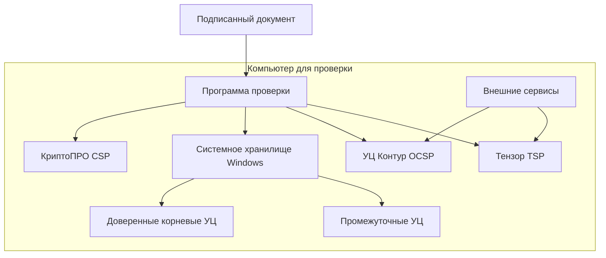

## Что нужно для проверки на другом компьютере:

### 1. Обязательные компоненты:
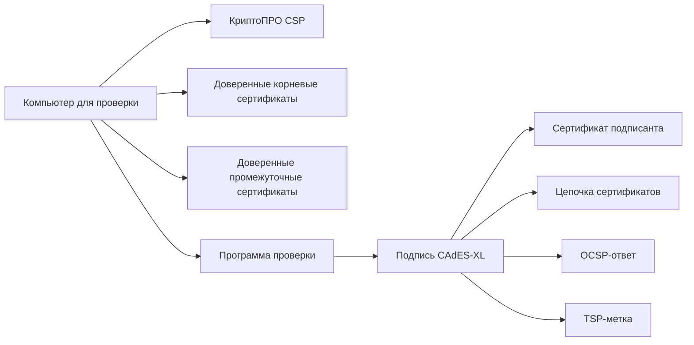

## Детальный процесс проверки подписи

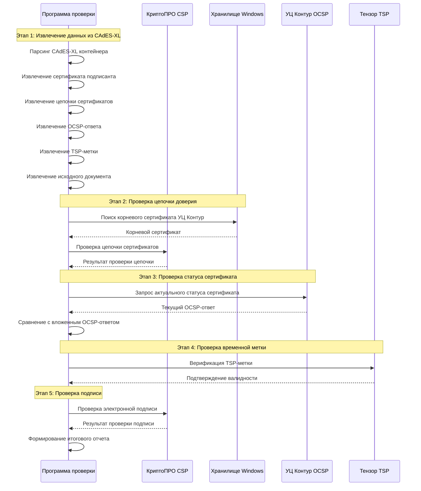

## Технические детали проверки

### 1. Компоненты, необходимые для проверки:

**Обязательно:**
- КриптоПРО CSP (для проверки алгоритмов и форматов)
- Доверенные корневые сертификаты УЦ Контур в хранилище Windows
- Доверенные промежуточные сертификаты УЦ Контур
- Программа для проверки подписей (может быть встроена в СЭД)

**Опционально (для полной проверки):**
- Доступ к УЦ Контур OCSP (для проверки актуального статуса)
- Доступ к Тензор TSP (для верификации временных меток)

### 2. Что содержится в CAdES-XL и не требует отдельной установки:

```cpp
// Данные, которые извлекаются из подписи:
struct CAdES_XL_Data {
    vector<byte> original_document;      // Исходный документ
    X509Certificate signer_cert;         // Сертификат подписанта
    vector<X509Certificate> cert_chain;  // Цепочка сертификатов
    OCSPResponse ocsp_response;          // Ответ OCSP на момент подписания
    TimeStampToken tsp_token;            // Временная метка
    vector<byte> signature;              // Электронная подпись
};
```

### 3. Критически важные моменты:

**Сертификат подписанта:**
- ✅ **Вложен в подпись** - не требует отдельной установки
- ✅ **Цепочка сертификатов** - обычно тоже вложена
- ❌ **Корневые сертификаты** - должны быть установлены в доверенное хранилище

**Проверка цепочки доверия:**
```python
def verify_certificate_chain(signer_cert, intermediate_certs, trusted_roots):
    # Проверяем, что сертификат подписанта выдан промежуточным УЦ
    if not verify_issuer(signer_cert, intermediate_certs[0]):
        return False
    
    # Проверяем, что промежуточный УЦ выдан корневым УЦ
    if not verify_issuer(intermediate_certs[0], trusted_roots["УЦ Контур"]):
        return False
    
    # Проверяем, что корневой УЦ доверенный
    if not is_trusted_root(trusted_roots["УЦ Контур"]):
        return False
    
    return True
```

### 4. Сценарии проверки:

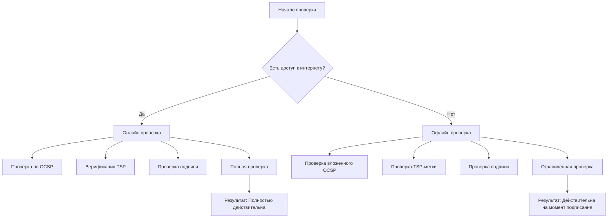

### 5. Код проверки подписи:

```cpp
// Пример использования КриптоПРО для проверки
HRESULT VerifySignature(const std::string& signed_data) {
    // Инициализация криптопровайдера
    HCRYPTPROV hProv;
    CryptAcquireContext(&hProv, NULL, "Crypto-Pro GOST R 34.10-2012 Cryptographic Service Provider", 
                       PROV_GOST_2012_256, 0);
    
    // Создание объекта для проверки подписи
    HCRYPTMSG hMsg = CryptMsgOpenToDecode(ENCODING, 0, 0, hProv, NULL, NULL);
    
    // Декодирование CAdES-XL
    CryptMsgUpdate(hMsg, (BYTE*)signed_data.c_str(), signed_data.length(), TRUE);
    
    // Проверка подписи
    BOOL result = CryptMsgControl(hMsg, 0, CMSG_CTRL_VERIFY_SIGNATURE, &verify_params);
    
    if (result) {
        // Дополнительные проверки цепочки сертификатов
        return VerifyCertificateChain(hMsg);
    }
    
    return E_FAIL;
}
```

## Вывод:

**Что НЕ нужно устанавливать:**
- Сертификат подписанта (вложен в подпись)
- Промежуточные сертификаты (обычно вложены в подпись)
- Закрытые ключи (только для подписания)

**Что НУЖНО установить:**
- КриптоПРО CSP
- Доверенные корневые сертификаты УЦ Контур
- Программу для проверки подписей

**Что желательно иметь:**
- Доступ к интернету для проверки актуального статуса сертификатов
- Доступ к TSP-сервису для верификации временных меток

Таким образом, для проверки подписи на другом компьютере достаточно установить криптопровайдер и доверенные корневые сертификаты, все остальные необходимые данные содержатся в самой CAdES-XL подписи.

## 5 Верно ли составил обобщённый алгоритм подписания документа:
1 Толстый клиент СЭД: Получение документа для подписания УКЭП
2 Толстый клиент СЭД: Передача файла документа в КриптоПро CSP
3 КриптоПро CSP: Формирование CADES-BES
3a) Запрос и проверка сертификатов корневого и промежуточных УЦ
3b) Команда подписи (использует закрытый ключ из РуТокен) и прием подписанного хэш
3с) Получение сертификата подписанта для вложения в подпись
4 КриптоПро CSP: Получение OCSP-ответа и TSP-ответа и формирование CADES-XL контейнера (на основе CADES-BES)
5 КриптоПро CSP: Передача сформированного файла-подписи CADES-XL в Толстый клиент СЭД
6 Формирование Описания электронного документа (XML) и передача трех файлов (документ, подпись CADES-XLб описание) в хранилище подписанных документов
