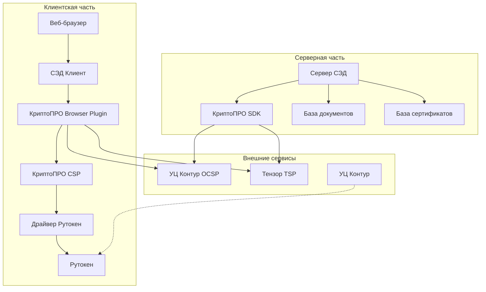
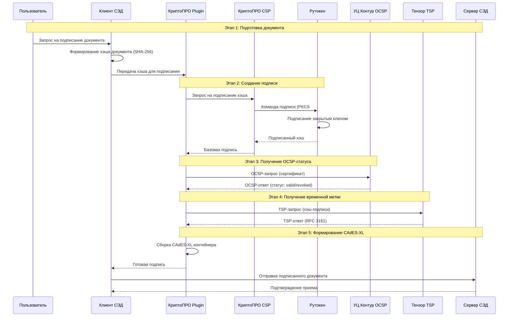
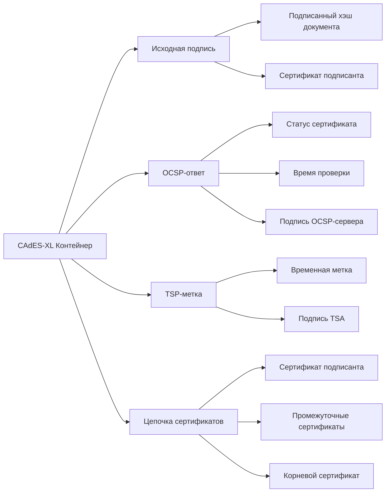
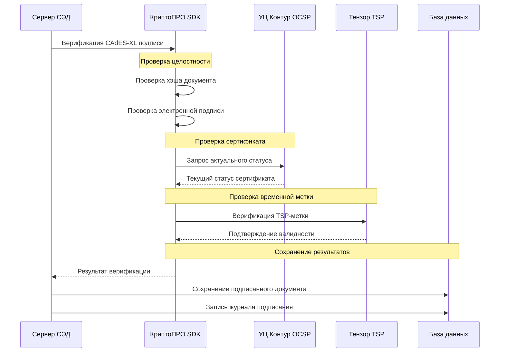

### cryptopro CSP

Есть СЭД, где подписание проводится электронной подписью.  
Параметры: 
- Тип подписи: усиленная квалифицированная электронная подпись (УКЭП).
- Выдается аккредитованным центром УЦ Контур (удостоверяющий центр). 
- Формат подписи: CADES-XL. В качестве OCSP сервера используется внешний сервис «УЦ Контур OCSP». 
- TSP – внешний сервис компании Тензор.
- Ключи хранятся в РуТокен.  
- Внутри компании при подписании используются продукты КриптоПРО. 
Нарисуй подробную схему (mermaid) взаимодействия всех компонент рассмотренного решения с указанием протокола, передаваемых данных и состава программных моделей на серверной и клиентской части.

Разбиваю систему на несколько читаемых схем с детализацией.

## Схема 1: Общая архитектура системы

**Компоненты клиентской части:**
- **Веб-браузер** - интерфейс пользователя
- **СЭД Клиент** - JavaScript приложение
- **КриптоПРО Browser Plugin** - плагин для работы с ЭП в браузере
- **КриптоПРО CSP** - криптопровайдер
- **Драйвер Рутокен** - драйвер для работы с токеном
- **Рутокен** - аппаратный носитель ключей

**Компоненты серверной части:**
- **Сервер СЭД** - backend система (Java/.NET)
- **КриптоПРО SDK** - библиотеки для работы с ЭП
- **Базы данных** - хранение документов и сертификатов

## Схема 2: Процесс подписания документа

## Схема 3: Формат данных CAdES-XL

**Состав CAdES-XL:**
- **Подписанные данные** - хэш документа + подпись
- **OCSP-ответ** - подтверждение действительности сертификата
- **TSP-метка** - доказательство времени подписания
- **Полная цепочка сертификатов** - от подписанта до корневого УЦ

## Схема 4: Верификация подписи на сервере

## Технические детали

**Протоколы и форматы:**
- **OCSP:** HTTP/HTTPS, ASN.1 кодирование
- **TSP:** HTTP/HTTPS, RFC 3161
- **Подпись:** CAdES-XL, PKCS#7/CMS
- **Сертификаты:** X.509 v3
- **Хэширование:** SHA-256/512

**Криптографические параметры:**
- **Алгоритмы:** RSA-2048/4096, ECDSA
- **Носитель:** Рутокен ГОСТ 2.0
- **Формат ключей:** PKCS#8, PKCS#12

**Данные передаваемые между компонентами:**
- Хэш документа (32/64 байта)
- Электронная подпись (256/512 байт)
- OCSP-ответ (1-4 КБ)
- TSP-метка (2-8 КБ)
- CAdES-XL контейнер (10-50 КБ)
