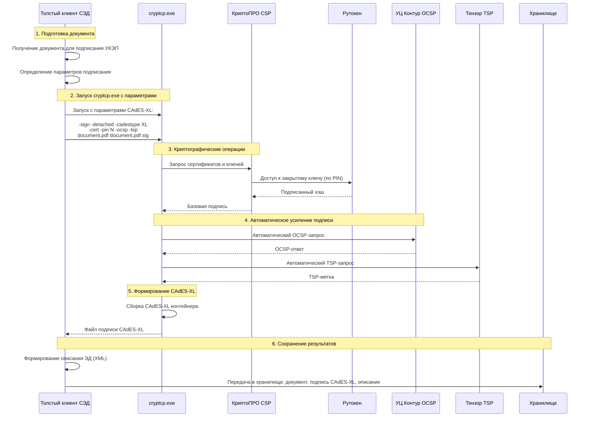

## CADES-XL end cryptcp.exe
Алгоритм подписания CADES-XL c использованием утилиты [cryptcp.exe](https://ca.kontur.ru/Files/userfiles/file/Faq/cryptopro-license/%D0%96%D0%A2%D0%AF%D0%98_00087-01%2093%2001_%20%D0%9F%D1%80%D0%B8%D0%BB%D0%BE%D0%B6%D0%B5%D0%BD%D0%B8%D0%B5%20%D0%BA%D0%BE%D0%BC%D0%B0%D0%BD%D0%B4%D0%BD%D0%BE%D0%B9%20%D1%81%D1%82%D1%80%D0%BE%D0%BA%D0%B8%20%D0%B4%D0%BB%D1%8F%20%D0%BF%D0%BE%D0%B4%D0%BF%D0%B8%D1%81%D0%B8%20%D0%B8%20%D1%88%D0%B8%D1%84%D1%80%D0%BE%D0%B2%D0%B0%D0%BD%D0%B8%D1%8F%20%D1%84%D0%B0%D0%B9%D0%BB%D0%BE%D0%B2(1).pdf)

### Thing
Алгоритм:
- Толстый клиент СЭД: Получение документа для подписания УКЭП.
- Толстый клиент СЭД: Запуск cryptcp.exe с передачей необходимых параметров, включая:
  - Путь к файлу документа
  - Тип подписи (CAdES-XL)
  - Параметры для OCSP (адрес сервера) и TSP (адрес сервера)
  - Место сохранения подписи

- cryptcp.exe (используя КриптоПРО CSP) выполняет:
  - a) Загрузка и проверка цепочки сертификатов (корневые и промежуточные УЦ из хранилища Windows)
  - b) Извлечение сертификата подписанта с Рутокен (запрос закрытого ключа для подписи)
  - c) Формирование хэша документа
  - d) Подписание хэша закрытым ключом (с Рутокен) и формирование CAdES-BES
  - e) Запрос OCSP-ответа от указанного сервера и TSP-метки от указанного сервера
  - f) Формирование CAdES-XL контейнера (включая OCSP и TSP)

- cryptcp.exe возвращает управление толстому клиенту СЭД, который получает файл подписи (CAdES-XL) и исходный документ (если не был изменен).
- Толстый клиент СЭД: Формирование Описания электронного документа (XML) и передача трех файлов (документ, подпись CAdES-XL, описание) в хранилище подписанных документов.

Однако, note: в документации указано, что cryptcp.exe может выполнять подписание с усилением до CAdES-XL, но для этого нужно указать соответствующие параметры (например, -cadestype XL, -ocsp и -tsp).

Пример команды для cryptcp.exe: 
```
cryptcp -sign -dn "CN=Иванов Иван Иванович" -cadestype XL -ocsp "http://ocsp.kontur.ru" -tsp "http://tsp.kontur.ru" -detached document.pdf document.pdf.sig
```
В этом примере:
- sign - команда подписания
- dn - субъект сертификата (может быть опущен, если сертификат выбран из хранилища)
- cadestype XL - тип подписи CAdES-XL
- ocsp - URL OCSP-сервера
- tsp - URL TSP-сервера
- detached - отделенная подпись (если нужна присоединенная, то не указывается)

Но note: в случае использования Рутокен, cryptcp.exe должен иметь доступ к контейнеру закрытого ключа (через КриптоПРО CSP) и сертификату.

Алгоритм с использованием cryptcp.exe:
- Толстый клиент СЭД: Получение документа для подписания УКЭП.
- Толстый клиент СЭД: Подготовка параметров для cryptcp.exe (выбор сертификата, указание OCSP и TSP серверов, пути к файлам).
- Толстый клиент СЭД: Запуск cryptcp.exe с подготовленными параметрами.

- cryptcp.exe (с использованием КриптоПРО CSP и драйвера Рутокен):
  - a) Загрузка сертификата подписанта (из Рутокен или системного хранилища) и проверка цепочки доверия (корневые и промежуточные УЦ из хранилища Windows).
  - b) Формирование хэша документа.
  - c) Подписание хэша закрытым ключом (с Рутокен) и формирование базовой подписи (CAdES-BES).
  - d) Запрос OCSP-ответа от указанного сервера для сертификата подписанта.
  - e) Запрос TSP-метки от указанного сервера для подписи.
  - f) Формирование CAdES-XL контейнера, включающего базовую подпись, цепочку сертификатов, OCSP-ответ и TSP-метку.

- cryptcp.exe сохраняет подпись в указанный файл и возвращает код ошибки (успех/неудача).
- Толстый клиент СЭД: Проверка кода возврата cryptcp.exe. Если подписание успешно, то формирование описания электронного документа (XML).
- Толстый клиент СЭД: Передача трех файлов (документ, подпись CAdES-XL, описание) в хранилище подписанных документов.

Таким образом, основная работа по формированию CAdES-XL перекладывается на cryptcp.exe, а толстый клиент СЭД управляет процессом через командную строку.
Важно: cryptcp.exe может потребовать указания конкретного сертификата, если их несколько. Это можно сделать через параметр -dn (отличительное имя) или -thumbprint (отпечаток).

Также note: cryptcp.exe может быть запущена с параметром -pin для ввода пин-кода к Рутокен, но ввод пин-кода может также производиться через диалоговое окно, если пин-код не указан.

Уточненная последовательность:
- Толстый клиент СЭД: Получение документа для подписания УКЭП.
- Толстый клиент СЭД: Формирование команды для cryptcp.exe, например:
```
cryptcp -sign -thumbprint <отпечаток сертификата> -cadestype XL -ocsp "http://ocsp.kontur.ru" -tsp "http://tsp.tensor.ru" -detached "C:\doc.pdf" "C:\doc.pdf.sig"
```
- Толстый клиент СЭД: Запуск cryptcp.exe и ожидание завершения.
- cryptcp.exe выполняет все криптографические операции, включая взаимодействие с OCSP и TSP.
- Толстый клиент СЭД: Проверка кода возврата. Если 0, то подписание успешно.
- Толстый клиент СЭД: Формирование описания электронного документа (XML).
- Толстый клиент СЭД: Передача в хранилище: документ, подпись CAdES-XL, описание.
Это упрощает алгоритм, так как cryptcp.exe берет на себя все этапы подписания и усиления подписи.

## Уточненный алгоритм с использованием cryptcp.exe



## Детализация использования cryptcp.exe

### Команда для cryptcp.exe:

```bash
cryptcp -sign -detached -cadestype XL -cert -pin N -ocsp "http://ocsp.kontur.ru" -tsp "http://tsp.tensor.ru" "C:\documents\document.pdf" "C:\signatures\document.pdf.sig"
```

**Параметры:**
- `-sign` - команда подписания
- `-detached` - отделенная подпись
- `-cadestype XL` - формат CAdES-XL
- `-cert` - выбор сертификата (может быть с указанием хранилища)
- `-pin N` - пин-код Рутокен (или диалоговый ввод)
- `-ocsp` - URL OCSP-сервера
- `-tsp` - URL TSP-сервера

## Уточненный алгоритм с cryptcp.exe

### 1. **Толстый клиент СЭД:** Подготовка к подписанию
- Получение документа для подписания
- Определение параметров подписи:
  - Выбор сертификата (по отпечатку или субъекту)
  - Настройка формата (CAdES-XL)
  - Указание URL OCSP и TSP серверов

### 2. **Толстый клиент СЭД:** Запуск cryptcp.exe
```python
# Пример кода запуска
import subprocess

command = [
    "cryptcp.exe",
    "-sign",
    "-detached", 
    "-cadestype", "XL",
    "-cert",
    "-pin", "123456",
    "-ocsp", "http://ocsp.kontur.ru",
    "-tsp", "http://tsp.tensor.ru",
    "document.pdf",
    "document.pdf.sig"
]

result = subprocess.run(command, capture_output=True, text=True)
if result.returncode == 0:
    print("Подписание успешно")
else:
    print("Ошибка подписания:", result.stderr)
```

### 3. **cryptcp.exe:** Автоматическое выполнение полного цикла
- Запрос сертификата с Рутокен
- Проверка цепочки доверия через системное хранилище
- Вычисление хэша документа
- Подписание хэша закрытым ключом
- **Автоматический запрос OCSP-статуса**
- **Автоматический запрос TSP-метки**
- Формирование CAdES-XL контейнера

### 4. **Толстый клиент СЭД:** Обработка результатов
- Проверка кода возврата cryptcp.exe
- Чтение сгенерированного файла подписи
- Валидация подписи (опционально)

### 5. **Толстый клиент СЭД:** Формирование пакета документов
- Создание описания электронного документа (XML)
- Формирование итогового пакета:
  - Исходный документ
  - Файл подписи CAdES-XL
  - XML-описание

### 6. **Толстый клиент СЭД:** Передача в хранилище
- Отправка пакета в систему хранения
- Запись в журнал аудита

## Преимущества использования cryptcp.exe:

### Автоматизация процесса:
```bash
# Одной командой выполняются все этапы:
cryptcp -sign -detached -cadestype XL -cert -pin 123456 -ocsp -tsp input.pdf output.sig

# Вместо ручной реализации:
# 1. Получение хэша
# 2. Подписание хэша  
# 3. OCSP-запрос
# 4. TSP-запрос
# 5. Сборка CAdES-XL
```

### Надежность:
- Использует проверенные алгоритмы КриптоПРО
- Корректная работа с форматами
- Обработка ошибок и исключений

### Соответствие стандартам:
- Правильное формирование CAdES-XL
- Корректное включение OCSP и TSP данных
- Соответствие требованиям УКЭП

## Важные замечания:

1. **PIN-код** может передаваться параметром или запрашиваться интерактивно
2. **Выбор сертификата** может быть по отпечатку, субъекту или через диалог
3. **Обработка ошибок** - необходимо анализировать код возврата cryptcp.exe
4. **Логирование** - cryptcp.exe может вести детальные логи для отладки

Данный подход значительно упрощает реализацию, так как вся сложность криптографических операций и формирования CAdES-XL инкапсулирована в cryptcp.exe.
