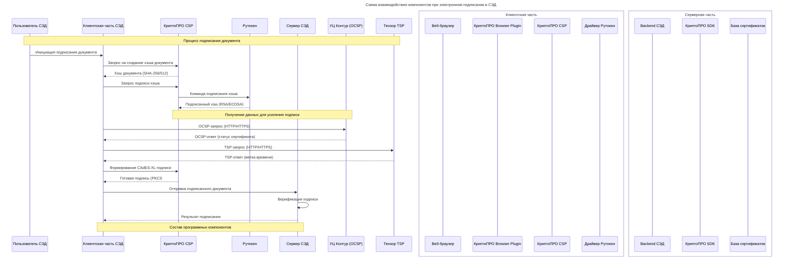

### cryptopro CSP

Есть СЭД, где подписание проводится электронной подписью.  
Параметры: 
- Тип подписи: усиленная квалифицированная электронная подпись (УКЭП).
- Выдается аккредитованным центром УЦ Контур (удостоверяющий центр). 
- Формат подписи: CADES-XL. В качестве OCSP сервера используется внешний сервис «УЦ Контур OCSP». 
- TSP – внешний сервис компании Тензор.
- Ключи хранятся в РуТокен.  
- Внутри компании при подписании используются продукты КриптоПРО. 
Нарисуй подробную схему (mermaid) взаимодействия всех компонент рассмотренного решения с указанием протокола, передаваемых данных и состава программных моделей на серверной и клиентской части.

## Детализация компонентов и данных:

### Клиентская часть:
**Состав:**
- Веб-браузер с JavaScript API
- КриптоПРО Browser Plugin
- КриптоПРО CSP 4.0+
- Драйвер Рутокен
- Криптографические библиотеки

**Данные:**
- Исходный документ (PDF/XLS/DOC)
- Хэш документа (SHA-256/512)
- Электронная подпись (CAdES-XL)
- Сертификат ЭП (X.509)

### Серверная часть:
**Состав:**
- Backend СЭД (Java/.NET)
- КриптоПРО SDK
- База данных сертификатов
- API для внешних сервисов

### Протоколы и форматы:
- **OCSP:** HTTP/HTTPS, ASN.1
- **TSP:** HTTP/HTTPS, RFC 3161
- **Подпись:** CAdES-XL, PKCS#7/CMS
- **Сертификаты:** X.509 v3
- **Криптография:** RSA-2048/4096, ECDSA

### Ключевые процессы:
1. **Хэширование документа** - SHA-256/512
2. **Подписание хэша** - закрытым ключом с Рутокен
3. **Верификация статуса** - через OCSP УЦ Контур
4. **Временная метка** - через TSP Тензор
5. **Формирование CAdES-XL** - включение всех данных в подпись
6. **Верификация на сервере** - проверка целостности и валидности
