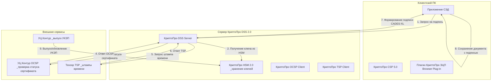
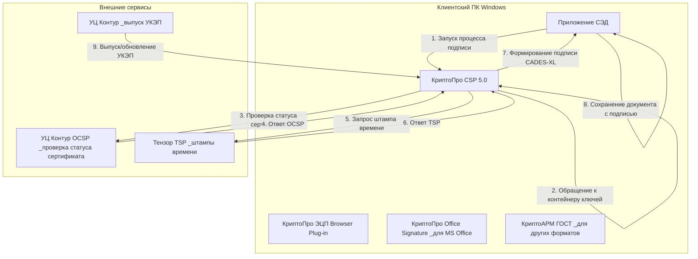

### вопрос 1
ты архитектор решения (Solution Architect). Есть СЭД, где подписание проводится электронной подписью. Параметры:
Тип подписи: усиленная квалифицированная электронная подпись (УКЭП).
Выдается аккредитованным центром УЦ Контур (удостоверяющий центр).
Формат подписи: CADES-XL. В качестве OCSP сервера используется внешний сервис «УЦ Контур OCSP».
TSP – внешний сервис компании Тензор.
Внутри компании при подписании используются продукты КриптоПРО. Ключи хранятся в КриптоПро HSM 2.0 https://cryptopro.ru/products/hsm

Нарисуй подробную схему (mermaid) взаимодействия всех компонент рассмотренного решения для двух вариантов:
А) с использованием КриптоПро DSS 2.0 https://cryptopro.ru/products/dss. Укажи полный состав ПО сервера и клиентского компьютера, необходимые для установки подписи на электронном документе и проверки подписи.
Б) без использования сервера КриптоПро DSS 2.0, т.е. инструменты подписания и проверки подписи стоят на компьютерах пользователей (Windows). Что кроме КриптоПро CSP https://cryptopro.ru/products/csp должно быть установлено?

Ответ:

Ниже представлены две схемы взаимодействия компонентов в формате **Mermaid** для обоих сценариев.

## А) С использованием КриптоПро DSS 2.0

**Состав ПО на клиентском ПК:**
- Приложение СЭД (система электронного документооборота).
- КриптоПро CSP 5.0 (криптопровайдер).
- Плагин КриптоПро ЭЦП Browser Plug‑in (для веб‑интерфейса СЭД).

**Состав ПО на сервере DSS:**
- КриптоПро DSS Server 2.0 (основной сервис подписи).
- КриптоПро HSM 2.0 (безопасное хранение ключей).
- КриптоПро OCSP Client (взаимодействие с OCSP‑сервером).
- КриптоПро TSP Client (взаимодействие с TSP‑сервером).

---

[mermaid.live](https://mermaid.live/edit#pako:eNqdVF1PE0EU_SuTeW7Xbrsf7T6YlBYFopGkPBhbQ1a6tE3aXbLsikpJKNVIguGBmJj0wQY1vJmsCFJaqH_hzj_yzmxxl1Jf3IfNzsw5Z849d2a36ZpTtahBCVlvOltrddP1yEqxYhN8Nv0XNdfcqBPowQgGcA7XbI91YIjflwT60Atx_MmXoc92cWEEY_jFoZxA4Bi-w8fnEW6uDD2B-832EMk5Y1IoLRNVSsVgBZRDqQB-IvSazOCg7gn0yZzrbG1aLllu-rVkw55IWHa1Yk8XcQznyDzl71mCxVKJpKVU5KFY_geqZLkvLTfmdn4WcqH0mOuRVfYOxwEG8jeUIYzYIXuPE5cxlQezVJ7wbArNhmV7MejDWdCVaeQkhekcjrgVtj8xg_0MYxmwDjuItlgow1c44a0fi7Z3MbVVOGUHuGeXHwKC6z3sQj_ma3EGSVSAJLQYho_lB7gtOg8EpCOGfAWnBuwt2hryJQhiyktl-CICvIAxivJaV9k-B8EVih8QtLaLgKsw5bvnIE-SyfttWSLwCTnCDusQxAZoDq2d4ZtH8KFNJse_KBhpiZ_0MXasKzo21UJkD-CCN7tN5uO8DOf9T9FtshjqLAodBXU-4zxX2RNhThlUp0qKUuHmbqXSJkshc0kwtVvSK3eUdVz_xuNG_mBSSnATQCwzGJBCvjhfSj591Cb5eNxZiV-78d0bcIbsIeuGxrhfwptxqw_sUIiFcgtCLodyR9EJvIfwH6jIfY0i7cmxFP2gCVpzG1VqeK5vJWjLclsmH9JtrluhXt1qWRVq4GfVWjf9plehFXsHaRum_cxxWjdM1_FrdWqsm81NHPkbVdOzig0Tr1QEwdNmuQXHtz1qpFVVaFBjm76iRlLJqVJWUTRdy6lZOZvSlQR9TQ05m5OUVFrRNE2WcVrTdxL0jdhXljJZXcnpSkZOq1o6o-kJalUbnuM-Dn_Z4s-98wdU4M-t)

## Б) Без использования КриптоПро DSS 2.0 (локальное подписание на ПК)

**Необходимое ПО на клиентском ПК (Windows):**
1. **КриптоПро CSP 5.0** — основной криптопровайдер для операций с ключами.
2. **КриптоПро ЭЦП Browser Plug‑in** — для работы с электронной подписью в веб‑интерфейсе СЭД.
3. **КриптоПро Office Signature** — для подписания документов MS Office (Word, Excel).
4. **КриптоАРМ ГОСТ** — для подписания файлов других форматов (PDF, XML, изображения и т. д.).
5. **Приложение СЭД** — клиентская часть системы электронного документооборота.

**Дополнительно требуется:**
- Установленный сертификат УКЭП от УЦ Контур в хранилище сертификатов Windows.
- Доступ к интернету для обращения к OCSP‑серверу (УЦ Контур) и TSP‑серверу (Тензор).

---

**Пояснения по компонентам:**
- **УКЭП** ($Усиленная\ Квалифицированная\ Электронная\ Подпись$) — обеспечивает юридическую значимость документа.
- **CADES‑XL** ($CAdES\ Extended\ Long$) — формат подписи с прикреплёнными доказательствами валидности сертификата (OCSP‑ответы, TSP‑штампы).
- **OCSP** ($Online\ Certificate\ Status\ Protocol$) — протокол проверки статуса сертификата (действителен/аннулирован).
- **TSP** ($Time\ Stamping\ Protocol$) — протокол получения штампа времени для фиксации момента подписания.
- **HSM** ($Hardware\ Security\ Module$) — аппаратное устройство для безопасного хранения ключей.
