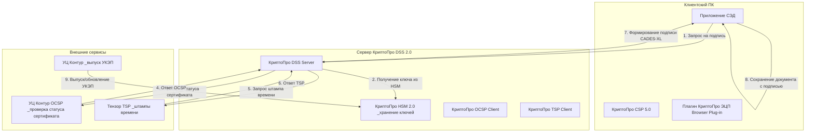
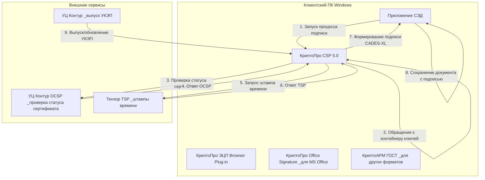
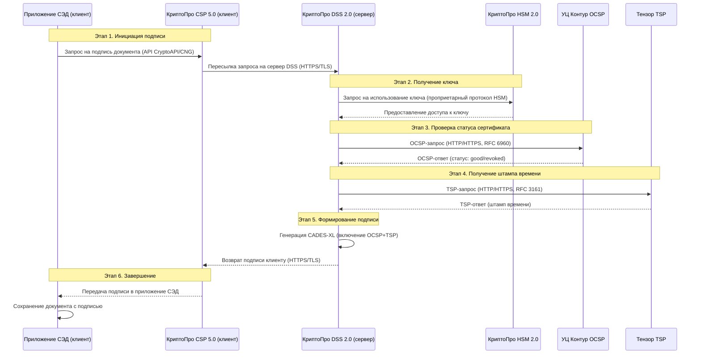
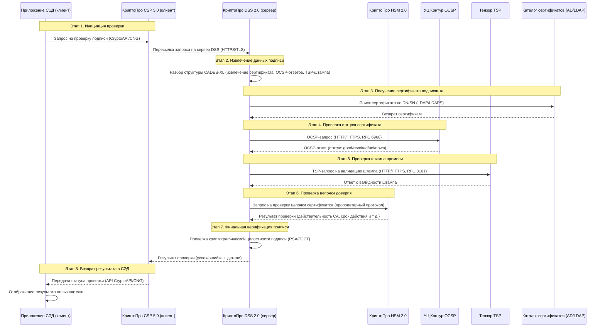

### cryptopro
- https://cryptopro.ru/products
- price [КриптоПро CSP cryptopro](https://cryptopro.ru/sites/default/files/docs/price.pdf#csp) ; [КриптоПро CSP xcom](https://www.xcom-shop.ru/kripto-pro_skzi_kriptopro_csp_versii_50_klass_ks3_na_odnom_rabochem_meste_astra_linux_special_edition_ili_alt_8_sp_956741.html?utm_source=admitad&utm_medium=cpa&utm_campaign=2101843&utm_content=2f03050f9295b5099174fc847b55366a&admitad_uid=2f03050f9295b5099174fc847b55366a&tagtag_uid=2f03050f9295b5099174fc847b55366a) 
- [КриптоПРО версии 5.0](https://uc-itcom.ru/help/docs/podpisat-dokument-s-pomoshhyu-kriptopro-5-0/) ; [адреса штампов времени](https://wiki.itcomgk.ru/docs/adresa-shtampov-vremeni/)
- 2015 [Решение по интеграции систем на базе 1С:Предприятие с сервером электронной подписи КриптоПро DSS](https://cryptopro.ru/partners/solutions/reshenie-po-integratsii-sistem-na-baze-1spredpriyatie-s-serverom-elektronnoi-podp)
  
### Вопрос 1
ты архитектор решения (Solution Architect). Есть СЭД, где подписание проводится электронной подписью. Параметры:
Тип подписи: усиленная квалифицированная электронная подпись (УКЭП).
Выдается аккредитованным центром УЦ Контур (удостоверяющий центр).
Формат подписи: CADES-XL. В качестве OCSP сервера используется внешний сервис «УЦ Контур OCSP».
TSP – внешний сервис компании Тензор.
Внутри компании при подписании используются продукты КриптоПРО. Ключи хранятся в КриптоПро HSM 2.0 https://cryptopro.ru/products/hsm

Нарисуй подробную схему (mermaid) взаимодействия всех компонент рассмотренного решения для двух вариантов:
А) с использованием КриптоПро DSS 2.0 https://cryptopro.ru/products/dss. Укажи полный состав ПО сервера и клиентского компьютера, необходимые для установки подписи на электронном документе и проверки подписи.
Б) без использования сервера КриптоПро DSS 2.0, т.е. инструменты подписания и проверки подписи стоят на компьютерах пользователей (Windows). Что кроме КриптоПро CSP https://cryptopro.ru/products/csp должно быть установлено?

Ответ:

Ниже представлены две схемы взаимодействия компонентов в формате **Mermaid** для обоих сценариев.

## А) С использованием КриптоПро DSS 2.0


[mermaid.live](https://mermaid.live/edit#pako:eNqdVF1PE0EU_SuTeW7Xbrsf7T6YlBYFopGkPBhbQ1a6tE3aXbLsikpJKNVIguGBmJj0wQY1vJmsCFJaqH_hzj_yzmxxl1Jf3IfNzsw5Z849d2a36ZpTtahBCVlvOltrddP1yEqxYhN8Nv0XNdfcqBPowQgGcA7XbI91YIjflwT60Atx_MmXoc92cWEEY_jFoZxA4Bi-w8fnEW6uDD2B-832EMk5Y1IoLRNVSsVgBZRDqQB-IvSazOCg7gn0yZzrbG1aLllu-rVkw55IWHa1Yk8XcQznyDzl71mCxVKJpKVU5KFY_geqZLkvLTfmdn4WcqH0mOuRVfYOxwEG8jeUIYzYIXuPE5cxlQezVJ7wbArNhmV7MejDWdCVaeQkhekcjrgVtj8xg_0MYxmwDjuItlgow1c44a0fi7Z3MbVVOGUHuGeXHwKC6z3sQj_ma3EGSVSAJLQYho_lB7gtOg8EpCOGfAWnBuwt2hryJQhiyktl-CICvIAxivJaV9k-B8EVih8QtLaLgKsw5bvnIE-SyfttWSLwCTnCDusQxAZoDq2d4ZtH8KFNJse_KBhpiZ_0MXasKzo21UJkD-CCN7tN5uO8DOf9T9FtshjqLAodBXU-4zxX2RNhThlUp0qKUuHmbqXSJkshc0kwtVvSK3eUdVz_xuNG_mBSSnATQCwzGJBCvjhfSj591Cb5eNxZiV-78d0bcIbsIeuGxrhfwptxqw_sUIiFcgtCLodyR9EJvIfwH6jIfY0i7cmxFP2gCVpzG1VqeK5vJWjLclsmH9JtrluhXt1qWRVq4GfVWjf9plehFXsHaRum_cxxWjdM1_FrdWqsm81NHPkbVdOzig0Tr1QEwdNmuQXHtz1qpFVVaFBjm76iRlLJqVJWUTRdy6lZOZvSlQR9TQ05m5OUVFrRNE2WcVrTdxL0jdhXljJZXcnpSkZOq1o6o-kJalUbnuM-Dn_Z4s-98wdU4M-t)

**Состав ПО на клиентском ПК:**
- Приложение СЭД (система электронного документооборота).
- КриптоПро CSP 5.0 (криптопровайдер).
- Плагин КриптоПро ЭЦП Browser Plug‑in (для веб‑интерфейса СЭД).

**Состав ПО на сервере DSS:**
- КриптоПро DSS Server 2.0 (основной сервис подписи).
- КриптоПро HSM 2.0 (безопасное хранение ключей).
- КриптоПро OCSP Client (взаимодействие с OCSP‑сервером).
- КриптоПро TSP Client (взаимодействие с TSP‑сервером).

---


## Б) Без использования КриптоПро DSS 2.0 (локальное подписание на ПК)



**Необходимое ПО на клиентском ПК (Windows):**
1. **КриптоПро CSP 5.0** — основной криптопровайдер для операций с ключами.
2. **КриптоПро ЭЦП Browser Plug‑in** — для работы с электронной подписью в веб‑интерфейсе СЭД.
3. **КриптоПро Office Signature** — для подписания документов MS Office (Word, Excel).
4. **КриптоАРМ ГОСТ** — для подписания файлов других форматов (PDF, XML, изображения и т. д.).
5. **Приложение СЭД** — клиентская часть системы электронного документооборота.

**Дополнительно требуется:**
- Установленный сертификат УКЭП от УЦ Контур в хранилище сертификатов Windows.
- Доступ к интернету для обращения к OCSP‑серверу (УЦ Контур) и TSP‑серверу (Тензор).

---

**Пояснения по компонентам:**
- **УКЭП** ($Усиленная\ Квалифицированная\ Электронная\ Подпись$) — обеспечивает юридическую значимость документа.
- **CADES‑XL** ($CAdES\ Extended\ Long$) — формат подписи с прикреплёнными доказательствами валидности сертификата (OCSP‑ответы, TSP‑штампы).
- **OCSP** ($Online\ Certificate\ Status\ Protocol$) — протокол проверки статуса сертификата (действителен/аннулирован).
- **TSP** ($Time\ Stamping\ Protocol$) — протокол получения штампа времени для фиксации момента подписания.
- **HSM** ($Hardware\ Security\ Module$) — аппаратное устройство для безопасного хранения ключей.

### Вопрос 2
"А) С использованием КриптоПро DSS 2.02 - для этого варианта - подробно покажи взаимодействие КриптоПро CSP 5.0 на клиентском компьютере, включая протоколы взаимодействия. Можно ли на клиентском компьютере не КриптоПро CSP 5.0?

Ответ

### Взаимодействие КриптоПро CSP 5.0 в схеме с КриптоПро DSS 2.0

В архитектуре с **КриптоПро DSS 2.0** роль клиентского ПК существенно упрощена: **КриптоПро CSP 5.0 не выполняет криптографические операции локально** — он выступает *промежуточным звеном* между приложением СЭД и сервером DSS.

#### Детальная последовательность взаимодействия



#### Протоколы взаимодействия

1. **Клиент (CSP) ↔ Сервер DSS**  
   - **Протокол**: HTTPS/TLS (порт 443)  
   - **Механизм**: REST API КриптоПро DSS  
   - **Данные**: метаинформация о документе, идентификатор ключа, параметры подписи.

2. **DSS ↔ HSM**  
   - **Протокол**: проприетарный интерфейс КриптоПро HSM  
   - **Защита**: аппаратное выполнение криптоопераций без извлечения ключа.

3. **DSS ↔ OCSP-сервер**  
   - **Протокол**: HTTP/HTTPS (RFC 6960)  
   - **Формат запроса**: OCSP Request (ASN.1)  
   - **Ответ**: OCSP Response с статусом сертификата.

4. **DSS ↔ TSP-сервер**  
   - **Протокол**: HTTP/HTTPS (RFC 3161)  
   - **Формат запроса**: TimeStampReq (ASN.1)  
   - **Ответ**: TimeStampResp со штампом времени.

5. **СЭД ↔ CSP**  
   - **Протокол**: CryptoAPI или CNG (Windows)  
   - **Вызов**: `CryptSignMessage` / `NCryptSignHash`.

---

### Можно ли обойтись без КриптоПро CSP 5.0 на клиенте?

**Нет, нельзя.** КриптоПро CSP обязателен по следующим причинам:

1. **Интерфейс для приложений**  
   - СЭД использует стандартные Windows-интерфейсы (CryptoAPI/CNG), которые реализуются только через CSP.  
   - Без CSP приложение не сможет инициировать процесс подписи.

2. **Транспортный слой**  
   - CSP выступает прокси между СЭД и DSS: он упаковывает запрос, передаёт его на сервер и возвращает результат.

3. **Проверка лицензий**  
   - CSP контролирует наличие действующей лицензии на использование криптографических функций.

4. **Совместимость с инфраструктурой**  
   - Сертификаты УКЭП хранятся в контейнерах, управляемых CSP (например, в реестре Windows или на токене).  
   - Только CSP может аутентифицировать пользователя и предоставить доступ к ключу.

---

### Альтернативы (теоретические, но непрактичные)

1. **Собственный клиент DSS**  
   - Можно разработать прямое подключение СЭД к DSS через REST API без CSP.  
   - **Минусы**:  
     - Потеря совместимости с Windows-стандартами (CryptoAPI/CNG).  
     - Необходимость переписать интеграцию во всех приложениях.  
     - Нарушение требований регуляторов (ФЗ-63, Приказ ФСБ № 796).

2. **Другой CSP**  
   - Замена КриптоПро CSP на альтернативный (например, ViPNet CSP).  
   - **Минусы**:  
     - Несовместимость с КриптоПро DSS (сервер «ждёт» именно КриптоПро-контейнеры).  
     - Риск нарушения цепочки доверия УКЭП.

---

### Вывод

В схеме с **КриптоПро DSS 2.0**:
- **КриптоПро CSP 5.0 обязателен** на клиенте.  
- Его роль — не выполнение криптоопераций, а **обеспечение совместимости** с Windows и СЭД.  
- Все криптографические операции (подпись, проверка, работа с OCSP/TSP) выполняются **на сервере DSS + HSM**.

### Детально процесс проверки подписи
Ниже — **детальная схема процесса проверки электронной подписи** в архитектуре с **КриптоПро DSS 2.0**, включая протоколы, участников и последовательность действий.

---

### Схема взаимодействия (Mermaid)



---

### Пошаговое описание процесса

1. **Инициация проверки (клиент → CSP)**  
   - Пользователь открывает документ в СЭД и запускает проверку подписи.  
   - СЭД через **CryptoAPI/CNG** передаёт запрос на проверку в **КриптоПро CSP 5.0**.

2. **Передача запроса на сервер DSS**  
   - CSP пересылает метаданные подписи и документ на **КриптоПро DSS 2.0** по **HTTPS/TLS**.  
   - Используется REST API DSS для асинхронной обработки.

3. **Разбор структуры CADES‑XL**  
   - DSS извлекает:  
     - Сертификат подписанта.  
     - Вложенные OCSP‑ответы (результаты предыдущих проверок статуса).  
     - TSP‑штамп (время подписания).  
     - Список отозванных сертификатов (CRL, если есть).

4. **Получение сертификата подписанта**  
   - DSS запрашивает сертификат из корпоративного каталога (**LDAP/LDAPS**) по DN (Distinguished Name) или серийному номеру.  
   - Альтернатива: загрузка из публичного репозитория УЦ.

5. **Проверка статуса сертификата (OCSP)**  
   - DSS отправляет **OCSP‑запрос** на сервер **УЦ Контур OCSP** (RFC 6960).  
   - В ответе:  
     - `good` — сертификат действителен.  
     - `revoked` — сертификат отозван.  
     - `unknown` — статус не определён.

6. **Проверка штампа времени (TSP)**  
   - DSS направляет **TSP‑запрос** на сервер **Тензор TSP** (RFC 3161).  
   - Сервер подтверждает:  
     - Валидность штампа (корректная подпись TSP).  
     - Время подписания (в пределах срока действия сертификата).

7. **Проверка цепочки доверия (через HSM)**  
   - DSS передаёт цепочку сертификатов в **КриптоПро HSM 2.0**.  
   - HSM выполняет:  
     - Проверку подписей всех сертификатов в цепочке (CA → промежуточный → конечный).  
     - Контроль сроков действия.  
     - Проверку политик использования ключей.

8. **Криптографическая верификация подписи**  
   - DSS использует открытый ключ из сертификата подписанта для проверки:  
     - Подписи документа (алгоритм: RSA или ГОСТ Р 34.10).  
     - Целостности вложенных OCSP/TSP‑данных.

9. **Возврат результата на клиент**  
   - DSS отправляет итог в **КриптоПро CSP 5.0** (JSON/XML с кодом результата и деталями).  
   - CSP транслирует результат в формат, понятный СЭД (через CryptoAPI/CNG).


10. **Отображение результата пользователю**  
    - СЭД показывает:  
      - «Подпись действительна» (если все проверки пройдены).  
      - «Сертификат отозван» / «Штамп времени недействителен» (при ошибках).  
      - Детали для аудита (даты, идентификаторы, URL сервисов).

---

### Используемые протоколы и стандарты

- **HTTPS/TLS** — защищённая передача данных между клиентом и DSS.  
- **RFC 6960 (OCSP)** — проверка статуса сертификата.  
- **RFC 3161 (TSP)** — валидация штампа времени.  
- **LDAP/LDAPS** — поиск сертификатов в каталоге.  
- **CryptoAPI/CNG** — интерфейс Windows для взаимодействия СЭД и CSP.  
- **ГОСТ Р 34.10‑2012** — алгоритм электронной подписи (если используется ГОСТ).  
- **PKCS#7/CMS** — формат подписи CADES‑XL.


---

### Ключевые особенности проверки в DSS

1. **Централизованная логика**  
   - Все проверки выполняются на сервере DSS, а не на клиенте. Это упрощает обновление политик и снижает нагрузку на ПК пользователей.

2. **Кеширование OCSP/TSP**  
   - DSS может кешировать ответы OCSP и TSP для ускорения повторных проверок.

3. **Аудит и журналирование**  
   - Все операции фиксируются в логах DSS (кто проверял, когда, результат).


4. **Поддержка отозванных сертификатов (CRL)**  
   - Если OCSP недоступен, DSS может использовать списки отозванных сертификатов (CRL) из LDAP.


5. **Мультиформатность**  
   - DSS поддерживает проверку подписей в форматах:  
     - CADES‑BES/XL/A.  
     - XMLDSig.  
     - PDF (с использованием Adobe CDS).

### Вопрос 3
Интересует описание решений с техническими подробностями, где есть КриптоПро DSS и КриптоПро HSM, но нет необходимости ставить каждому клиенту КриптоПро CSP 5.0.

КриптоПро DSS и КриптоПро HSM позволяют централизовать криптографические операции и хранение ключей, минимизируя необходимость установки КриптоПро CSP 5.0 на клиентских устройствах. Это достигается за счёт использования облачных технологий и альтернативных методов аутентификации и взаимодействия с системой. Рассмотрим ключевые решения и технические детали.

### Централизованное хранение ключей в КриптоПро HSM
КриптоПро HSM обеспечивает защищённое хранение закрытых ключей пользователей и сертификатов в неизвлекаемом виде. Все операции с ключами (формирование, проверка подписей, шифрование/расшифровка данных) выполняются на сервере КриптоПро DSS с использованием функций HSM. Это исключает необходимость хранения ключей на клиентских устройствах и установки КриптоПро CSP. [```1```](https://www.anti-malware.ru/reviews/cryptopro-DSS-2-0)[```4```](https://it-enigma.ru/produktyi/sredstva-kriptograficheskoj-zashhityi/kripto-pro/kriptopro-dss)

**Технические особенности:**
- HSM оснащён датчиками вскрытия, механизмами доверенной генерации и уничтожения ключей, защитой от утечек по побочным каналам и от внутреннего нарушителя (администратора). [```1```](https://www.anti-malware.ru/reviews/cryptopro-DSS-2-0)
- Ключи становятся неизвлекаемыми, что снижает риск их компрометации.
- Доступ к ключам предоставляется только после многофакторной аутентификации в КриптоПро DSS. [```1```](https://www.anti-malware.ru/reviews/cryptopro-DSS-2-0)

### Работа через веб-интерфейс и мобильное приложение
Для взаимодействия с КриптоПро DSS пользователю достаточно веб-браузера или мобильного приложения КриптоПро myDSS. Это позволяет подписывать документы с любого устройства без установки дополнительного ПО. [```1```](https://www.anti-malware.ru/reviews/cryptopro-DSS-2-0)[```4```](https://it-enigma.ru/produktyi/sredstva-kriptograficheskoj-zashhityi/kripto-pro/kriptopro-dss)

**Процесс подписания документа:**
1. Пользователь загружает документ в систему через веб-интерфейс или мобильное приложение.
2. КриптоПро DSS направляет запрос на подписание в КриптоПро HSM.
3. HSM выполняет криптографические операции и возвращает подписанный документ.
4. КриптоПро DSS передаёт документ обратно пользователю или в интегрированную систему (например, СЭД). [```1```](https://www.anti-malware.ru/reviews/cryptopro-DSS-2-0)

### Многофакторная аутентификация
Для подтверждения операций (подписание, расшифровка документов) используются различные методы аутентификации:
- **Мобильное приложение КриптоПро myDSS**: пользователь подтверждает операцию через приложение, вводя пароль или используя биометрию (Touch ID/Face ID). [```1```](https://www.anti-malware.ru/reviews/cryptopro-DSS-2-0)
- **SMS-коды**: пользователю отправляется код подтверждения, который он вводит в веб-интерфейсе. [```6```](https://cryptopro.ru/products/dss/usage)
- **OTP-токены (eToken PASS)**: генерация одноразовых паролей. [```2```](https://dss.cryptopro.ru/)
- **Криптографические токены типа Рутокен Web**: требуется установка специального плагина и стороннего центра идентификации. [```2```](https://dss.cryptopro.ru/)

### Интеграция с внешними системами
КриптоПро DSS поддерживает интеграцию с корпоративными системами через стандартные протоколы:
- **SOAP и REST API**: для автоматизации процессов подписания документов в бизнес-приложениях. [```2```](https://dss.cryptopro.ru/)[```4```](https://it-enigma.ru/produktyi/sredstva-kriptograficheskoj-zashhityi/kripto-pro/kriptopro-dss)
- **HTTP API**: для взаимодействия с системами ДБО, ЭДО и другими сервисами. [```6```](https://cryptopro.ru/products/dss/usage)

**Пример интеграции с 1С:Документооборот:**
1. Пользователь регистрируется в КриптоПро DSS и получает учётные данные.
2. В 1С настраиваются параметры подключения к DSS-серверу.
3. При подписании документа система 1С передаёт его в КриптоПро DSS, которая выполняет криптографические операции с использованием HSM. [```5```](https://dokumentooborot24.ru/poleznosti/ispolzovanie-oblachnoj-elektronnoj-podpisi-po-tehnologii-kriptopro-dss-v-1s-dokumentooborot-redakcziya-3-0/)

### КриптоПро Cloud CSP как альтернатива
Для совместимости с приложениями, требующими стандартного интерфейса CryptoAPI, можно использовать КриптоПро Cloud CSP. Этот модуль позволяет интегрировать КриптоПро DSS с традиционными приложениями без установки КриптоПро CSP на клиенте. [```2```](https://dss.cryptopro.ru/)[```4```](https://it-enigma.ru/produktyi/sredstva-kriptograficheskoj-zashhityi/kripto-pro/kriptopro-dss)

**Особенности:**
- Сочетает преимущества КриптоПро CSP и облачных технологий.
- Обеспечивает безопасность хранения ключей в HSM и удобство управления пользователями.
- Позволяет использовать облачную ЭП в приложениях, поддерживающих CryptoAPI. [```2```](https://dss.cryptopro.ru/)

### Сравнение сценариев использования
| Сценарий | Необходимость КриптоПро CSP 5.0 | Преимущества |
|----------|--------------------------------|--------------|
| Работа через веб-интерфейс/myDSS | Нет | Простота использования, доступность с любого устройства |
| Интеграция с системами через API | Нет | Автоматизация процессов, отсутствие клиентского ПО |
| Использование КриптоПро Cloud CSP | Нет (заменяет CSP) | Совместимость с приложениями, требующими CryptoAPI |
| Локальные операции с документами | Да | Требуется для офлайн-работы или интеграции с legacy-системами |

### Рекомендации
- Для большинства сценариев (облачный документооборот, интеграция с корпоративными системами) достаточно КриптоПро DSS и HSM без клиентского CSP.
- В случаях, где требуется локальная работа с документами или интеграция с устаревшими системами, может понадобиться КриптоПро CSP.
- Рассмотрите использование КриптоПро Cloud CSP для совместимости с приложениями, ожидающими стандартный CryptoAPI.

Таким образом, КриптоПро DSS и HSM предоставляют гибкие возможности для централизации криптографических операций, снижая зависимость от клиентского ПО. Выбор конкретного решения зависит от требований к интеграции, мобильности пользователей и специфики бизнес-процессов.

