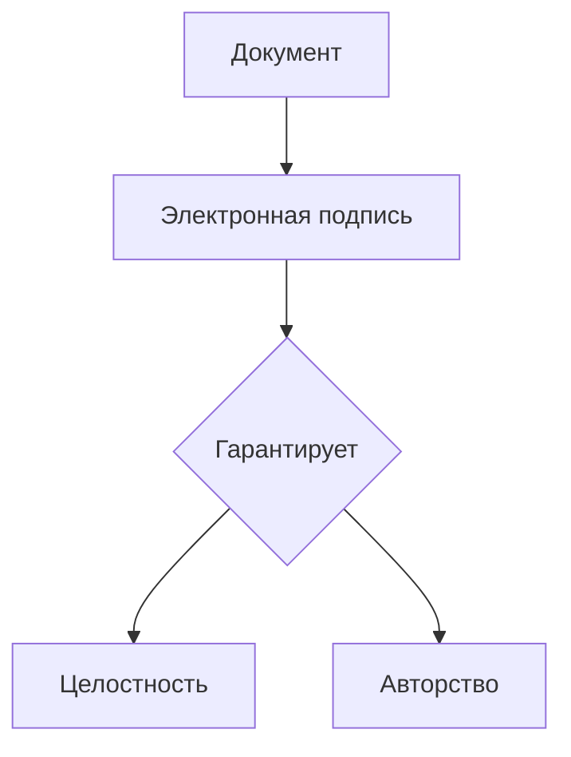
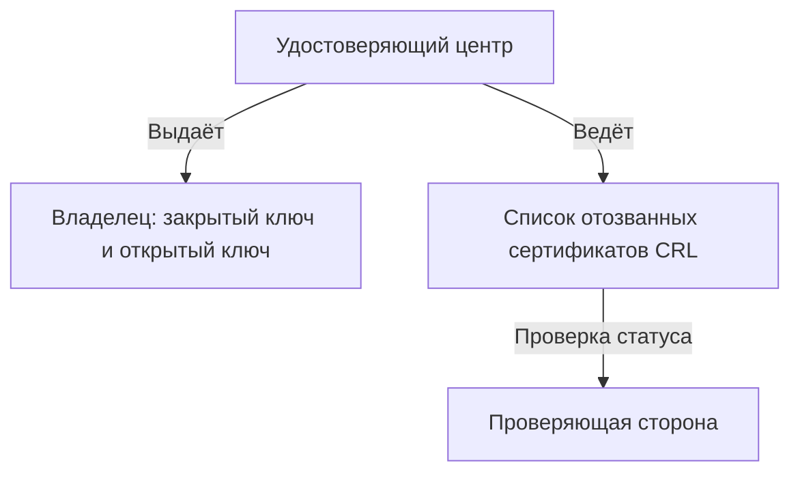
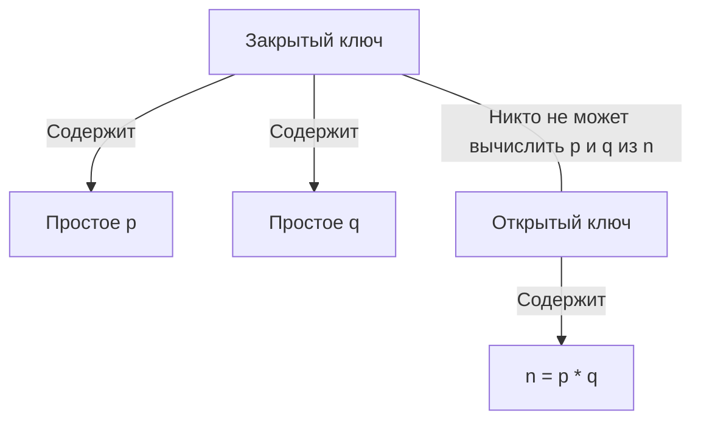
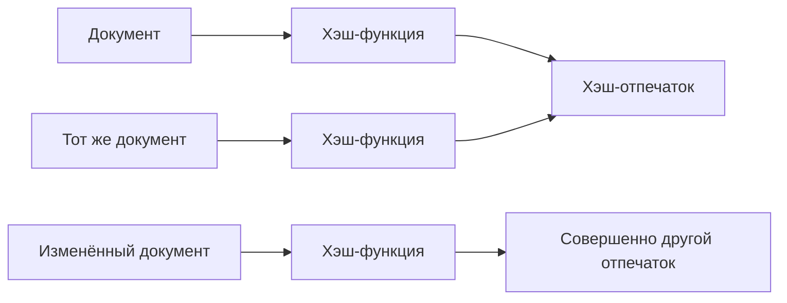
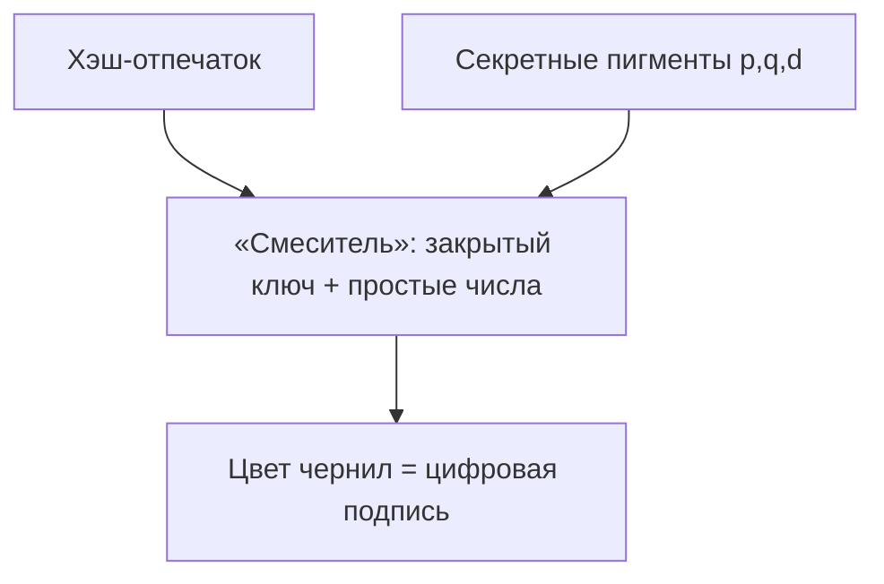
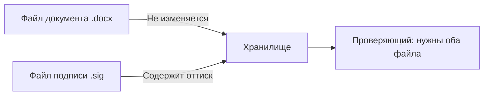
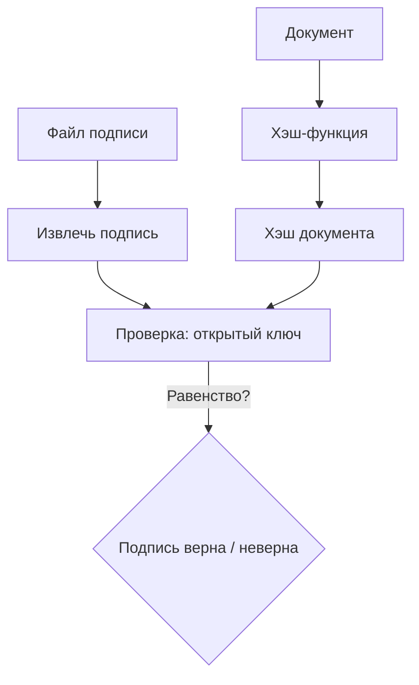
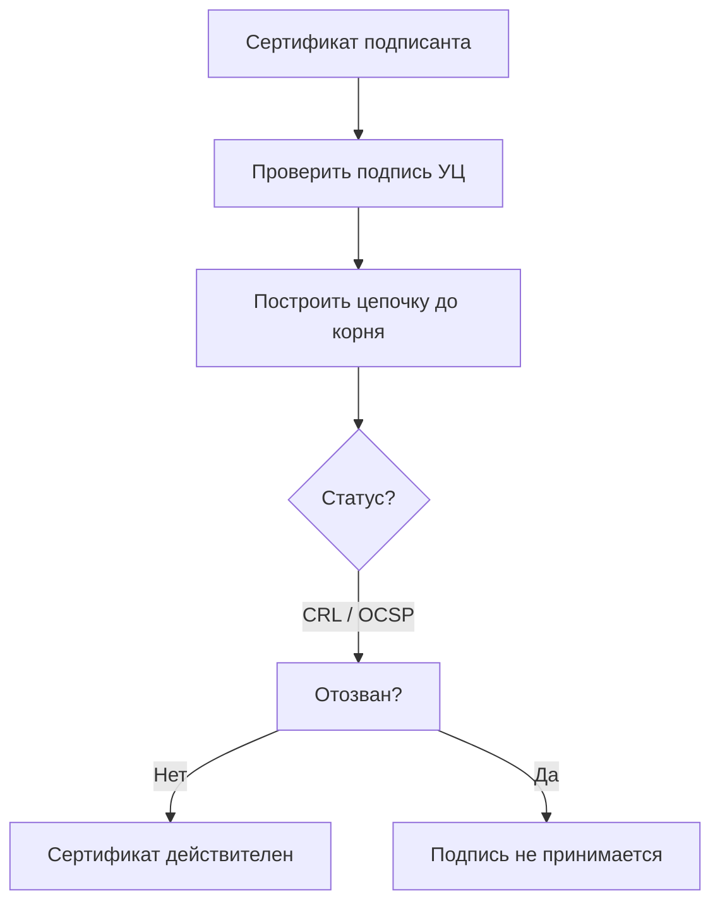

## 1

# Электронная подпись на пальцах: клише, цветные чернила и волшебная лупа

В этой статье мы объясним, как работает электронная подпись, с помощью простой аналогии — печать-факсимиле с особыми чернилами. Каждый шаг разбирается сначала «для гуманитария», потом «для айтишника», и закрепляется понятной схемой. Таких блоков будет восемь.

---

## 1. Что такое электронная подпись вообще?

**Для гуманитария**  
Представьте, что электронная подпись — это штамп‑факсимиле, которым можно заверить цифровой документ. Как и обычная печать, она подтверждает, что документ исходит именно от вас, и что в нём ничего не меняли. Только вместо резинового клише и штемпельной подушки используются математические «чернила» и цифровое «клише».

**Для айтишника**  
Электронная подпись — это криптографический механизм, гарантирующий авторство и целостность электронного документа. Она базируется на асимметричной криптографии: владелец использует закрытый ключ для подписания, а проверяющая сторона — открытый ключ для верификации. Формат подписи может быть откреплённым (отдельный файл `.sig` или `.p7s`).

---

## 2. Кто делает «клише» и ведёт список недействительных

**Для гуманитария**  
Доверенный «изготовитель печатей» — Удостоверяющий центр (УЦ). Он выпускает вам уникальное клише (закрытый ключ) и волшебную лупу (открытый ключ) для проверки. Если вы потеряете клише или его украдут, УЦ заносит его номер в чёрный список — специальный реестр отозванных печатей. Пока клише там, его оттиски нигде не примут.

**Для айтишника**  
Центр сертификации (CA) выпускает сертификат открытого ключа, связывающий ключ с личностью владельца. Закрытый ключ хранится в секрете у подписанта. Открытый ключ распространяется публично. Статус действительности ключа контролируется через CRL (список отозванных сертификатов) или OCSP‑ответ. При компрометации закрытого ключа сертификат отзывается и попадает в CRL.

---

## 3. Что скрыто внутри «клише»

**Для гуманитария**  
Внутри клише спрятаны два секретных простых числа — как два базовых пигмента (например, идеально чистый красный и идеально чистый синий). Эти пигменты знает только владелец штампа. Снаружи на клише написано их «произведение» — огромное составное число. По одному произведению никто не сможет восстановить исходные пигменты, потому что перебрать все варианты нереально долго.

**Для айтишника**  
В криптосистеме RSA закрытый ключ содержит два больших простых числа `p` и `q`, а также секретную экспоненту `d`. Открытый ключ — это модуль `n = p*q` и открытая экспонента `e`. Безопасность основана на вычислительной сложности задачи факторизации: по `n` практически невозможно восстановить `p` и `q`. Закрытый ключ позволяет формировать подпись, а открытый — её проверять.

---

## 4. Перед тем как ставить печать: вычисляем отпечаток документа

**Для гуманитария**  
Прежде чем приложить клише, мы прогоняем текст документа через специальную машинку, которая считает «контрольную сумму». Это как короткий уникальный отпечаток всего текста. Если в документе изменить хоть одну запятую, отпечаток станет совсем другим. Так мы фиксируем содержимое документа на момент подписания.

**Для айтишника**  
На документ применяется криптографическая хэш‑функция (SHA‑256, SHA‑512 и т.п.), порождающая дайджест фиксированной длины. Хэш обладает свойствами: необратимость, устойчивость к коллизиям, лавинный эффект. В дальнейшем подписывается именно хэш, а не сам документ, что ускоряет вычисления и соответствует стандартам PKCS#1.

---

## 5. Смешиваем краски: рождается цвет подписи

**Для гуманитария**  
Теперь берём отпечаток документа и по специальному рецепту смешиваем наши секретные пигменты (простые числа). Результат — уникальный цвет чернил. Это как если бы вы по номеру документа набирали на палитре точный оттенок из бесконечного спектра. Именно этим цветом клише оставит оттиск на отдельном листе. Без знания секретных пигментов никто не сможет получить такой же цвет для того же документа.

**Для айтишника**  
Вычисляется цифровая подпись: `signature = hash^d mod n`. Используется закрытый ключ `(d, n)`. Поскольку `d` вычислительно защищено знанием `p` и `q`, подпись уникальна для данного хэша. Проверяющая сторона, зная открытый ключ `(e, n)`, способна проверить, что `hash == signature^e mod n`, но не может подделать подпись.

---

## 6. Оттиск на отдельном листе — откреплённая подпись

**Для гуманитария**  
Мы не ставим печать прямо на оригинале, а делаем оттиск на чистом листе бумаги и прикладываем его рядом. Теперь у нас два листа: один — текст договора, второй — цветной оттиск факсимиле. Это и есть «откреплённая» подпись. Сам документ остаётся нетронутым, его можно читать без всяких технических средств.

**Для айтишника**  
Формируется откреплённая электронная подпись (detached signature) — отдельный файл (например, `.sig`), содержащий подпись, сертификат подписанта и, возможно, цепочку сертификатов. Документ остаётся в исходном формате. Проверяющий должен иметь и файл документа, и файл подписи. Стандарты: PKCS#7 / CMS detached, XMLDSig, PDF подписи.

---

## 7. Проверка подписи: волшебная лупа и лёгкая математика

**Для гуманитария**  
Получатель берёт текст документа и снова считает его отпечаток. Потом через «лупу» (открытый ключ) смотрит на цвет оттиска и проверяет: действительно ли такой цвет мог получиться именно из этого отпечатка и именно из того клише, чей номер указан. Фокус в том, что проверка занимает секунды, хотя создание правильного цвета без секретных пигментов — неподъёмная задача. Именно так устроена асимметрия: сложно сделать, легко проверить.

**Для айтишника**  
Верификация: вычисляется хэш документа `h'`, затем проверяется равенство `h' == signature^e mod n`. Операция модульного возведения в степень `e` (обычно 65537) выполняется быстро. В то же время подделка подписи требует вычислительно нерешаемой задачи факторизации `n` для нахождения `d`. Дополнительно проверяется соответствие подписи и хэша по алгоритму, указанному в сертификате.

---

## 8. Проверка паспорта штампа: сертификат и чёрный список

**Для гуманитария**  
Вместе с оттиском вам передают «паспорт» клише — сертификат. Это отдельный документ, заверенный печатью УЦ, где написано, кому принадлежит штамп и какой у него открытый ключ. Получатель сначала убеждается, что паспорт подлинный (проверяет подпись УЦ), потом сверяется с чёрным списком: не украдено ли клише, не аннулирован ли паспорт. Только если и паспорт, и сам оттиск в порядке, подпись принимается.

**Для айтишника**  
Сертификат X.509 содержит открытый ключ субъекта и подписан закрытым ключом УЦ. Проверка подписи сертификата выполняется с использованием открытого ключа УЦ. Затем проверяется статус сертификата: через CRL (полный список отозванных) или OCSP (онлайн‑запрос). Алгоритм валидации цепочки вплоть до доверенного корневого сертификата описан в RFC 5280. Если сертификат отозван или цепочка невалидна, подпись отвергается.

---

Так устроена электронная подпись: за гуманитарной аналогией с клише, цветными чернилами и лупой скрывается строгая криптография на основе асимметричных ключей, хэшей и инфраструктуры открытых ключей (PKI).
