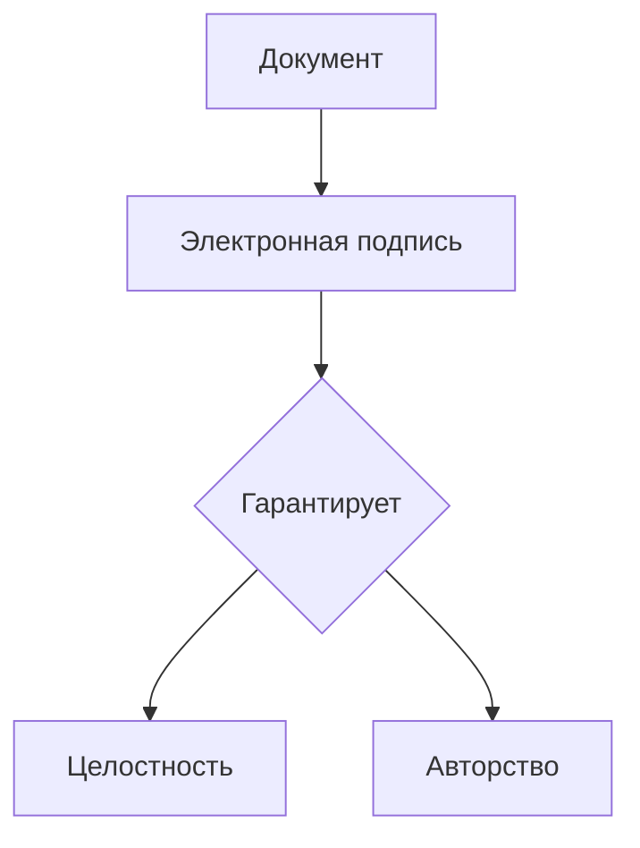
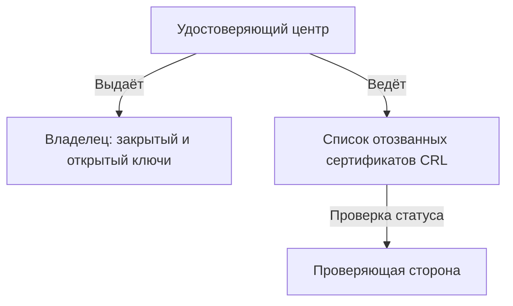
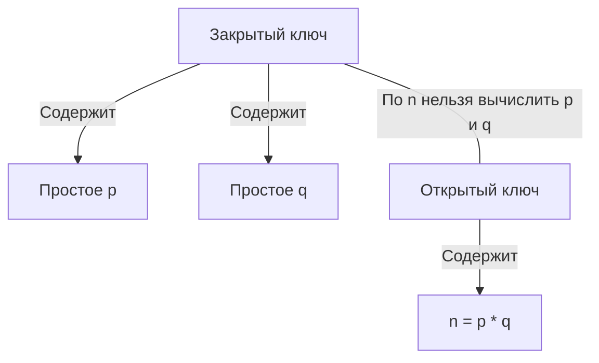
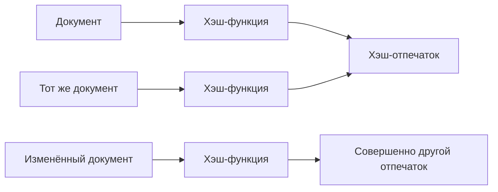
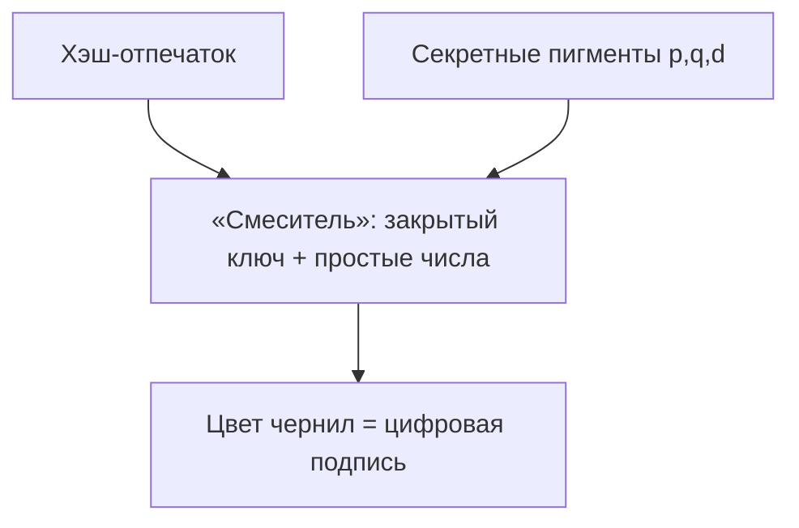
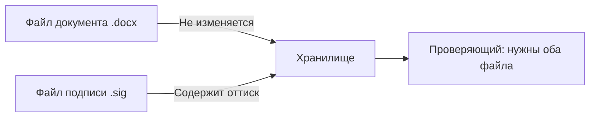
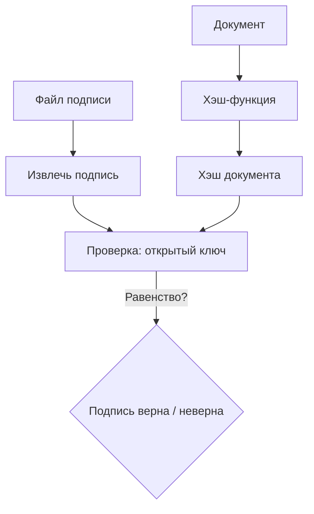
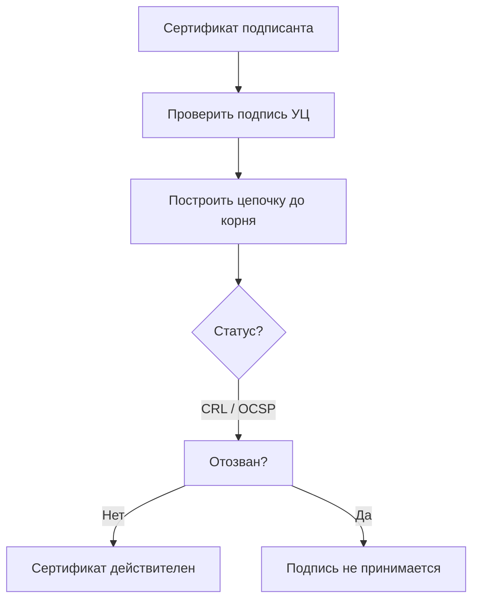

1a
# Электронная подпись на пальцах: факсимиле с умными чернилами

Перед вами простой рассказ о том, как работает электронная подпись. Мы сравним её с механическим факсимиле, которое окунается в особые чернила. Каждый шаг разбирается сначала «для гуманитария», потом «для айтишника» и поясняется наглядной схемой. Таких блоков будет восемь.

---

## 1. Что такое электронная подпись вообще?

**Для гуманитария**  
Представьте цифровое факсимиле – печать, которая не оставляет оттиск прямо на документе, а ставит его на отдельном листе. Главное отличие от обычного штампа – чернила не простые: их цвет каждый раз подбирается под текст документа. Это гарантирует, что оттиск принадлежит именно вам и что после подписания в документе не изменили ни запятой.

**Для айтишника**  
Электронная подпись — криптографический механизм, обеспечивающий авторство и целостность цифровых данных. Основа — асимметричная криптосистема: закрытый ключ создаёт подпись, открытый проверяет. Формат может быть откреплённым (detached signature, отдельный файл `.sig` или `.p7s`).

---

## 2. Кто делает «клише» и ведёт список недействительных

**Для гуманитария**  
Доверенный «изготовитель печатей» — Удостоверяющий центр (УЦ). Он выпускает для вас уникальное факсимиле с секретными пигментами и выдаёт открытый «номер» этого клише, чтобы любой мог проверить оттиски. Если печать потеряется или её украдут, УЦ заносит её номер в чёрный список (специальный реестр отозванных клише). Пока номер в этом списке, оттиски такой печати нигде не принимаются.

**Для айтишника**  
Центр сертификации (Certificate Authority, CA) выпускает сертификат открытого ключа, связывая его с личностью владельца. Закрытый ключ известен только подписанту. Открытый ключ доступен всем. Статус действительности проверяется по CRL (Certificate Revocation List) или через OCSP-запрос. При компрометации ключа сертификат отзывается и попадает в CRL.

---

## 3. Что спрятано внутри «клише»

**Для гуманитария**  
Внутри факсимиле хранятся два секретных базовых пигмента — как два идеально чистых тюбика краски, известных только владельцу. На корпусе клише написан их «открытый номер» — произведение этих пигментов. По одному произведению восстановить исходные пигменты нереально: перебирать все варианты пришлось бы многие годы. Так что секрет остаётся секретом.

**Для айтишника**  
В алгоритме RSA закрытый ключ содержит два больших простых числа `p` и `q`, а также секретную экспоненту `d`. Открытый ключ — модуль `n = p * q` и открытая экспонента `e`. Сложность факторизации `n` на `p` и `q` обеспечивает криптостойкость: по открытому ключу практически невозможно восстановить закрытый.

---

## 4. Перед тем как окунуть печать: получаем отпечаток документа

**Для гуманитария**  
Прежде чем ставить оттиск, мы прогоняем текст через специальную машинку, которая считает «контрольную сумму» — короткий уникальный отпечаток всего содержимого. Если в документе изменить хоть одну букву, отпечаток станет совсем другим. Так мы фиксируем состояние документа на момент подписания.

**Для айтишника**  
На документ подаётся криптографическая хэш-функция (SHA‑256, SHA‑512 и др.), порождающая дайджест фиксированной длины. Хэш обладает необратимостью, лавинным эффектом и устойчивостью к коллизиям. В дальнейшем подписывается именно хэш, а не весь файл, что соответствует стандарту PKCS#1.

---

## 5. Как замешиваются чернила: рождается цвет подписи

**Для гуманитария**  
Внутри факсимиле есть смеситель и два резервуара с секретными пигментами. Получив отпечаток документа, устройство смешивает пигменты в пропорции, которую диктует этот отпечаток. На выходе получается уникальный цвет чернил — точно соответствующий и документу, и владельцу клише. Резиновый валик окунается в этот цвет и готов оставить оттиск. Подобрать такой же цвет без знания пигментов — задача космической сложности, а проверить его подлинность можно мгновенно.

**Для айтишника**  
Вычисляется цифровая подпись: `signature = hash^d mod n`. Используется закрытый ключ `(d, n)`. Поскольку `d` получить практически невозможно без `p` и `q`, подпись уникальна для пары «документ + отправитель». Проверяющая сторона, зная открытый ключ `(e, n)`, может убедиться, что `hash == signature^e mod n`, но не может подделать подпись.

---

## 6. Оттиск на отдельном листе — откреплённая подпись

**Для гуманитария**  
Мы не ставим печать прямо на оригинал, а делаем оттиск на чистом листе и прикладываем его рядом. Теперь у нас два листа: один — текст договора, второй — цветной оттиск факсимиле. Это и есть откреплённая подпись. Сам документ остаётся неизменным, его можно спокойно читать.

**Для айтишника**  
Формируется откреплённая электронная подпись (detached signature) — отдельный файл, содержащий подпись, сертификат подписанта и, возможно, цепочку сертификатов. Документ сохраняется в исходном формате. Для проверки нужны оба файла: документ и файл подписи. Используются стандарты PKCS#7/CMS, XMLDSig и др.

---

## 7. Проверка подписи: «проявитель» и лёгкая математика

**Для гуманитария**  
Получатель снова прогоняет документ через машинку и получает тот же отпечаток. Затем он берёт открытый номер клише — он работает как химический проявитель. Стоит «капнуть» им на оттиск, и сразу видно: совпадает ли цвет с тем, что должен быть у этого документа. Если совпадает — подпись верна. Проверка занимает доли секунды, а подбор правильного цвета без секретных пигментов — невыполнимая задача.

**Для айтишника**  
Верификация: вычисляется хэш документа `h'`, затем проверяется `h' == signature^e mod n`. Возведение в степень `e` (обычно 65537) выполняется быстро. Для подделки же нужно решить задачу факторизации `n`, что вычислительно невозможно для больших ключей. Дополнительно сверяются алгоритмы подписи из сертификата.

---

## 8. Проверка паспорта штампа: сертификат и чёрный список

**Для гуманитария**  
Вместе с оттиском вам вручают «паспорт» клише — сертификат. Это документ, заверенный подписью УЦ, где указано, кому принадлежит печать и какой у неё открытый номер. Получатель сначала убеждается, что паспорт не подделан (проверяет подпись УЦ), а потом заглядывает в чёрный список: не украдена ли печать, не аннулирован ли паспорт. Только если и паспорт, и оттиск в порядке, подпись признаётся действительной.

**Для айтишника**  
Сертификат X.509 содержит открытый ключ субъекта и подписан закрытым ключом УЦ. Проверяется подпись сертификата с использованием открытого ключа УЦ и строится цепочка доверия до корневого сертификата. Затем определяется статус сертификата: по CRL (списку отозванных) или OCSP. Если сертификат отозван или цепочка недействительна, подпись отвергается. Процедура описана в RFC 5280.

---

## Словарик: термины и их простые аналоги

| Термин (сокращение) | Штатное объяснение | Упрощённая аналогия |
|----------------------|-------------------|----------------------|
| **Электронная подпись (ЭП)** / Digital signature | Криптографический механизм подтверждения авторства и целостности электронных данных. | Цифровое факсимиле с умными чернилами, меняющими цвет под документ. |
| **Удостоверяющий центр (УЦ)** / Certificate Authority (CA) | Организация, выпускающая сертификаты открытых ключей и подтверждающая их принадлежность. | Доверенная фабрика, которая изготавливает клише и выдаёт паспорта к ним. |
| **Закрытый ключ** / Private key | Секретный криптографический ключ, используемый для создания подписи. Не должен быть известен никому, кроме владельца. | Само клише с секретными пигментами и смесителем, спрятанное у владельца. |
| **Открытый ключ** / Public key | Ключ, доступный всем желающим и предназначенный для проверки подписи, сделанной парным закрытым ключом. | Открытый номер клише, работающий как проявитель: позволяет проверить оттиск, но не создать его. |
| **Хэш-функция** / Hash function | Алгоритм, превращающий данные произвольной длины в короткую строку (дайджест) фиксированной длины. | Машинка для снятия уникального отпечатка со всего текста документа. |
| **Сертификат ключа** / Certificate | Электронный документ, подписанный УЦ и связывающий открытый ключ с личностью владельца. | Паспорт клише, заверенный печатью УЦ, с указанием владельца и открытого номера. |
| **CRL (список отозванных сертификатов)** / Certificate Revocation List | Публикуемый УЦ перечень сертификатов, которые были отозваны до истечения срока действия. | Чёрный список украденных, потерянных или испорченных клише. |
| **Откреплённая подпись** / Detached signature | Файл подписи, хранящийся отдельно от подписываемого документа. | Оттиск печати на отдельном листе, приложенном к договору. |
| **Простые числа (p, q)** / Prime numbers | Натуральные числа, делящиеся только на 1 и на самих себя. В RSA используются для генерации ключей. | Два идеально чистых пигмента, из смешивания которых получаются уникальные чернила. |
| **RSA** / Rivest–Shamir–Adleman | Криптосистема с открытым ключом, основанная на сложности факторизации больших чисел. | Сама конструкция нашего «умного факсимиле», где секретность держится на перемножении пигментов. |

Теперь, когда вы знаете и «гуманитарную», и техническую сторону, принцип действия электронной подписи перестаёт быть магией и превращается в понятный и элегантный механизм.
