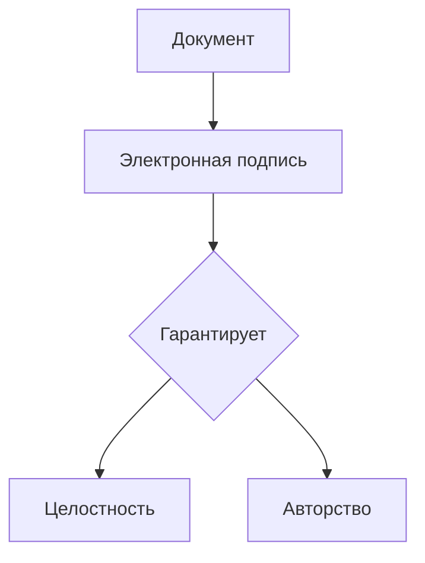
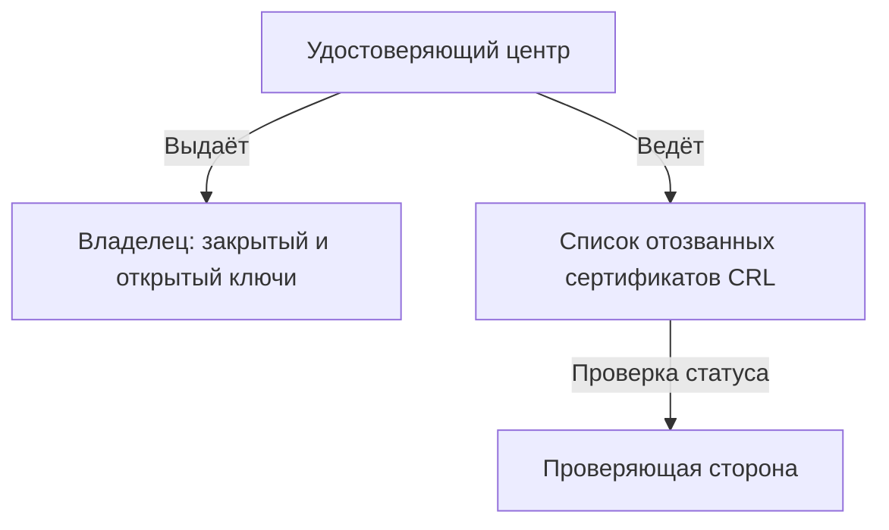
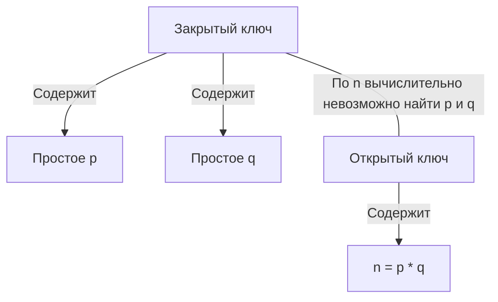
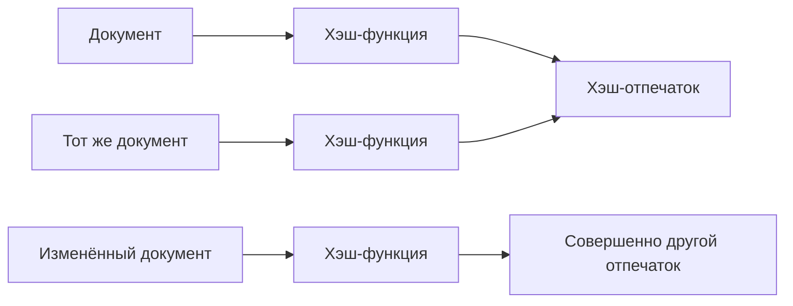
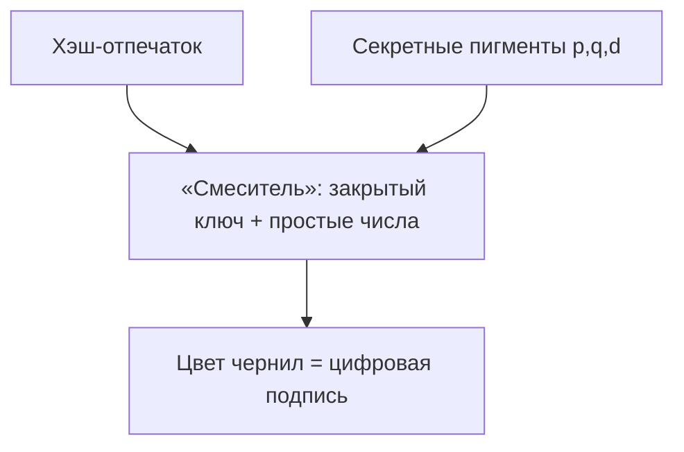
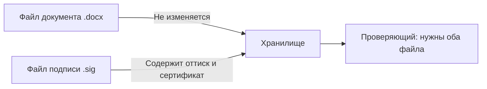
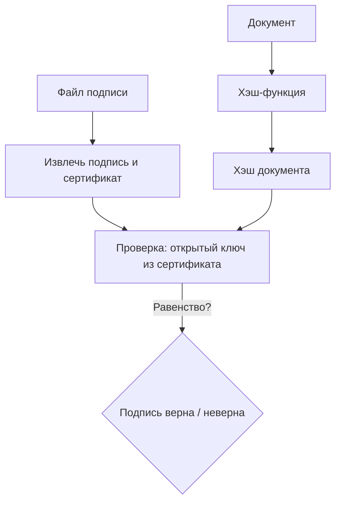
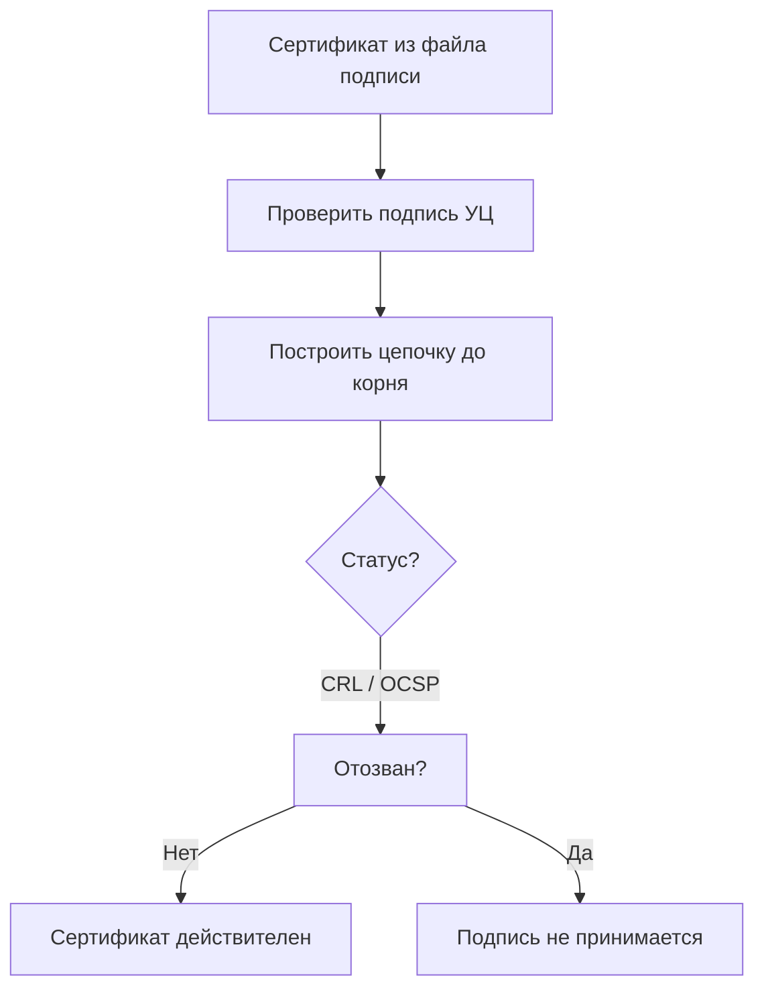
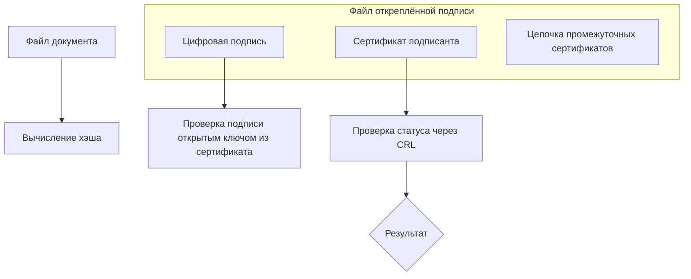

ai1b

# Электронная подпись на пальцах: факсимиле с умными чернилами

Перед вами подробный рассказ о том, как работает электронная подпись. Мы сравним её с механическим факсимиле, которое каждый раз окунается в особые чернила. Каждый шаг разбирается сначала «для гуманитария», потом «для айтишника» и поясняется наглядной схемой. Таких блоков будет восемь, а в конце — приложение с устройством файла подписи и словарик.

---

## 1. Что такое электронная подпись вообще?

**Для гуманитария**  
Представьте цифровое факсимиле — печать, которая не пачкает сам документ, а оставляет цветной оттиск на отдельном листе. Главное волшебство — чернила не простые: их оттенок каждый раз подбирается автоматически под текст договора. Если позже кто-то изменит в договоре хоть запятую, цвет оттиска перестанет совпадать, и подлог сразу раскроется. Таким образом, такая подпись гарантирует две вещи: что документ подписан именно вами (никто не сможет подобрать правильный цвет без вашего уникального клише) и что после подписания в нём ничего не меняли.

**Для айтишника**  
Электронная подпись — криптографический механизм, обеспечивающий авторство и целостность цифровых данных. В основе лежит асимметричная криптосистема: закрытый ключ порождает подпись, открытый — проверяет её. Формат может быть откреплённым (detached signature), когда подпись хранится в отдельном файле (например, `.sig` или `.p7s`) и не внедряется в сам документ.

---

## 2. Кто делает «клише» и ведёт список недействительных

**Для гуманитария**  
Доверенный «изготовитель печатей» — Удостоверяющий центр (УЦ). Это как государственная фабрика, которая выпускает для вас уникальное механическое факсимиле с секретными пигментами внутри. Одновременно УЦ публикует открытый «номер» этого клише — что-то вроде серийного номера, доступного любому желающему для проверки. Если вы потеряете печать или её украдут, вы немедленно сообщаете на фабрику, и номер клише заносится в чёрный список (специальный реестр отозванных устройств). Пока номер в этом списке, оттиски такой печати не примет ни один проверяющий. Сам чёрный список регулярно обновляется и доступен всем, кому нужно проверить подпись.

**Для айтишника**  
Центр сертификации (Certificate Authority, CA) выпускает сертификат открытого ключа, связывая его с личностью владельца. Закрытый ключ хранится исключительно у подписанта. Открытый ключ распространяется публично. Статус действительности сертификата проверяется по CRL (Certificate Revocation List, список отозванных сертификатов) или через онлайн-запрос OCSP. При компрометации ключа сертификат отзывается и немедленно попадает в CRL.

---

## 3. Что спрятано внутри «клише» и почему это надёжно

**Для гуманитария**  
Внутри факсимиле хранятся два секретных флакона с идеально чистыми красителями — например, абсолютный красный и абсолютный синий. Эти красители — два огромных простых числа. На корпусе клише выгравирован их «открытый номер» — произведение этих чисел. Например, если внутри 13 и 17, то снаружи написано 221. Пока числа маленькие, перебрать варианты легко, но в настоящем клише каждое число записывается тремя сотнями знаков. Чтобы понять масштаб, представьте: если каждую секунду проверять по миллиарду вариантов, на полный перебор уйдёт больше времени, чем существует Вселенная. Однако перемножить два исходных числа можно за долю секунды. В этом и заключается асимметрия: изготовить клише, зная пигменты, легко, а восстановить пигменты по открытому номеру практически невозможно.

**Для айтишника**  
В криптосистеме RSA закрытый ключ включает два больших простых числа `p` и `q`, а также секретную экспоненту `d`. Открытый ключ — модуль `n = p * q` и открытая экспонента `e`. Криптостойкость основана на вычислительной сложности задачи факторизации: разложить `n` на множители `p` и `q` для ключей длиной 2048 или 4096 бит не под силу даже самым мощным суперкомпьютерам. В то же время операции с ключами (генерация, подписание, проверка) выполняются быстро благодаря эффективным алгоритмам модульной арифметики.

---

## 4. Перед тем как окунуть печать: получаем отпечаток документа

**Для гуманитария**  
Представьте специальную машинку — «сниматель отпечатков». Вы кладёте в неё текст договора, и она выдаёт короткую строку символов, похожую на уникальный штрих-код всего содержимого. Если в документе изменить хотя бы одну букву или запятую, отпечаток станет совершенно другим — как будто это другой документ. Такой отпечаток называют контрольной суммой или хэшем. Именно по этому отпечатку факсимиле потом подберёт цвет чернил, поэтому машинка гарантирует, что подписан будет именно этот текст и никакой другой.

**Для айтишника**  
На документ подаётся криптографическая хэш-функция (SHA‑256, SHA‑512 и др.), которая порождает дайджест фиксированной длины. Хэш обладает свойствами необратимости, лавинного эффекта и стойкости к коллизиям. В дальнейшем подписывается именно хэш, а не весь документ, что соответствует стандарту PKCS#1 и значительно ускоряет вычисления.

---

## 5. Как замешиваются чернила: рождается цвет подписи

**Для гуманитария**  
Внутри нашего факсимиле есть автоматический смеситель и два резервуара с теми самыми секретными пигментами (красным и синим). Получив отпечаток документа, устройство считывает его и по строгому, вшитому в механизм рецепту смешивает пигменты в строго определённой пропорции. На выходе получается уникальный оттенок, например, определённый тон фиолетового. Именно этим цветом резиновая печатная головка оставляет оттиск на бумаге. Важнейший момент: подобрать такой же цвет без знания исходных пигментов — всё равно что пытаться угадать точную комбинацию из десятков цифр, просто глядя на итоговый цвет. Тогда как проверить, подлинный ли оттенок, можно почти мгновенно — с помощью специального «проявителя» (открытого ключа), о котором пойдёт речь дальше.

**Для айтишника**  
Вычисляется цифровая подпись: `signature = hash^d mod n`. Используется закрытый ключ `(d, n)`. Поскольку `d` защищён сложностью факторизации, подпись уникальна для пары «документ + отправитель». Проверяющая сторона, зная открытый ключ `(e, n)`, сможет позже убедиться, что `hash == signature^e mod n`, но не сможет подделать подпись, так как для этого потребовалось бы знание `d`.

---

## 6. Оттиск на отдельном листе — откреплённая подпись

**Для гуманитария**  
Мы не ставим печать прямо на оригинале договора, а делаем оттиск на чистом листе и прикладываем его к документу. Теперь у нас два листа: один — текст соглашения, второй — цветной оттиск факсимиле. Это и есть откреплённая подпись. Сам договор остаётся нетронутым, его можно свободно читать, копировать, пересылать. Важно: на листе с оттиском помимо самого цветного пятна напечатан ещё и «паспорт» клише (сертификат), так что отдельно передавать какие-либо бумаги о печати не требуется — всё уже вложено в файл подписи.

**Для айтишника**  
Формируется откреплённая электронная подпись (detached signature) — отдельный файл (например, `.sig` или `.p7s`), который содержит саму подпись и сертификат подписанта (а также, возможно, цепочку промежуточных сертификатов). Документ сохраняется в исходном формате. Для проверки необходимы оба файла: исходный документ и файл подписи. Стандарты: PKCS#7/CMS, XMLDSig, CAdES и др.

---

## 7. Проверка подписи: «проявитель» и лёгкая математика

**Для гуманитария**  
Получатель повторно прогоняет текст договора через ту же машинку для снятия отпечатков и получает уже знакомый хэш. Затем он берёт «проявитель» — это открытый номер клише, доступный всем. Проявитель работает как волшебная лакмусовая бумажка: её прикладывают к цветному оттиску, и она мгновенно показывает, совпадает ли цвет с тем, который обязан получиться из такого документа именно этим клише. Если совпадает — подпись подлинна, документ не искажён. Если нет — либо документ подделан, либо оттиск оставлен чужим факсимиле. Весь фокус в том, что проверить совпадение можно за секунду, а подобрать правильный цвет без секретных пигментов — задача, на которую не хватит жизни всей Вселенной.

**Для айтишника**  
Верификация: вычисляется хэш документа `h'`, затем проверяется равенство `h' == signature^e mod n`. Возведение в степень `e` (обычно 65537) по модулю `n` выполняется быстро. Попытка же подделать подпись требует решения задачи факторизации `n` для получения `d`, что для современных размеров ключей практически неосуществимо. Дополнительно сверяются алгоритмы подписи, указанные в сертификате.

---

## 8. Проверка паспорта штампа: сертификат и чёрный список

**Для гуманитария**  
В файл подписи уже вшит «паспорт» клише — сертификат, заверенный самим Удостоверяющим центром. В паспорте написано, кому принадлежит печать и какой у неё открытый номер. Получатель сначала убеждается, что паспорт не подделан: для этого он проверяет подпись УЦ под этим паспортом (тем же методом «проявителя», но с использованием открытого номера самого УЦ). Затем он обращается к чёрному списку (CRL) и смотрит, не значится ли там серийный номер этого клише. Если паспорт подлинный и номера в чёрном списке нет, а сам оттиск прошёл проверку по цвету, подпись признаётся действительной. Таким образом, для полной проверки достаточно иметь сам документ, файл подписи и доступ к актуальному чёрному списку.

**Для айтишника**  
Сертификат X.509, содержащийся в файле подписи, подписан закрытым ключом УЦ. Проверяется подпись сертификата с использованием открытого ключа УЦ и выстраивается цепочка доверия до корневого сертификата. Затем определяется статус сертификата: по CRL (списку отозванных) или через OCSP. Если сертификат отозван или цепочка недействительна, подпись отвергается. Процедура описана в RFC 5280. Важно, что отдельный сертификат не нужен — он извлекается из самой подписи; внешним остаётся только список отзыва (CRL) или ответ OCSP.

---

## Приложение: что внутри файла откреплённой подписи

**Для гуманитария**  
Файл подписи — это конверт, в который вложены:
- сам цветной оттиск (цифровая подпись),
- паспорт клише (сертификат владельца),
- иногда — промежуточные удостоверения фабрики печатей, чтобы можно было проверить весь путь доверия до главного, корневого изготовителя.

То есть всё, что нужно для проверки, кроме самого документа и актуального чёрного списка, уже лежит внутри этого конверта. Отдельно носить паспорт или копию лицензии УЦ не требуется.

**Для айтишника**  
Файл откреплённой подписи в формате CMS/PKCS#7 (или CAdES) содержит:
- `signatureValue` — собственно значение подписи,
- `signerInfo` — идентификатор сертификата подписанта,
- `certificates` — набор сертификатов: сертификат подписанта и, как правило, цепочка промежуточных CA вплоть до корневого (доверенного) сертификата,
- возможно, атрибуты времени подписания, политики и т.д.

Корневой сертификат обычно уже присутствует в системе проверяющего, а список отзыва (CRL) загружается отдельно или проверяется онлайн. Таким образом, для полной верификации нужны: файл документа, файл подписи и актуальный CRL (или доступ к OCSP-серверу).

---

## Словарик: термины и их простые аналоги

| Термин (сокращение) | Штатное объяснение | Упрощённая аналогия |
|----------------------|-------------------|----------------------|
| **Электронная подпись (ЭП)** / Digital signature | Криптографический механизм, подтверждающий авторство и целостность электронных данных. | Цифровое факсимиле с умными чернилами, меняющими цвет под каждый документ. |
| **Удостоверяющий центр (УЦ)** / Certificate Authority (CA) | Организация, выпускающая сертификаты открытых ключей и удостоверяющая их принадлежность. | Доверенная фабрика, изготавливающая клише и выдающая паспорта на них. |
| **Закрытый ключ** / Private key | Секретный криптографический ключ для создания подписи; должен быть известен только владельцу. | Само клише с секретными пигментами, спрятанное у владельца. |
| **Открытый ключ** / Public key | Ключ, доступный всем и используемый для проверки подписи, созданной парным закрытым ключом. | Открытый номер клише, работающий как проявитель цвета. |
| **Хэш-функция** / Hash function | Алгоритм, преобразующий данные любой длины в короткую строку (дайджест) фиксированного размера. | Машинка, снимающая уникальный отпечаток со всего текста. |
| **Сертификат ключа** / Certificate | Электронный документ, подписанный УЦ и связывающий открытый ключ с личностью владельца. | Паспорт клише, заверенный подписью фабрики. |
| **CRL (список отозванных сертификатов)** / Certificate Revocation List | Публикуемый УЦ перечень сертификатов, отозванных до истечения срока. | Чёрный список украденных, потерянных или аннулированных клише. |
| **Откреплённая подпись** / Detached signature | Подпись, хранящаяся в отдельном от документа файле. | Оттиск печати на отдельном листе, вложенном в конверт с паспортом клише. |
| **Простые числа (p, q)** / Prime numbers | Натуральные числа >1, делящиеся только на 1 и на себя; в RSA служат основой ключей. | Два идеально чистых пигмента, из смеси которых получаются уникальные чернила. |
| **RSA** / Rivest–Shamir–Adleman | Асимметричная криптосистема, стойкость которой основана на сложности факторизации больших чисел. | Сама конструкция умного факсимиле, где секрет держится на перемножении огромных чисел. |

Теперь, вооружившись и гуманитарной, и технической стороной, вы сможете уверенно объяснить кому угодно, как работает электронная подпись — и даже заглянуть внутрь файла подписи, не опасаясь магии.
