ai1d

Вероятностная схема подписи (RSA-PSS) и «соль»

«Вероятностная» означает, что даже при подписании одного и того же документа одним и тем же ключом вы будете получать *разные* значения подписи. Это сделано для дополнительной безопасности. 

Соль (salt) в криптографии — это случайный набор данных, который добавляется к хэшу документа перед созданием подписи. Представьте, что перед смешиванием красок художник каждый раз добавляет в палитру немного случайного оттенка — это гарантирует, что даже если кто-то увидит результат, он не сможет понять точную формулу смешивания. Соль делает каждую подпись уникальной, даже если сообщение одно и то же — это усложняет жизнь злоумышленнику, который пытается подобрать ключ, анализируя подписи.

---

Термины из живописи (вместо «автоматический смеситель»)

Вместо «смесителя» лучше использовать термины из живописи: **палитра, мольберт, тюбики с красками, мастихин, грунтовка холста**. 

Каждому цвету сопоставляется не простое число, а число из закрытого ключа: два секретных простых числа `p` и `q` — это как два базовых чистых пигмента (например, идеальный красный и идеальный синий). Их произведение `n` — это «открытый номер» клише. Сам же цвет чернил, которым ставится оттиск, — это результат смешивания пигментов в пропорции, которую диктует хэш-отпечаток документа. То есть цвет — это значение подписи `signature = hash^d mod n`, а не сами простые числа.

---

Аналогия «проявителя» — открытый ключ как проверка цвета

Фраза «проявитель — открытый ключ» означает следующее. Представьте, что у проверяющего есть специальная линейка-шаблон с делениями. Он прикладывает её к цветному оттиску, и если оттенок совпадает с одним из делений шкалы — оттиск подлинный. Эта линейка устроена так, что проверить совпадение можно за секунду, но подобрать краску, которая попадёт в нужное деление, без знания секретных пигментов практически невозможно. «Проявитель» — это открытый ключ: он не может создать подпись, но может мгновенно подтвердить, что она правильная.

---

«Конверт» — это файл откреплённой подписи

«Конверт» — это сам файл откреплённой подписи (.p7s или .sig). Когда говорят «из конверта достают паспорт клише — сертификат», имеется в виду: из файла подписи извлекается сертификат подписанта, который уже встроен в этот файл. Отдельно сертификат передавать не нужно — он уже внутри «конверта».

---

CAdES-A версии 3 и ссылки на стандарты

Формат **CAdES-A v3** (CMS Advanced Electronic Signatures — Archival, версия 3) — это последняя версия стандарта долгосрочного хранения электронных подписей. Он определён в ETSI EN 319 122 (части 1 и 2), которые заменили предыдущий ETSI TS 101 733 и RFC 5126. В CAdES-A v3 добавлены новые атрибуты, в частности `archive-time-stamp-v3`, который позволяет проверять подпись даже спустя десятилетия после истечения срока действия сертификатов. Подробности можно найти в следующих стандартах:
- **RFC 5126** — CMS Advanced Electronic Signatures (CAdES).
- **ETSI TS 101 733** — исходный стандарт CAdES (заменён ETSI EN 319 122).
- **ETSI EN 319 122** — актуальный европейский стандарт CAdES.
- **RFC 5280** — Internet X.509 Public Key Infrastructure Certificate and CRL Profile.
- **RFC 3161** — Internet X.509 Public Key Infrastructure Time-Stamp Protocol (TSP).

---

Альтернативные аналогии для гуманитариев

Если аналогия с клише и красками кажется сложной, можно использовать другие сравнения:

1. **Сейф с кодовым замком и открытая ячейка.** Закрытый ключ — это код от сейфа, который знает только владелец. Открытый ключ — номер ячейки, куда можно положить документ на проверку. Чтобы «подписать» документ, владелец закрывает его в сейфе — и все видят, что документ там, но открыть и проверить содержимое может любой, зная номер ячейки. Подделать подпись — всё равно что открыть сейф без кода.

2. **Печать из воска и плавление.** У каждого владельца есть уникальный штамп (закрытый ключ). Когда он ставит оттиск на воске, воск плавится под воздействием тепла и принимает форму штампа. Проверяющий может приложить к оттиску трафарет (открытый ключ): если контуры совпадают — подпись подлинна. Сложность в том, что по одному оттиску невозможно восстановить форму штампа.

3. **Рецепт коктейля и дегустация.** Бармен знает секретный рецепт (закрытый ключ). Он смешивает напиток по заказу (документ) и подаёт бокал. Дегустатор пробует коктейль и сравнивает вкус с эталоном (открытый ключ). Если вкус совпадает — значит, коктейль приготовлен по правильному рецепту именно этим барменом. Восстановить точный рецепт по одному глотку практически невозможно, а проверить соответствие можно мгновенно.

---

Гуманитарные схемы для статьи

Я подготовил несколько схем, где используются только гуманитарные термины:

**Схема 1. Фаза подписания (для гуманитария)**

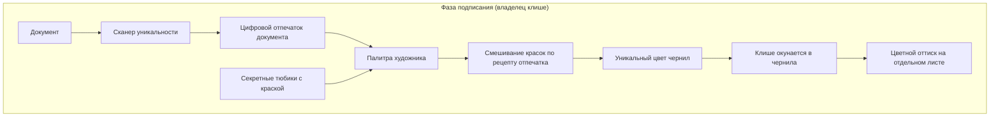

**Схема 2. Фаза проверки (для гуманитария)**

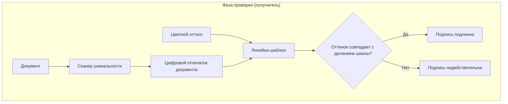

**Схема 3. Асимметрия: легко проверить, сложно подделать**

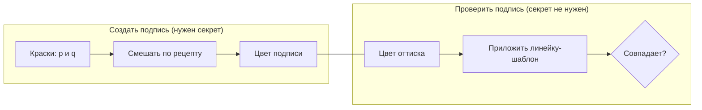

# 2
# Электронная подпись на пальцах: факсимиле с умными чернилами

В этой статье мы шаг за шагом разберём устройство электронной подписи. Сначала — общая картина всего процесса, а затем каждый этап с трёх точек зрения: «для гуманитария», «для айтишника» и «для продвинутого айтишника». Все шаги сопровождены подробными схемами, а в конце — словарик терминов.

## Общая схема алгоритма

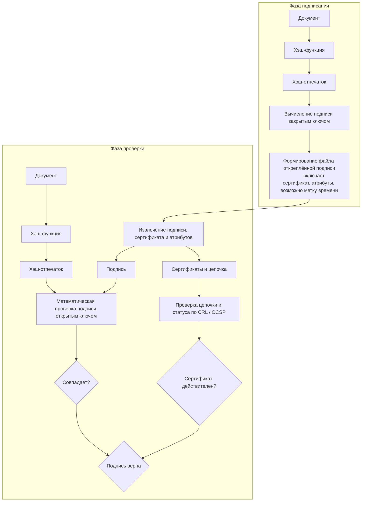

---

## 1. Что такое электронная подпись?

**Для гуманитария**  
Представьте цифровую печать, которая не пачкает сам документ, а ставит цветной оттиск на отдельном листе. Главная хитрость: чернила не постоянного цвета, а каждый раз замешиваются строго под содержание договора. Если кто-то потом изменит в договоре хотя бы запятую, цвет оттиска перестанет совпадать с ожидаемым, и подлог сразу же раскроется. Такая подпись гарантирует две вещи: во‑первых, документ подписан именно вами (никто не сможет подобрать правильный цвет без вашего уникального клише), во‑вторых, после подписания в нём ничего не меняли.

**Для айтишника**  
Электронная подпись — криптографический механизм, обеспечивающий авторство, целостность и неотказуемость электронных данных. Основана на асимметричной криптосистеме: закрытый ключ создаёт подпись, открытый — проверяет. Формат может быть откреплённым (detached signature), когда подпись хранится в отдельном файле (например, `.sig` или `.p7s`) и не внедряется в сам документ.

**Для продвинутого айтишника**  
Электронная подпись базируется на инфраструктуре открытых ключей (PKI) и стандартах X.509. Используются криптографические алгоритмы: RSA, DSA, ГОСТ Р 34.10-2012, ECDSA. Форматы подписей: CMS/PKCS#7, CAdES (с уровнями -B, -T, -XL для долгосрочной валидации), XAdES, PAdES. Механизм обеспечивает неотказуемость, поскольку подпись можно предъявить третьей стороне, а проверка не требует участия подписанта.

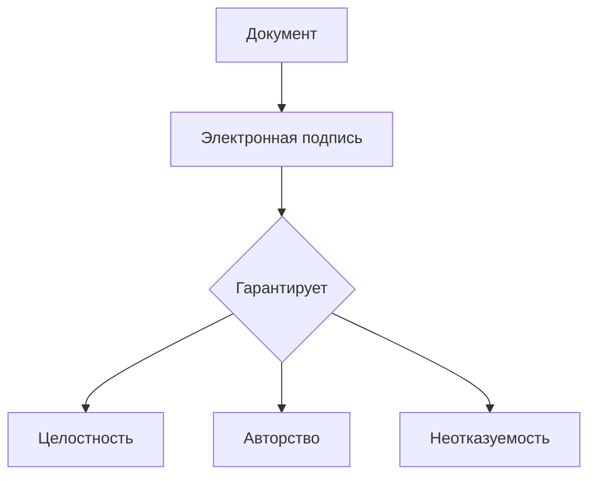

---

## 2. Кто делает «клише» и ведёт список недействительных

**Для гуманитария**  
Доверенный «изготовитель печатей» — Удостоверяющий центр (УЦ). Это своего рода фабрика, выпускающая уникальные механические клише с секретными красителями внутри. Одновременно УЦ публикует открытый «номер» клише, доступный любому для проверки. Если печать украли или потеряли, владелец немедленно сообщает на фабрику, и номер заносится в чёрный список — реестр отозванных устройств. Пока номер в списке, оттиски такой печати никто не примет.

**Для айтишника**  
Центр сертификации (Certificate Authority, CA) выпускает сертификат открытого ключа, связывая его с личностью владельца. Закрытый ключ хранится у подписанта. Открытый ключ распространяется публично. Статус действительности сертификата проверяется по CRL (Certificate Revocation List) или через онлайн-протокол OCSP. При компрометации ключа сертификат отзывается и немедленно попадает в CRL.

**Для продвинутого айтишника**  
CRL — это список, содержащий серийные номера отозванных сертификатов, дату отзыва и причину. Типовые причины: `keyCompromise` (компрометация ключа), `affiliationChanged` (изменение принадлежности), `superseded` (замена новым), `cessationOfOperation` (прекращение работы) и другие. Источником CRL служат точки распространения (CRL Distribution Points), указанные в сертификате. OCSP (Online Certificate Status Protocol) позволяет получить статус конкретного сертификата в реальном времени без загрузки всего списка. OCSP-ответ содержит один из статусов: `good`, `revoked`, `unknown`. CRL требует периодического обновления, OCSP — постоянного сетевого подключения.

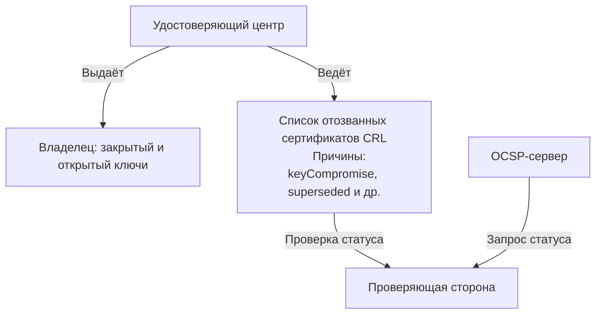

---

## 3. Что спрятано внутри «клише» и почему это надёжно

**Для гуманитария**  
Внутри клише находятся два флакона с секретными красителями — например, идеально чистый красный и идеально чистый синий. Каждый краситель — это огромное простое число. На корпусе клише выгравирован их «открытый номер» — произведение этих чисел. Если представить числа вроде 13 и 17, произведение 221 разложить на множители легко. Но в настоящем клише каждое число записывается тремя сотнями знаков. Чтобы перебрать все возможные делители, компьютеру потребуется время, многократно превышающее возраст Вселенной. Однако перемножить два исходных числа можно за долю секунды. В этом и заключается асимметрия: создать клише легко, а восстановить красители по открытому номеру практически невозможно.

**Для айтишника**  
В RSA закрытый ключ содержит два больших простых числа `p` и `q`, а также секретную экспоненту `d`. Открытый ключ — модуль `n = p * q` и открытая экспонента `e`. Стойкость основана на вычислительной сложности задачи факторизации: разложить 2048- или 4096-битное `n` на множители не под силу современным суперкомпьютерам.

**Для продвинутого айтишника**  
Помимо RSA применяются схемы на эллиптических кривых (ECDSA), где асимметрия базируется на сложности дискретного логарифмирования в группе точек кривой. Это позволяет использовать более короткие ключи при той же стойкости. В перспективе квантовые вычисления могут ослабить и RSA, и ECDSA, поэтому разрабатываются постквантовые алгоритмы (CRYSTALS-Dilithium и др.).

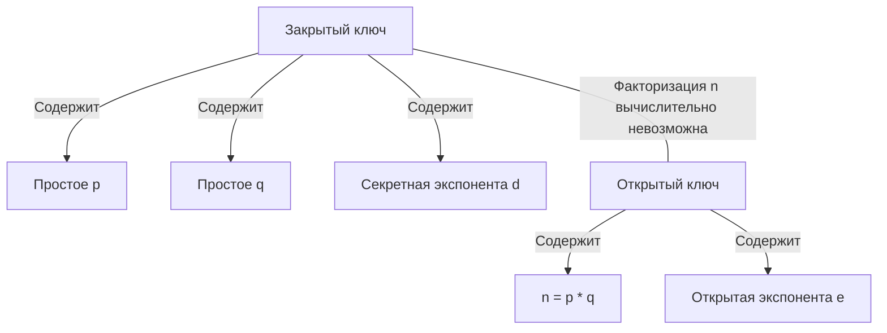

---

## 4. Перед тем как окунуть печать: получаем отпечаток документа

**Фаза: общая для подписания и проверки**

**Для гуманитария**  
Представьте специальную машинку — «сканер уникальности». Вы кладёте в неё текст договора, и она выдаёт короткую строку символов, похожую на штрих-код всего содержимого. Этот код настолько тесно связан с текстом, что любое, даже самое маленькое изменение (добавленная запятая) приводит к совершенно другому коду. Такой код называют отпечатком документа. Именно под этот отпечаток клише позже подберёт цвет чернил; при проверке получатель снова прогонит договор через точно такой же сканер и получит отпечаток — он должен совпасть с тем, для которого был когда-то подобран цвет. Таким образом, машинка гарантирует, что подписан именно этот текст и никакой другой.

**Для айтишника**  
На документ применяется криптографическая хэш-функция (SHA‑256, SHA‑512 и др.), которая порождает дайджест фиксированной длины. Хэш обладает необратимостью, лавинным эффектом и стойкостью к коллизиям. Подписывается именно хэш, а не весь документ, что ускоряет вычисления и соответствует стандарту PKCS#1.

**Для продвинутого айтишника**  
Используются хэш-функции из семейств SHA-2, SHA-3 или ГОСТ Р 34.11-2012. В контексте RSA-PSS (вероятностная схема подписи) хэш может дополняться солью. «Вероятностная» означает, что даже при подписании одного и того же документа одним и тем же ключом вы будете получать *разные* значения подписи. Соль (salt) в криптографии — это случайный набор данных, который добавляется к хэшу документа перед созданием подписи. Представьте, что перед смешиванием красок художник каждый раз добавляет в палитру немного случайного оттенка — это гарантирует, что даже если кто-то увидит результат, он не сможет понять точную формулу смешивания. Соль делает каждую подпись уникальной, даже если сообщение одно и то же — это усложняет жизнь злоумышленнику, который пытается подобрать ключ, анализируя подписи. В CAdES/CMS хэш-алгоритм указывается в подписанных атрибутах (signed attributes). Проверяющая сторона обязана использовать тот же алгоритм хэширования, что и подписант.

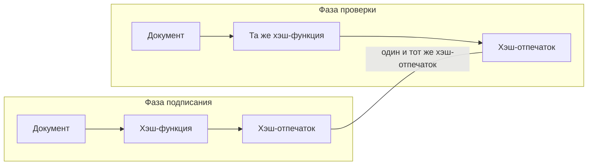

---

## 5. Как замешиваются чернила: рождается цвет подписи

**Фаза: подписание**

**Для гуманитария**  
Теперь вместо «автоматического смесителя» представьте палитру художника. На ней — два тюбика с секретными красителями (теми самыми огромными простыми числами). Получив отпечаток документа, художник мастихином смешивает краски в пропорции, которую диктует этот отпечаток. На выходе получается уникальный оттенок — скажем, конкретный тон фиолетового. Именно этим цветом резиновая печатная головка оставляет оттиск на бумаге. Подобрать такой же цвет без знания исходных красителей — всё равно что пытаться восстановить точный рецепт краски, глядя на уже окрашенную стену: вы видите лишь итоговый цвет, но не знаете, какие именно пигменты и в какой пропорции были смешаны, а вариантов — бесконечно много. А проверить, тот ли это оттенок, можно почти мгновенно с помощью специального «проявителя» — открытого ключа. Представьте, что у проверяющего есть особая линейка-шаблон с делениями-эталонами. Он прикладывает её к цветному оттиску, и если оттенок совпадает с одним из делений шкалы — оттиск подлинный. Эта линейка устроена так, что проверить совпадение можно за секунду, но подобрать краску, которая попадёт в нужное деление, без знания секретных пигментов практически невозможно. «Проявитель» — это открытый ключ: он не может создать подпись, но может мгновенно подтвердить, что она правильная.

**Для айтишника**  
Вычисляется цифровая подпись: `signature = hash^d mod n`. Используется закрытый ключ `(d, n)`. Поскольку `d` защищён сложностью факторизации, подпись уникальна для пары «документ + отправитель». Проверяющая сторона позже сможет убедиться, что `hash == signature^e mod n`, но не сможет подделать подпись без знания `d`.

**Для продвинутого айтишника**  
В RSA подпись — это результат модульного возведения хэша (иногда с дополнением по PKCS#1 v1.5 или PSS) в степень `d` по модулю `n`. В ECDSA подпись состоит из пары чисел `(r, s)`, вычисляемых с использованием эфемерного ключа и хэша. Важное значение имеет защита от атак по побочным каналам при генерации подписи.

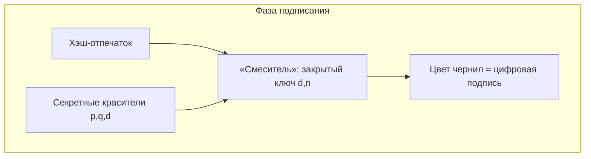

---

## 6. Оттиск на отдельном листе — откреплённая подпись

**Фаза: формирование файла подписи (подписание)**

**Для гуманитария**  
Мы не пачкаем сам договор, а делаем оттиск на чистом листе и вкладываем его в конверт. В этот же конверт фабрика печатей заранее положила паспорт клише (сертификат) и, возможно, ещё несколько удостоверений, чтобы любой мог проверить всю цепочку доверия. «Конверт» — это сам файл откреплённой подписи (.p7s или .sig). Теперь у нас два объекта: текст договора и конверт с оттиском и документами. Это и есть откреплённая подпись. Сам договор остаётся нетронутым. Для проверки не нужно ничего больше, кроме самого документа, этого конверта и актуального чёрного списка (CRL).

**Для айтишника**  
Формируется откреплённая электронная подпись (detached signature) в виде отдельного файла, обычно `.p7s` (CMS SignedData). Внутри содержатся: значение подписи, сертификат подписанта и цепочка промежуточных сертификатов. Документ остаётся в исходном формате. Для верификации нужны оба файла: документ и файл подписи.

**Для продвинутого айтишника**  
Формат CAdES (CMS Advanced Electronic Signatures) расширяет CMS дополнительными подписанными и неподписанными атрибутами.  
- **CAdES-B** (базовый) — содержит подпись и сертификаты.  
- **CAdES-T** добавляет в неподписанные атрибуты timestamp token — подписанную доверенным сервером TSA (Timestamp Authority) метку времени, фиксирующую момент подписания. Это защищает от подделки времени.  
- **CAdES-XL** дополнительно включает сертификаты всей цепочки и CRL (или OCSP-ответы), что позволяет проверить подпись даже годы спустя, когда исходные списки отзыва могут быть уже недоступны.  
Формат **CAdES-A v3** (CMS Advanced Electronic Signatures — Archival, версия 3) — это последняя версия стандарта долгосрочного хранения электронных подписей, определённая в ETSI EN 319 122 (части 1 и 2), которые заменили предыдущий ETSI TS 101 733 и RFC 5126. В CAdES-A v3 добавлены новые атрибуты, в частности `archive-time-stamp-v3`, который позволяет проверять подпись даже спустя десятилетия после истечения срока действия сертификатов.

Стандарты:
- **RFC 5126** — CMS Advanced Electronic Signatures (CAdES).
- **ETSI TS 101 733** — исходный стандарт CAdES (заменён ETSI EN 319 122).
- **ETSI EN 319 122** — актуальный европейский стандарт CAdES.
- **RFC 5280** — Internet X.509 Public Key Infrastructure Certificate and CRL Profile.
- **RFC 3161** — Internet X.509 Public Key Infrastructure Time-Stamp Protocol (TSP).

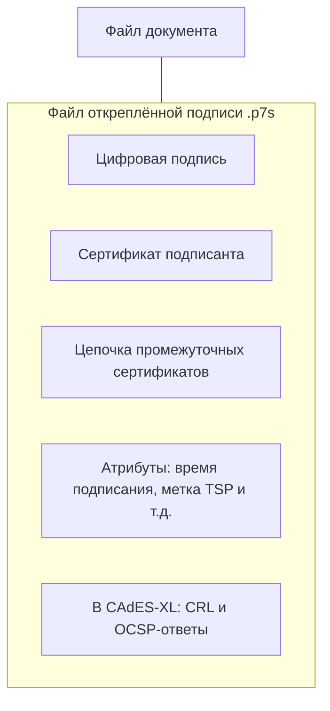

---

## 7. Проверка подписи: «проявитель» и лёгкая математика

**Фаза: проверка (математический этап)**

**Для гуманитария**  
Получатель берёт договор и снова пропускает его через ту же машинку для снятия отпечатков, получая уже знакомый отпечаток. Затем он достаёт из конверта «проявитель» — открытый номер клише, доступный всем. Проявитель работает как химический реагент: его «капают» на цветной оттиск, и он мгновенно показывает, тот ли это оттенок, который обязан получиться из такого документа именно этим клише. Если цвет совпадает — подпись подлинна, документ не искажён. Если нет — либо договор подделан, либо оттиск оставлен чужим клише. Весь фокус в том, что проверка занимает долю секунды, а подбор правильного цвета без секретных красителей — задача астрономической сложности.

**Для айтишника**  
Верификация: вычисляется хэш документа `h'`, затем проверяется равенство `h' == signature^e mod n`. Возведение в степень `e` (обычно 65537) по модулю `n` выполняется быстро. Подделка подписи требовала бы решения задачи факторизации, что практически невозможно.

**Для продвинутого айтишника**  
Проверка учитывает схему дополнения (PKCS#1 v1.5 или PSS). В CMS/CAdES сначала проверяются подписанные атрибуты: извлекается хэш из атрибута message-digest, сравнивается с вычисленным хэшем документа, а затем проверяется подпись над самими атрибутами. Для ECDSA проверяется соотношение с открытым ключом на эллиптической кривой. При использовании CAdES-T проверяется также валидность метки времени.

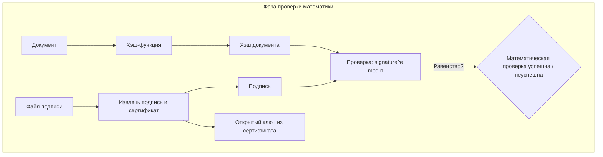

---

## 8. Проверка паспорта штампа: сертификат и чёрный список

**Фаза: проверка (статус сертификата)**

**Для гуманитария**  
Из конверта (файла подписи) достают паспорт клише — сертификат, заверенный подписью УЦ. Сначала убеждаются, что паспорт подлинный: проверяют подпись УЦ под ним (тем же методом «проявителя», но с открытым номером самого УЦ). Затем сверяют серийный номер клише с чёрным списком (CRL): не украдена ли печать, не аннулирована ли? Если паспорт настоящий, номера в чёрном списке нет, а цвет оттиска совпал — подпись принимается.

**Для айтишника**  
Сертификат X.509, извлечённый из файла подписи, подписан закрытым ключом УЦ. Проверяется подпись сертификата с использованием открытого ключа УЦ и строится цепочка доверия до корневого сертификата. Затем определяется статус сертификата: по CRL или OCSP. Если сертификат отозван или цепочка недействительна, подпись отвергается. Процедура описана в RFC 5280.

**Для продвинутого айтишника**  
Полная валидация включает:  
- построение цепочки от сертификата подписанта до доверенного корня,  
- проверку сроков действия всех сертификатов,  
- проверку статуса каждого сертификата по CRL (причины отзыва: `keyCompromise`, `CACompromise`, `affiliationChanged`, `superseded`, `cessationOfOperation`, `privilegeWithdrawn` и др.) или через OCSP,  
- учёт политик сертификации.  
Сравнение методов статуса:  
- CRL: может кэшироваться, работает офлайн, но может устареть.  
- OCSP: актуален на момент запроса, требует доступа к сети.  
Для долгосрочной проверки в CAdES-XL включают CRL и OCSP-ответы прямо в файл подписи.

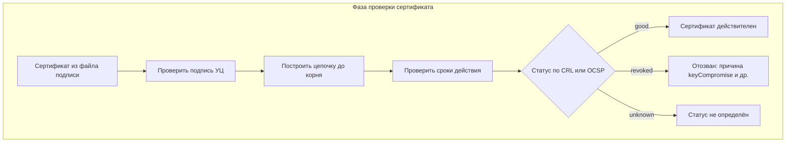

---

## Приложение: что внутри файла откреплённой подписи (на примере CAdES)

**Для гуманитария**  
Файл подписи — это «конверт», в котором лежат: сам цветной оттиск, паспорт клише, иногда промежуточные удостоверения фабрики, а также квитанция о времени подписания (метка TSP). В усовершенствованном варианте туда же вкладывают актуальный чёрный список или справку о статусе паспорта, чтобы проверка была возможна даже через много лет. Таким образом, всё необходимое, кроме самого договора и самого главного открытого номера корневой фабрики, уже упаковано в конверт.

**Для айтишника и продвинутого айтишника**  
Типовой файл `.p7s` в формате CAdES представляет собой DER- или BER-закодированную структуру CMS `SignedData` со следующими полями:
- `version` — версия синтаксиса.
- `digestAlgorithms` — использованные хэш-алгоритмы.
- `encapContentInfo` — указание на тип подписываемых данных (для откреплённой подписи — `eContent` отсутствует).
- `certificates` — набор сертификатов: от подписанта до промежуточных CA (и корня опционально).
- `crls` (в CAdES-XL) — списки отозванных сертификатов.
- `signerInfos` — информация о каждом подписанте:
  - `signedAttributes`: `contentType`, `messageDigest`, `signingTime` и т.д.
  - `signatureValue` — собственно подпись.
  - `unsignedAttributes`: `timestampToken` (в CAdES-T) и другие.

Проверяющая сторона извлекает сертификат подписанта из `certificates`, открытый ключ из сертификата, вычисляет хэш документа, проверяет соответствие `messageDigest` в `signedAttributes`, затем верифицирует подпись, а после — статус сертификата и метку времени.

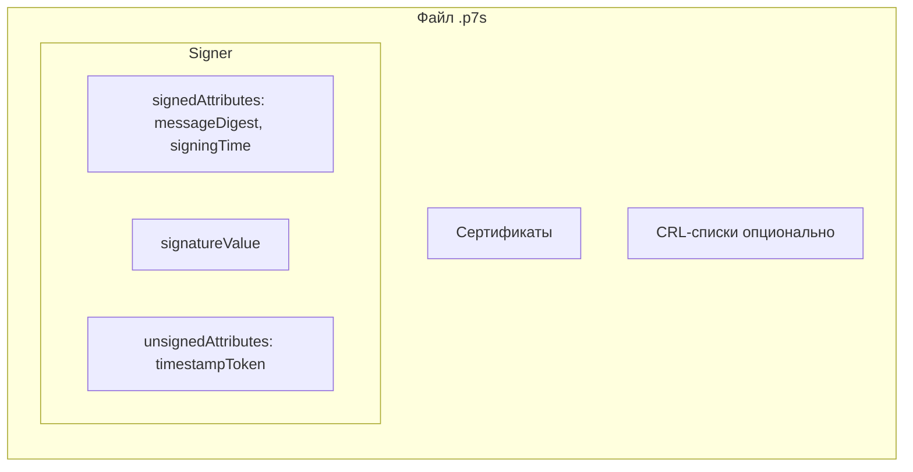

---

## Словарик: термины и их простые аналоги

| Термин (сокращение) | Штатное объяснение | Упрощённая аналогия |
|----------------------|-------------------|----------------------|
| **Электронная подпись (ЭП)** / Digital signature | Криптографический механизм для подтверждения авторства, целостности и неотказуемости электронных данных. | Цифровое факсимиле с чернилами, меняющими цвет под документ. |
| **Удостоверяющий центр (УЦ)** / Certificate Authority (CA) | Организация, выпускающая сертификаты открытых ключей и подтверждающая их принадлежность. | Доверенная фабрика, изготавливающая клише и выдающая к ним паспорта. |
| **Закрытый ключ** / Private key | Секретный криптографический ключ для создания подписи; известен только владельцу. | Само клише с секретными красителями, спрятанное у владельца. |
| **Открытый ключ** / Public key | Ключ, доступный всем, для проверки подписи, созданной парным закрытым ключом. | Открытый номер клише, работающий как химический проявитель цвета. |
| **Хэш-функция** / Hash function | Алгоритм, преобразующий данные в короткий дайджест фиксированной длины. | Машинка-сканер, снимающая уникальный отпечаток со всего текста. |
| **Сертификат** / Certificate | Электронный документ, подписанный УЦ и связывающий открытый ключ с личностью владельца. | Паспорт клише, заверенный печатью фабрики. |
| **CRL (список отозванных сертификатов)** / Certificate Revocation List | Публикуемый УЦ перечень сертификатов, отозванных до истечения срока, с указанием причины. | Чёрный список украденных, потерянных или аннулированных клише. |
| **OCSP** / Online Certificate Status Protocol | Протокол для получения статуса одного сертификата в реальном времени. | Мгновенная проверка паспорта по телефону у фабрики. |
| **TSA** / Timestamp Authority | Доверенный сервер, выдающий метку времени, подтверждающую существование данных на определённый момент. | Нотариус, заверяющий точное время подписания. |
| **CAdES** / CMS Advanced Electronic Signatures | Стандарт усовершенствованной подписи, добавляющий атрибуты и метки времени для долгосрочной проверки. | Конверт с оттиском, паспортом и квитанцией о времени отправки. |
| **Откреплённая подпись** / Detached signature | Подпись, хранящаяся в отдельном файле, не изменяющем исходный документ. | Оттиск печати на отдельном листе, приложенном к договору. |
| **Простые числа (p, q)** | Натуральные числа >1, делящиеся только на 1 и на себя; в RSA — основа ключей. | Два идеально чистых секретных красителя, дающих уникальный цвет при смешивании. |
| **RSA** | Асимметричная криптосистема, стойкость которой основана на сложности факторизации больших чисел. | Конструкция самого умного факсимиле, где секрет держится на перемножении огромных чисел. |
| **ECDSA** | Алгоритм подписи на эллиптических кривых, обеспечивающий сравнимую стойкость при меньшей длине ключа. | То же умное факсимиле, но с ещё более компактными и современными шестерёнками. |

---

## Примеры аналогичных статей в интернете

Вот несколько статей, которые также используют простые аналогии для объяснения электронной подписи:

- **«Электронная цифровая подпись для чайников: с чем ее есть, и как не подавиться»** (Habr) — подробный разбор с аналогией «замок и два ключа»: открытый ключ открывает замок, закрытый — закрывает.
- **«How to Explain Public-Key Cryptography and Digital Signatures to Non-Techies»** (Auth0) — аналогия с коробкой и замком, у которого есть три позиции, и двумя видами ключей: приватный поворачивает только по часовой стрелке, публичный — только против.
- **«Асимметричная криптография для чайников»** (Habr) — обсуждение и критика популярных аналогий, включая «публичный ключ — это замок, приватный — ключ от замка».
- **«Электронная подпись — что это простыми словами»** (СберПро) — базовое объяснение с акцентом на юридическую значимость.
- **«Гайд по криптографии: что такое электронная цифровая подпись и как она работает»** (Xakep) — технический разбор с пояснением асимметричного шифрования.

# 3

Вот ссылки на статьи, упомянутые в разделе «Примеры аналогичных статей в интернете», в формате Markdown:

- [Электронная цифровая подпись для чайников: с чем ее есть, и как не подавиться (Habr)](https://habr.com/ru/articles/449236/)
- [How to Explain Public-Key Cryptography and Digital Signatures to Non-Techies (Auth0)](https://auth0.com/blog/how-to-explain-public-key-cryptography-digital-signatures-to-non-techies/)
- [Асимметричная криптография для чайников (Habr)](https://habr.com/ru/articles/444136/)
- [Электронная подпись — что это простыми словами (СберПро)](https://sber.pro/digital/article/elektronnaya-podpis-chto-eto-prostymi-slovami/)
- [Гайд по криптографии: что такое электронная цифровая подпись и как она работает (Xakep)](https://xakep.ru/2017/03/16/digital-signature-guide/)

## 3.1
- https://habr.com/ru/users/etz/bookmarks/articles/page17/
- https://habr.com/ru/articles/748226/comments/
- https://xakep.ru/2016/12/15/crypto-part5/?amp
- https://intuit.ru/studies/curriculums/4101/courses/547/lecture/12393?page=1&keyword_content=RSA
- https://github.com/SarmiAnsim/APOiBAS_Lab2_EDS
- https://orioncom.ru/demo_bkb/bezop/skzi/rsa-es.htm
- https://www.1-ofd.ru/blog/news/princip-raboty-ecp/
