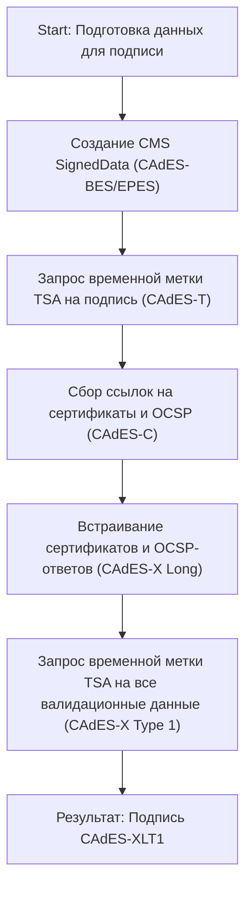
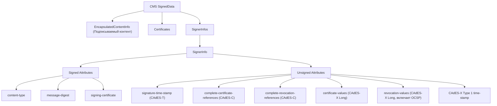
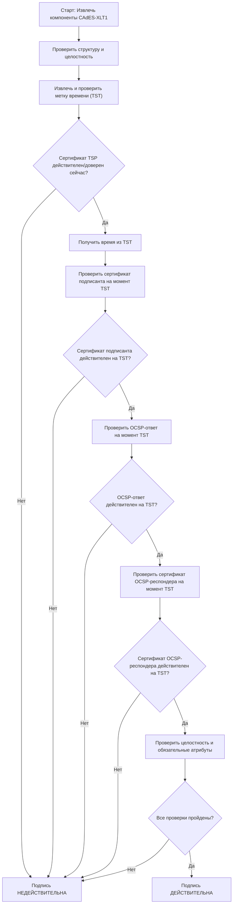

algorithm
### 1 как происходит формирование подписи формата CAdES-X Long Type 1 (Cades-XLT1). Считаем, что используется OSCP сервис. Кроме текстового описания приведи алгоритм формирования и саму структуру блоков подписи в формате mermaid markdown (для вставки на github).

## 📄 Подробное описание формирования подписи CAdES-X Long Type 1 (CAdES-XLT1) с использованием OCSP

> **Кратко:**  
> Подпись CAdES-XLT1 формируется поэтапно, начиная с базовой подписи (CAdES-BES), добавлением временных меток, ссылок и самих данных для проверки (сертификаты и OCSP-ответы), а также финальной временной метки, охватывающей все эти данные. Это обеспечивает долгосрочную проверяемость подписи без необходимости обращения к внешним сервисам.

---

### 1. Описание процесса формирования CAdES-XLT1

**CAdES-XLT1** — это расширенный формат электронной подписи на базе CMS, который включает в себя не только саму подпись, но и все необходимые данные для её долгосрочной проверки: цепочку сертификатов, статусы отзыва (OCSP-ответы), а также временные метки. Использование OCSP позволяет удостовериться, что сертификаты не были отозваны на момент подписания.

#### **Пошаговый алгоритм формирования CAdES-XLT1:**

1. **Создание базовой подписи (CAdES-BES/EPES):**
   - Формируется структура CMS SignedData с подписываемым контентом, сертификатом подписанта и обязательными подписанными атрибутами (content-type, message-digest, signing-certificate).

2. **Добавление временной метки на подпись (CAdES-T):**
   - Получается временная метка у доверенного TSA (Time Stamping Authority) на значение подписи и добавляется как неподписанный атрибут.

3. **Добавление ссылок на валидационные данные (CAdES-C):**
   - Включаются ссылки (хэши) на все сертификаты и данные об отзыве (OCSP-ответы), необходимые для проверки подписи. Эти ссылки добавляются как неподписанные атрибуты.

4. **Встраивание самих валидационных данных (CAdES-X Long):**
   - Включаются сами сертификаты и OCSP-ответы в атрибуты certificate-values и revocation-values.

5. **Добавление временной метки на все валидационные данные (CAdES-X Type 1):**
   - Получается временная метка TSA на хэш всех неподписанных атрибутов (включая валидационные данные) и добавляется как атрибут.

6. **Результат — CAdES-XLT1:**
   - Итоговая подпись содержит: исходную подпись, временные метки, ссылки и значения сертификатов и OCSP-ответов, а также финальную временную метку на все эти данные.

---

### 2. Алгоритм формирования (mermaid markdown)

```
flowchart TD
    S1[Start: Подготовка данных для подписи]
    S2[Создание CMS SignedData (CAdES-BES/EPES)]
    S3[Запрос временной метки TSA на подпись (CAdES-T)]
    S4[Сбор ссылок на сертификаты и OCSP (CAdES-C)]
    S5[Встраивание сертификатов и OCSP-ответов (CAdES-X Long)]
    S6[Запрос временной метки TSA на все валидационные данные (CAdES-X Type 1)]
    S7[Результат: Подпись CAdES-XLT1]
    S1 --> S2 --> S3 --> S4 --> S5 --> S6 --> S7
```
### 3. Структура блоков подписи CAdES-XLT1 (mermaid markdown)

```
graph TD
    A[CMS SignedData]
    A --> B[EncapsulatedContentInfo (Подписываемый контент)]
    A --> C[Certificates]
    A --> D[SignerInfos]
    D --> E[SignerInfo]
    E --> F[Signed Attributes]
    F --> F1[content-type]
    F --> F2[message-digest]
    F --> F3[signing-certificate]
    E --> G[Unsigned Attributes]
    G --> G1[signature-time-stamp (CAdES-T)]
    G --> G2[complete-certificate-references (CAdES-C)]
    G --> G3[complete-revocation-references (CAdES-C)]
    G --> G4[certificate-values (CAdES-X Long)]
    G --> G5[revocation-values (CAdES-X Long, включает OCSP)]
    G --> G6[CAdES-X Type 1 time-stamp]
```

### 4. Ключевые моменты и пояснения

- **OCSP-ответы** обязательно включаются в атрибут `revocation-values`, что позволяет проверять подпись даже без доступа к внешним сервисам . https://yazilim.kamusm.gov.tr/eit-wiki/doku.php?id=en:cades_x-long#:~:text=The%20following%20table%20specifies,for%20CAdES%2DX%20LONG%20signature
- **certificate-values** содержит все сертификаты, необходимые для проверки цепочки доверия . https://nsoftware.com/kb/articles/legacy/sbb/8-cades#:~:text=CAdES%2DX%20Long%20adds%20the,whole%20certificate%20path%20required
- **Временные метки** (signature-time-stamp и CAdES-X Type 1 time-stamp) защищают подпись и валидационные данные от подделки задним числом . https://www.etsi.org/deliver/etsi_ts/101700_101799/101733/02.02.01_60/ts_101733v020201p.pdf#:~:text=EXtended%20Long%20Electronic%20Signature,Type%202%20format%20is
- **Структура подписи** полностью самодостаточна для долгосрочной проверки.

---

### 🟢 **Key Takeaway**

> **CAdES-XLT1 с OCSP — это формат электронной подписи, который гарантирует долгосрочную проверяемость за счёт включения всех необходимых сертификатов, OCSP-ответов и временных меток прямо в структуру подписи.**

---

**Источники:** 
- [RFC 5126, ETSI TS 101 733, техническая документация по CAdES](https://datatracker.ietf.org/doc/html/rfc5126#:~:text=e%20Validation%20Data%20References)
- [ETSI TS 101 733 V2.2.1](https://www.etsi.org/deliver/etsi_ts/101700_101799/101733/02.02.01_60/ts_101733v020201p.pdf#:~:text=EXtended%20Long%20Electronic%20Signature,Type%202%20format%20is)  
- [Стандарты CAdES и спецификации ASN.1](https://nsoftware.com/kb/articles/legacy/sbb/8-cades#:~:text=CAdES%2DX%20Long%20adds%20the,whole%20certificate%20path%20required)  
- [Роль OCSP в CAdES-XLT1](https://yazilim.kamusm.gov.tr/eit-wiki/doku.php?id=en:cades_x-long#:~:text=The%20following%20table%20specifies,for%20CAdES%2DX%20LONG%20signature)  
- [Требования к включению OCSP-ответов](https://yazilim.kamusm.gov.tr/eit-wiki/doku.php?id=en:cades_x-long#:~:text=and%20OCSP%20responses%20for,a%20long%20period%20of)

---

### 2 Напиши подробный алгоритм проверки подписи Cades-XLT1. Считается, что сертификат подписанта и сертификат OSCP просрочены, а только сертификат TSP не просрочен. Кроме текстового описания приведи алгоритм в формате mermaid markdown.

## 🛡️ Подробный алгоритм проверки подписи CAdES-XLT1 (при просроченных сертификатах подписанта и OCSP, но действующем сертификате TSP)

> **Кратко:**  
> Для проверки CAdES-XLT1, когда сертификаты подписанта и OCSP уже просрочены, а сертификат TSP (Timestamp Authority) действителен, все проверки валидности (кроме TSP) выполняются на момент времени, зафиксированный в метке времени (TST). Критически важно, чтобы сертификат TSP был действителен и доверен на момент проверки.

---

### 📋 Подробный текстовый алгоритм

1. **Извлечение компонентов подписи**
   - Извлеките из контейнера CAdES-XLT1: подписанные данные, подпись, сертификаты, OCSP/CRL-ответы, метки времени (TST), все валидационные данные.

2. **Проверка структуры и целостности**
   - Убедитесь, что присутствуют все обязательные атрибуты: `certificate-values`, `revocation-values`, `time-stamp tokens` и др.
   - Проверьте криптографическую целостность подписи.

3. **Проверка метки времени (TST)**
   - Извлеките TST и проверьте её подпись с помощью сертификата TSP.
   - Убедитесь, что сертификат TSP:
     - Действителен и не отозван на текущий момент.
     - Доверен (входит в доверенное хранилище).

4. **Определение контрольного времени**
   - Зафиксируйте время из TST — это "контрольное время" для всех последующих проверок.

5. **Проверка сертификата подписанта**
   - Проверьте, что сертификат подписанта был действителен (не просрочен и не отозван) на момент TST.
   - Используйте вложенные OCSP/CRL-ответы для проверки статуса на момент TST.

6. **Проверка OCSP-ответа**
   - Проверьте, что OCSP-ответ был действителен на момент TST.
   - Проверьте подпись OCSP-ответа с помощью сертификата OCSP-респондера.

7. **Проверка сертификата OCSP-респондера**
   - Проверьте, что сертификат OCSP-респондера был действителен (не просрочен и не отозван) на момент TST.

8. **Проверка цепочек сертификатов**
   - Постройте и проверьте цепочки доверия для подписанта и OCSP-респондера на момент TST.

9. **Финальное решение**
   - Если все проверки успешны, подпись считается действительной на момент времени, зафиксированный в TST, несмотря на то, что сертификаты подписанта и OCSP-респондера сейчас просрочены.
   - Если сертификат TSP недействителен или не доверен — подпись недействительна.

---

### 🗂️ Таблица ключевых шагов и статусов

| Шаг проверки                                      | Сертификат/Токен         | Время проверки         | Ожидаемый статус                                      |
|---------------------------------------------------|--------------------------|------------------------|-------------------------------------------------------|
| Проверка сертификата TSP                          | Сертификат TSP           | Текущее время          | Действителен и доверен                                |
| Проверка сертификата подписанта                   | Сертификат подписанта    | Время TST              | Действителен на момент TST (может быть просрочен сейчас) |
| Проверка OCSP-ответа                              | OCSP-ответ               | Время TST              | Действителен на момент TST (может быть просрочен сейчас) |
| Проверка сертификата OCSP-респондера              | Сертификат OCSP-респондера| Время TST             | Действителен на момент TST (может быть просрочен сейчас) |
| Проверка целостности и атрибутов                  | Подпись, атрибуты        | N/A                    | Все проверки пройдены                                 |

---

### 🖇️ Mermaid-диаграмма алгоритма


```
flowchart TD
    A[Старт: Извлечь компоненты CAdES-XLT1] --> B[Проверить структуру и целостность]
    B --> C[Извлечь и проверить метку времени (TST)]
    C --> D{Сертификат TSP действителен/доверен сейчас?}
    D -- Нет --> Z[Подпись НЕДЕЙСТВИТЕЛЬНА]
    D -- Да --> E[Получить время из TST]
    E --> F[Проверить сертификат подписанта на момент TST]
    F --> G{Сертификат подписанта действителен на TST?}
    G -- Нет --> Z
    G -- Да --> H[Проверить OCSP-ответ на момент TST]
    H --> I{OCSP-ответ действителен на TST?}
    I -- Нет --> Z
    I -- Да --> J[Проверить сертификат OCSP-респондера на момент TST]
    J --> K{Сертификат OCSP-респондера действителен на TST?}
    K -- Нет --> Z
    K -- Да --> L[Проверить целостность и обязательные атрибуты]
    L --> M{Все проверки пройдены?}
    M -- Нет --> Z
    M -- Да --> Y[Подпись ДЕЙСТВИТЕЛЬНА на момент TST]
    Z[Подпись НЕДЕЙСТВИТЕЛЬНА]
    Y[Подпись ДЕЙСТВИТЕЛЬНА]
```

---

> **Key Takeaway:**  
> Даже если сертификаты подписанта и OCSP-респондера просрочены, подпись CAdES-XLT1 считается действительной, если они были валидны на момент метки времени, а сертификат TSP действителен и доверен на момент проверки.

---

### 📦 Итог

- **Вся логика проверки "замораживается" на момент времени, зафиксированный в TST.**
- **Единственный сертификат, который должен быть действителен и доверен сейчас — это сертификат TSP.**
- **Если хотя бы одна из проверок на момент TST не проходит, либо сертификат TSP недействителен — подпись считается недействительной.**

---

**Рекомендация:**  
Для автоматизации проверки используйте приведённую диаграмму и таблицу как чек-лист для реализации или аудита процесса валидации CAdES-XLT1.

#### Что такое TST и расшифровка аббревиатуры

В контексте проверки электронной подписи CAdES-XLT1, **TST** — это аббревиатура от **Time-Stamp Token** (токен метки времени).

- **Time-Stamp Token (TST)** — это криптографически защищённый электронный документ, который подтверждает, что определённые данные (например, хэш подписи) существовали в конкретный момент времени.  
- TST выдается доверенным центром меток времени (TSA — Time Stamp Authority) и содержит зафиксированное время, подпись TSA и другие данные, обеспечивающие доказательство времени создания подписи.

Таким образом, **TST — это метка времени, которая служит доказательством того, что подпись была создана до указанного времени и не могла быть изменена после него**.

---

#### Кратко:

| Аббревиатура | Расшифровка           | Значение в CAdES-XLT1                              |
|--------------|-----------------------|---------------------------------------------------|
| TST          | Time-Stamp Token      | Криптографическая метка времени, подтверждающая момент создания подписи |

---

#### Дополнительные пояснения

- В отличие от других значений аббревиатуры TST (например, таможенная стоимость, тестостерон и т.п.), в криптографии и электронной подписи TST всегда означает **Time-Stamp Token**.
- TST используется для обеспечения долгосрочной валидности подписи, позволяя проверять её корректность даже после истечения срока действия сертификатов подписанта и OCSP.

---

Если кратко, то **TST — это электронный "штамп времени", который гарантирует, что подпись была сделана не позднее указанного времени и защищён от подделки**.

### Некоторые ссылки
- [метка времени ](https://ru.wikipedia.org/wiki/%D0%92%D1%80%D0%B5%D0%BC%D0%B5%D0%BD%D0%BD%D0%B0%D1%8F_%D0%BC%D0%B5%D1%82%D0%BA%D0%B0)
- [CAdES-X Long Type 1 -- это не просто "добавить ответы TSA и OCSP-сервера"](https://forum.rutoken.ru/topic/3665/)
