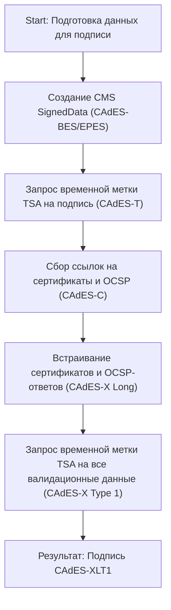
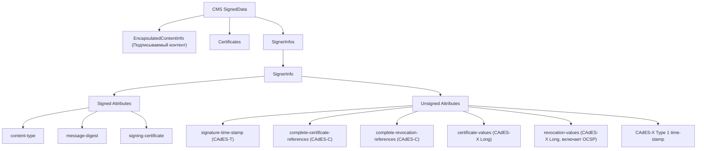

algorithm
### 1 как происходит формирование подписи формата CAdES-X Long Type 1 (Cades-XLT1). Считаем, что используется OSCP сервис. Кроме текстового описания приведи алгоритм формирования и саму структуру блоков подписи в формате mermaid markdown (для вставки на github).

## 📄 Подробное описание формирования подписи CAdES-X Long Type 1 (CAdES-XLT1) с использованием OCSP

> **Кратко:**  
> Подпись CAdES-XLT1 формируется поэтапно, начиная с базовой подписи (CAdES-BES), добавлением временных меток, ссылок и самих данных для проверки (сертификаты и OCSP-ответы), а также финальной временной метки, охватывающей все эти данные. Это обеспечивает долгосрочную проверяемость подписи без необходимости обращения к внешним сервисам.

---

### 1. Описание процесса формирования CAdES-XLT1

**CAdES-XLT1** — это расширенный формат электронной подписи на базе CMS, который включает в себя не только саму подпись, но и все необходимые данные для её долгосрочной проверки: цепочку сертификатов, статусы отзыва (OCSP-ответы), а также временные метки. Использование OCSP позволяет удостовериться, что сертификаты не были отозваны на момент подписания.

#### **Пошаговый алгоритм формирования CAdES-XLT1:**

1. **Создание базовой подписи (CAdES-BES/EPES):**
   - Формируется структура CMS SignedData с подписываемым контентом, сертификатом подписанта и обязательными подписанными атрибутами (content-type, message-digest, signing-certificate).

2. **Добавление временной метки на подпись (CAdES-T):**
   - Получается временная метка у доверенного TSA (Time Stamping Authority) на значение подписи и добавляется как неподписанный атрибут.

3. **Добавление ссылок на валидационные данные (CAdES-C):**
   - Включаются ссылки (хэши) на все сертификаты и данные об отзыве (OCSP-ответы), необходимые для проверки подписи. Эти ссылки добавляются как неподписанные атрибуты.

4. **Встраивание самих валидационных данных (CAdES-X Long):**
   - Включаются сами сертификаты и OCSP-ответы в атрибуты certificate-values и revocation-values.

5. **Добавление временной метки на все валидационные данные (CAdES-X Type 1):**
   - Получается временная метка TSA на хэш всех неподписанных атрибутов (включая валидационные данные) и добавляется как атрибут.

6. **Результат — CAdES-XLT1:**
   - Итоговая подпись содержит: исходную подпись, временные метки, ссылки и значения сертификатов и OCSP-ответов, а также финальную временную метку на все эти данные.

---

### 2. Алгоритм формирования (mermaid markdown)

flowchart TD
    S1[Start: Подготовка данных для подписи]
    S2[Создание CMS SignedData (CAdES-BES/EPES)]
    S3[Запрос временной метки TSA на подпись (CAdES-T)]
    S4[Сбор ссылок на сертификаты и OCSP (CAdES-C)]
    S5[Встраивание сертификатов и OCSP-ответов (CAdES-X Long)]
    S6[Запрос временной метки TSA на все валидационные данные (CAdES-X Type 1)]
    S7[Результат: Подпись CAdES-XLT1]
    S1 --> S2 --> S3 --> S4 --> S5 --> S6 --> S7

### 3. Структура блоков подписи CAdES-XLT1 (mermaid markdown)

graph TD
    A[CMS SignedData]
    A --> B[EncapsulatedContentInfo (Подписываемый контент)]
    A --> C[Certificates]
    A --> D[SignerInfos]
    D --> E[SignerInfo]
    E --> F[Signed Attributes]
    F --> F1[content-type]
    F --> F2[message-digest]
    F --> F3[signing-certificate]
    E --> G[Unsigned Attributes]
    G --> G1[signature-time-stamp (CAdES-T)]
    G --> G2[complete-certificate-references (CAdES-C)]
    G --> G3[complete-revocation-references (CAdES-C)]
    G --> G4[certificate-values (CAdES-X Long)]
    G --> G5[revocation-values (CAdES-X Long, включает OCSP)]
    G --> G6[CAdES-X Type 1 time-stamp]

### 4. Ключевые моменты и пояснения

- **OCSP-ответы** обязательно включаются в атрибут `revocation-values`, что позволяет проверять подпись даже без доступа к внешним сервисам . https://yazilim.kamusm.gov.tr/eit-wiki/doku.php?id=en:cades_x-long#:~:text=The%20following%20table%20specifies,for%20CAdES%2DX%20LONG%20signature
- **certificate-values** содержит все сертификаты, необходимые для проверки цепочки доверия . https://nsoftware.com/kb/articles/legacy/sbb/8-cades#:~:text=CAdES%2DX%20Long%20adds%20the,whole%20certificate%20path%20required
- **Временные метки** (signature-time-stamp и CAdES-X Type 1 time-stamp) защищают подпись и валидационные данные от подделки задним числом . https://www.etsi.org/deliver/etsi_ts/101700_101799/101733/02.02.01_60/ts_101733v020201p.pdf#:~:text=EXtended%20Long%20Electronic%20Signature,Type%202%20format%20is
- **Структура подписи** полностью самодостаточна для долгосрочной проверки.

---

### 🟢 **Key Takeaway**

> **CAdES-XLT1 с OCSP — это формат электронной подписи, который гарантирует долгосрочную проверяемость за счёт включения всех необходимых сертификатов, OCSP-ответов и временных меток прямо в структуру подписи.**

---

**Источники:** 
- [RFC 5126, ETSI TS 101 733, техническая документация по CAdES](https://datatracker.ietf.org/doc/html/rfc5126#:~:text=e%20Validation%20Data%20References)
- [ETSI TS 101 733 V2.2.1](https://www.etsi.org/deliver/etsi_ts/101700_101799/101733/02.02.01_60/ts_101733v020201p.pdf#:~:text=EXtended%20Long%20Electronic%20Signature,Type%202%20format%20is)  
- [Стандарты CAdES и спецификации ASN.1](https://nsoftware.com/kb/articles/legacy/sbb/8-cades#:~:text=CAdES%2DX%20Long%20adds%20the,whole%20certificate%20path%20required)  
- [Роль OCSP в CAdES-XLT1](https://yazilim.kamusm.gov.tr/eit-wiki/doku.php?id=en:cades_x-long#:~:text=The%20following%20table%20specifies,for%20CAdES%2DX%20LONG%20signature)  
- [Требования к включению OCSP-ответов](https://yazilim.kamusm.gov.tr/eit-wiki/doku.php?id=en:cades_x-long#:~:text=and%20OCSP%20responses%20for,a%20long%20period%20of)

---
