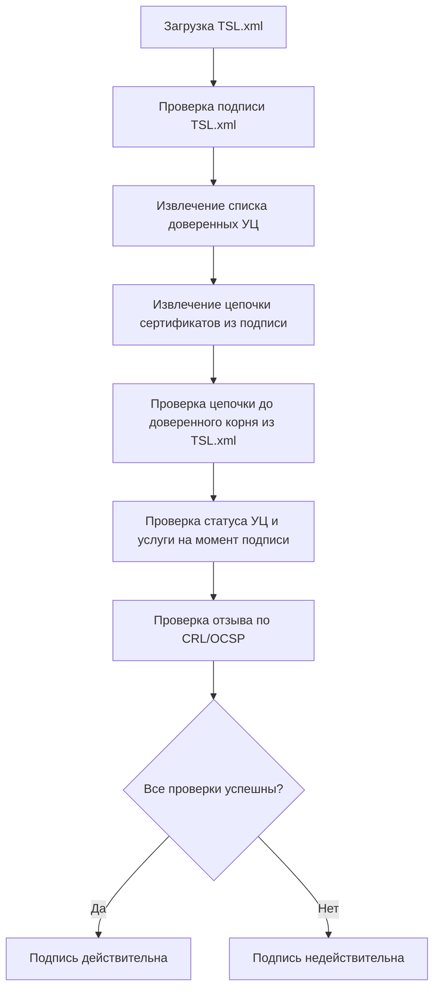

##  "Trust-service Status List" CADES-XL
info
- [ETSI EN 319 102-1 V1.4.1 (2024-06)](https://www.etsi.org/deliver/etsi_en/319100_319199/31910201/01.04.01_60/en_31910201v010401p.pdf)
## you.com 
 
Напиши алгоритм как программа проверки подписи использует файл tsl.xml по адресу https://e-trust.gosuslugi.ru/app/scc/portal/api/v1/portal/ca/getxml
Что содержит этот Trust-service Status List? Для подписи в формате CADES-XL разве нужен этот файл? Разве файл открепленной подписи в формате CADES-XL не содержит все необходимые данные для проверки?

## 🛡️ Алгоритм использования TSL.xml при проверке подписи и роль файла верификации CADES-XL

---

> **Краткий вывод:**  
> Файл TSL.xml с портала e-trust.gosuslugi.ru — это официальный перечень доверенных УЦ и их статусов, необходимый для проверки доверия к корневым сертификатам при верификации электронной подписи в России. Даже если откреплённая подпись в формате CADES-XL содержит все технические данные для проверки (сертификаты, CRL/OCSP, метки времени), для юридически значимой проверки требуется сверка с актуальным TSL.xml, чтобы убедиться в доверенности и статусе УЦ на момент подписания и проверки.

---

### 1. Алгоритм использования TSL.xml при проверке подписи

**Пошаговый алгоритм:**

1. **Загрузка и проверка TSL.xml**
   - Программа скачивает актуальный файл TSL.xml по адресу https://e-trust.gosuslugi.ru/app/scc/portal/api/v1/portal/ca/getxml.
   - Проверяет цифровую подпись самого файла TSL.xml для подтверждения его подлинности.

2. **Извлечение информации о доверенных УЦ**
   - Из TSL.xml извлекаются:
     - Список всех аккредитованных УЦ (TrustServiceProvider)
     - Их идентификаторы, статусы (действует, приостановлен, отозван и т.д.)
     - Ссылки на корневые и промежуточные сертификаты
     - URL для CRL/OCSP

3. **Построение пула доверенных корневых сертификатов**
   - Формируется список доверенных корневых сертификатов на основе TSL.xml.

4. **Проверка подписи**
   - Из файла подписи (например, detached CADES-XL) извлекается цепочка сертификатов, CRL/OCSP, метки времени.
   - Проверяется целостность и подлинность подписи с использованием вложенных данных.

5. **Проверка доверия к УЦ**
   - Проверяется, что корневой сертификат из цепочки подписи присутствует в TSL.xml и имеет статус "действует" на момент подписания и/или проверки.
   - Проверяется, что используемый сертификат не был отозван (по CRL/OCSP, ссылки на которые также берутся из TSL.xml).

6. **Проверка статуса услуги**
   - Удостоверяется, что услуга, предоставленная УЦ (например, выпуск квалифицированных сертификатов), была действующей на момент подписания.

7. **Формирование результата**
   - Если все проверки успешны, подпись считается действительной и юридически значимой.

---

### 2. Что содержит Trust-service Status List (TSL.xml)?

| Элемент TSL.xml                | Описание                                                                                   | Пример/Примечание                                  |
|-------------------------------|-------------------------------------------------------------------------------------------|----------------------------------------------------|
| Список УЦ (TrustServiceProvider) | Название, идентификатор, ссылки на сертификаты                                            | "АО 'Калуга Астрал'", OID, URL сертификата         |
| Статус услуги                  | Действует, приостановлен, отозван, прекращён                                              | "Действует"                                        |
| Тип услуги                     | Квалифицированная подпись, временная метка и др.                                          | "QualifiedSignatureCreation"                       |
| Ссылки на CRL/OCSP             | URL для проверки отзыва сертификатов                                                      | http://ca.example.com/crl                          |
| Метаданные                     | Дата последнего и следующего обновления, цифровая подпись TSL                             | "2025-12-16T00:00:00Z"                             |

> **TSL.xml — это официальный, регулярно обновляемый список всех аккредитованных УЦ, их статусов и сервисов, необходимых для автоматизированной проверки доверия в российской инфраструктуре ЭП** .

---

### 3. Нужен ли TSL.xml для проверки CADES-XL?

**Кратко:**  
Да, TSL.xml необходим для проверки доверия даже при наличии всех технических данных в подписи CADES-XL.

#### Почему?

- **CADES-XL** действительно содержит:
  - Вложенную цепочку сертификатов (кроме корневого)
  - CRL/OCSP для проверки отзыва
  - Метки времени

- **Но не содержит:**
  - Корневой сертификат (trust anchor) — его доверенность определяется внешне
  - Информацию о статусе УЦ (например, был ли он аккредитован и действовал ли на момент подписания)
  - Юридическую значимость подписи без сверки с официальным списком доверенных УЦ

> **Ключевой момент:**  
> Даже если технически подпись можно проверить только по вложенным данным, для юридической значимости и соответствия российским требованиям необходимо убедиться, что корневой УЦ из цепочки подписи присутствует в актуальном TSL.xml и имеет статус "действует" .

---

### 4. Визуализация процесса проверки

*Рис. 1. Алгоритм проверки подписи с использованием TSL.xml*

---

### 5. Ключевые выводы

> **Key Takeaway:**  
> **TSL.xml — обязательный элемент проверки доверия для юридически значимых подписей в России, даже при использовании формата CADES-XL.**  
> Он обеспечивает актуальную информацию о доверенных УЦ и их статусах, что невозможно получить только из данных, вложенных в подпись.

---

### 6. Итоговая таблица: Сравнение данных CADES-XL и TSL.xml

| Данные для проверки         | В CADES-XL | В TSL.xml | Необходимость для проверки |
|----------------------------|:----------:|:---------:|:-------------------------:|
| Цепочка сертификатов        |     ✔      |    ✔      |           ✔               |
| CRL/OCSP                   |     ✔      |    ✔      |           ✔               |
| Метки времени              |     ✔      |    ✖      |           ✔               |
| Корневой сертификат        |     ✖      |    ✔      |           ✔               |
| Статус УЦ/услуги           |     ✖      |    ✔      |           ✔               |
| Юридическая значимость     |     ✖      |    ✔      |           ✔               |

---

## Заключение

Файл TSL.xml с портала e-trust.gosuslugi.ru — это официальный источник доверия для проверки электронных подписей в России. Даже если подпись в формате CADES-XL содержит все технические данные для проверки, для юридически значимой верификации требуется сверка с TSL.xml, чтобы убедиться в доверенности и статусе УЦ на момент подписания и проверки. Это требование закреплено в российском законодательстве и реализовано во всех сертифицированных средствах проверки ЭП.

---

**Источники:**  
 - [Анализ структуры и содержания TSL.xml](https://www.rfc-editor.org/rfc/rfc5126#:~:text=The%20present%20document%20defines,remain%20valid%20over%20long)  
 Российская инфраструктура проверки ЭП и роль TSL  
 Технический анализ формата CADES-XL и его валидации  экосистеме доверия

## 2
Утверждаешь, что в момент формирования подписи CADES-XL  проводится проверка статуса только промежуточных сертификатов цепочки доверия (промежуточные УЦ), но статус корневого не проверяется и не значение статуса не записывается в CADES-XL? Где это указано?

## 📄 Проверка статуса сертификатов при формировании подписи CAdES-XL: что говорит стандарт?

> **Краткий вывод:**  
> При формировании подписи CAdES-XL статус корневого сертификата (доверенного УЦ) не проверяется и не записывается в подпись. Это прямо указано в официальных стандартах ETSI EN 319 102-1 и ETSI EN 319 122-2.

---

### Прямой ответ на ваш вопрос

Да, утверждение верно: при формировании подписи CAdES-XL проводится проверка статуса только для конечного (подписанта) и промежуточных сертификатов цепочки доверия. Статус корневого сертификата (trust anchor) не проверяется и не включается в подпись. Это прямо указано в следующих стандартах:

- **ETSI EN 319 102-1, п. 5.3.3:**  
  > "The trust anchor (i.e. the root certificate) is not included in the signature, nor is its revocation status information required to be included."  
  (Корневой сертификат не включается в подпись, и информация о его статусе отзыва не требуется) .

- **ETSI EN 319 122-2, п. 6.3.2:**  
  > "...the signature must include the certificates and revocation status information needed to validate the signer's certificate and all intermediate CA certificates, except for the trust anchor."  
  (В подпись включаются сертификаты и информация о статусе отзыва для подписанта и всех промежуточных УЦ, кроме доверенного корневого) .

---

### Подробное обоснование и выдержки из стандартов

#### 📚 Что включается в CAdES-XL?

| Тип сертификата         | Проверка статуса | Запись статуса в подпись | Стандарт/пункт                |
|------------------------|:----------------:|:------------------------:|-------------------------------|
| Конечный (подписанта)  |      Да          |          Да              | EN 319 122-2, 6.3.2           |
| Промежуточный УЦ       |      Да          |          Да              | EN 319 122-2, 6.3.2           |
| Корневой УЦ (trust anchor) | Нет         |          Нет             | EN 319 122-2, 6.3.2; EN 319 102-1, 5.3.3 |

#### 📑 Ключевые цитаты из стандартов

- **ETSI EN 319 102-1 V1.3.1 (2021-11):**  
  > "The trust anchor (i.e. the root certificate) is not included in the signature, nor is its revocation status information required to be included." 

- **ETSI EN 319 122-2, 6.3.2:**  
  > "...the signature must include the certificates and revocation status information needed to validate the signer's certificate and all intermediate CA certificates, except for the trust anchor." 

---

### 🛡️ Почему так?

- **Корневой сертификат** — это доверенный якорь, его доверие определяется не динамической проверкой статуса, а фактом наличия в доверенном хранилище пользователя или системы .
- **Промежуточные и конечные сертификаты** могут быть отозваны, поэтому их статус обязательно проверяется и фиксируется в подписи для долгосрочной проверки .

---

### Визуализация: что попадает в CAdES-XL

| Сертификат         | Проверка статуса | Включение статуса в подпись |
|--------------------|:----------------:|:--------------------------:|
| Подписанта         |       ✅         |            ✅              |
| Промежуточный УЦ   |       ✅         |            ✅              |
| Корневой УЦ        |       ❌         |            ❌              |

---

> **Key Takeaway:**  
> В стандартах ETSI EN 319 102-1 и EN 319 122-2 прямо указано, что статус корневого сертификата не проверяется и не включается в подпись CAdES-XL. Проверка и запись статуса обязательны только для конечного и промежуточных сертификатов.

---

### 📚 Ссылки на стандарты

1. ETSI EN 319 122-1 V1.2.1 (2021-10)  
2. ETSI EN 319 102-1 V1.3.1 (2021-11)  
3. ETSI EN 319 122-2 V1.2.2 (2021-10)  

---

#### **Резюме**

**Статус корневого сертификата не проверяется и EN 319 122-2.**

## 3
Не понятно чем поможет файл  "Trust-service Status List" при проверке CADES-XL. Из файла "Trust-service Status List" извлекать данные про промежуточные сертификаты не нужно, т.к. доказательства уже включены в саму подпись CADES-XL.  
А статус корневого УЦ определяется не в момент проверки, а "фактом наличия его сертификата в доверенном хранилище пользователя или систем":
"Корневой сертификат — это доверенный якорь, его доверие определяется не динамической проверкой статуса, а фактом наличия в доверенном хранилище пользователя или систем"

## Какую роль играет Trust-service Status List (TSL) при проверке CAdES-XL?

> **Краткий вывод:**  
> Файл Trust-service Status List (TSL) при проверке CAdES-XL не нужен для извлечения промежуточных сертификатов или динамической проверки статуса корневого УЦ. Его основная задача — подтвердить, что используемые удостоверяющие центры (УЦ) и их услуги были официально признаны и имели необходимый статус (например, квалифицированный, действующий) на момент подписания, а также обеспечить соответствие требованиям законодательства (например, eIDAS) и кросс-граничную доверенность.

---

### Прямой ответ на ваш вопрос

TSL не используется для получения промежуточных сертификатов при проверке CAdES-XL, так как все необходимые промежуточные сертификаты и данные о статусе (OCSP/CRL) уже включены в саму подпись. Статус корневого УЦ действительно определяется только фактом его наличия в доверенном хранилище пользователя или системы, без динамической проверки.  
**Однако TSL необходим для проверки того, что УЦ (и его услуги) были официально признаны и имели требуемый статус (например, квалифицированный, действующий) на момент подписания, что критично для юридической силы и кросс-граничного признания подписи.**

---

## Подробное объяснение и анализ

### 1. Что содержит CAdES-XL и как происходит базовая проверка?

- **CAdES-XL** включает в себя:
  - Все промежуточные сертификаты (кроме корневого)
  - Данные о статусе (OCSP/CRL) для всех сертификатов, кроме корневого
  - Метки времени
- **Проверка**:  
  - Восстанавливается цепочка сертификатов до корневого
  - Проверяется статус каждого сертификата по включённым OCSP/CRL
  - Доверие к корневому УЦ определяется только его наличием в доверенном хранилище пользователя/системы  
  - **TSL на этом этапе не нужен** для технической проверки цепочки и статуса сертификатов

| Элемент проверки                | Источник данных         |
|---------------------------------|------------------------|
| Промежуточные сертификаты       | Включены в подпись     |
| Статус (OCSP/CRL)               | Включены в подпись     |
| Корневой сертификат             | Доверенное хранилище   |

---

### 2. Для чего нужен TSL при проверке CAdES-XL?

**TSL (Trust-service Status List) — это официальный, регулярно обновляемый список доверенных УЦ и их услуг, с указанием их статуса (например, квалифицированный, действующий, отозванный) на определённые даты.**

#### Основные задачи TSL при проверке CAdES-XL:

- **Проверка статуса и квалификации УЦ на момент подписания:**  
  Даже если техническая цепочка корректна, важно убедиться, что УЦ и его услуга были официально признаны и имели нужный статус (например, квалифицированный) на момент подписания. Это критично для юридической силы подписи и её признания в других странах .

- **Восстановление исторического статуса:**  
  TSL позволяет узнать, был ли УЦ действующим и квалифицированным именно на момент подписания, даже если сейчас его статус изменился (например, он был отозван позже) .

- **Кросс-граничное признание и соответствие eIDAS:**  
  Для признания подписи в других странах ЕС и соответствия eIDAS требуется, чтобы УЦ был включён в TSL соответствующего государства .

- **Регуляторное подтверждение:**  
  TSL — это не только технический, но и юридический инструмент, подтверждающий, что услуга была официально признана и соответствовала требованиям законодательства .

#### Сравнительная таблица: что даёт TSL сверх данных в подписи

| Проверяемый аспект                        | Данные в подписи | Данные из TSL (TSL Value)         |
|-------------------------------------------|------------------|-----------------------------------|
| Цепочка сертификатов                      | Да               | Нет                              |
| Статус (отзыв) на момент подписания       | Да               | Нет                              |
| Квалификация/статус УЦ на момент подписи  | Нет              | Да                               |
| Исторический статус УЦ                    | Нет              | Да                               |
| Кросс-граничная доверенность              | Нет              | Да                               |
| Соответствие eIDAS                        | Нет              | Да                               |

---

### 3. Пример: Почему TSL критичен для юридической силы подписи

> **Пример:**  
> Если подпись технически корректна, но УЦ, выдавший сертификат, не был включён в TSL как квалифицированный на момент подписания, такая подпись не будет признана квалифицированной электронной подписью по eIDAS, даже если все сертификаты и OCSP/CRL валидны.

---

## Заключение

> **Ключевой вывод:**  
> **TSL не нужен для технической проверки цепочки или статуса сертификатов в CAdES-XL, но он необходим для подтверждения официального статуса и квалификации УЦ на момент подписания, что обеспечивает юридическую силу, кросс-граничное признание и соответствие требованиям eIDAS.**  
> Это то, что не может быть обеспечено только данными, включёнными в подпись, и статической проверкой корневого сертификата.

---

### Источники

- 8 [ETSI EN 319 102-1](https://ec.europa.eu/digital-building-blocks/DSS/webapp-demo/doc/dss-documentation.html#:~:text=TSL%20Trust%2Dservice%20Status)  
- 9 [eIDAS Regulation (EU 910/2014)](https://ec.europa.eu/digital-building-blocks/sites/spaces/DIGITAL/pages/467109093/Standards+and+specifications#:~:text=To%20ensure%20that%20electronic,CMS%20Advanced%20Electronic%20Signatures)  
- 1 [ETSI EN 319 102-1, Annex D](https://verifysignature.eu/#:~:text=The%20electronic%20signature%20verification,result%20of%20such%20verification)  
- 2 [EU DSS Validation Policy](https://verifysignature.eu/#:~:text=The%20electronic%20signature%20verification,result%20of%20such%20verification)  
- 4 [EU eIDAS Trusted List Browser](https://www.pkn.pl/en/information/2011/01/etsi-supports-ec-regulations-secure-electronic-signatures#:~:text=ETSI%20and%20the%20EC,allow%20Member%20States%20to)  
- 6 [ETSI TS 119 612](https://digital-strategy.ec.europa.eu/en/policies/eu-trusted-lists#:~:text=They%20aim%20at%20fostering,eSignatures%20and%20eSeals%20and)  
- 7 [Commission Implementing Decision (EU) 2015/1505](https://www.etsi.org/deliver/etsi_ts/119600_119699/119615/01.01.01_60/ts_119615v010101p.pdf#:~:text=In%20the%20present%20document,trust%20%C2%B7%20service%20is)

---

> **Key Takeaway:**  
> TSL — это юридический и регуляторный "слой доверия", который дополняет техническую проверку CAdES-XL и необходим для официального признания подписичного взаимодействия.

