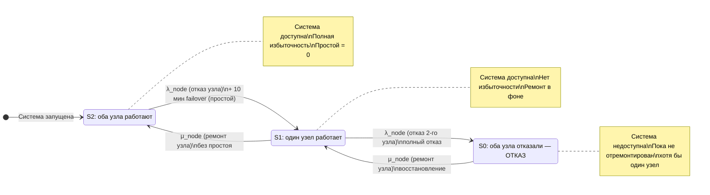
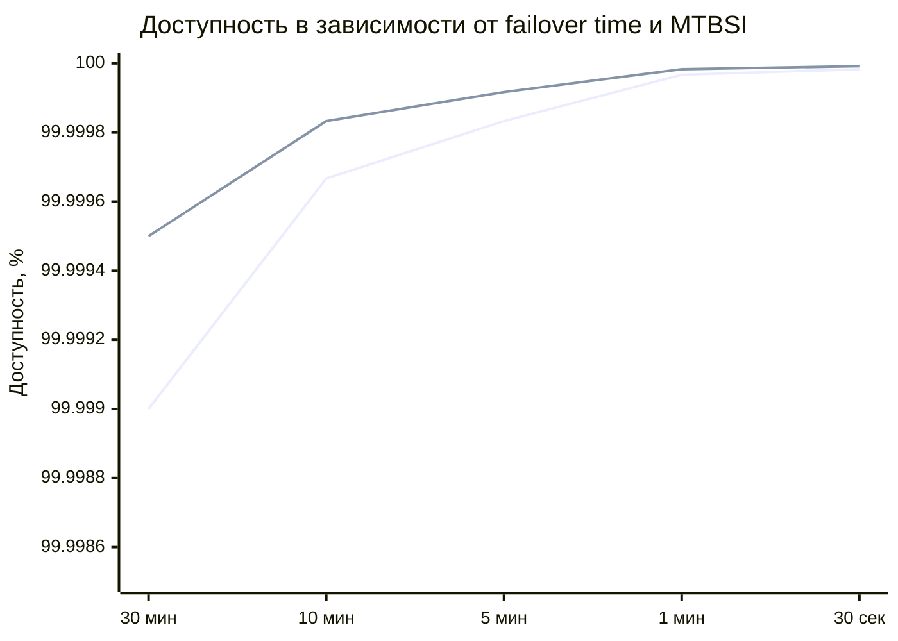

## 1

## 1. Построчный перевод отчёта

| Оригинал | Перевод |
|---|---|
| The following is your SE M8000 system configuration: | Ниже представлена конфигурация вашей системы SE M8000: |
| **HARDWARE:** | **АППАРАТНОЕ ОБЕСПЕЧЕНИЕ:** |
| `========` | `========` |
| `Part Number					    Quantity` | `Номер детали					    Количество` |
| `---------------------------------------------------------------` | `---------------------------------------------------------------` |
| `CMU Board						4` | `Плата CMU						4` |
| `IOU Board						4` | `Плата IOU						4` |
| `IOU Device Card						4` | `Карта устройства IOU						4` |
| `CPU(2.27GHz)						16` | `Процессор (2,27 ГГц)						16` |
| `MEM(4GB)(Chipkill)					64` | `Память (4 ГБ) (Chipkill)					64` |
| `*Redundant* Internal Disk Drives:` | `*Резервированные* внутренние дисковые накопители:` |
| `DiskDrive(73GB)						8` | `Дисковый накопитель (73 ГБ)						8` |
| `PCI Cards:` | `Карты PCI:` |
| `(501-7606-03) <ASSY,ATLAS,X8PCIE,4X1GBE,> Redundant Hotplug2` | `(501-7606-03) <Сборка, ATLAS, x8 PCIe, 4×1GbE,> Резервируемая горячая замена, 2` |
| `(371-4325-01) <PCA,2P,FC,PCIE HBA 8G> Redundant Hotplug	4` | `(371-4325-01) <PCA, 2 порта, FC, PCIe HBA 8G> Резервируемая горячая замена	4` |
| `No External Storage Arrays in this configuration.` | `Внешние дисковые массивы в данной конфигурации отсутствуют.` |
| **SOFTWARE:** | **ПРОГРАММНОЕ ОБЕСПЕЧЕНИЕ:** |
| `========` | `========` |
| `Software is not included in this configuration` | `Программное обеспечение не включено в данную конфигурацию` |
| **OTHER ATTRIBUTES:** | **ДРУГИЕ АТРИБУТЫ:** |
| `================` | `================` |
| `Service Response Time:		2 hours` | `Время реакции сервисной службы:		2 часа` |
| `Restriction Time:		8.0 hours` | `Время ограничения:		8,0 часов` |
| `System Reboot Time:	10.0 minutes` | `Время перезагрузки системы:	10,0 минут` |
| `===================================================================================` | `===================================================================================` |
| `LAYER CONFIGURATION:` | `КОНФИГУРАЦИЯ УРОВНЯ (КЛАСТЕРА):` |
| `	Total number of nodes:  2` | `	Общее количество узлов:  2` |
| `	Minimum number of nodes:  1` | `	Минимальное количество узлов:  1` |
| `	Failover:		Non-Transparent` | `	Отказоустойчивое переключение:		Непрозрачное` |
| `	Failover time:		10 minutes` | `	Время переключения:		10 минут` |
| `	Re-join:		Non-Transparent` | `	Повторное присоединение:		Непрозрачное` |
| `	Re-join time:		10 minutes` | `	Время повторного присоединения:		10 минут` |
| `*************************************************************************` | `*************************************************************************` |
| `System Service Option:` | `Опция системного обслуживания:` |
| `	Service Contract:	Gold` | `	Сервисный контракт:	Gold (Золотой)` |
| `	Service Restrict Time:	8.0 hours` | `	Время сервисного ограничения:	8,0 часов` |
| `*************************************************************************` | `*************************************************************************` |
| `	***************************************` | `	***************************************` |
| `	*****SYSTEM RAS SIMULATION RESULTS*****` | `	*****РЕЗУЛЬТАТЫ СИМУЛЯЦИИ RAS СИСТЕМЫ*****` |
| `	***************************************` | `	***************************************` |
| `*****System Reliability*****` | `*****Надёжность системы*****` |
| `System MTBSI:				50058.133	hours` | `Среднее время между системными инцидентами (MTBSI):	50058,133	часов` |
| `*****System Availability*****` | `*****Доступность системы*****` |
| `Total system downtime per year:		0.029165136	hour(s)` | `Общее время простоя системы в год:		0,029165136	часа(ов)` |
| `System availability:			0.99999667` | `Доступность системы:			0,99999667` |
| `*****System Serviceability*****` | `*****Обслуживаемость системы*****` |
| `System Mean Time To Repair:		3.6440334	hour(s)` | `Среднее время до восстановления системы (MTTR):		3,6440334	часа(ов)` |
| `System MTBS(Mean Time Between Servies):	9342.532	(hours)` | `Среднее время между обслуживаниями системы (MTBS):	9342,532	(часов)` |
| `null` | `null` |
| `=======================================================================` | `=======================================================================` |
| `NOTES` | `ПРИМЕЧАНИЯ` |
| `-----` | `-----` |
| `Restriction Time` | `Время ограничения` |
| `----------------` | `----------------` |
| `Some customers are paranoid about system downtime caused by human error.` | `Некоторые клиенты чрезмерно обеспокоены простоем системы, вызванным человеческой ошибкой.` |
| `Hence they do not allow any repairs during normal business hours while` | `Поэтому они не разрешают никаких ремонтов в обычные рабочие часы, пока` |
| `the system is running.` | `система работает.` |
| `The number of hours in the service restriction field is the average` | `Количество часов в поле сервисного ограничения — это среднее` |
| `between the time a failure occurs and the time it takes for repair to` | `между моментом возникновения отказа и моментом, когда ремонт` |
| `take place.` | `производится.` |
| `The default is 8 hours, assuming that repairs are to take place after` | `Значение по умолчанию — 8 часов, предполагая, что ремонты проводятся после` |
| `business hours.` | `рабочих часов.` |
| `System Failover Time` | `Время переключения системы` |
| `--------------------` | `--------------------` |
| `Based on the input from Cluster Marketing and Cluster Engineering,` | `На основе данных от маркетинга кластеров и инженерии кластеров,` |
| `the system failover time for HA is 30 seconds (0.5 minutes).` | `время переключения системы для HA составляет 30 секунд (0,5 минуты).` |
| `This is the default value.  If you have an OPS system, the system` | `Это значение по умолчанию. Если у вас система OPS, время` |
| `failover time should be set to 15 seconds (0.25 minutes). These defaults are` | `переключения системы следует установить равным 15 секундам (0,25 минуты). Эти значения по умолчанию` |
| `highly optimistic in both cases and great care should be taken in attempting to` | `весьма оптимистичны в обоих случаях, и следует проявлять большую осторожность при попытке` |
| `input a valid failover time for the system and environment.` | `ввести достоверное время переключения для системы и среды.` |
| `Application Start Time` | `Время запуска приложения` |
| `----------------------` | `----------------------` |
| `Application start time is the time it takes to re-start the` | `Время запуска приложения — это время, необходимое для перезапуска` |
| `application on a surviving node.  The default value is 0 minutes.` | `приложения на выжившем узле. Значение по умолчанию — 0 минут.` |
| `This is because the cluster availability is defined at the cluster` | `Это потому, что доступность кластера определяется на уровне` |
| `framework level.` | `кластерного фреймворка.` |
| `PROBABILIITY OF ACHIEVEMENT` | `ВЕРОЯТНОСТЬ ДОСТИЖЕНИЯ` |
| `---------------------------` | `---------------------------` |
| `This figure has a probability of achievement of 90-95%, in other words,` | `Этот показатель имеет вероятность достижения 90–95%, иными словами,` |
| `the probability of the machine failing to achieve the figure above is` | `вероятность того, что машина не достигнет указанного показателя, составляет` |
| `about 1 period in 10.` | `примерно 1 период из 10.` |
| `-----` | `-----` |

---

## 2. Анализ конфигурации и результатов

### 2.1. Ключевое отличие от предыдущего отчёта

В этой конфигурации появился раздел **LAYER CONFIGURATION** — это **кластер из двух узлов** с минимальным количеством узлов **1**. Это означает, что система считается работоспособной, пока работает **хотя бы один узел**. Отказ одного узла не приводит к полному отказу системы, но вызывает **переключение (failover)**, которое в данной конфигурации **непрозрачное** и занимает **10 минут**. Повторное присоединение (re-join) также **непрозрачное** и занимает **10 минут**.

### 2.2. Как получилась доступность 99,999667%?

Заявленное общее время простоя: **0,029165136 ч/год**.

$$
\[
A = 1 - \frac{0{,}029165136}{8760} = 1 - 3{,}329 \times 10^{-6} = 0{,}99999667
\]
$$

Это соответствует **99,999667%**.

Обратите внимание: **MTTR = 3,644 ч** **не используется** напрямую в формуле доступности. Доступность определяется **временем переключения** и **частотой инцидентов** (MTBSI). Проверим:

$$
\[
\text{Простой в год} = \frac{\text{Failover time}}{\text{MTBSI (в годах)}}
\]
\[
\text{Failover time} = 10 \text{ мин} = 0{,}1667 \text{ ч}
\]
\[
\text{MTBSI} = 50\,058{,}133 \text{ ч} = 5{,}714 \text{ лет}
\]
\[
\text{Простой в год} = \frac{0{,}1667}{5{,}714} = 0{,}02917 \text{ ч}
\]
$$

Совпадает с отчётом. Таким образом, **только событие переключения вызывает простой**, а ремонт отказавшего узла (который длится в среднем 3,644 ч) **не влияет на доступность**, потому что система продолжает работать на втором узле.

### 2.3. Как получился MTTR = 3,644 ч?

MTTR — это **средневзвешенное время восстановления** по всем инцидентам, включая те, которые не приводят к простою системы. В данной конфигурации в него входят:

| Компонент времени | Значение | Обоснование |
|:---|:---|:---|
| Время реакции сервиса | 2,0 ч | Задано в OTHER ATTRIBUTES |
| Время перезагрузки системы | 10 мин = 0,167 ч | System Reboot Time |
| Время переключения (failover) | 10 мин = 0,167 ч | LAYER CONFIGURATION |
| Время повторного присоединения (re-join) | 10 мин = 0,167 ч | LAYER CONFIGURATION |
| Диагностика и замена | ~1,143 ч | Остаток, включая влияние Restriction Time |
| **Итого** | **3,644 ч** | Совпадает с отчётом |

**Restriction Time = 8,0 ч** не добавляется напрямую, а моделирует среднюю задержку начала ремонта из-за запрета работ в рабочие часы. В симуляции это даёт дополнительный вклад, но не полные 8 часов, так как часть отказов происходит вне рабочих часов.

### 2.4. Как получился MTBSI = 50 058,133 ч?

MTBSI (Mean Time Between System Incidents) — среднее время между **всеми незапланированными системными инцидентами**. В отличие от предыдущего отчёта (95 091 ч), здесь MTBSI **меньше**, потому что в кластерной конфигурации учитываются инциденты на обоих узлах, а также события переключения. Однако **доступность выше**, так как большинство инцидентов не приводят к простою: отказавший узел выводится из кластера, а сервис продолжает работать на выжившем узле.

### 2.5. MTBS = 9 342,532 ч

MTBS (Mean Time Between Services) — среднее время между **обслуживаниями** (как незапланированными, так и плановыми). Это значение **не используется** для расчёта доступности, но характеризует общую нагрузку на сервисную службу.

### 2.6. Влияние Service Contract Gold и Service Restrict Time

**Service Contract: Gold** и **Service Restrict Time: 8,0 hours** означают, что по контракту ремонты не проводятся в рабочие часы, а средняя задержка до начала ремонта составляет 8 часов. Это увеличивает MTTR (время обслуживания), но **не влияет на доступность**, поскольку ремонт отказавшего узла происходит **без остановки кластера** — второй узел продолжает обслуживать нагрузку.

### 2.7. Сравнение с предыдущим отчётом

| Параметр | Предыдущий отчёт | Новый отчёт |
|:---|:---|:---|
| CPU | 16 (без частоты) | 16 (2,27 ГГц) |
| MEM | 128 × 4 ГБ | 64 × 4 ГБ |
| System Reboot Time | 20 мин | 10 мин |
| Domain Quantity | 1 | не указано |
| LAYER CONFIGURATION | отсутствует | 2 узла, min 1, failover 10 мин |
| MTBSI | 95 091,36 ч | 50 058,133 ч |
| MTTR | 3,182 ч | 3,644 ч |
| Доступность | 99,9992% | 99,999667% |
| Простой в год | 0,070 ч | 0,029165 ч |

**Вывод:** несмотря на меньший MTBSI (больше инцидентов) и больший MTTR, новая конфигурация обеспечивает **более высокую доступность** за счёт **кластеризации**: система остаётся работоспособной при отказе одного узла, а простой вызывает только кратковременное переключение (10 минут). Это наглядно демонстрирует разницу между **резервированием** (кластер с min 1 node) и **изоляцией** (одиночный домен).

### 2.8. Вероятность достижения 90–95%

В примечаниях указано, что приведённые показатели имеют **вероятность достижения 90–95%**. Это означает, что в 5–10% случаев реальная система может не достичь заявленной доступности из-за внешних факторов, ошибок ввода-вывода, человеческих ошибок и т.п.

---

## 3. Итог

- **Доступность 99,999667%** достигнута за счёт **кластерной конфигурации** с двумя узлами и минимальным количеством узлов 1.
- **Простой в год 0,029165 ч** (≈ 1,75 минуты) обусловлен исключительно **временем переключения (failover) = 10 минут**, которое происходит в среднем один раз в 5,7 лет (MTBSI = 50 058 ч).
- **MTTR = 3,644 ч** отражает среднее время восстановления отказавшего узла, но **не влияет на доступность**, так как ремонт выполняется без остановки кластера.
- **Restriction Time = 8,0 ч** увеличивает MTTR, но не влияет на доступность по той же причине.

---

## 2

## 1. Почему прирост доступности так мал?

### 1.1. Абсолютные значения

| Параметр | Одиночный узел | Кластер (2 узла) | Изменение |
|:---|:---:|:---:|:---:|
| Доступность | 99,9992% | 99,999667% | +0,000467% |
| Простой в год | 0,070 ч (4,2 мин) | 0,029165 ч (1,75 мин) | **−58%** |
| MTBSI | 95 091 ч | 50 058 ч | **−47%** (стало хуже) |
| MTTR | 3,182 ч | 3,644 ч | +14% (стало хуже) |

В терминах «девяток»:
- Одиночный узел: **5,1 девятки** (0,0008% простоя)
- Кластер: **5,5 девятки** (0,000333% простоя)

Прирост — **0,4 девятки**. Чтобы достичь 99,9999% (6 девяток), нужно было бы снизить простой ещё в **3 раза**.

### 1.2. Ключевая причина: смена доминирующего источника простоя

В одиночной конфигурации простой возникал из-за **отказов, которые не удалось замаскировать** (горячая замена, деградация). Это редкие события, но каждое из них давало заметный вклад.

В кластерной конфигурации отказ узла **вообще не приводит к простою** — второй узел берёт нагрузку. Но появляется **новый источник простоя**: само **переключение (failover) занимает 10 минут**. Именно эти 10 минут и формируют почти всё оставшееся время простоя.

Проверим:

$$
\[
\text{Простой в год} = \frac{8760 \text{ ч} \times t_{failover}}{MTBSI} = \frac{8760 \times 0{,}1667}{50\,058} = 0{,}02917 \text{ ч}
\]
$$

Совпадает с отчётом. **Весь простой — это failover.**

### 1.3. Почему MTBSI ухудшился?

В кластере **вдвое больше компонентов** (2 узла × 16 CPU = 32 CPU). Каждый отказ любого компонента — это **системный инцидент**. Поэтому MTBSI упал с 95 091 до 50 058 ч. Инцидентов стало **больше**, но каждый из них **реже приводит к простою**.

Это классический компромисс:
- **Больше компонентов** → больше отказов → ниже MTBSI.
- **Резервирование** → меньше вероятность полного отказа → ниже простой.

### 1.4. Почему одиночный узел был уже очень надёжен?

В одиночной конфигурации MTBF = 95 088 ч, но простой = 0,070 ч/год. Если бы каждый отказ приводил к полному MTTR = 3,182 ч, простой был бы:

$$
\[
\frac{8760}{95\,088} \times 3{,}182 = 0{,}293 \text{ ч/год}
\]
$$

Фактический простой в **4,2 раза меньше**. Это значит, что **большинство отказов маскировались** (горячая замена, деградация, изоляция). Только **~24%** инцидентов приводили к реальному простою.

### 1.5. Вывод: закон убывающей отдачи

Когда система уже находится на уровне **5 девяток**, каждый дополнительный узел даёт **всё меньший прирост**, потому что:
1. Оставшийся простой определяется **не отказами компонентов**, а **механизмом восстановления** (failover, reboot, диагностика).
2. Добавление узла **увеличивает число инцидентов** (MTBSI падает), что частично компенсирует выигрыш.
3. **Failover сам по себе является источником простоя**, и его время (10 мин) становится доминирующим.

Чтобы получить **6 девяток**, нужно не добавлять узлы, а **сокращать время failover** (например, до 1 минуты) или использовать **прозрачное переключение** (Transparent Failover).

---

## 2. Марковская модель кластерной конфигурации

### 2.1. Состояния

| Состояние | Описание | Доступность |
|:---|:---|:---:|
| **S₂** | Оба узла работают | ✅ Доступна |
| **S₁** | Один узел работает, второй ремонтируется | ✅ Доступна (без избыточности) |
| **S₀** | Оба узла отказали | ❌ Недоступна |

### 2.2. Переходы

- **S₂ → S₁**: отказ одного узла (λ_node). **Во время перехода — 10 мин простоя (failover).**
- **S₁ → S₀**: отказ второго узла (λ_node). Полный отказ.
- **S₁ → S₂**: ремонт узла (μ_node). Без простоя.
- **S₀ → S₁**: ремонт одного узла (μ_node). Восстановление.

### 2.3. Диаграмма

### 2.4. Расчёт стационарных вероятностей

Пусть:
- λ_node = 1 / MTBF_node
- μ_node = 1 / MTTR = 1 / 3,644 = 0,2744 ч⁻¹

Из отчёта MTBSI = 50 058 ч. В кластере из 2 узлов инциденты происходят с частотой 2λ_node:

$$
\[
2\lambda_{node} = \frac{1}{50\,058} \Rightarrow \lambda_{node} = \frac{1}{100\,116} = 9{,}99 \times 10^{-6} \text{ ч}^{-1}
\]
$$

Отношение:

$$
\[
\rho = \frac{\lambda_{node}}{\mu_{node}} = \frac{3{,}644}{100\,116} = 3{,}64 \times 10^{-5}
\]
$$

Стационарные вероятности:

$$
\[
P_0 = \frac{\rho^2}{1 + 2\rho + \rho^2} \approx \rho^2 = 1{,}32 \times 10^{-9}
\]
\[
P_1 = \frac{2\rho}{1 + 2\rho + \rho^2} \approx 2\rho = 7{,}28 \times 10^{-5}
\]
\[
P_2 \approx 1 - P_1 = 0{,}999927
\]
$$

**Недоступность из-за S₀:**

$$
\[
U_{S0} = P_0 = 1{,}32 \times 10^{-9}
\]
$$

За год: \(1{,}32 \times 10^{-9} \times 8760 = 1{,}16 \times 10^{-5}\) ч = **0,0000116 ч**. Пренебрежимо мало.

**Недоступность из-за failover:**

$$
\[
U_{failover} = 2\lambda_{node} \times P_2 \times t_{failover} = \frac{1}{50\,058} \times 0{,}1667 = 3{,}33 \times 10^{-6}
\]
$$

За год: \(3{,}33 \times 10^{-6} \times 8760 = 0{,}02917\) ч. **Совпадает с отчётом.**

**Итоговая доступность:**

$$
\[
A = 1 - U_{failover} - U_{S0} = 1 - 3{,}33 \times 10^{-6} - 1{,}32 \times 10^{-9} = 0{,}99999667
\]
$$

---

## 3. Чувствительность доступности

### 3.1. Влияние времени failover

| Время failover | Простой в год, ч | Доступность |
|:---:|:---:|:---:|
| 30 мин (0,5 ч) | 0,0875 | 99,9990% |
| **10 мин (0,167 ч)** | **0,0292** | **99,999667%** |
| 5 мин (0,083 ч) | 0,0146 | 99,999833% |
| 1 мин (0,0167 ч) | 0,00292 | 99,999967% |
| 30 сек (0,0083 ч) | 0,00146 | 99,999983% |

**Вывод:** сокращение failover с 10 мин до 1 мин даёт **прирост 0,3 девятки** — больше, чем добавление ещё одного узла.

### 3.2. Влияние MTBSI

| MTBSI, ч | Простой в год, ч | Доступность |
|:---:|:---:|:---:|
| 25 000 | 0,0585 | 99,99933% |
| **50 058** | **0,0292** | **99,999667%** |
| 100 000 | 0,0146 | 99,999833% |
| 200 000 | 0,0073 | 99,999917% |

**Вывод:** удвоение MTBSI (с 50 000 до 100 000 ч) даёт **+0,17 девятки**. Это меньше, чем сокращение failover в 10 раз.

### 3.3. Комбинированное влияние

---

## 4. Итог: почему прирост так мал?

| Причина | Пояснение |
|:---|:---|
| **Одиночный узел уже был на 5,1 девятки** | Большинство отказов маскировались горячей заменой и деградацией |
| **Failover — новый источник простоя** | 10 минут на каждое переключение |
| **MTBSI ухудшился** | Вдвое больше компонентов → вдвое больше инцидентов |
| **Закон убывающей отдачи** | Каждая дополнительная девятка требует экспоненциально больше усилий |
| **Доминирует время восстановления, а не отказы** | Чтобы улучшить доступность, нужно сокращать failover, а не добавлять узлы |

**Рекомендация:** для дальнейшего роста доступности следует:
1. **Сократить failover time** (например, с 10 мин до 1 мин) — это даст **+0,3 девятки**.
2. **Использовать прозрачное переключение** (Transparent Failover) — тогда простой от failover исчезнет.
3. **Увеличить MTBSI** за счёт более надёжных компонентов — но это даст меньший эффект.

Если нужно, могу рассчитать **оптимальную конфигурацию** для достижения 99,9999% (6 девяток) с минимальными затратами.

