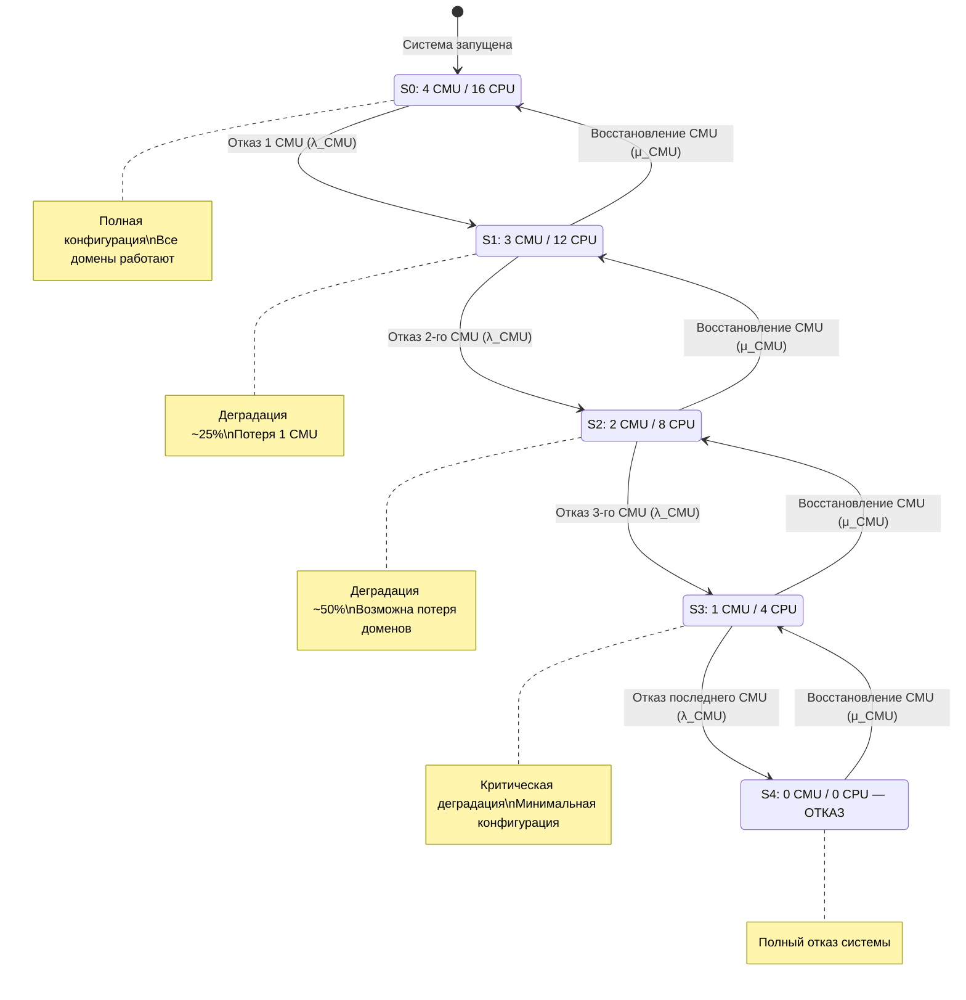
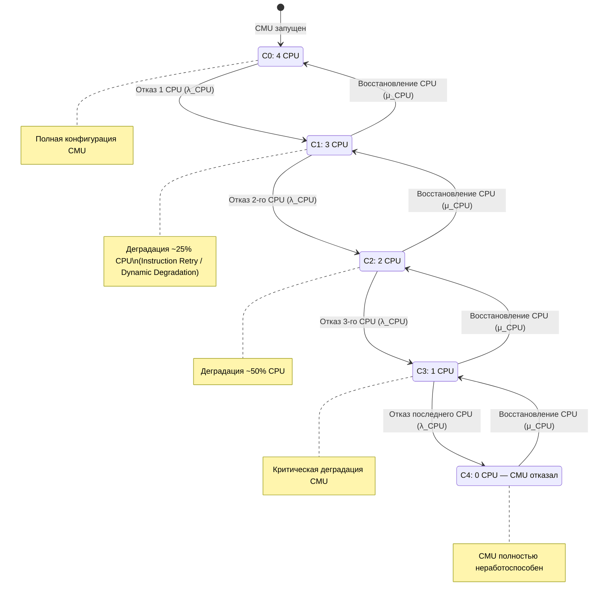

## 1

## 📌 Ключевое уточнение: CMU/IOU — это не резервная группа

В предыдущем ответе формулировка «резервная группа» была неточной. Согласно документации Oracle, в списке **резервируемых** компонентов M8000 перечислены: память, диск (software RAID), блок питания, XSCF, вентиляторы, PCI-карты — но **не CMU и не IOU**. Это указано в официальном даташите Oracle для серии SPARC Enterprise M-Series: «Major system components are redundant and hot-swappable» — к ним относятся перечисленные выше компоненты, но архитектура CMU/IOU строится на других принципах.

CMU и IOU относятся к категории **компонентов с поддержкой горячей замены (hot-swap)** и **динамической реконфигурации (DR)**. Это означает:

- **Резервная группа** (например, 2 БП в режиме 1+1): при отказе одного элемента его функции **немедленно и автоматически** берет на себя другой, заранее назначенный элемент.
- **Пул с изоляцией** (CMU/IOU + Dynamic Domains): отказ компонента приводит к **деградации** (снижению производительности или потере домена), но не к отказу всей системы. Другие компоненты продолжают работу, а отказавший — **заменяется в режиме горячей замены** без остановки системы.

Динамическая реконфигурация (DR) позволяет добавлять, удалять или заменять системные платы в серверах M8000/M9000, **пока домены, содержащие эти платы, остаются работающими**. Это официальное описание функции DR из руководства Oracle.

---

## 🌳 Граф надежности: многоуровневая модель

Построим граф надежности с двумя уровнями: **уровень CMU** (4 модуля) и **уровень CPU внутри CMU** (до 4 CPU на CMU).

### Уровень 1: Состояния по количеству работоспособных CMU

| Состояние | Работоспособных CMU | Описание | Влияние на систему |
|:---:|:---:|:---|:---|
| **S₀** | 4 | Полная конфигурация | Максимальная производительность, все домены работают |
| **S₁** | 3 | Один CMU отказал или извлечен через DR | Деградация: потеря ~25% вычислительной мощности и памяти |
| **S₂** | 2 | Два CMU отказали | Серьезная деградация: потеря ~50% мощности, возможна потеря доменов |
| **S₃** | 1 | Три CMU отказали | Критическая деградация: система работает на минимальной конфигурации |
| **S₄** | 0 | Все CMU отказали | Полный отказ системы |

**Переходы:**
- **S₀ → S₁**: отказ одного CMU (λ_CMU) или его принудительное извлечение для обслуживания (DR).
- **S₁ → S₂**: отказ еще одного CMU.
- **S₂ → S₃**: отказ третьего CMU.
- **S₃ → S₄**: отказ последнего CMU.
- **Обратные переходы** (восстановление): замена CMU в режиме горячей замены через DR.

### Уровень 2: Состояния CPU внутри одного CMU

Каждый CMU содержит до 4 CPUM (модулей CPU). M8000 поддерживает до 16 процессоров SPARC64 VII+/VII quad-core или SPARC64 VI dual-core. Рассмотрим состояния внутри одного CMU:

| Состояние | Работоспособных CPU | Описание |
|:---:|:---:|:---|
| **C₀** | 4 | Полная конфигурация CMU |
| **C₁** | 3 | Один CPU деградировал или отключен |
| **C₂** | 2 | Два CPU деградировали |
| **C₃** | 1 | Три CPU деградировали |
| **C₄** | 0 | Все CPU в CMU отказали (CMU полностью неработоспособен) |

**Важно:** Отказ **одного CPU** внутри CMU **не считается отказом системы** и **не считается отказом CMU** в большинстве случаев. Процессоры SPARC64 VI/VII поддерживают **Hardware Instruction Retry** и **Dynamic degradation**. Согласно пресс-релизу Sun и Fujitsu, «SPARC64 VII processor also delivers the RAS functions of SPARC64 VI, including hardware instruction retry, dynamic degradation and parity-protected processor registers, to maintain the levels of performance and reliability needed in mission-critical systems».

---

## ⚙️ Варианты резерва вычислительных модулей

### 1. Резервирование на уровне CPU (внутри CMU)

**Механизм:** Hardware Instruction Retry + Dynamic chip/core degradation.

- Если в CPU возникает **транзиентная ошибка** (например, сбой в кэше), процессор автоматически повторяет инструкцию.
- Если ошибка повторяется, **происходит деградация** — отключается неисправное ядро или весь чип.
- **Отказ одного CPU не приводит к отказу CMU**, если в CMU остаются работоспособные CPU. CMU продолжает функционировать с меньшим числом активных процессоров.
- **Отказ CPU не считается отказом системы** — это **событие деградации**, которое фиксируется в логах (XSCF), но не приводит к незапланированному простою.

**Подтверждение из официальных источников:** В даташите Oracle указано: «RAS features come standard in the SPARC Enterprise M8000 server—features like automatic recovery with instruction retry, up to 1 TB of system memory error-correcting code (ECC) protection with extended ECC support, guaranteed data-path integrity, total SRAM and register protection, and configurable memory mirroring».

### 2. Резервирование на уровне CMU

**Механизм:** Dynamic Reconfiguration (DR).

- **CMU не являются «горячим резервом»** друг для друга. Однако DR позволяет **добавлять и удалять CMU** из работающей системы без остановки.
- При отказе одного CMU его можно **заменить в режиме горячей замены**, если он не входит в активный домен.
- Если CMU входит в домен, его отказ приводит к **потере домена** (domain panic), но **не всей системы**. Другие домены продолжают работу.
- **CMU является hot-swappable** — его можно заменить без выключения системы.

### 3. Резервирование на уровне доменов

**Механизм:** Dynamic Domains (до 16 доменов).

- Каждый домен может включать один или несколько CMU/IOU. Отказ компонента в одном домене **не влияет на другие домены**.
- Это **не резервирование**, а **изоляция**. Домен — логическая единица, которая может отказать независимо.
- Если в системе несколько доменов, отказ одного домена не приводит к отказу всей системы. Это **повышает общую доступность** за счет **разделения**.

**Подтверждение:** В даташите Oracle указано: «It supports up to 16 Dynamic Domains, enabling massive server consolidation and data center virtualization».

---

## 🧮 Как это влияет на MTBF из отчета

В отчете указано:
- **System Unscheduled MTBSI** = 95 091,36 ч
- **System MTTR** = 3,182 ч
- **System MTBF** = MTBSI − MTTR = **95 088,18 ч**

**Формула MTBSI** однозначно определена в стандартах ITIL: **MTBSI = MTBF + MTTR**. Согласно базе знаний Baidu Baike, «MTBSI表示两次相邻系统事件的平均间隔时间，其数值等于平均故障间隔时间（MTBF）与平均恢复时间（MTTR）之和。其核心计算公式为MTBSI = MTBF + MTTR». Соответственно, **MTBF = MTBSI − MTTR**.

**Что именно считается «отказом» в этой симуляции?**

Симуляция RAS моделирует **события, приводящие к незапланированному простою системы**. Это могут быть:
- Отказ, приводящий к **потере всех доменов** (например, отказ всех CMU или критического компонента, общего для всех доменов).
- Отказ, требующий **перезагрузки системы** — например, фатальная ошибка, которую нельзя изолировать.

**Отказ одного CPU или даже одного CMU, если он не приводит к потере всей системы, в MTBF не учитывается** (или учитывается как деградация с отдельной интенсивностью, не влияющей на MTBSI).

---

## 💎 Итог

| Вопрос | Ответ |
|:---|:---|
| **CMU/IOU — резервная группа?** | Нет. Это пул ресурсов с изоляцией через домены. |
| **Отказ одного CPU — отказ системы?** | Нет. Это деградация, обрабатываемая через Instruction Retry и Dynamic core degradation. |
| **Отказ одного CMU — отказ системы?** | Только если он входит в единственный домен или приводит к потере всех доменов. |
| **Как считается MTBF?** | MTBF = MTBSI − MTTR, где MTBSI — среднее время между системными инцидентами. |
| **Граф надежности** | Многоуровневый: состояния по числу CMU (S₀–S₄) и по числу CPU внутри CMU (C₀–C₄). Переходы — отказы и восстановления через DR. |

---

## 📚 Ссылки на источники

1. **Oracle Data Sheet: SPARC Enterprise M-Series** — официальный даташит с описанием RAS-функций, включая instruction retry и Dynamic Domains: `http://www.oracle.com/us/products/servers-storage/035993.pdf`

2. **Oracle Dynamic Reconfiguration (DR) User's Guide** — руководство по динамической реконфигурации: `https://docs.oracle.com/cd/E19855-01/821-2796-11/preface.html`

3. **Fujitsu XSCF User's Guide** — руководство по сервисному процессору XSCF: `https://www.fujitsu.com/downloads/SPARCE/manuals/sparc-m4-m5e/m4m5-install-en-08.pdf`

4. **Digital Engineering: Sun & Fujitsu Unveil SPARC Enterprise Servers** — статья с описанием процессора SPARC64 VII и его RAS-функций: `https://www.digitalengineering247.com/article/sun-and-fujitsu-unveil-sparc-enterprise-servers/news`

5. **Baidu Baike: MTBSI** — определение и формула MTBSI: `https://baike.baidu.com/item/MTBSI/9735959`

6. **Fujitsu SPARC Enterprise M8000 Datasheet** — официальный даташит Fujitsu: `https://www.fujitsu.com/hk/imagesgig5/ds-sparcenterprise-m8000-ww-en.pdf`

Если нужно, могу детализировать расчет вероятностей переходов между состояниями или построить марковскую модель для оценки доступности.

## 2

## 1. Считается ли система работоспособной, если работает хотя бы один процессор?

**Нет, не всегда.** Ответ зависит от **критерия отказа**, определённого для конкретной системы. В теории надёжности используется понятие **k-out-of-n** (k из n) — система работоспособна, если работают **не менее k** элементов из n.

Для M8000 с 16 процессорами (4 CMU × 4 CPU) критерий может быть:

| Критерий | Формулировка | Считается ли отказом выход 15 из 16 CPU? |
|:---|:---|:---:|
| **1-out-of-16** | Достаточно 1 CPU | Нет |
| **2-out-of-16** | Нужно минимум 2 CPU | Нет |
| **4-out-of-16** | Нужно минимум 4 CPU | Нет |
| **8-out-of-16** | Нужно минимум 8 CPU | **Да** (если 15 < 8 — нет, но если 7 — да) |
| **16-out-of-16** | Нужны все CPU | **Да** |

В RAS-симуляции M8000 критерий отказа, скорее всего, определялся как **полная потеря домена или системы**, а не отдельного CPU. Отказ одного CPU — это **деградация**, а не отказ.

---

## 2. Примеры из публикаций: отказ процессоров и надежностные схемы

### Пример 1: 2 процессора с параллельным включением

В учебной задаче рассматривается система из **двух дублированных процессоров и памяти**. Процессоры соединены **параллельно**, поскольку **только одного из них достаточно** для работоспособности системы. Память соединена **последовательно**, так как её отказ приводит к отказу системы.

**Оригинальный текст:**
> *"Consider a system consisting of two duplicated processors and a memory. The reliability block diagram of the system is shown in the next figure. The processors are connected in parallel, since only one of them is sufficient for the system to be operational. The memory is connected in series, since its failure could cause the system's failure."*

**Перевод:**
> «Рассмотрим систему, состоящую из двух дублированных процессоров и памяти. Диаграмма надёжности системы показана на следующем рисунке. Процессоры соединены параллельно, поскольку только одного из них достаточно для работоспособности системы. Память соединена последовательно, так как её отказ может привести к отказу системы.»

**Схема (RBD):**
```
Processor 1 ──┐
              ├── (параллельно) ── Memory ── (последовательно)
Processor 2 ──┘
```

### Пример 2: 3 CPU с критерием «минимум 2»

В другой задаче система состоит из **2 блоков питания, 3 CPU, 2 систем памяти, 2 дисков с контроллерами, ленточного накопителя и 2 дисплеев**. Система даёт **сниженную, но приемлемую производительность**, если работают **минимум 2 CPU**, 1 система памяти, 1 диск с контроллером или ленточный накопитель, 1 дисплей и 1 блок питания.

**Оригинальный текст:**
> *"A certain computer system consists of 2 power supplies (PU), 3 CPUs, 2 memory systems (MS), 2 disks (D) each with a controller (C), a tape drive (TD) and 2 video display units. If the system will give a reduced but an acceptable level of performance with at least 2 CPUs, 1 memory systems, 1 disk with its controller or tape drive, a video display unit and 1 power supply are operational."*

**Перевод:**
> «Некоторая компьютерная система состоит из 2 блоков питания, 3 процессоров, 2 систем памяти, 2 дисков с контроллерами, ленточного накопителя и 2 дисплеев. Система будет давать сниженную, но приемлемую производительность, если работают как минимум 2 процессора, 1 система памяти, 1 диск с контроллером или ленточный накопитель, 1 дисплей и 1 блок питания.»

**Схема (RBD для CPU):**
```
CPU1 ──┐
CPU2 ──┼── (2-out-of-3) ──→ Система работоспособна
CPU3 ──┘
```

### Пример 3: Degradable Triplex System (NASA)

В отчёте NASA рассматривается **тройная система с деградацией**: система начинает работу с **тремя рабочими процессорами**. При отказе одного процессора система переходит в состояние с **двумя рабочими процессорами**, затем — с **одним**, и только при отказе последнего наступает **полный отказ** (состояние 8 — «failure by exhaustion of parts»).

**Оригинальный текст:**
> *"The degradable triplex system begins in state 1 with all three processors operational. ... At state 4 the system is operational with two good processors. ... The transition from state 7 to 8 represents the failure of the last processor. At state 8 there are no good processors remaining, and the probability of reaching this death state is often referred to as failure by exhaustion of parts."*

**Перевод:**
> «Деградирующая тройная система начинает работу в состоянии 1, когда все три процессора работоспособны. ... В состоянии 4 система работоспособна с двумя исправными процессорами. ... Переход из состояния 7 в состояние 8 представляет отказ последнего процессора. В состоянии 8 не остаётся исправных процессоров, и вероятность достижения этого состояния отказа часто называют отказом из-за исчерпания компонентов.»

**Марковская модель:**
```
Состояние 1 (3 CPU) → Состояние 2 (отказ 1 CPU) → Состояние 4 (2 CPU) → Состояние 5 (отказ 2-го CPU) → Состояние 7 (1 CPU) → Состояние 8 (0 CPU) = ОТКАЗ
```

### Пример 4: Частичный отказ многоядерного процессора

В работе «Structural Analysis of Multi-Core Processor and Reliability Evaluation Model» вводится понятие **частичного отказа** (Partial Failure) и **полного отказа** (Complete Failure).

**Оригинальный текст:**
> *"A complete failure of MFE is an event when an element goes from an operable state to a non-operable state. Partial failure of MFE is an event when the element's loss of ability to perform one or more functions does not lead transition to the state of inoperability and the element remains in the state of operability."*

**Перевод:**
> «Полный отказ MFE — это событие, когда элемент переходит из работоспособного состояния в неработоспособное. Частичный отказ MFE — это событие, когда потеря элементом способности выполнять одну или несколько функций не приводит к переходу в неработоспособное состояние, и элемент остаётся в работоспособном состоянии.»

Это подтверждает, что **отказ одного ядра или CPU не обязательно означает отказ всего процессора или системы** — это частичный отказ, который снижает функциональность, но не приводит к полной неработоспособности.

---

## 3. Резервирование vs изоляция: различие с позиции расчета надежности

### Определения

**Резервирование** — метод повышения надёжности введением **запасных (резервных) элементов**, являющихся **избыточными** по отношению к минимальной структуре системы.

**Оригинальный текст:**
> *"Резервирование – это метод повышения надежности введением запасных (резервных) элементов, являющихся избыточными по отношению к минимальной структуре системы."*

**Перевод:**
> «Резервирование — это метод повышения надёжности путём введения запасных (резервных) элементов, которые являются избыточными по отношению к минимальной структуре системы.»

**Изоляция** — это **разделение** компонентов таким образом, чтобы отказ одного не влиял на другие. Изоляция **не добавляет избыточных элементов** — она **ограничивает распространение отказа**.

### Различие в RBD

| Аспект | Резервирование | Изоляция |
|:---|:---|:---|
| **Структура в RBD** | **Параллельное** соединение | **Разделение** на независимые блоки |
| **Формула надёжности** | R = 1 − (1−R₁)(1−R₂)... | R = R₁ × R₂ × ... (каждый блок независим) |
| **Влияние на MTBF** | MTBF **увеличивается** | MTBF **не увеличивается** (но снижается вероятность полного отказа) |
| **Пример** | 2 БП в режиме 1+1 | 4 домена с независимыми CMU |
| **Цель** | **Предотвратить** отказ системы | **Ограничить** масштаб отказа |

### Ключевое различие

В **резервировании** отказ резервного элемента **не влияет** на работу основного. В **изоляции** отказ одного компонента **приводит к потере** этого компонента (или домена), но **не затрагивает** другие.

Изоляция **дополняет** резервирование: в стандарте IEC 61508 указано, что «обычное резервирование не защищает от систематических отказов, вызванных ошибками проектирования. Поэтому... дополняющим резервирование является **принцип независимости и разделения** (independency and separation) компонентов».

**Оригинальный текст:**
> *"Обычное резервирование не защищает от систематических отказов, вызванных ошибками проектирования. Поэтому... дополняющим резервирование является принцип независимости и разделения (independency and separation) компонентов"*

**Перевод:**
> «Обычное резервирование не защищает от систематических отказов, вызванных ошибками проектирования. Поэтому... дополняющим резервирование является принцип независимости и разделения компонентов.»

**Для расчёта надёжности:**
- Если компоненты **резервированы** (параллельно), система отказывает только при отказе **всех** резервных элементов.
- Если компоненты **изолированы**, система может отказать при отказе **одного** компонента, если он критичен для домена, но **другие домены** остаются работоспособными.

---

## 4. Граф надёжности в Mermaid



**Дополнительный уровень (внутри одного CMU):**



---

## 5. Итоговая таблица

| Вопрос | Ответ |
|:---|:---|
| **Работает 1 CPU — система работоспособна?** | Зависит от критерия отказа. В M8000 — это деградация, а не отказ |
| **Пример из публикаций** | 2 CPU параллельно (1 достаточно); 3 CPU с критерием 2/3; NASA triplex с деградацией |
| **Резервирование vs изоляция** | Резервирование = параллельные блоки в RBD; Изоляция = разделение на независимые блоки |
| **Различие в MTBF** | Резервирование увеличивает MTBF; Изоляция не увеличивает, но снижает вероятность полного отказа |
| **Граф надёжности** | Построен в Mermaid: 5 состояний на уровне CMU + 5 состояний на уровне CPU |
