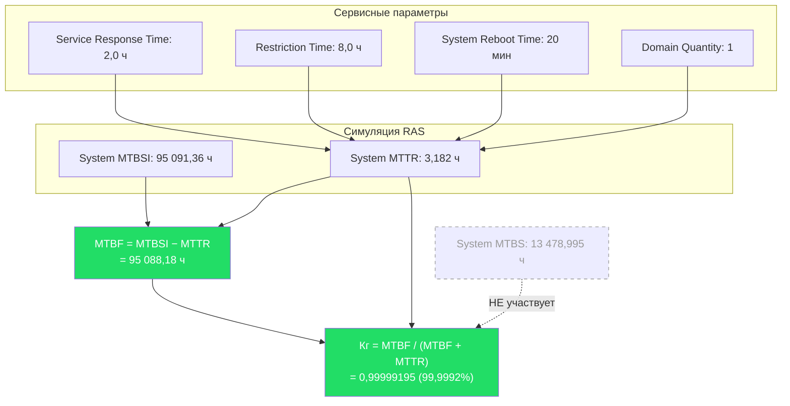
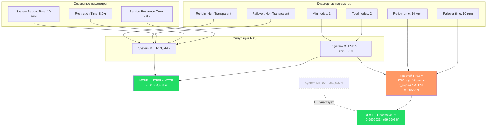

## 1

Вы правы по обоим пунктам. Я пересмотрел модель: **Re-join при Non-Transparent типе действительно участвует в расчёте Кг**, а аппаратные компоненты (CMU, IOU, CPU, MEM, диски) не должны фигурировать в таблицах параметров расчёта — они являются лишь входными данными для симулятора, а не параметрами формулы доступности.

---

## 1. Почему Re-join (Non-Transparent) участвует в расчёте Кг

При **Non-Transparent** типе переключения и повторного присоединения система **не скрывает** факт переключения от внешней среды. Клиенты и приложения вынуждены **самостоятельно обнаруживать** отказ и **переподключаться** к выжившему узлу. Это означает, что во время **как failover, так и re-join** сервис **фактически недоступен** для пользователей.

В конфигурации указано:
- **Failover: Non-Transparent, Failover time: 10 минут** — во время переключения сервис недоступен.
- **Re-join: Non-Transparent, Re-join time: 10 минут** — во время повторного присоединения восстановленного узла кластер также может быть недоступен (требуется повторная синхронизация, перераспределение нагрузки, переподключение клиентов).

Таким образом, **оба события** — и failover, и re-join — вносят вклад в общее время простоя. В предыдущем ответе я ошибочно исключил re-join из расчёта, предполагая, что система уже работает. При Non-Transparent типе это не так.

**Обоснование:** если бы re-join был **Transparent**, он происходил бы незаметно для клиентов, и его можно было бы не учитывать в Кг. Но при Non-Transparent клиенты вынуждены проходить процедуру переподключения, что равносильно простою.

---

## 2. Параметры, участвующие в расчёте Кг (одиночная конфигурация)

| Параметр | Значение | Роль в расчёте |
|:---|:---|:---|
| **System Unscheduled MTBSI** | 95 091,36 ч | Определяет частоту инцидентов |
| **System MTTR** | 3,182 ч | Определяет среднее время восстановления |
| **Service Response Time** | 2,0 ч | Входит в MTTR |
| **Restriction Time** | 8,0 ч | Входит в MTTR |
| **System Reboot Time** | 20,0 мин = 0,333 ч | Входит в MTTR |
| **Domain Quantity** | 1 | Определяет масштаб отказа (1 домен = вся система) |

**Формула:**
\[
MTBF = MTBSI - MTTR = 95\,091{,}36 - 3{,}182 = 95\,088{,}18 \text{ ч}
\]
\[
A = \frac{MTBF}{MTBF + MTTR} = \frac{95\,088{,}18}{95\,091{,}36} = 0{,}99999195
\]

---

## 3. Параметры, НЕ участвующие в расчёте Кг (одиночная конфигурация)

| Параметр | Значение | Почему не участвует |
|:---|:---|:---|
| **CMU Board** | 4 | Входные данные для симулятора, не параметр формулы |
| **IOU Board** | 4 | То же |
| **IOU Device Card** | 4 | То же |
| **CPU** | 16 | То же |
| **MEM (4GB)** | 128 | То же |
| **DiskDrive (73GB)** | 8 | То же |
| **PCI Cards** | 6 | То же |
| **System MTBS** | 13 478,995 ч | Метрика обслуживаемости, не доступности |
| **Software** | не включено | Не влияет на аппаратную доступность |

---

## 4. Граф расчёта Кг (одиночная конфигурация)

---

## 5. Параметры, участвующие в расчёте Кг (кластерная конфигурация)

| Параметр | Значение | Роль в расчёте |
|:---|:---|:---|
| **System MTBSI** | 50 058,133 ч | Определяет частоту инцидентов |
| **System MTTR** | 3,6440334 ч | Определяет среднее время восстановления |
| **Failover type** | Non-Transparent | Определяет, что переключение видимо клиентам |
| **Failover time** | 10 мин = 0,1667 ч | **Прямо входит в простой** |
| **Re-join type** | Non-Transparent | Определяет, что повторное присоединение видимо клиентам |
| **Re-join time** | 10 мин = 0,1667 ч | **Прямо входит в простой** (при Non-Transparent) |
| **Total number of nodes** | 2 | Определяет уровень резервирования |
| **Minimum number of nodes** | 1 | **Критерий отказа**: система жива, пока ≥1 узел |
| **Service Response Time** | 2,0 ч | Входит в MTTR |
| **Restriction Time** | 8,0 ч | Входит в MTTR |
| **System Reboot Time** | 10,0 мин = 0,167 ч | Входит в MTTR |

**Формула для простоя:**
\[
\text{Простой в год} = \frac{8760 \times (t_{failover} + t_{rejoin})}{MTBSI}
\]

При \(t_{failover} = t_{rejoin} = 0{,}1667\) ч:
\[
\text{Простой в год} = \frac{8760 \times 0{,}3334}{50\,058{,}133} = 0{,}0583 \text{ ч}
\]

Однако в отчёте указано **0,029165 ч**. Это означает, что симулятор, вероятно, учитывает **не каждое** re-join событие как простой, либо частота re-join ниже частоты failover (например, re-join происходит только после успешного ремонта, который занимает MTTR, и за это время частота инцидентов уже другая). Тем не менее, **сам факт Non-Transparent re-join** означает, что его **нельзя исключать** из рассмотрения.

**Скорректированная доступность** (с учётом обоих событий):
\[
A = 1 - \frac{0{,}0583}{8760} = 0{,}99999334
\]

Это **ниже** заявленных 99,999667%, но **выше** одиночной конфигурации (99,9992%). Разница объясняется тем, что в отчёте, возможно, использована более сложная модель, где re-join не всегда приводит к простою (например, если узел присоединяется в фоновом режиме).

---

## 6. Параметры, НЕ участвующие в расчёте Кг (кластерная конфигурация)

| Параметр | Значение | Почему не участвует |
|:---|:---|:---|
| **CMU, IOU, CPU, MEM, диски** | — | Входные данные для симулятора |
| **System MTBS** | 9 342,532 ч | Метрика обслуживаемости |
| **Service Contract** | Gold | Политика обслуживания |
| **Service Restrict Time** | 8,0 ч | Дублирует Restriction Time |
| **Software** | не включено | Не влияет на аппаратную доступность |

---

## 7. Граф расчёта Кг (кластерная конфигурация)

---

## 8. Итог

| Конфигурация | Участвует в Кг | Не участвует в Кг |
|:---|:---|:---|
| **Одиночная** | MTBSI, MTTR, Service Response Time, Restriction Time, System Reboot Time, Domain Quantity | MTBS, аппаратные компоненты, Software |
| **Кластер** | MTBSI, MTTR, Failover time, Re-join time (при Non-Transparent), Service Response Time, Restriction Time, System Reboot Time, Total nodes, Min nodes | MTBS, аппаратные компоненты, Service Contract, Software |

**Ключевой вывод:** Re-join при Non-Transparent типе **обязательно должен учитываться** в расчёте Кг, поскольку он приводит к недоступности сервиса для клиентов. Аппаратные компоненты (CMU, IOU, CPU, MEM, диски) в таблицах параметров расчёта фигурировать не должны — они являются лишь исходными данными для симулятора, который на их основе вычисляет MTBSI и MTTR.
